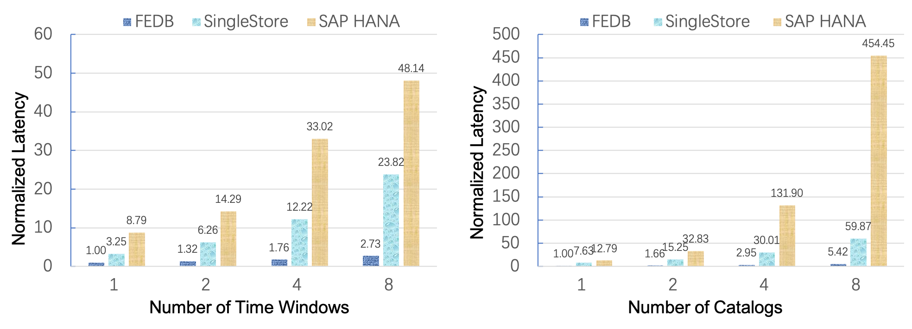

- [**Slack Channel**](https://join.slack.com/t/hybridsql-ws/shared_invite/zt-ozu3llie-K~hn9Ss1GZcFW2~K_L5sMg)
- [**Discussions**](https://github.com/4paradigm/fedb/discussions)
- [**中文README**](README_cn.md)

## Introduction

FEDB is a NewSQL database optimised for realtime inference and decisioning applications. These applications put real-time features extracted from multiple time windows through a pre-trained model to evaluate new data to support decision making. Existing in-memory databases cost hundreds or even thousands of milliseconds so they cannot meet the requirements of inference and decisioning applications. 

FEDB use a double-layered skiplist as the core data structure to store all the data in memory and optimize sql compilation to improve the execution performance.

- __High Performance__

   The benchmark shows that FEDB can be one to two orders of magnitude faster than SingleStore and SAP HANA.

- __SQL Compatible__

   FEDB is compatible with most of ANSI SQL syntax. You can implement your aplications with sqlalchemy or JDBC.

- __Online-offline Consistency__

   Machine learning applications developed by FEDB can be launched simply and ensure online and offline consistency, which greatly reduces the cost.

- __High Availability__

   Support auto failover and scaling horizontally.

Note: The latest released FEDB is unstable and not recommend to be used in production environment.

### Architecture

[See more](https://github.com/4paradigm/HybridSQL-docs/blob/main/fedb/architecture/architecture.md) 

## Quick Start

### Build on Linux

```
docker pull 4pdosc/centos6_gcc7_hybridsql:0.1.1
git clone https://github.com/4paradigm/fedb.git
cd fedb
docker run -v `pwd`:/fedb -it 4pdosc/centos6_gcc7_hybridsql:0.1.1
cd /fedb
sh steps/init_env.sh
mkdir -p build && cd build && cmake ../ && make -j5 fedb
```

### Demo

* [Predict taxi trip duration](https://github.com/4paradigm/DemoApps/tree/main/predict-taxi-trip-duration)
* Detect the healthy of online transaction and make an alert -oncoming
* Online real-time transaction fraud detection -oncoming

## Performance

In AI scenarios most real-time features are time-related and required to be computed over multiple time windows. So we use computation TopN queries as benchmark scenario.

### Server Specification
The server spec is as follows:

|Item|Spec|
|---|----|
|CPU|Intel Xeon Platinum 8280L Processor|
|Memory|384 GB|
|OS|CentOS-7 with kernel 5.1.9-1.el7|

### Benchmark Results



The benchmark result shows that FEDB can be one to two orders of magnitude faster than SingleStore and SAP HANA. Please check our [VLDB'21 paper](http://vldb.org/pvldb/vol14/p799-chen.pdf) for more benchmarks.

## Roadmap

### ANSI SQL Compatibility

FEDB is currently compatible with mainstream DDL and DML syntax, and will gradually enhances the compatibility of ANSI SQL syntax.

* [2021H1] Support the standard syntax of Window, Where, Group By and Join ect.
* [2021H1&H2] Expand AI-oriented SQL syntax and UDAF functions.

### Features

In order to meet the high performance requirements of realtime inference and decisioning scenarios, FEDB chooses memory as the storage engine medium. At present, the memory storage engine used in the industry has memory fragmentation and recovery efficiency problems. FEDB plans to optimize the memory allocation algorithm to reduce fragmentation and accelerate data recovery with [PMEM](https://www.intel.com/content/www/us/en/architecture-and-technology/optane-dc-persistent-memory.html)(Intel Optane DC Persistent Memory Module).

* [2021H1]Provide a new strategy of memory allocation to reduce memory fragmentation.
* [2021H2]Support PMEM-based storage engine.

### Build Ecosystem
FEDB has python client and java client which support most of JDBC API. FEDB will make a connection with big data ecosystem for integrating with Flink/Kafka/Spark simplily.

* [2021H1&H2]Support Flink/Kafka/Spark connector.


## Feedback and Getting involved
* Report bugs, ask questions or give suggestions by [Github Issues](https://github.com/4paradigm/fedb/issues/new).
* Cannot find what you are looking for? Have a question or idea? Please post your questions or comments on our [slack](https://hybridsql-ws.slack.com/archives/C01R7L7AL3W).

## License
Apache License 2.0
