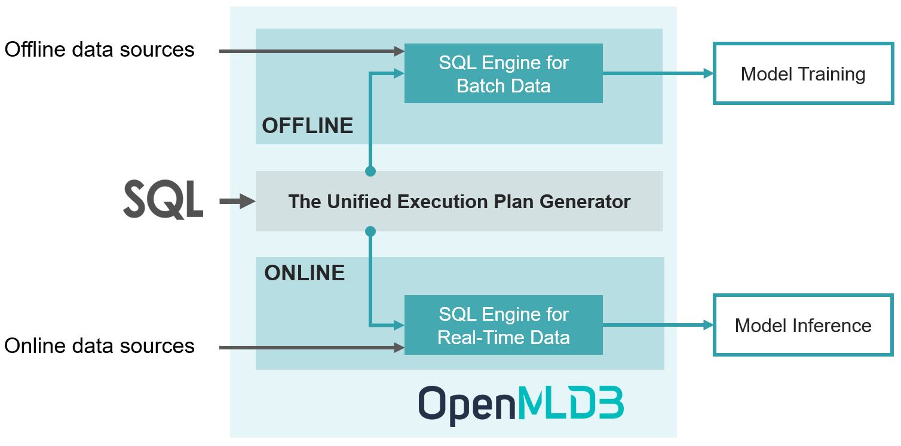

**English | [中文](README_cn.md)**

## Content

1. [Our Philosophy](#1-our-philosophy)
2. [A Feature Platform for ML Applications](#2-a-feature-platform-for-ml-applications)
3. [Highlights](#3-highlights)
4. [FAQ](#4-faq)
5. [Build and Install](#5-build-and-install)
6. [QuickStart](#6-quickstart)
7. [Use Cases](#7-use-cases)
8. [Documentation](#8-documentation)
9. [Roadmap](#9-roadmap)
10. [Contributors](#10-contributors)
11. [Community](#11-community)
12. [Publications](#12-publications)
13. [The User List](#13-the-user-list)

### OpenMLDB is an open-source machine learning database that provides a feature platform computing consistent features for training and inference.

## 1. Our Philosophy

For the artificial intelligence (AI) engineering, 95% of the time and effort is consumed by data related workloads. In order to tackle this challenge, tech giants spend thousands of hours on building in-house data and feature platforms to address engineering issues such as data leakage, feature backfilling, and efficiency. The other small and medium-sized enterprises have to purchase expensive SaaS tools and data governance services. 

OpenMLDB is an open-source machine learning database that is committed to solving the data and feature challenges. OpenMLDB has been deployed in hundreds of real-world enterprise applications. It prioritizes the capability of feature engineering using SQL for open-source, which offers a feature platform enabling consistent features for training and inference.

## 2. A Feature Platform for ML Applications

Real-time features are essential for many machine learning applications, such as real-time personalized recommendation and risk analytics. However, a feature engineering script developed by data scientists (Python scripts in most cases) cannot be directly deployed into production for online inference because it usually cannot meet the engineering requirements, such as low latency, high throughput and high availability. Therefore, a engineering team needs to be involved to refactor and optimize the source code using database or C++ to ensure its efficiency and robustness. As there are two teams and two toolchains involved for the development and deployment life cycle, the verification for consistency is essential, which usually costs a lot of time and human power. 

OpenMLDB is particularly designed as a feature platform for ML applications to accomplish the mission of **Development as Deployment**, to significantly reduce the cost from the offline training to online inference. Based on OpenMLDB, there are three steps only for the entire life cycle:

- Step 1: Offline development of feature engineering script based on SQL
- Step 2: SQL online deployment using just one command
- Step 3: Online data source configuration to import real-time data

With those three steps done, the system is ready to serve real-time features, and highly optimized to achieve low latency and high throughput for production.

In order to achieve the goal of Development as Deployment, OpenMLDB is designed to provide consistent features for training and inference. The figure above shows the high-level architecture of OpenMLDB, which consists of four key components: (1) SQL as the unified programming language; (2) The real-time SQL engine for for extra-low latency services; (3) The batch SQL engine based on [a tailored Spark distribution](https://github.com/4paradigm/spark); (4) The unified execution plan generator to bridge the batch and real-time SQL engines to guarantee the consistency.

## 3. Highlights

**Consistent Features for Training and Inference:** Based on the unified execution plan generator, correct and consistent features are produced for offline training and online inference, providing hassle-free time travel without data leakage.

**Real-Time Features with Ultra-Low Latency**: The real-time SQL engine is built from scratch and particularly optimized for time series data. It can achieve the response time of a few milliseconds only to produce real-time features, which significantly outperforms other commercial in-memory database systems (Figures 9 & 10, [the VLDB 2021 paper](http://vldb.org/pvldb/vol14/p799-chen.pdf)).

**Define Features as SQL**: SQL is used as the unified programming language to define and manage features. SQL is further enhanced for feature engineering, such as the extended syntax `LAST JOIN` and `WINDOW UNION`.

**Production-Ready for ML Applications**: Production features are seamlessly integrated to support enterprise-grade ML applications, including distributed storage and computing, fault recovery, high availability, seamless scale-out, smooth upgrade, monitoring, heterogeneous memory support, and so on.

## 4. FAQ

1. **What are use cases of OpenMLDB?**
   
   At present, it is mainly positioned as a feature platform for ML applications, with the strength of low-latency real-time features. It provides the capability of Development as Deployment to significantly reduce the cost for machine learning applications. On the other hand, OpenMLDB contains an efficient and fully functional time-series database, which is used in finance, IoT and other fields.
   
2. **How does OpenMLDB evolve?**
   
   OpenMLDB originated from the commercial product of [4Paradigm](https://www.4paradigm.com/) (a leading artificial intelligence service provider). In 2021, the core team has abstracted, enhanced and developed community-friendly features based on the commercial product; and then makes it publicly available as an open-source project to benefit more enterprises to achieve successful digital transformations at low cost. Before the open-source, it had been successfully deployed in hundreds of real-world ML applications together with 4Paradigm's other commercial products.
   
3. **Is OpenMLDB a feature store?**
   
   OpenMLDB is more than a feature store to provide features for ML applications. OpenMLDB is capable of producing real-time features in a few milliseconds. Nowadays, most feature stores in the market serve online features by syncing features pre-computed at offline. But they are unable to produce low latency real-time features. By comparison, OpenMLDB is taking advantage of its optimized online SQL engine, to efficiently produce real-time features in a few milliseconds.
   
4. **Why does OpenMLDB choose SQL to define and manage features?**
   
   SQL (with extension) has the elegant syntax but yet powerful expression ability. SQL based programming experience flattens the learning curve of using OpenMLDB, and further makes it easier for collaboration and sharing.

## 5. Build and Install

:point_right: [Read more](https://openmldb.ai/docs/en/main/deploy/index.html)

Or you can directly start working on this repository by clicking on the following button

## 6. QuickStart

**Cluster and Standalone Versions**

OpenMLDB has two versions with different deployment options, which are *cluster version* and *standalone version*. The cluster version is suitable for large-scale applications and ready for production. On the other hand, the lightweight standalone version running on a single node is ideal for evaluation and demonstration. The cluster and standalone versions have the same functionalities but with different limitations for particular functions. Please refer to [this document](https://openmldb.ai/docs/en/main/tutorial/standalone_vs_cluster.html)  for details. 

**Getting Started with OpenMLDB**

:point_right: [OpenMLDB QuickStart](https://openmldb.ai/docs/en/main/quickstart/openmldb_quickstart.html)

## 7. Use Cases

We are building a list of real-world use cases based on OpenMLDB to demonstrate how it can fit into your business. 

| Use Cases                                                    | Tools                                                        | Brief Introduction                                           |
| ------------------------------------------------------------ | ------------------------------------------------------------ | ------------------------------------------------------------ |
| [New York City Taxi Trip Duration](https://openmldb.ai/docs/en/main/use_case/lightgbm_demo.html) | OpenMLDB, LightGBM                                           | This is a challenge from Kaggle to predict the total ride duration of taxi trips in New York City. You can read [more detail here](https://www.kaggle.com/c/nyc-taxi-trip-duration/). It demonstrates using the open-source tools OpenMLDB + LightGBM to build an end-to-end machine learning applications easily. |
| [Importing real-time data streams from Pulsar](https://openmldb.ai/docs/en/main/use_case/pulsar_connector_demo.html) | OpenMLDB, Pulsar, [OpenMLDB-Pulsar connector](https://pulsar.apache.org/docs/next/io-connectors/#jdbc-openmldb) | Apache Pulsar is a cloud-native streaming platform. Based on the OpenMLDB-Kafka connector , we are able to seamlessly import real-time data streams from Pulsar to OpenMLDB as the online data sources. |
| [Importing real-time data streams from Kafka](https://openmldb.ai/docs/en/main/use_case/kafka_connector_demo.html) | OpenMLDB, Kafka, [OpenMLDB-Kafka connector](https://github.com/4paradigm/OpenMLDB/tree/main/extensions/kafka-connect-jdbc) | Apache Kafka is a distributed event streaming platform. With the OpenMLDB-Kafka connector, the real-time data streams can be imported from Kafka as the online data sources for OpenMLDB. |
| [Importing real-time data streams from RocketMQ](https://openmldb.ai/docs/zh/main/integration/online_datasources/rocketmq_connector.html) | OpenMLDB, RocketMQ, [OpenMLDB-RocketMQ connector](https://github.com/apache/rocketmq-connect/tree/master/connectors/rocketmq-connect-jdbc/rocketmq-connect-jdbc-openmldb) | Apache RocketMQ is a distributed messaging and streaming platform. The OpenMLDB-RocketMQ connector is used to efficiently import real-data streams from RocketMQ to OpenMLDB. |
| [Building end-to-end ML pipelines in DolphinScheduler](https://openmldb.ai/docs/en/main/use_case/dolphinscheduler_task_demo.html) | OpenMLDB, DolphinScheduler, [OpenMLDB task plugin](https://dolphinscheduler.apache.org/zh-cn/docs/dev/user_doc/guide/task/openmldb.html) | We demonstrate to build an end-to-end machine learning pipeline based on OpenMLDB and DolphinScheduler (an open-source workflow scheduler platform). It consists of feature engineering, model training, and deployment. |
| [Ad Tracking Fraud Detection](https://openmldb.ai/docs/en/main/use_case/talkingdata_demo.html) | OpenMLDB, XGBoost                                            | This demo uses OpenMLDB and XGBoost to [detect click fraud](https://www.kaggle.com/c/talkingdata-adtracking-fraud-detection/) for online advertisements. |
| [SQL-based ML pipelines](https://openmldb.ai/docs/en/main/use_case/OpenMLDB_Byzer_taxi.html) | OpenMLDB, Byzer, [OpenMLDB Plugin for Byzer](https://github.com/byzer-org/byzer-extension/tree/master/byzer-openmldb) | Byzer is a low-code open-source programming language for data pipeline, analytics and AI. Byzer has integrated OpenMLDB to deliver the capability of building ML pipelines with SQL. |
| [Building end-to-end ML pipelines in Airflow](https://openmldb.ai/docs/en/main/use_case/airflow_provider_demo.html) | OpenMLDB, Airflow, [Airflow OpenMLDB Provider](https://github.com/4paradigm/OpenMLDB/tree/main/extensions/airflow-provider-openmldb), XGBoost | Airflow is a popular workflow management and scheduling tool. This demo shows how to effectively schedule OpenMLDB tasks in the Airflow through the provider package. |
| [Precision marketing](https://openmldb.ai/docs/en/main/use_case/JD_recommendation_en.html) | OpenMLDB, OneFlow                                            | OneFlow is a deep learning framework designed to be user-friendly, scalable and efficient. This use case demonstrates to use OpenMLDB for feature engineering and OneFlow for model training/inference, to build an application for [precision marketing](https://jdata.jd.com/html/detail.html?id=1). |

## 8. Documentation

- Chinese documentations: [https://openmldb.ai/docs/zh](https://openmldb.ai/docs/zh/)
- English documentations: [https://openmldb.ai/docs/en/](https://openmldb.ai/docs/en/)

## 9. Roadmap

Please refer to our [public Roadmap page](https://github.com/4paradigm/OpenMLDB/projects/10).

Furthermore, there are a few important features on the development roadmap but have not been scheduled yet. We appreciate any feedbacks on those features.

- A cloud-native OpenMLDB
- Automatic feature extraction
- Optimization based on heterogeneous storage and computing resources
- A lightweight OpenMLDB for edge computing

## 10. Contribution

We really appreciate the contribution from our community.

- If you are interested to contribute, please read our [Contribution Guideline](CONTRIBUTING.md) for more details. 
- If you are a new contributor, you may get start with [the list of issues labeled with `good first issue`](https://github.com/4paradigm/OpenMLDB/issues?q=is%3Aopen+is%3Aissue+label%3A%22good+first+issue%22).
- If you have experience of OpenMLDB development, or want to tackle a challenge that may take 1-2 weeks, you may find [the list of issues labeled with `call-for-contributions`](https://github.com/4paradigm/OpenMLDB/issues?q=is%3Aopen+is%3Aissue+label%3Acall-for-contributions).

## 11. Community

- Website: [https://openmldb.ai/en](https://openmldb.ai/en)

- Email: [contact@openmldb.ai](mailto:contact@openmldb.ai)

- [Slack](https://join.slack.com/t/openmldb/shared_invite/zt-ozu3llie-K~hn9Ss1GZcFW2~K_L5sMg) 

- [GitHub Issues](https://github.com/4paradigm/OpenMLDB/issues) and [GitHub Discussions](https://github.com/4paradigm/OpenMLDB/discussions): The GitHub Issues is used to report bugs and collect new feature requirements. The GitHub Discussions is open to any discussions related to OpenMLDB.

- [Blogs (English)](https://openmldb.medium.com/)

- [Blogs (Chinese)](https://www.zhihu.com/column/c_1417199590352916480)

- Public drives maintained by the PMC: [English](https://drive.google.com/drive/folders/1T5myyLVe--I9b77Vg0Y8VCYH29DRujUL) |  [中文](https://openmldb.feishu.cn/wiki/space/7101318128021307396)

- [Mailing list for developers](https://groups.google.com/g/openmldb-developers)

- WeChat Groups (Chinese):

    

## 12. Publications

- Cheng Chen, Jun Yang, Mian Lu, Taize Wang, Zhao Zheng, Yuqiang Chen, Wenyuan Dai, Bingsheng He, Weng-Fai Wong, Guoan Wu, Yuping Zhao, and Andy Rudoff. *[Optimizing in-memory database engine for AI-powered on-line decision augmentation using persistent memory](http://vldb.org/pvldb/vol14/p799-chen.pdf)*. International Conference on Very Large Data Bases (VLDB) 2021.
- Siqi Wang, Jiashu Li, Mian Lu, Zhao Zheng, Yuqiang Chen, and Bingsheng He. 2022. [A System for Time Series Feature Extraction in Federated Learning](https://dl.acm.org/doi/pdf/10.1145/3511808.3557176). In Proceedings of the 31st ACM International Conference on Information & Knowledge Management (CIKM) 2022.

## 13. [The User List](https://github.com/4paradigm/OpenMLDB/discussions/707)

We are building [a user list](https://github.com/4paradigm/OpenMLDB/discussions/707) to collect feedback from the community. We really appreciate it if you can provide your use cases, comments, or any feedback when using OpenMLDB. We want to hear from you! 
