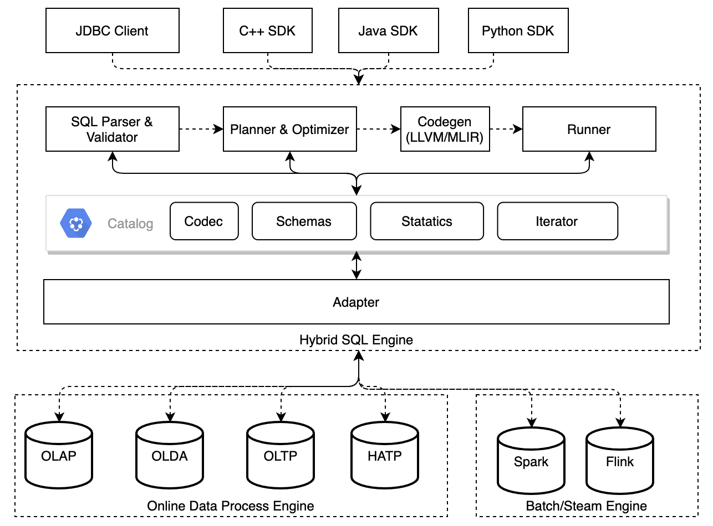

[](https://github.com/4paradigm/HybridSE/actions/workflows/hybridse-ci.yml?query=branch%3Amain++)
[](https://github.com/4paradigm/HybridSE/releases/latest)
[](https://github.com/4paradigm/HybridSE/milestones)
[](https://github.com/4paradigm/HybridSE/blob/main/LICENSE)
[](https://codecov.io/gh/4paradigm/HybridSE)

- [**Slack Channel**](https://join.slack.com/t/hybridsql-ws/shared_invite/zt-ozu3llie-K~hn9Ss1GZcFW2~K_L5sMg)
- [**Discussions**](https://github.com/4paradigm/HybridSE/discussions)
- [中文文档](README-zh.md)

# Introduction

HybridSE (Hybrid SQL Engine) is a LLVM-based, hybrid-execution and high-performance SQL engine. It can provide fast and consistent execution on heterogeneous SQL data systems, e.g., OLAD database, HTAP system, SparkSQL, and Flink Stream SQL.



HybridSE is a modularized SQL compiler and executor, with following features:

- SQL syntax validation
- Logical plan generation and optimization
- Expression optimization
- Online/Offline physical plan generation
- Native code generation
- Cluster/Standalone runner

By leveraging the power of HybridSE, developer can implement high performance SQL database with ease, or improve performance over existing offline SQL execution engine.
Unlike MySQL and SparkSQL, which have buildin SQL engine, HybridSE offers better performance. What's more, it's designed for AI scenarios,
did grammar expansion and optimization, making HybridSE more like a modern SQL engine.

HybridSE has following characteristic:

- **High Performance**

  Leveraging the power of LLVM JIT, HybridSE can generate binary code dynamicly based on different hardware environment. It also have dozens of plan pass buildin, a more flexible memory management,
  which ensure High-Performance for HybridSE.

- **Great Scalability**

  Thanks to the modularized design, HybridSE can generate logical and physical plan for different stages.
  With sdk for multiple languages, HybridSE can be used on SQL optimization, regardless the system is realtime OLAD database, distributed OLAP or stream SQL.

- **Machine Learning Aimed Optimization**

  Offer the special table join operation and customized UDF/UDAF, which fullfill the requirements of feature extraction and deployment from machine learning applications.

- **Online-Offline Consistency**

  Same SQL and CodeGen logical, is guaranteed equivalent meaning and exact same result. Consistency also apply to UDF/UDAF in multiple programing languages.

# Quick Start

## Requirements

- [git](https://git-scm.com)
- [docker](https://docs.docker.com/engine/install/)

## Prepare Code & Docker

```bash
git clone --recursive https://github.com/4paradigm/HybridSE.git
cd HybridSE
docker run -v `pwd`:/HybridSE -it ghcr.io/4paradigm/hybridsql:0.3.0
cd /HybridSE
# init enviroment before build
./tools/init_env.profile.sh
```

It is recommended using the docker image listed above for faster start and avoid dependency hole. You may checkout [HybridSQL-docker](https://github.com/4paradigm/HybridSQL-docker/blob/main/README.md) for complete dependency.

## Build

```bash
cd /HybridSE
mkdir -p build && cd build
cmake ..
# compile the core library
make -j$(nproc) hybridse_core # install coreutils if nproc not found in mac
```

## Install

```bash
cd /HybridSE
mkdir -p build && cd build
cmake ..  -DCMAKE_INSTALL_PREFIX="CONFIG_YOUR_HYRBIDSE_INSTALL_DIR"
make -j$(nproc) install
```

checkout [HybridSE Quick start](https://github.com/4paradigm/HybridSQL-docs/blob/main/hybridse/usage/quick_start.md) for more information

## Run tests

```bash
cd /HybridSE
mkdir -p build & cd buid
cmake .. -DTESTING_ENABLE=ON
export SQL_CASE_BASE_DIR=/HybridSE
make -j$(nproc) && make -j$(nproc) test
```

## Run simple engine demo

```bash
cd /HybridSE
mkdir build
cd build
cmake ..
make -j$(nproc) hybridse_proto && make -j$(nproc) hybridse_parser && make -j$(nproc) simple_engine_demo
./src/simple_engine_demo
```

`simple_engine_demo` is a in-memory SQL engine implemented on HybridSE。For more information see [How to create a simple SQL engine](https://github.com/4paradigm/HybridSQL-docs/blob/feat/simple_engine_demo_doc/hybridse/usage/simple_engine_demo.md)

## Run ToyDB

- Build ToyDB

```bash
cd /HybridSE
mkdir build
cmake .. -DEXAMPLES_ENABLE=ON
make -j$(nproc) hybridse_proto && make -j$(nproc) hybride_parser && make toydb -j$(nproc)
```

- Start ToyDB

```bash
cd /HybridSE/examples/toydb/onebox
sh start_all.sh
sh start_cli.sh
```

ToyDB is a simple in-memory database powered by HybridSE, supporting basic CRUD operations. see more information at [ToyDB quick start](https://github.com/4paradigm/HybridSQL-docs/blob/feat/hybridse-quick-start-doc/hybridse/usage/toydb_usage/toydb_quickstart.md)

## Related Projects

| Project                                                 | Status        | Description                                                               |
| :------------------------------------------------------ | :------------ | :------------------------------------------------------------------------ |
| [FEDB](https://github.com/4paradigm/fedb)               | Open Source   | NewSQL database optimised for realtime inference and decisioning applications          |
| [SparkFE](https://github.com/4paradigm/SparkFE) | Open Source   | LLVM-based and high-performance Spark native execution engine which is designed for feature engineering |
| NativeFlink                                             | Under Develop | High-performance, Batch-Stream-in-onebox FlinkSQL execution engine           |

## Roadmap

### ANSI SQL compatibility

HybridSE is compatible with mainstream DDL, DML already，and will support ANSI SQL progressively, which will reduce the cost of migration from other SQL engine.

- [2021H1&H2] Enrich standard syntax of `Window`，support Where, Group By, Join etc
- [2021H1&H2] Extend AI-domain specific grammar and UDAF functions

### Performance

HybridSE offer dozens of SQL expression and logical plan optimization, standardized optimization pass interface, and will implement more SQL optimization.

- [2021H1] Logical and physical plan optimization for batch mode and request mode data processing
- [2021H1] High-performance, distributed execution plan generation and codegen
- [2021H2] Compilation and codegen optimization for LLVM-based expression
- [2021H2] More classic SQL expression pass support

### Ecosystem Integration

HybridSE has been integrated by NativeSpark and FEDB already. It can been integrated into NoSQL, OLAP, OLTP system, and will support more open source system in the future.

- [2021H2] Adapt to open source SQL compute framework like FlinkSQL
- [2021H2] Adapt to various encoding format in row and column, be compatible with Apache Arrow
- [2021H2] Support popular programing languages，including C++, Java, Python, Go, Rust etc

## Contribution

- Report issues in [Github Issue](https://github.com/4paradigm/HybridSE/issues)
- Ask and discuss more in [Discussions](https://github.com/4paradigm/HybridSE/discussions) and [slack](https://hybridsql-ws.slack.com/archives/C01R7LAF6AY)

## License

[Apache License 2.0](https://github.com/4paradigm/HybridSE/blob/main/LICENSE)
