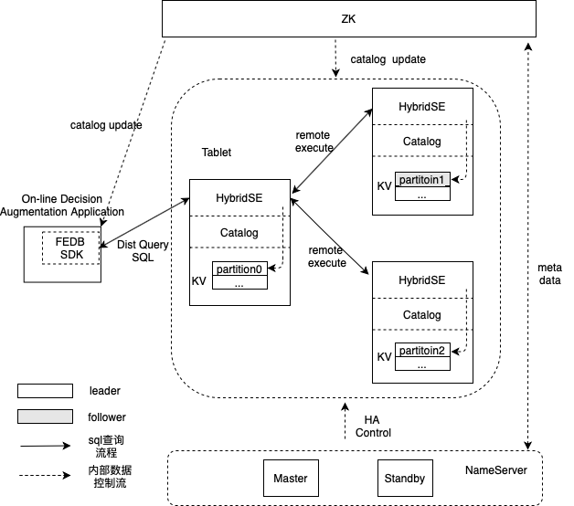

[中文版](README_cn.md)


- [**Slack Channel**](https://hybridsql-ws.slack.com/archives/C01R7L7AL3W)
- [**Discussions**](https://github.com/4paradigm/fedb/discussions)

## Introduction

FEDB is a NewSQL database optimised for realtime inference and decisioning applications.

- __High Performance__

   Reduce data access latency by using in-memory storage engine and improve the execution performance significantly with sql compilation optimization.

- __SQL Compatible__

   FEDB is compatible with most of ANSI SQL syntax. You can implement your aplications with sqlalchemy or JDBC.

- __Online-offline Consistency__

   Machine learning applications developed by FEDB can be launched simply and ensure online and offline consistency, which greatly reduces the cost.

- __High Availability__

   Support auto failover and scaling horizontally.

Note: The latest released FEDB is unstable and not recommend to be used in production environment.

## Quick Start

### Build

```
git clone --recurse-submodules https://github.com/4paradigm/fedb.git
cd fedb
docker run -v `pwd`:/fedb -it ghcr.io/4paradigm/centos6_gcc7_hybridsql:latest
cd /fedb
sh steps/install_hybridse.sh
mkdir -p build && cd build && cmake ../ && make -j5 fedb
```

### Demo

* [Predict taxi trip duration](https://github.com/4paradigm/DemoApps/tree/main/predict-taxi-trip-duration)
* Detect the healthy of online transaction and make an alert -oncoming
* Online real-time transaction fraud detection -oncoming

## Architecture

  

## Roadmap

### ANSI SQL Compatibility

FEDB is currently compatible with mainstream DDL and DML syntax, and will gradually enhances the compatibility of ANSI SQL syntax.

* [2021H1] Support the standard syntax of Window, Where, Group By and Join ect.
* [2021H1&H2] Expand AI-oriented SQL syntax and UDAF functions.

### Features

In order to meet the high performance requirements of realtime inference and decisioning scenarios, FEDB chooses memory as the storage engine medium. At present, the memory storage engine used in the industry has memory fragmentation and recovery efficiency problems. FEDB plans to optimize the memory allocation algorithm to reduce fragmentation and introduce [PMEM](https://www.intel.com/content/www/us/en/architecture-and-technology/optane-dc-persistent-memory.html)(Intel Optane DC Persistent Memory Module) to improve data recovery efficiency.

* [2021H1]Provide a new strategy of memory allocation to reduce memory fragmentation.
* [2021H2]Support PMEM-based storage engine.

### Build Ecosystem
FEDB has python client and java client which support most of JDBC API. FEDB will make a connection with big data ecosystem for integrating with Flink/Kafka/Spark simplily.

* [2021H1&H2]Support Flink/Kafka/Spark connector.


## Feedback and Getting involved
* Report bugs, ask questions or give suggestions by [Github Issues](https://github.com/4paradigm/fedb/issues/new).
* Cannot find what you are looking for? Have a question or idea? Please post your questions or comments on our [slack](https://hybridsql-ws.slack.com/archives/C01R7L7AL3W).

## License
Apache License 2.0