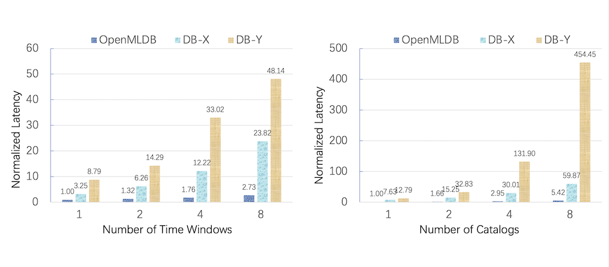
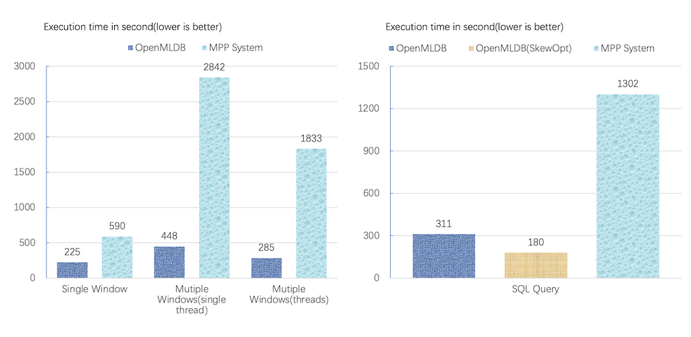

<div align=center></div>

[](https://github.com/4paradigm/openmldb/actions/workflows/cicd.yaml)
[](https://hub.docker.com/r/4pdosc/openmldb)
[](https://join.slack.com/t/hybridsql-ws/shared_invite/zt-ozu3llie-K~hn9Ss1GZcFW2~K_L5sMg)
[](https://github.com/4paradigm/OpenMLDB/discussions)
[](https://codecov.io/gh/4paradigm/OpenMLDB)
[](https://github.com/4paradigm/OpenMLDB/releases)
[](https://github.com/4paradigm/OpenMLDB/blob/main/LICENSE)
[](https://gitee.com/paradigm4/OpenMLDB)
[](https://mvnrepository.com/artifact/com.4paradigm.openmldb/openmldb-batch)
[](https://mvnrepository.com/artifact/com.4paradigm.openmldb/openmldb-jdbc)
[](https://pypi.org/project/openmldb/)


English version|[中文版](README_cn.md)


## What is OpenMLDB 

OpenMLDB is an open-source database designed and optimized to enable data correctness & efficiency for machine learning driven applications. Besides the 10x faster ML application landing experience, OpenMLDB provides the unified computing & storage engines to reduce the complexity and cost of development and operation.

## Who Uses OpenMLDB 
The OpenMLDB project originated from several enterprise AI data products(RTiDB, SparkFE & FeDB) at 4Paradigm. OpenMLDB is now used in production to serve machine learning scenarios in many leading companies, with more than 120 industry landed use cases including content recommender system, ads CTR prediction, AIOps, anti-money laundering, anti-fraud recognition, intelligent marketing, etc. 

## Features

* **Consistency**

    OpenMLDB ensures the consistency for online and offline. Data scientists can use OpenMLDB for feature extration which will avoid crossing data. The online and offline computation are consistent because of the use of the same LLVM IR for complication. To ensure the consistency of storage, OpenMLDB will synchronize data for offline and online. Users do not need to manage multiple data sources for online and offline, which may avoid the inconsistency from features or data.
    
* **High Performance**

    OpenMLDB implements the native SQL compiler with C++ and LLVM. It contains tens of optimization passes for physical plans and expressions. It can generate optimized binary code for different hardware and optimize the memory layout for feature storage. The storage and cost for features can be 9x lower than the similar databases. The performance of real-time execution can be 9x better and the performance of batch processing can be 6x better.

* **High Availability**

    OpenMLDB supports distributed massive-parallel processing and database storage. It supports automatic failover to avoid the single point of failure.

* **ANSI SQL Support**

    OpenMLDB supports user-friendly SQL interface which is compatible with most ANSI SQL and extends syntax for AI scenarios. Take the time serial features as example, OpenMLDB not only supports the syntax of Over Window but also supports the new syntax for sliding window with instance table and real-time window aggregation with current row data.

* **AI Optimization**

    OpenMLDB is designed for optimizing AI scenarios. For storage we design the efficient data structure to storage features which gets better the utilization of space and performance than the similar products. For computation, we provide the usual methods for table join and the UDF/UDAF for most machine learning scenarios.

* **Easy To Use**

    OpenMLDB is easy to use just like any other standalone database. Not only data scientists but also application developers can use SQL to develop the machine learning applications which includes massive-parallel processing and real-time feature extraction. With this database it is easy for AI landing with lowest cost.

## Performance

Comparing with the mainstream databases, OpenMLDB achieves better performance for different size of data and computational complexity.



Comparing with the popular Spark computation framework, using OpenMLDB for batch data process can achieve better performance and lower TCO especially with optimization for skew window data.



## QuickStart

Take Predict Taxi Tour Duration as example, we can use OpenMLDB to develop and deploy ML applications easily.

```bash 
# Start docker image (support linux/amd64 & linux/arm64 image)
# try one of the mirror image from 
#  - mirror.baidubce.com/4pdosc/openmldb:0.2.1
#  - ghcr.io/4paradigm/openmldb:0.2.1
# if you pull the image slowly
docker run -it 4pdosc/openmldb:0.2.1 bash

# Initilize the environment
sh init.sh
 
# Import the data to OpenMLDB
python3 import.py
 
# Run feature extraction and model training
python3 train.py ./fe.sql /tmp/model.txt
 
# Start HTTP serevice for inference with OpenMLDB
sh start_predict_server.sh ./fe.sql 8887 /tmp/model.txt
 
# Run inference with HTTP request
python3 predict.py
```

## Build

See [here](docs/en/compile.md)

## Architecture 

<div align=center></div>

## Status and Roadmap

### Status of Project


* SQL compiler and optimizer[Complete]
    * Support ANSI SQL compiler[Complete]
    * Support optimizing physical plans and expressions[Complete]
    * Support code generation for functions[Complete]
* Front-end programming interfaces[In Process]
    * Support JDBC protocol[Complete]
    * Support C++、Python SDK[Complete]
    * Support RESTful API[In Process]
* Online/offline computaion engine[Complete]
    * Support online database computaion engine[Complete]
    * Support offline batch process computaion engine[Complete]
* Unified storage engine[In Process]
    * Support distributed memory storage[Complete]
    * Support synchronization for online and offline data[In Process]

### Roadmap

* SQL Compatibility
    * Support more `Window` types and `Where`, `GroupBy` with complex expressions[2021H2]
    * Support more SQL syntax and UDF/UDAF functions for AI scenarios[2021H2]
* Performance Improvement
    * Logical and physical plan optimization for batch mode and request mode data processing[2021H2]
    * High-performance, distributed execution plan generation and codegen[2021H2]
    * More classic SQL expression pass support[2022H1]
    * Integrate the optimization passes for Native LastJoin which is used in AI scenarios[2021H2]
    * Provide a new strategy of memory allocation to reduce memory fragmentation[2022H1]
* Ecosystem Integration
    * Adapt to various encoding format in row and column, be compatible with Apache Arrow[2021H2]
    * Adapt to open source SQL compute framework like FlinkSQL[2022H1]
    * Support popular programing languages，including C++, Java, Python, Go, Rust etc[2021H2]
    * Support PMEM-based storage engine[2022H1]
    * Support Flink/Kafka/Spark connector[2022H1]

## Publication

* Cheng Chen, Jun Yang, Mian Lu, Taize Wang, Zhao Zheng, Yuqiang Chen, Wenyuan Dai, Bingsheng He, Weng-Fai Wong, Guoan Wu, Yuping Zhao, and Andy Rudoff. *[Optimizing in-memory database engine for AI-powered on-line decision augmentation using persistent memory](http://vldb.org/pvldb/vol14/p799-chen.pdf)*. International Conference on Very Large Data Bases (VLDB) 2021.

## Some Readings

[In-Depth Interpretation of the Latest VLDB 2021 Paper: Artificial Intelligence Driven Real-Time Decision System Database and Optimization Based on Persistent Memory](https://medium.com/@fengxindai0/in-depth-interpretation-of-the-latest-vldb-2021-paper-artificial-intelligence-driven-real-time-f2a818bcf2b2)

[Predictive maintenance — 5minutes demo of an end to end machine learning project](https://towardsdatascience.com/predictive-maintenance-5minutes-demo-of-an-end-to-end-machine-learning-project-60941f1c9793)

[Compared to Native Spark 3.0, We Have Achieved Significant Optimization Effects in the AI Application Field](https://towardsdatascience.com/we-have-achieved-significant-optimization-effects-in-the-ai-application-field-compared-to-native-2a055e47250f)

[MLOp Practice: Using OpenMLDB in the Real-Time Anti-Fraud Model for the Bank’s Online Transaction](https://towardsdatascience.com/practice-of-openmldbs-transaction-real-time-anti-fraud-model-in-the-bank-s-online-event-40ab41fec6d4)


## License

[Apache License 2.0](./LICENSE)
