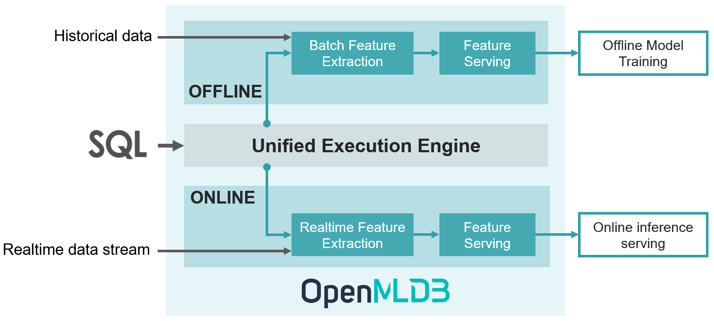

**English version | [中文版](README_cn.md)**

### OpenMLDB is an open-source machine learning database that provides enterprises with a full-stack FeatureOps solution.

## 1. Our Philosophy

In the process of artificial intelligence (AI) engineering, 95% of the time and effort is consumed by data processing, data verification and other data related workloads. In order to tackle this problem, 1% tech giants will spend thousands of hours on building in-house data platforms to address AI engineering challenges such as online-offline consistency, data correctness, and data processing efficiency. The other 99% small and medium-sized enterprise purchase expensive SaaS tools and data governance services. 

OpenMLDB is an open-source machine learning database that is committed to solving the data governance challenge of AI engineering in a closed loop. OpenMLDB has been deployed in hundreds of real-world enterprise applications. OpenMLDB gives priority to open-source the capability of feature engineering using SQL, which provides enterprises with a full-stack feature engineering solution (aka FeatureOps).

## 2. A Full-Stack FeatureOps Solution for Enterprises

MLOps provides a set of practices to develop, deploy, and maintain machine learning models in production efficiently and reliably. As a key link, FeatureOps is responsible for feature engineering, bridging the DataOps and ModelOps. A closed-loop FeatureOps solution should cover all aspects of feature engineering, including functionalities (such as feature store, feature extraction, feature serving, feature sharing) and production (such as low latency, high throughput, fault recovery, high availability, monitoring). OpenMLDB provides a full-stack FeatureOps solution for enterprises with great ease of use, so that feature engineering development returns to its essence: focusing on the development of high-quality feature extraction scripts only and be no longer bound by engineering challenges.

 

The figure above shows the workflow of FeatureOps based on OpenMLDB. From offline feature development to online serving, it only consists of three steps:

1. The offline development of feature extraction using SQL
2. The deployment of SQL scripts with one click only, switching the system from the offline to online mode
3. Online feature extraction and serving by connecting with real-time data streams

## 3. Highlights

**The Unified Online-Offline Execution Engine:** Offline and real-time online feature extraction use a unified execution engine, thus online-offline consistency is inherently guaranteed.

**SQL-Centric Development and Management**: Feature extraction script development, deployment, and maintenance are all based on SQL with great ease of use.

**Customized Optimization for Feature Extraction**: Offline feature extraction is performed based on [a tailored Spark version](https://github.com/4paradigm/spark) that is particularly optimized for batch-based feature processing. Online feature extraction provides tens of milliseconds latency under high throughput pressure, which fully meets the online performance requirements.

**Designed for Enterprise**: OpenMLDB implements important production features for large-scale enterprise applications, including fault recovery, high availability, seamless scale-out, smooth upgrade, monitoring, heterogeneous memory support, and so on.

## 4. FAQ

1. **What are use cases of OpenMLDB?**
   
   At present, it is mainly positioned as a full-stack FeatureOps solution for machine learning applications. Its pipeline consists of offline and online feature extraction, feature storage, feature serving, feature sharing, and so on. On the other hand, OpenMLDB contains an efficient and fully functional time-series database, which is used in finance, IoT and other fields.
   
2. **How does OpenMLDB evolve?**
   
   OpenMLDB originated from the commercial product of [4Paradigm](https://www.4paradigm.com/) (a leading artificial intelligence service provider). In 2021, the core team has abstracted, enhanced and developed community-friendly features based on the commercial product; and then makes it publicly available as an open-source project to benefit more enterprises to achieve successful digital transformations at low cost. Before OpenMLDB was open-source, it had been successfully deployed in hundreds of real-world applications together with 4Paradigm's other commercial products.
   
3. **Is OpenMLDB a feature store?**
   
   OpenMLDB covers all the functions of a feature store, but provides a more complete full-stack FeatureOps solution, which includes feature store, development using SQL, [a tailored Spark distribution](https://github.com/4paradigm/spark) for offline feature extraction, highly optimized indexing for real-time online feature extraction, feature serving, and other production features for enterprises (such as monitoring, high-availability, fault recovery and so on). Furthermore, OpenMLDB is also used as a high performance time-series database besides FeatureOps. 
   
4. **Why does OpenMLDB choose SQL as the programming language for users?**
   
   SQL has the elegant syntax but yet powerful expression ability. SQL based programming experience flattens the learning curve of using OpenMLDB, and further makes it easier for collaboration and sharing. In addition, based on the experience of developing and deploying hundreds of real-world applications using OpenMLDB, it shows that SQL has complete functions in the expression of feature extraction and has withstood the test of practice for a long time.

## 5. Build & Install

:point_right: [Read more](docs/en/compile.md)

## 6. QuickStart

**Cluster and Standalone Versions**

OpenMLDB has introduced two deployment versions, which are *cluster version* and *standalone version*. The cluster version is suitable for large-scale applications, which provides the scalability and high-availability. On the other hand, the lightweight standalone version running on a single node is ideal for small businesses and demonstration. The cluster and standalone versions have the same functionalities but with different limitations for particular functions. Please refer to [this document](https://docs.openmldb.ai/v/0.4/content-2/standalone_vs_cluster)  for details. 

**Getting Started with OpenMLDB**

:point_right: [OpenMLDB QuickStart](https://docs.openmldb.ai/v/0.4/content-1/openmldb_quickstart)

## 7. Use Cases

We are making efforts to build a list of real-world use cases based on OpenMLDB to demonstrate how it can fit into your business. Please stay tuned.

| Application                                                  | Tools              | Brief Introduction                                           |
| ------------------------------------------------------------ | ------------------ | ------------------------------------------------------------ |
| [New York City Taxi Trip Duration](https://docs.openmldb.ai/v/0.4/content-3/taxi_tour_duration_prediction) | OpenMLDB, LightGBM | This is a challenge from Kaggle to predict the total ride duration of taxi trips in New York City. You can read [more detail here](https://www.kaggle.com/c/nyc-taxi-trip-duration/). It demonstrates using the open-source tools OpenMLDB + LightGBM to build an end-to-end machine learning applications easily. |

## 8. Documentation

You can find our detailed [OpenMLDB Documentation](https://docs.openmldb.ai/).

## 9. Roadmap

| Version | Est. release date | Highlight features                                           |
| ------- | ----------------- | ------------------------------------------------------------ |
| 0.5.0   | 2022 Q1           | - Monitoring APIs and tools for online serving  - Efficient queries over a fairly long period of time by window functions  - Kafka/Pulsar connector support for online data sources  - The online storage engine supports external storage devices. |

Furthermore, there are a few important features on the development roadmap but have not been scheduled yet. We appreciate any feedbacks on those features.

- A cloud-native OpenMLDB
- Adaptors to open-source machine learning lifecycle management platforms, such as MLflow and Airflow
- Fast recovery based on Intel® Optane™ Persistent Memory
- Automatic feature extraction
- Lightweight OpenMLDB for edge computing

## 10. Contributors

We really appreciate the contribution from our community.

- If you are interested to contribute, please read our [Contribution Guideline](CONTRIBUTING.md) for more details. 
- If you are a new contributor, you may get start with [the list of good-first-issue](https://github.com/4paradigm/OpenMLDB/issues?q=is%3Aopen+is%3Aissue+label%3A%22good+first+issue%22).

Let's clap hands for our community contributors :clap:

## 11. Community

- **Website**: [https://openmldb.ai/](https://openmldb.ai) (coming soon)

- **Email**: [contact@openmldb.ai](mailto:contact@openmldb.ai)

- **[Slack](https://join.slack.com/t/openmldb/shared_invite/zt-ozu3llie-K~hn9Ss1GZcFW2~K_L5sMg)** 

- **[GitHub Issues](https://github.com/4paradigm/OpenMLDB/issues)** and **[GitHub Discussions](https://github.com/4paradigm/OpenMLDB/discussions)**: If you are a serious developer, you are most welcome to join our discussion on GitHub. The GitHub Issues is used to report bugs and collect new requirements. The GitHub Discussions is mostly used by our project maintainers to publish and comment RFCs.

- [**Blogs (Chinese)**](https://www.zhihu.com/column/c_1417199590352916480)

- **WeChat Groups (Chinese)**:

    

## 12. Publications & Blogs

- Cheng Chen, Jun Yang, Mian Lu, Taize Wang, Zhao Zheng, Yuqiang Chen, Wenyuan Dai, Bingsheng He, Weng-Fai Wong, Guoan Wu, Yuping Zhao, and Andy Rudoff. *[Optimizing in-memory database engine for AI-powered on-line decision augmentation using persistent memory](http://vldb.org/pvldb/vol14/p799-chen.pdf)*. International Conference on Very Large Data Bases (VLDB) 2021.
- [In-Depth Interpretation of the Latest VLDB 2021 Paper: Artificial Intelligence Driven Real-Time Decision System Database and Optimization Based on Persistent Memory](https://medium.com/@fengxindai0/in-depth-interpretation-of-the-latest-vldb-2021-paper-artificial-intelligence-driven-real-time-f2a818bcf2b2)
- [Predictive maintenance — 5 minutes demo of an end to end machine learning project](https://towardsdatascience.com/predictive-maintenance-5minutes-demo-of-an-end-to-end-machine-learning-project-60941f1c9793)
- [Compared to Native Spark 3.0, We Have Achieved Significant Optimization Effects in the AI Application Field](https://towardsdatascience.com/we-have-achieved-significant-optimization-effects-in-the-ai-application-field-compared-to-native-2a055e47250f)
- [MLOp Practice: Using OpenMLDB in the Real-Time Anti-Fraud Model for the Bank’s Online Transaction](https://towardsdatascience.com/practice-of-openmldbs-transaction-real-time-anti-fraud-model-in-the-bank-s-online-event-40ab41fec6d4)

## 13. [The User List](https://github.com/4paradigm/OpenMLDB/discussions/707)

We are building [a user list](https://github.com/4paradigm/OpenMLDB/discussions/707) to collect feedback from the community. We really appreciate it if you can provide your use cases, comments, or any feedback when using OpenMLDB. We want to hear from you! 
