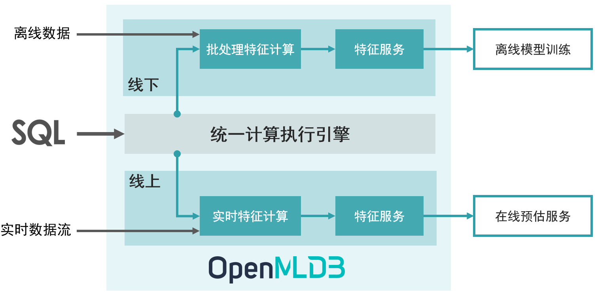

**[English version](./README.md) | 中文版**

### OpenMLDB 是一个开源机器学习数据库，提供企业级 FeatureOps 全栈解决方案。

## 1. 设计理念

在人工智能工程化落地过程中，企业的数据和工程化团队 95% 的时间精力会被数据处理、数据校验等相关工作所消耗。为了解决该痛点，1% 的头部企业会花费上千小时自研构建数据与特征平台，来解决诸如线上线下一致性、数据穿越、高并发低延迟、高可用等工程挑战；其他 99% 的企业则采购高昂的 SaaS 工具和数据治理服务。 

OpenMLDB 致力于闭环解决 AI 工程化落地的数据治理难题，并且已经在上百个企业级人工智能场景中得到落地。OpenMLDB 优先开源了特征数据治理能力，依托 SQL 的开发能力，为企业提供全栈功能的，低门槛特征数据计算和管理平台。

## 2. 企业级 FeatureOps 全栈解决方案

MLOps 为人工智能工程化落地提供全栈技术方案，作为其中的关键一环，FeatureOps 负责特征计算和供给，衔接 DataOps 和 ModelOps。一个完整的可高效工程化落地的 FeatureOps 解决方案需要覆盖特征工程的各个方面，包括功能需求（如特征存储、特征计算、特征上线、特征共享、特征服务等）和产品级需求（如低延迟、高并发、灾备、高可用、扩缩容、平滑升级、可监控等）。OpenMLDB 提供一套企业级全栈 FeatureOps 解决方案，以及低门槛的基于 SQL 的开发和管理体验，让特征工程开发回归于本质：专注于高质量的特征计算脚本开发，不再被工程化效率落地所羁绊。

 

上图显示了基于 OpenMLDB 的 FeatureOps 的基本使用流程，从离线特征开发到服务上线，只需要三个步骤：

1. 使用 SQL 进行线下特征计算脚本开发
1. SQL 特征计算脚本一键部署上线，由线下模式切换为线上模式
3. 接入实时数据流，进行线上实时特征计算和供给服务

## 3. 核心特性

**线上线下一致性执行引擎：** 离线和实时特征计算使用统一的计算执行引擎，线上线下一致性得到了天然保证。

**以 SQL 为核心的开发和管理体验：** 低门槛且功能强大的数据库开发体验，全流程基于 SQL 进行特征计算脚本开发以及部署上线。

**面向特征计算的定制化性能优化：** 离线特征计算使用[面向特征计算优化的 OpenMLDB Spark 发行版](https://docs.openmldb.ai/v/0.4/content-2/openmldbspark_distribution)；线上实时特征计算在高吞吐压力下的复杂查询提供几十毫秒量级的延迟，充分满足高并发、低延迟的性能需求。

**企业级特性：** 为大规模企业级应用而设计，整合诸多企业级特性，包括灾备恢复、高可用、可无缝扩缩容、可平滑升级、可监控、企业级异构内存架构支持等。

## 4. FAQ

1. **主要使用场景是什么？**

   目前主要面向人工智能场景，为机器训练模型和推理提供一站式特征供给解决方案，包含特征计算、特征存储、特征访问等功能。此外，OpenMLDB 本身也包含了一个高效且功能完备的时序数据库，使用于金融、IoT、数据标注等领域。

2. **OpenMLDB 是如何发展起来的？**
   
   OpenMLDB 起源于领先的人工智能平台提供商[第四范式](https://www.4paradigm.com/)的商业化软件。其核心开发团队在 2021 年将商业产品中作为特征工程的核心组件进行了抽象、增强、以及社区友好化，将它们形成了一个系统的开源产品，以帮助更多的企业低成本实现人工智能转型。在开源之前，OpenMLDB 已经作为第四范式的商业化组件之一在上百个场景中得到了部署和上线。
   
3. **OpenMLDB 是否就是一个 feature store？**
   
   OpenMLDB 包含 feature store 的全部功能，并且提供更为完整的 FeatureOps 全栈方案。除了提供特征存储功能，还具有基于 SQL 的数据库开发体验、[面向特征计算优化的 OpenMLDB Spark 发行版](https://docs.openmldb.ai/v/0.4/content-2/openmldbspark_distribution)，针对实时特征计算优化的索引结构，特征上线服务、企业级运维和管理等功能。此外，OpenMLDB 也被用作一个高性能的时序特征数据库。
   
4. **OpenMLDB 为什么选择 SQL 作为开发语言？**
   
   SQL 具备表达语法简洁且功能强大的特点，选用 SQL 和数据库开发体验一方面降低开发门槛，另一方面更易于跨部门之间的协作和共享。此外，基于 OpenMLDB 的实践经验表明，SQL 在特征计算的表达上功能完备，已经经受了长时间的实践考验。

## 5. 编译和安装

:point_right: [点击这里](https://docs.openmldb.ai/content-4)

## 6. QuickStart

**集群版和单机版**

OpenMLDB 有两种部署模式：集群版（cluster version）和单机版（standalone vesion）。集群版适合于大规模数据的生产环境，提供了良好的可扩展性和高可用性；单机版适合于小数据场景或者试用目的，更加方便部署和使用。集群版和单机版在功能上完全一致，但是在某些具体功能上会有不同限制，详细参阅[此篇说明文档](https://docs.openmldb.ai/v/0.4/content-2/standalone_vs_cluster)。

**准备开始体验 OpenMLDB**

:point_right: [OpenMLDB 快速上手指南](https://docs.openmldb.ai/v/0.4/content-1/openmldb_quickstart)

## 7. 使用案例

我们正在努力构建一个 OpenMLDB 用于实际案例的列表，为 OpenMLDB 如何在你的业务中发挥价值提供参考，请随时关注我们的列表更新。

| 应用                                                         | 所用工具           | 简介                                                         |
| ------------------------------------------------------------ | ------------------ | ------------------------------------------------------------ |
| [New York City Taxi Trip Duration](https://docs.openmldb.ai/v/0.4/content-3/taxi_tour_duration_prediction) | OpenMLDB, LightGBM | 这是个来自 Kaggle 的挑战，用于预测纽约市的出租车行程时间。你可以从这里阅读更多关于[该应用场景的描述](https://www.kaggle.com/c/nyc-taxi-trip-duration/)。本案例展示使用 OpenMLDB + LightGBM 的开源方案，快速搭建完整的机器学习应用。 |

## 8. OpenMLDB 文档

你可以找到我们完整的 [OpenMLDB 使用文档](https://docs.openmldb.ai/)。

## 9. 开发计划

| 版本号 | 预期发布日期 | 主要特性                                                     |
| ------ | ------------ | ------------------------------------------------------------ |
| 0.5.0  | 2022 Q1      | - 在线服务监控模块 - 长时间窗口支持  - 支持第三方在线数据流引入，包括 Kafka 和 Pulsar - 实时特征计算的存储引擎支持外存设备 |

此外，OpenMLDB roadmap 上有一些规划中的重要功能演进，但是尚未具体排期，欢迎给我们任何反馈：

- Cloud-native 版本
- 适配机器学习全流程管理平台，比如 MLflow, Airflow 等
- 整合基于傲腾持久内存的快速恢复技术
- 整合自动特征生成
- 轻量级 edge 版本

## 10. 开发贡献者

我们非常感谢来自社区的贡献。

- 如果你对于加入 OpenMLDB 开发者感兴趣，请阅读我们的 [Contribution Guideline](CONTRIBUTING.md)。
- 如果你是一位新加入的贡献者，你或许可以从我们的这个 [good-first-issue](https://github.com/4paradigm/OpenMLDB/issues?q=is%3Aopen+is%3Aissue+label%3A%22good+first+issue%22) 列表开始。

为我们已有的社区贡献者鼓掌表示感谢 :clap: 

## 11. 社区

- 网站：[https://openmldb.ai/](https://openmldb.ai) (即将上线)
- **Email**: [contact@openmldb.ai](mailto:contact@openmldb.ai)
- **[Slack](https://join.slack.com/t/openmldb/shared_invite/zt-ozu3llie-K~hn9Ss1GZcFW2~K_L5sMg)**
- **[GitHub Issues](https://github.com/4paradigm/OpenMLDB/issues) 和 [GitHub Discussions](https://github.com/4paradigm/OpenMLDB/discussions)**: 如果你是一个严肃的开发者，我们非常欢迎加入我们 GitHub 上的开发者社区，近距离参与我们的开发迭代。GitHub Issues 主要用来搜集 bugs 以及反馈新特性需求；GitHub Discussions 主要用来给开发团队发布并且讨论 RFCs。
- [**技术博客**](https://www.zhihu.com/column/c_1417199590352916480)
- **微信交流群：**
    

## 12. 学术论文和技术博客

* Cheng Chen, Jun Yang, Mian Lu, Taize Wang, Zhao Zheng, Yuqiang Chen, Wenyuan Dai, Bingsheng He, Weng-Fai Wong, Guoan Wu, Yuping Zhao, and Andy Rudoff. *[Optimizing in-memory database engine for AI-powered on-line decision augmentation using persistent memory](http://vldb.org/pvldb/vol14/p799-chen.pdf)*. International Conference on Very Large Data Bases (VLDB) 2021.
* [第四范式OpenMLDB优化创新论文被国际数据库顶会VLDB录用](https://zhuanlan.zhihu.com/p/401513878)
* [OpenMLDB在银行上线事中交易反欺诈模型实践](https://zhuanlan.zhihu.com/p/389599785)
* [OpenMLDB在AIOPS领域关于交易系统异常检测应用实践](https://zhuanlan.zhihu.com/p/393602288)
* [5分钟完成硬件剩余寿命智能预测](https://zhuanlan.zhihu.com/p/399346826)

## 13. [用户列表](https://github.com/4paradigm/OpenMLDB/discussions/707)

我们创建了一个用于搜集用户使用反馈意见的[用户列表](https://github.com/4paradigm/OpenMLDB/discussions/707)。我们非常感激我们的社区用户可以留下基于 OpenMLDB 的使用案例、意见、或者任何反馈。我们非常期待听到你的声音！
