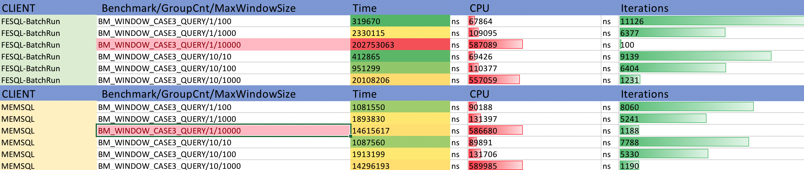

# FeSQL Query Benchmark 


## 简单列选择

#### 场景1: 表多列筛选：

```SQL
-- BM_WINDOW_CASE1_BATCH_QUERY/N 描述：
-- 数据规模为N条
select col_str64, col_i64, col_i32, col_i16, col_f, col_d, col_str255 
        from tbl limit ${N};
              
```

| CLIENT         | Benchmark/GroupCnt/MaxWindowSize | Time    |      | CPU    |      | Iterations |
| -------------- | -------------------------------- | ------- | ---- | ------ | ---- | ---------- |
| FESQL-BatchRequestRun | BM_SIMPLE_QUERY/10/1             | 248826  | ns   | 59943  | ns   | 12263      |
| FESQL-BatchRequestRun | BM_SIMPLE_QUERY/10/10            | 310241  | ns   | 66803  | ns   | 10848      |
| FESQL-BatchRequestRun | BM_SIMPLE_QUERY/10/100           | 618046  | ns   | 103188 | ns   | 5586       |
| FESQL-BatchRequestRun | BM_SIMPLE_QUERY/10/1000          | 3470984 | ns   | 588842 | ns   | 1209       |

| CLIENT | Benchmark/GroupCnt/MaxWindowSize | Time    |      | CPU     |      | Iterations |
| ------ | -------------------------------- | ------- | ---- | ------- | ---- | ---------- |
| MEMSQL | BM_SIMPLE_QUERY/10/1             | 826812  | ns   | 84570   | ns   | 8400       |
| MEMSQL | BM_SIMPLE_QUERY/10/10            | 1115726 | ns   | 97611   | ns   | 8317       |
| MEMSQL | BM_SIMPLE_QUERY/10/100           | 1889041 | ns   | 208870  | ns   | 3027       |
| MEMSQL | BM_SIMPLE_QUERY/10/1000          | 8867520 | ns   | 1426309 | ns   | 490        |

报告分析：

FESQL的单行列筛选性能优于MEMSQL，30~60%

## 窗口聚合

### 单窗口聚合

```SQL
#schema
create table tbl (
        col_i32 int,
        col_i16 int,
        col_i64 bigint,
        col_f float,
        col_d double,
        col_str64 string,
        col_str255 string,
       index(key=(col_str64), ts=col_i64, ttl=60d));
```

### benchmark 报告：

#### 场景1: 全表窗口sum统计，统计列数2: 

```SQL
-- BM_WINDOW_CASE1_BATCH_QUERY/N 描述：
-- 数据规模为N条
-- col_str64有10类
-- 每类col_str64上最大窗口为N/10
SELECT sum(col_i32) OVER w1 as sum_col_i32, 
sum(col_f) OVER w1 as sum_col_f 
FROM tbl
window w1 as (PARTITION BY col_str64 
                  ORDER BY col_i64
                  ROWS BETWEEN 86400000 PRECEDING AND CURRENT ROW) limit ${N};
              
```

| CLIENT         | Benchmark/GroupCnt/MaxWindowSize | Time     |      | CPU    |      | Iterations |
| -------------- | -------------------------------- | -------- | ---- | ------ | ---- | ---------- |
| FESQL-BatchRequestRun | BM_WINDOW_CASE1_QUERY/10/1       | 264609   | ns   | 60641  | ns   | 11745      |
| FESQL-BatchRequestRun | BM_WINDOW_CASE1_QUERY/10/10      | 311786   | ns   | 70131  | ns   | 10341      |
| FESQL-BatchRequestRun | BM_WINDOW_CASE1_QUERY/10/100     | 1064633  | ns   | 119575 | ns   | 5688       |
| FESQL-BatchRequestRun | BM_WINDOW_CASE1_QUERY/10/1000    | 40367027 | ns   | 591808 | ns   | 100        |

| CLIENT | Benchmark/GroupCnt/MaxWindowSize | Time     |      | CPU    |      | Iterations |
| ------ | -------------------------------- | -------- | ---- | ------ | ---- | ---------- |
| MEMSQL | BM_WINDOW_CASE1_QUERY/10/1       | 958215   | ns   | 89087  | ns   | 7884       |
| MEMSQL | BM_WINDOW_CASE1_QUERY/10/10      | 1088567  | ns   | 85354  | ns   | 7369       |
| MEMSQL | BM_WINDOW_CASE1_QUERY/10/100     | 2386065  | ns   | 144237 | ns   | 4921       |
| MEMSQL | BM_WINDOW_CASE1_QUERY/10/1000    | 18958395 | ns   | 828558 | ns   | 856        |

报告分析：

- MemSQL在数据规模为10000时下，性能有优势。FESQL BatchRun在这个数据规模下，性能衰减很大

#### 场景2: 全表窗口sum统计，统计列数4: 

```SQL
-- BM_WINDOW_CASE1_BATCH_QUERY/N 描述：
-- 数据规模为N条，N in {10, 100, 1000, 10000}
-- col_str64有10类
-- 每类col_str64上最大窗口为N/10
SELECT sum(col_i32) OVER w1 as sum_col_i32, 
sum(col_i16) OVER w1 as sum_col_i16, 
sum(col_f) OVER w1 as sum_col_f, 
sum(col_d) OVER w1 as sum_col_d 
FROM tbl
window w1 as (PARTITION BY col_str64 
                  ORDER BY col_i64
                  ROWS BETWEEN 86400000 PRECEDING AND CURRENT ROW) limit ${N};
```


| CLIENT         | Benchmark/GroupCnt/MaxWindowSize | Time     |      | CPU    |      | Iterations |
| -------------- | -------------------------------- | -------- | ---- | ------ | ---- | ---------- |
| FESQL-BatchRequestRun | BM_WINDOW_CASE2_QUERY/10/10      | 277045   | ns   | 64237  | ns   | 11924      |
| FESQL-BatchRequestRun | BM_WINDOW_CASE2_QUERY/10/100     | 344821   | ns   | 70509  | ns   | 9459       |
| FESQL-BatchRequestRun | BM_WINDOW_CASE2_QUERY/10/1000    | 1452067  | ns   | 121331 | ns   | 5639       |
| FESQL-BatchRequestRun | BM_WINDOW_CASE2_QUERY/10/10000   | 81348037 | ns   | 586633 | ns   | 100        |

| CLIENT | Benchmark/GroupCnt/MaxWindowSize | Time     |      |         | Iterations |      |
| ------ | -------------------------------- | -------- | ---- | ------- | ---------- | ---- |
| MEMSQL | BM_WINDOW_CASE2_QUERY/10/10      | 947796   | ns   | 80607   | ns         | 7662 |
| MEMSQL | BM_WINDOW_CASE2_QUERY/10/100     | 1052808  | ns   | 81987   | ns         | 7421 |
| MEMSQL | BM_WINDOW_CASE2_QUERY/10/1000    | 3015756  | ns   | 176972  | ns         | 1000 |
| MEMSQL | BM_WINDOW_CASE2_QUERY/10/10000   | 26454000 | ns   | 1209306 | ns         | 100  |

报告分析：

- MemSQL在数据规模为10000时下，性能有优势。FESQL BatchRun在这个数据规模下，性能衰减很大。
- FESQL-BatchRequestRun/BM_WINDOW_CASE2_QUERY/10000 VS FESQL-BatchRun/BM_WINDOW_CASE1_QUERY/10000: 
  - FESQL在10000数据规模下,统计列数增加一倍（从2列变成4列），Time消耗增加一倍。MemSQL却仅增加约30%，说明FESQL对统计列规模敏感。这可能是由于统计多列耗时导致性能衰减，也可能是多列编码解码以及rpc传输导致性能衰减。
- BatchRequestRun/BM_WINDOW_CASE2_QUERY/10000 VS BatchRun/BM_SIMPLE_QUERY/10000:
  - FESQL的单行列筛选性能表现比MEMSQL好，因此多列编解码和rpc传输不是瓶颈
- 最终，猜测瓶颈可能还是多列统计导致


#### 场景3: 全表窗口max统计，统计列数1: 

```SQL
-- BM_WINDOW_CASE1_BATCH_QUERY/N 描述：
-- 数据规模为N=GroupCnt*WindowMaxSize条，N in {1*100, 1* 1000, 1* 10000, 10*10, 10*100, 10*1000}
SELECT sum(col_i32) OVER w1 as sum_col_i32, 
sum(col_i16) OVER w1 as sum_col_i16, 
sum(col_f) OVER w1 as sum_col_f, 
sum(col_d) OVER w1 as sum_col_d 
FROM tbl
window w1 as (PARTITION BY col_str64 
                  ORDER BY col_i64
                  ROWS BETWEEN 86400000 PRECEDING AND CURRENT ROW) limit ${N};
```

| CLIENT         | Benchmark/GroupCnt/MaxWindowSize | Time      |      | CPU    |      | Iterations |
| -------------- | -------------------------------- | --------- | ---- | ------ | ---- | ---------- |
| FESQL-BatchRequestRun | BM_WINDOW_CASE3_QUERY/1/100      | 319670    | ns   | 67864  | ns   | 11126      |
| FESQL-BatchRequestRun | BM_WINDOW_CASE3_QUERY/1/1000     | 2330115   | ns   | 109095 | ns   | 6377       |
| FESQL-BatchRequestRun | BM_WINDOW_CASE3_QUERY/1/10000    | 202753063 | ns   | 587089 | ns   | 100        |
| FESQL-BatchRequestRun | BM_WINDOW_CASE3_QUERY/10/10      | 412865    | ns   | 69426  | ns   | 9139       |
| FESQL-BatchRequestRun | BM_WINDOW_CASE3_QUERY/10/100     | 951299    | ns   | 110377 | ns   | 6404       |
| FESQL-BatchRequestRun | BM_WINDOW_CASE3_QUERY/10/1000    | 20108206  | ns   | 557059 | ns   | 1231       |

| CLIENT | Benchmark/GroupCnt/MaxWindowSize | Time     |      | CPU    |      | Iterations |
| ------ | -------------------------------- | -------- | ---- | ------ | ---- | ---------- |
| MEMSQL | BM_WINDOW_CASE3_QUERY/1/100      | 1081550  | ns   | 90188  | ns   | 8060       |
| MEMSQL | BM_WINDOW_CASE3_QUERY/1/1000     | 1893830  | ns   | 131397 | ns   | 5241       |
| MEMSQL | BM_WINDOW_CASE3_QUERY/1/10000    | 14615617 | ns   | 586680 | ns   | 1188       |
| MEMSQL | BM_WINDOW_CASE3_QUERY/10/10      | 1087560  | ns   | 89891  | ns   | 7788       |
| MEMSQL | BM_WINDOW_CASE3_QUERY/10/100     | 1913199  | ns   | 131706 | ns   | 5330       |
| MEMSQL | BM_WINDOW_CASE3_QUERY/10/1000    | 14296193 | ns   | 589985 | ns   | 1190       |



报告分析：

- MEMSQL数据规模相同时，即便MaxWi ndowSize不同，性能也差异不大。具体参考MEMSQL性能：
  - BM_WINDOW_CASE3_QUERY/1/100 VS BM_WINDOW_CASE3_QUERY/10/10
  - BM_WINDOW_CASE3_QUERY/1/1000 VS BM_WINDOW_CASE3_QUERY/10/100
  - BM_WINDOW_CASE3_QUERY/1/10000 VS BM_WINDOW_CASE3_QUERY/10/1000
  - 可以合理猜测：MEMSQL的MAX函数接近O(1)的复杂度。
- FESQL的数据规模相同时，MaxWindowSize不同，性能差异很大。具体参考FESQL-BatchRun性能：
  - BM_WINDOW_CASE3_QUERY/1/100 VS BM_WINDOW_CASE3_QUERY/10/10
  - BM_WINDOW_CASE3_QUERY/1/1000 VS BM_WINDOW_CASE3_QUERY/10/100
  - BM_WINDOW_CASE3_QUERY/1/10000 VS BM_WINDOW_CASE3_QUERY/10/1000
  - 分析：FESQL的一次max的计算时间复杂度是O(n)，N时窗口的size。因此，当总数据规模为M时候，整体的计算复杂度时M*O(N)，其中N估算为平均窗口长度。
- 最终，猜测MEMSQL的MAX应该是基于增量计算

##  简单列选择+自定义单行UDF（Q1)

```SQL
%%fun
def test(a:i32,b:i32):i32
    c=a+b
    d=c+1
    return d
end
%%sql
SELECT column1, column2,test(column1,column5) as f1 FROM t1 limit 10;
```

### benchmark数据集

- 数据量：1000, 1w, 10w, 100w, 1000w
- 列：10, 100, 1000列
- 字符串列：1, 5, 10, 100, 1000

## 全选(2010/Q1)

```SQL
select * from t1;
```

### TODO

select *需要优化codegen，可以直接获取一整行数据

## 聚合函数的性能表现(Q1)：

### 数字统计类：
* sum
* count
* avg
* min
* max
* std

### 字符串处理类：
* join
* combine

### benchmark数据集

- 数据量：1000, 1w, 10w, 100w, 1000w
- 列：10, 100, 1000列
- 字符串列：1, 5, 10, 100, 1000
- 窗口大小：100, 1000, 1w, 10w
- 分片规模：10, 100, 1000, 1w, 10w, 100w, 1000w