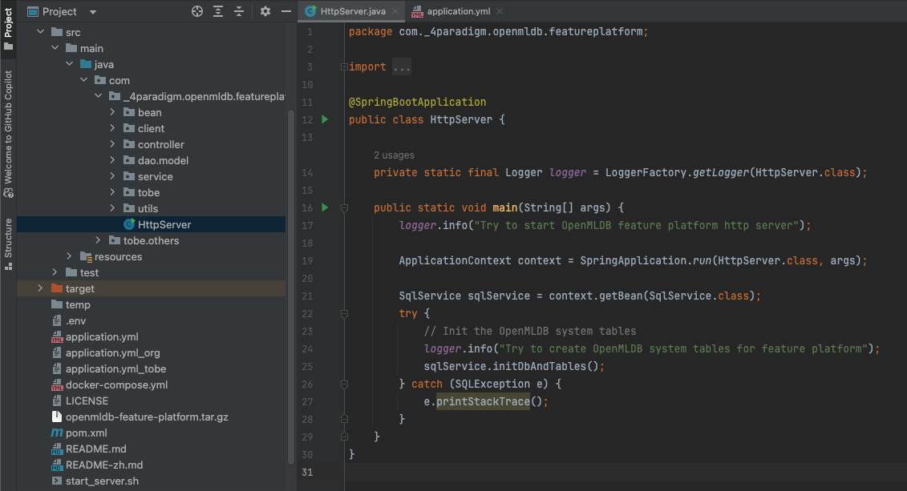

# Build from Source

## Introduction

You can build FeatInsight from source code as required. 

## Download

Download project source code.

```
git clone https://github.com/4paradigm/FeatInsight
```

## Compile from Source

Enter project root directory, execute the following command to compile frontend and backend.

```
cd ./FeatInsight/frontend/
npm run build

cd ../
mvn clean package
```

## Start

Deploy OpenMLDB cluster and generate configuration file, start the service with the following command.


```
./start_server.sh
```

## IDE

If you are developing with IDE, you can modify `application.yml` configuration file, and directly start `HtttpServer.java`.


