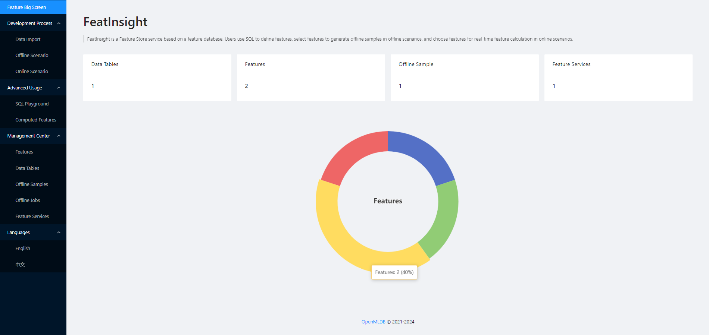

# Introduction

FeatInsight is a sophisticated feature store service, leveraging [OpenMLDB](https://github.com/4paradigm/OpenMLDB) for efficient feature computation, management and orchestration. 

FeatInsight provides a user-friendly user interface, allowing users to perform the entire process of feature engineering for machine learning, including data import, viewing and update, feature generation, store and online deployment. For offline scenarios, user can choose features for training sample generation for ML training; for online scenarios, user can deploy online feature services for real-time feature computations.

## Main Functionalities

FeatInsight includes the following major functionalities:

- [Data Management](./functions/import_data.md): To import and manage dataset and online data sources for feature engineering.
- [Feature Management](./functions/manage_feature.md): To store original features and generated features.
- [Online Scenario](./functions/online_scenario.md): To deploy feature services online, which provides hard real-time online feature extraction APIs using online data.
- [Offline Scenario](./functions/offline_scenario.md): To generate training dataset from offline data and corresponding feature calculations. It also provides management functions for offline datasets and offline tasks. 
- [SQL Playground](./functions/sql_playground.md): To execute any OpenMLDB SQL statements. It can be used in both online and offline mode for feature calculations.
- [Computed Features](./functions/computed_features.md)：To store pre-computed features directly into OpenMLDB online tables, for access to perform feature reads and writes.

## Key Features

The main objective of FeatInsight is to address common challenges in machine learning development, including facilitating easy and quick feature extraction, transformation, combination, and selection, managing feature lineage, enabling feature reuse and sharing, version control for feature services, and ensuring consistency and reliability of feature data used in both training and inference processes. Application scenarios includes the following:

* Online Feature Service Deployment: Provides high performance feature storage and online feature compuation functions for localized deployment.
* MLOps Platform: Establishs MLOps workflow with OpenMLDB online-offline consistent computations.
* FeatureStore Platform: Provides comprehensive feature extraction, deletion, online-deployment and lineage management functionality to achieve low-cost local FeatureStore services.
* Open-Source Feature Solution Reuse: Supports solution reuse locally for feature reuse and sharing.
* Business Component for Machine Learning: Provides a one-stop feature engineering solution machine learning models in recommendation systems, natural language processing, finance, healthcare, and other areas of machine learning implementation.

## Core Concepts

Here are some terms and their definitions used in FeatInsight for better understanding:

* Feature: Data obtained through feature extraction from raw data that can be directly used for model training and inference.
* Pre-computed Feature: Feature values stored after external batch computation or streaming processing, available for direct online use.
* Feature View: A set of features defined by a single SQL computation statement.
* Feature Service: Combines one or more features into a feature service, provided for use in online scenarios.
* Online Scenario: By deploying feature services, it provides hard real-time online feature extraction interfaces using online data.
* Offline Scenario: With distributed computing, performs feature computation on offline data and export training dataset for machine learning.
* Online-Offline Consistency: The consistency in feature results between online and offline scenarios is ensured through the same SQL statement.