# Quickstart

We will use a simple example to show how to use FeatInsight to perform feature engineering.

The installation and deployment, you can refer to [OpenMLDB Deployment](../../../deploy/index.rst) and [FeatInsight Deployment](./install/index.rst).

## Usage

The major steps to use FeatInsight includes the following:

1. Data Import: Use SQL or frontend form to create database, data table, import online data, import offline data.
2. Feature Creation: Use SQL to define a feature view, and FeatInsight will use SQL compiler to analyze and create corresponding features.
3. Offline Scenarios: Choose features to import (features from different feature views can be chosen), and export training dataset through distributed computing into local or distributed storage. 
4. Online Scenarios: Choose features for deployment, and deploy them as online feature extraction services. The service then can be accessed through HTTP client to retrieve online feature extraction results.

### 1. Data Import

Firstly, create database `test_db` and data table `test_table`. You can use SQL to create.

```
CREATE DATABASE test_db;

CREATE TABLE test_db.test_table (id STRING, trx_time DATE);
```

Or can use the UI and create under "Data Import".

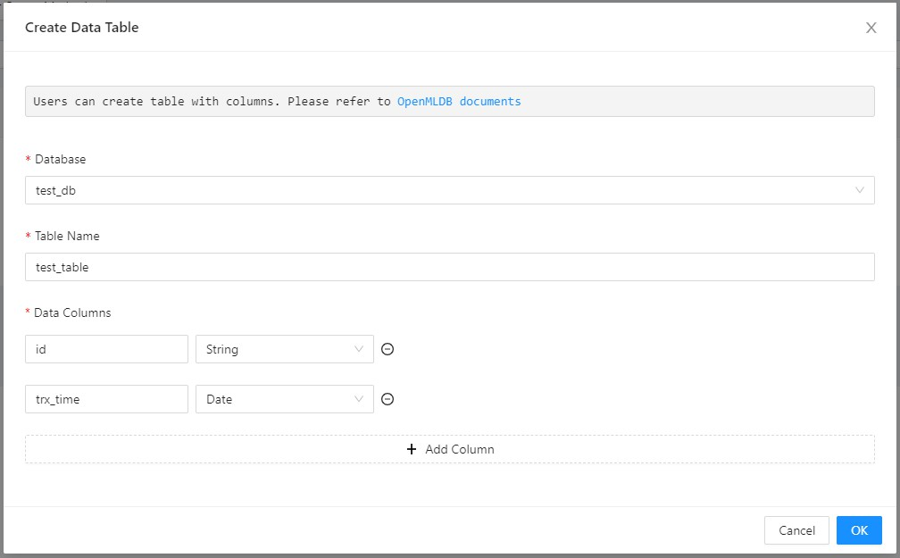

For easier testing, we prepare a CSV file and save it to `/tmp/test_table.csv`. Note that, this path is a local path for the machine that runs the OpenMLDB TaskManager, usually also the machine for FeatInsight. You will need the access to the machine for edition.

```
id,trx_time
user1,2024-01-01
user2,2024-01-02
user3,2024-01-03
user4,2024-01-04
user5,2024-01-05
user6,2024-01-06
user7,2024-01-07
```

For online scenarios, you can use command `LOAD DATA` or `INSERT`. Here we use "Import from CSV".

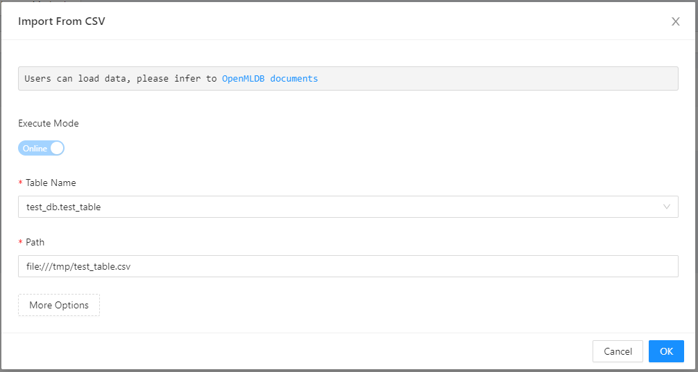

The imported data can be previewed.

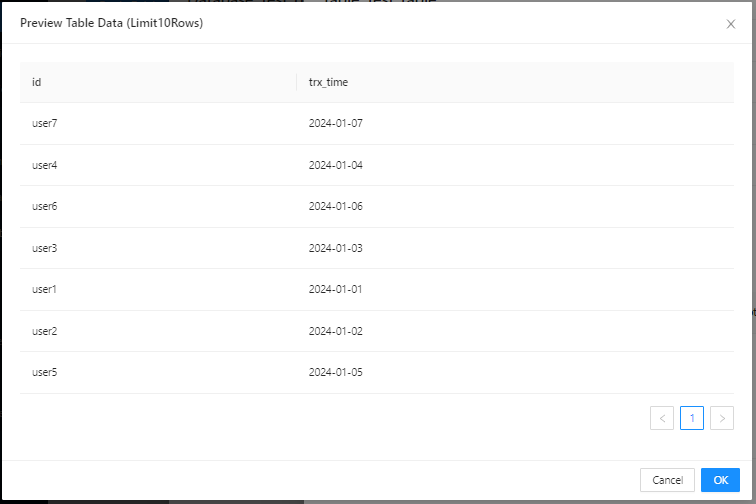

For offline scenarios, you can also use `LOAD_DATA` or "Import from CSV".

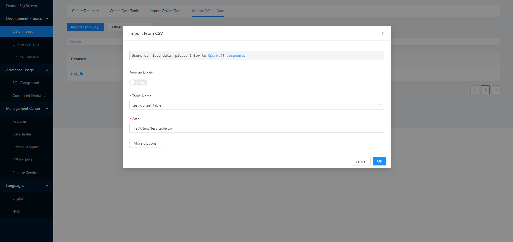

Wait for about half a minute for the task to finish. You can also check the status and log.

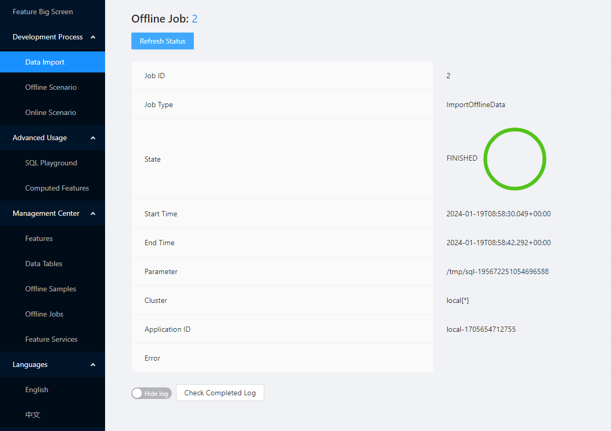

### 2. Feature Creation

After data import, we can create features. Here we use SQL to create two basic features.

```
SELECT id, dayofweek(trx_time) as trx_day FROM test_table
```

In "Features", the button beside "All Features" is to create new features. Fill in the from accordingly.

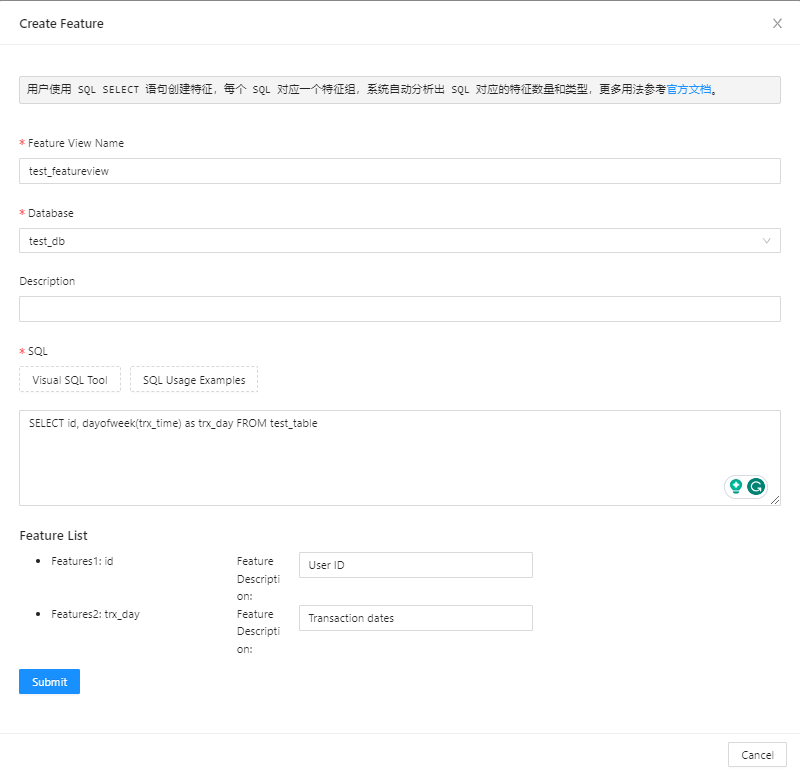

After successful creation, you can check the features. Click on the name to go into details. You can check the basic information, as well as preview feature values. 

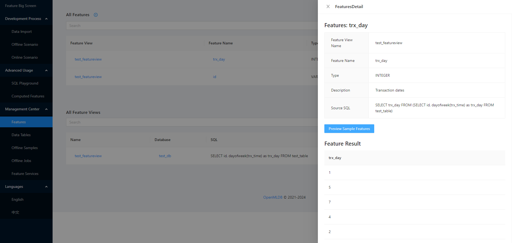


### 3. Offline Samples Export

In "Offline Scenario", you can choose to export offline samples. You can choose the features to export and specify export path. There are "More Options" for you to specify file format and other advance parameters.

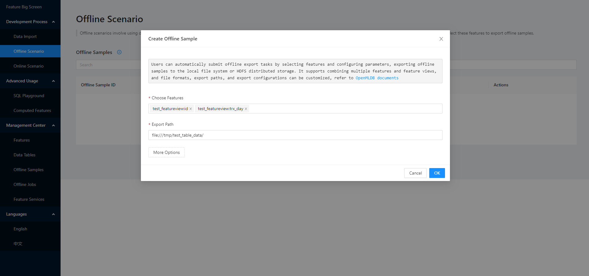

Wait for about half a minute and you can check the status at "Offline Samples".

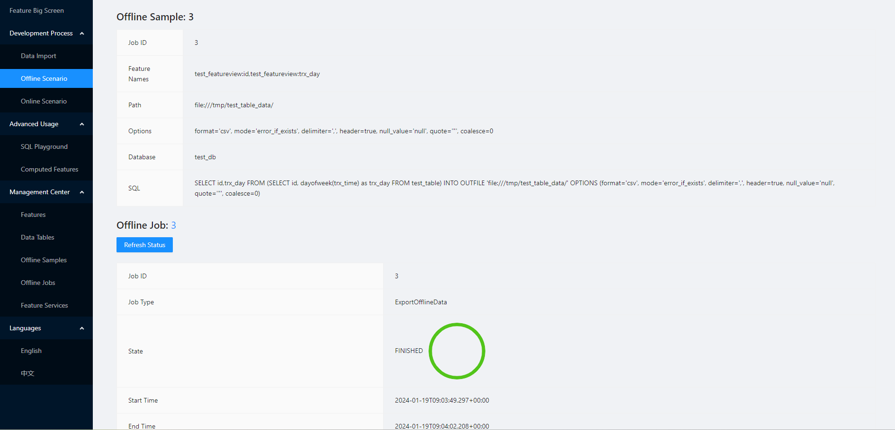

You can check the content of the exported samples. To verify online-offline consistency provided by FeatInsight, you can record the result and compare it with online feature computation results.

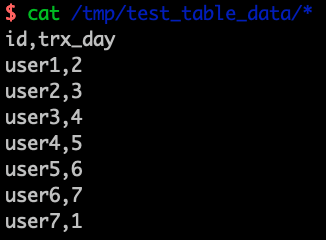

### 4. Online Feature Service

In "Feature Services", the button besides "All Feature Services" is to create a new feature service. You can choose the features to deploy, and fill in service name and version accordingly.

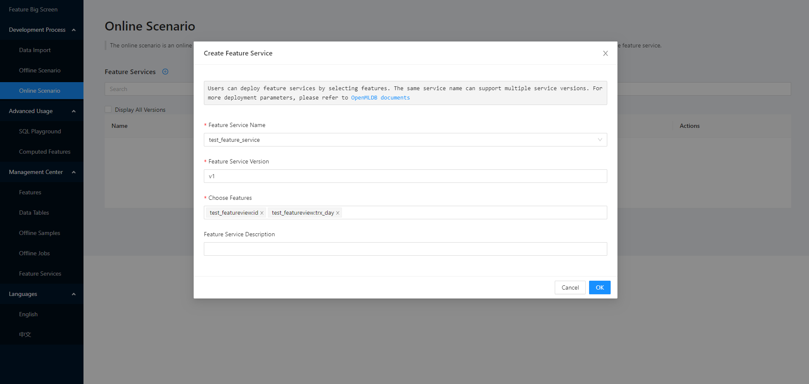

After successful creation, you can check service details, including feature list, dependent tables and lineage.

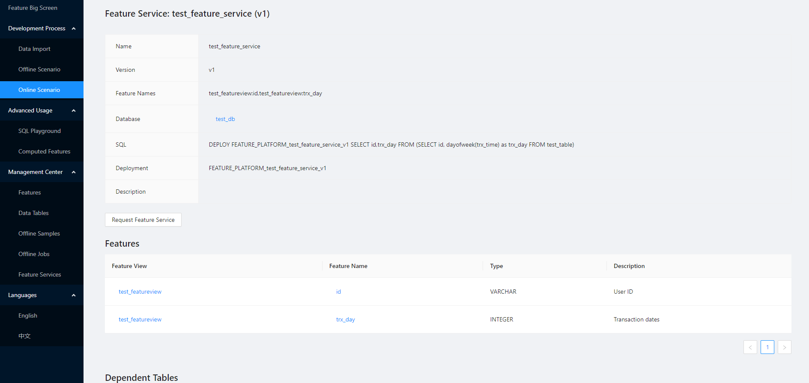

Lastly, in "Request Feature Service" page, we can key in test data to perform online feature calculation, and compare it with offline computation results.

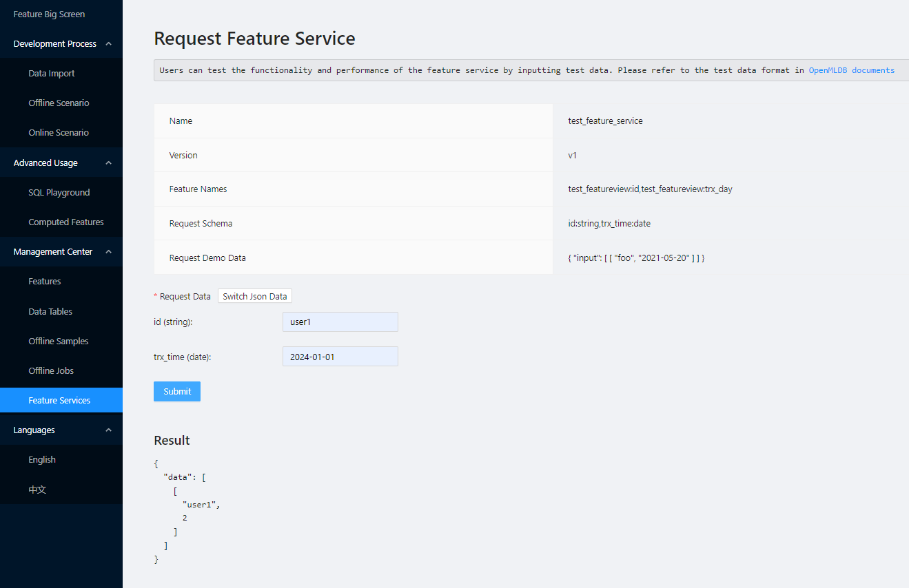

## Summary

This example demonstrates the complete process of using FeatInsight. By writing simple SQL statements, users can define features for both online and offline scenarios. By selecting different features or combining feature sets, users can quickly reuse and deploy features services. Lastly, the consistency of feature computation can be validated by comparing offline and online calculation results.

## Appendix: Advanced Functions
In addition to the basic functionalities of feature engineering, FeatInsight also provides advanced functionalities to facilitate feature development for users:

* SQL Playground: Offers debugging and execution capabilities for OpenMLDB SQL statements, allowing users to execute arbitrary SQL operations and debug SQL statements for feature extraction.
* Computed Features: Enables the direct storage of feature values obtained through external batch computation or stream processing into OpenMLDB online tables. Users can then access and manipulate feature data in online tables.