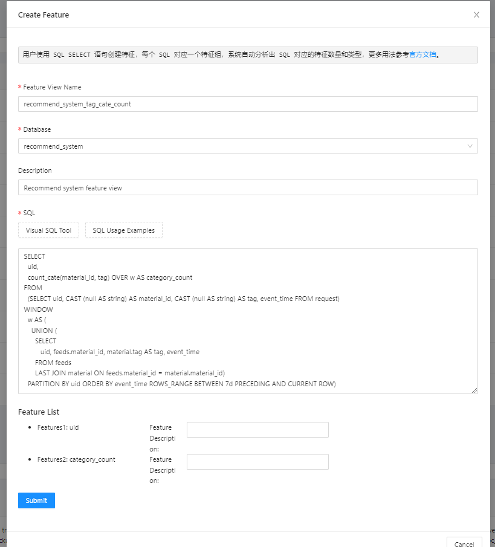
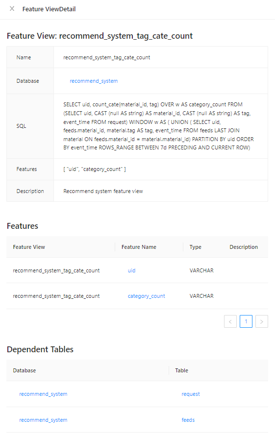
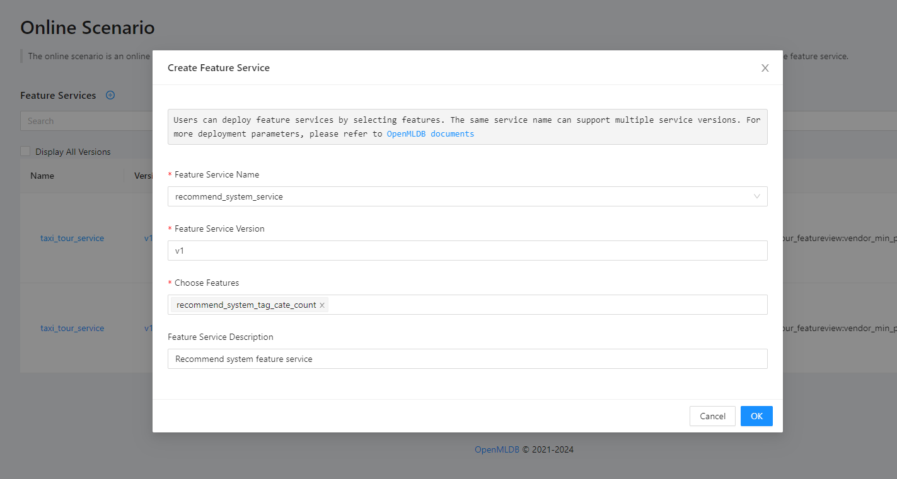

# E-commerce Recommendation System

## Background

In common e-commerce recommendation systems, it is necessary to accurately count the number of times users browse various tagged advertisements in a specific time period (e.g., the last 7 days) before each recommendation request. These statistics will be fed back to the recommendation system for more in-depth rule analysis and decision-making.

## Data Preparation

We prepare three data tables. 

First is the request data table, where users query the features for the current window using ID and request time.

```
CREATE TABLE recommend_system.request (uid string, event_time timestamp)
```

Next is the exposure table, which provides user ID and material ID information. To simplify, we remove other irrelevant columns.

```
CREATE TABLE recommend_system.feeds (uid string, material_id string, event_time timestamp)
```

Finally, the material table contains basic information about the material, including the material type needed for this scenario. Again, we simplify by removing unrelated fields.

```
CREATE TABLE recommend_system.material (material_id string, tag string);
```

## Feature Design

Based on the scenario description, we only need to extract the count of different labels for user ID and materials. We use the following OpenMLDB SQL to perform feature extraction.

```
SELECT 
  uid, 
  count_cate(material_id, tag) OVER w AS category_count
FROM
  (SELECT uid, CAST (null AS string) AS material_id, CAST (null AS string) AS tag, event_time FROM request) 
WINDOW 
  w AS ( 
    UNION (
      SELECT
         uid, feeds.material_id, material.tag AS tag, event_time
      FROM feeds 
      LAST JOIN material ON feeds.material_id = material.material_id)
  PARTITION BY uid ORDER BY event_time ROWS_RANGE BETWEEN 7d PRECEDING AND CURRENT ROW)
```
You can refer to below to understand the meaning of the SQL statement:

1. Join the exposure table with the material table to obtain the attributes needed, such as the material's label type.
2. Expand the request table, adding the material_id and tag columns and filling them with null values. This facilitates the subsequent Union operation with the output table from the first step.
3. Use Window Union to combine the tables from the first and second steps. This results in a complete table, and window and query operations are performed based on this complete table. Note that Window Union is used instead of Join + Window to avoid the possibility of a Left Join producing multiple rows for one data entry, and using Last Join may cause the secondary table to be joined with only one row of data.
4. Finally, use the count_cate function to count the material labels and obtain the feature.

## Implementation Process

### 1. Data Import

First, create the database and tables, and for convenience, add the indexes in advance.

```
CREATE DATABASE recommend_system;

CREATE TABLE recommend_system.request (uid string, event_time timestamp, INDEX(key=uid, TS=event_time));

CREATE TABLE recommend_system.feeds (uid string, material_id string, event_time timestamp, INDEX(key=uid, TS=event_time));

CREATE TABLE recommend_system.material (material_id string, tag string);
```

Since actual data needs to be desensitized, users can import test data according to their actual situation. This article only demonstrates the feature deployment process

### 2. Feature Definition

Define features using the SQL statement introduced earlier.

```
SELECT 
  uid, 
  count_cate(material_id, tag) OVER w AS category_count
FROM
  (SELECT uid, CAST (null AS string) AS material_id, CAST (null AS string) AS tag, event_time FROM request) 
WINDOW 
  w AS ( 
    UNION (
      SELECT
         uid, feeds.material_id, material.tag AS tag, event_time
      FROM feeds 
      LAST JOIN material ON feeds.material_id = material.material_id)
  PARTITION BY uid ORDER BY event_time ROWS_RANGE BETWEEN 7d PRECEDING AND CURRENT ROW)
```

在前端页面创建特征，并自动分析出需要创建的两个特征。

Create features through the frontend interface, use "Analyze SQL" to automatically analyze that two features need to be created.



After successfully creating the features, you can view the details through feature view details.



### 3. Feature Deployment

On the "Online Scenario" page, select the features to be deployed and confirm the creation.



After successfully deploying the feature service, you can test it by inputting request data.


## Summary

For recommendation systems, feature engineering is a crucial step. FeatInsight provides a simple and fast feature management and deployment process, helping users quickly deploy features to enhance the effectiveness of recommendation systems. Even more complex features can be described and deployed using SQL.

