# Taxi Trip Duration Prediction

## Background

The scenario is from Kaggle's [New York City Taxi Trip Duration](https://www.kaggle.com/c/nyc-taxi-trip-duration/overview), where the goal is to predict the trip duration for taxi rides in New York City. The inputs for prediction include the starting and ending latitude and longitude, departure time, weather conditions, etc. Feature extraction is required to ultimately predict the trip duration based on these features.

## Feature Design

For feature design, we refer to [Taxi Trip Duration Prediction (OpenMLDB+LightGBM)](../../../use_case/taxi_tour_duration_prediction.md). The following OpenMLDB SQL is used for feature engineering and export.

```
SELECT
  trip_duration,
  passenger_count,
  sum(pickup_latitude) OVER w AS vendor_sum_pl,
  max(pickup_latitude) OVER w AS vendor_max_pl,
  min(pickup_latitude) OVER w AS vendor_min_pl,
  avg(pickup_latitude) OVER w AS vendor_avg_pl,
  sum(pickup_latitude) OVER w2 AS pc_sum_pl,
  max(pickup_latitude) OVER w2 AS pc_max_pl,
  min(pickup_latitude) OVER w2 AS pc_min_pl,
  avg(pickup_latitude) OVER w2 AS pc_avg_pl,
  count(vendor_id) OVER w2 AS pc_cnt,
  count(vendor_id) OVER w AS vendor_cnt
FROM t1
WINDOW 
  w AS (PARTITION BY vendor_id ORDER BY pickup_datetime ROWS_RANGE BETWEEN 1d PRECEDING AND CURRENT ROW),
  w2 AS (PARTITION BY passenger_count ORDER BY pickup_datetime ROWS_RANGE BETWEEN 1d PRECEDING AND CURRENT ROW)
```

## Implementation Process

### 1. Data Import

Create database

Create testing database `taxi_trip_duration` and testing data table `t1`.

```
CREATE DATABASE taxi_trip_duration;

CREATE TABLE taxi_trip_duration.t1 (id string, vendor_id int, pickup_datetime timestamp, dropoff_datetime timestamp, passenger_count int, pickup_longitude double, pickup_latitude double, dropoff_longitude double, dropoff_latitude double, store_and_fwd_flag string, trip_duration int);
```

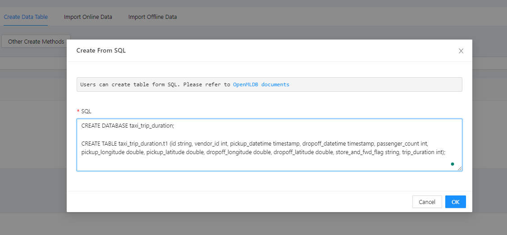

Note, for versions before 0.8.4, index creation is not automatic. You need to manually create index when creating tables.

```
CREATE TABLE taxi_trip_duration.t1(id string, vendor_id int, pickup_datetime timestamp, dropoff_datetime timestamp, passenger_count int, pickup_longitude double, pickup_latitude double, dropoff_longitude double, dropoff_latitude double, store_and_fwd_flag string, trip_duration int, INDEX(KEY=vendor_id, TS=pickup_datetime), INDEX(KEY=passenger_count, TS=pickup_datetime));
```

Download dataset from Kaggle.

```
kaggle competitions download -c nyc-taxi-trip-duration
```

Unzip to get `train.csv`, and put the file at `/tmp/train.csv`, in frontend form, use "Import From CSV" to import as online data.

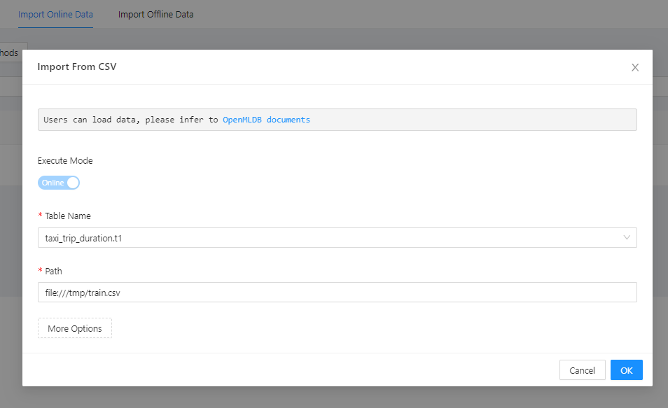

Preview online table.

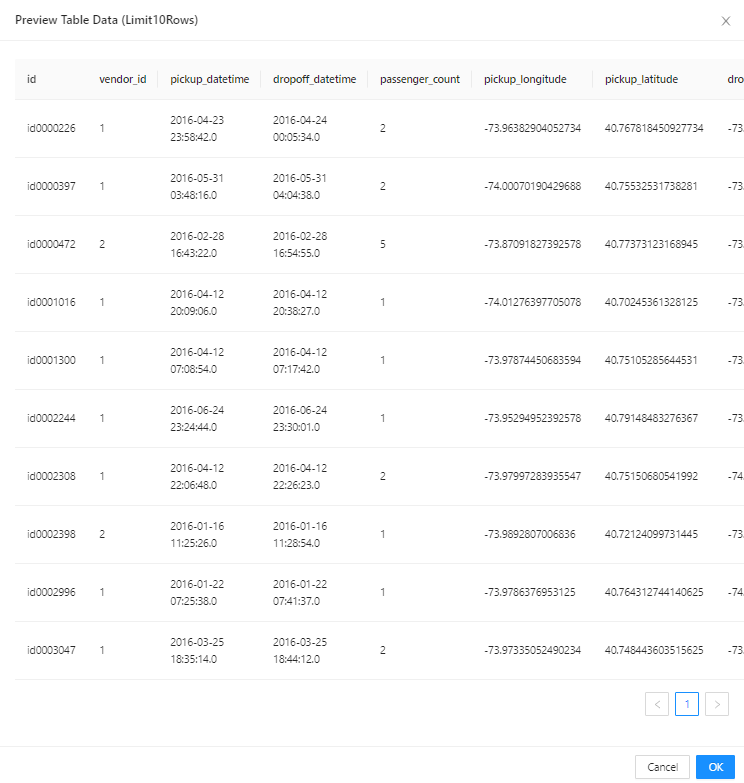

Then perform offline data import. Similarly, use "Import From CSV".


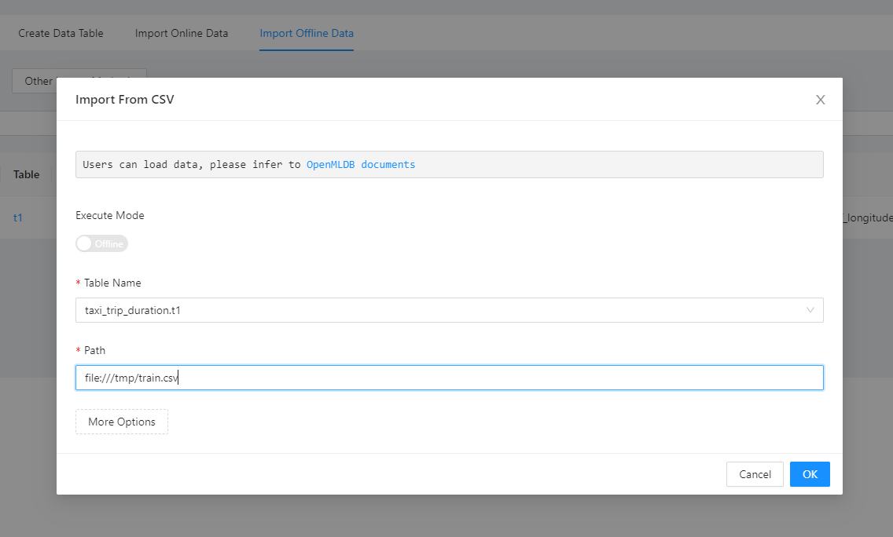

### 2. Feature Creation

With SQL statements designed, we create a feature view. Use "Analyze SQL", and a list of features will be automatically generated based on the SQL analysis.

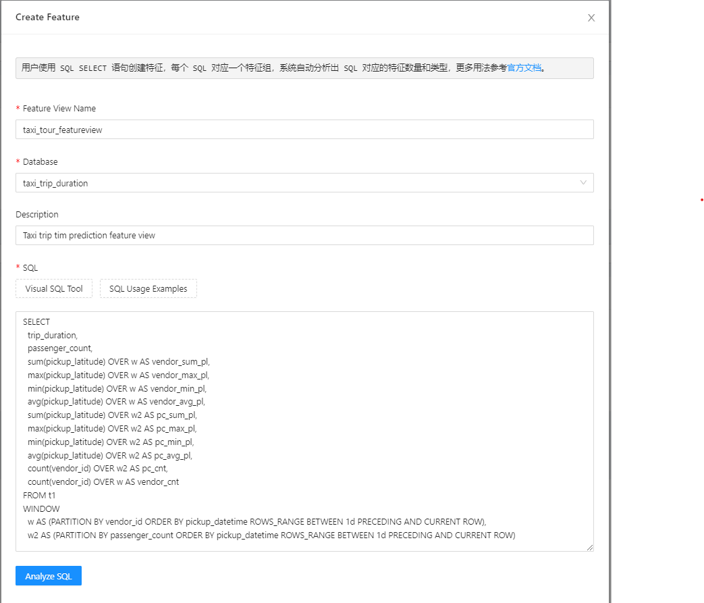

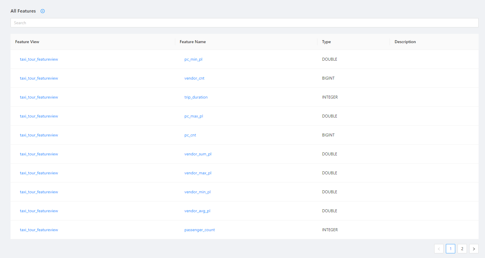

### 3. Offline Scenario

To generate offline samples, we choose all the features in the feature view. The samples are used for model training.

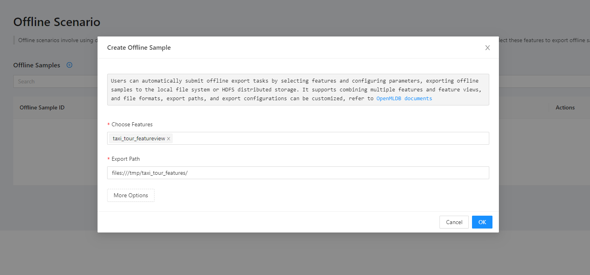

After successful generation, check path `/tmp/taxi_tour_features/` for the generated samples. These data can be directly used for model training. For training, please refer to [Taxi Trip Duration Prediction (OpenMLDB+LightGBM)](../../../use_case/taxi_tour_duration_prediction.md).

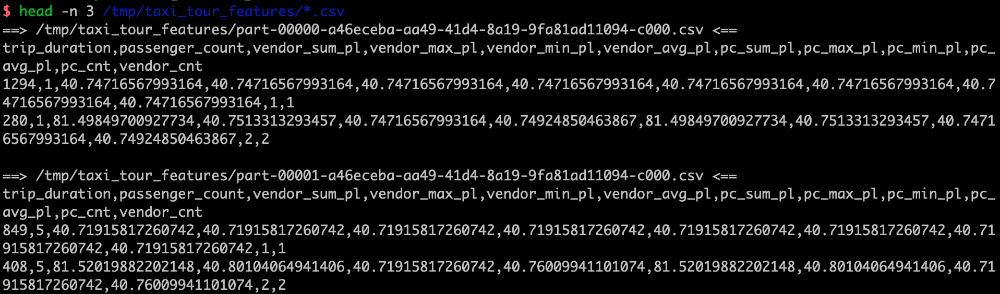

### 4. Online Scenario

After verifying the SQL through offline scenario, the features can be deployed online as a feature service.

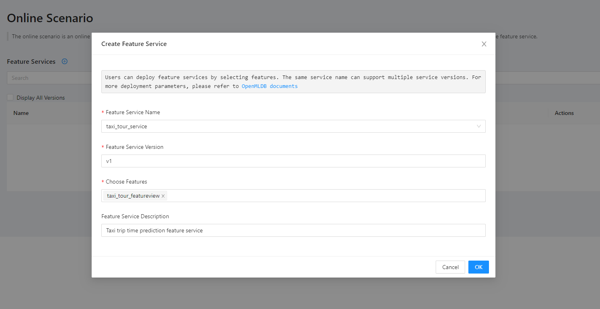

The details of the feature service can be checked here.

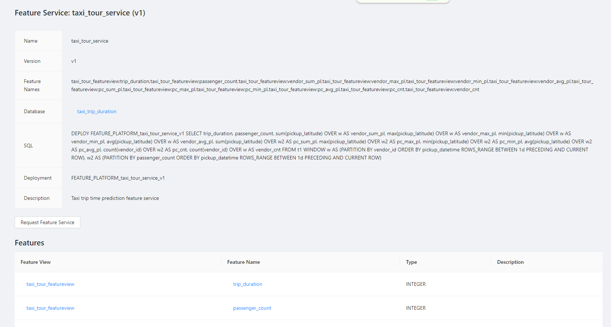

Lastly, at "Request Feature Service", test with request data to verify the consistency between online and offline results.

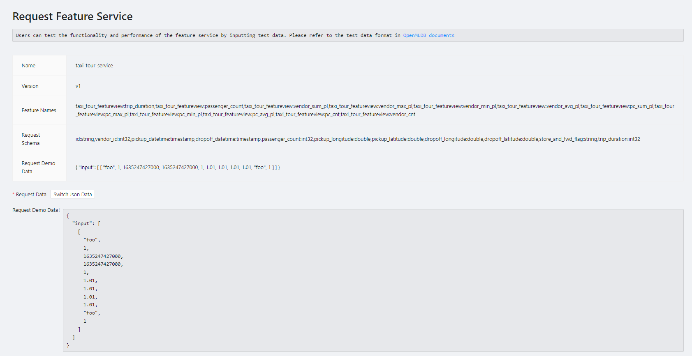

## Summary

Using FeatInsight to implement the taxi trip duration prediction scenario is a straightforward and clear process. It is more intuitive compared to using the OpenMLDB command-line tools. Moreover, it eliminates the hassle for scientists to set up the environment, as it can be operated with just a browser. Online debugging of features and feature reuse are also simplified using FeatInsight.
