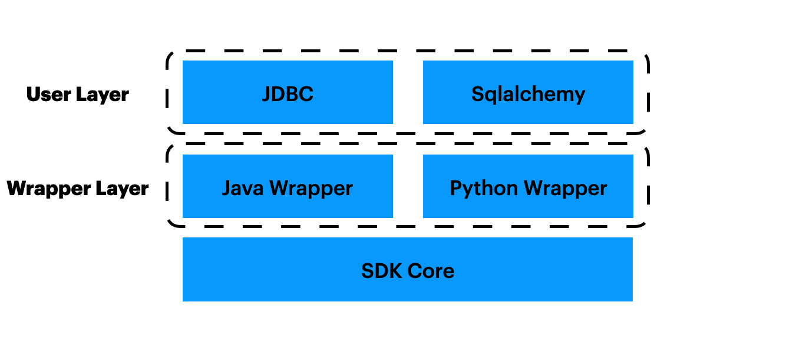

# SDK Development Guidelines

## Overview

The OpenMLDB SDK can be divided into several layers, as shown in the figure. The introduction will go from the bottom up.


### SDK Layer
The bottom layer is the SDK core layer, which is implemented as [SQLClusterRouter](https://github.com/4paradigm/OpenMLDB/blob/b6f122798f567adf2bb7766e2c3b81b633ebd231/src/sdk/sql_cluster_router.h#L110). It is the  core layer of **client**. All operations on OpenMLDB clusters can be done by using the methods of `SQLClusterRouter` after proper configuration.

Three core methods of this layer that developers may need to use are:

1. [ExecuteSQL](https://github.com/4paradigm/OpenMLDB/blob/b6f122798f567adf2bb7766e2c3b81b633ebd231/src/sdk/sql_cluster_router.h#L160) supports the execution of all SQL commands, including DDL, DML and DQL.
2. [ExecuteSQLParameterized](https://github.com/4paradigm/OpenMLDB/blob/b6f122798f567adf2bb7766e2c3b81b633ebd231/src/sdk/sql_cluster_router.h#L166)supports parameterized SQL.
3. [ExecuteSQLRequest](https://github.com/4paradigm/OpenMLDB/blob/b6f122798f567adf2bb7766e2c3b81b633ebd231/src/sdk/sql_cluster_router.h#L156)is the special methods for the OpenMLDB specific execution mode: [Online Request mode](../tutorial/modes.md#4-the-online-request-mode).


### Wrapper Layer
Due to the complexity of the implementation of the SDK Layer, we didn't develop the Java and Python SDKs from scratch, but to use Java and Python to call the **SDK Layer**. Specifically, we made a wrapper layer using Swig.

Java Wrapper is implemented as [SqlClusterExecutor](https://github.com/4paradigm/OpenMLDB/blob/main/java/openmldb-jdbc/src/main/java/com/_4paradigm/openmldb/sdk/impl/SqlClusterExecutor.java). It is a simple wrapper of `sql_router_sdk`, including the conversion of input types, the encapsulation of returned results, the encapsulation of returned errors.

Python Wrapper is implemented as [OpenMLDBSdk](https://github.com/4paradigm/OpenMLDB/blob/main/python/openmldb/sdk/sdk.py). Like the Java Wrapper, it is a simple wrapper as well.


### User Layer
Although the Wrapper Layer can be used directly, it is not convenient enough. So, we develop another layer, the User Layer of the Java/Python SDK.

The Java User Layer supports the JDBC. Users can use the JDBC protocol to access OpenMLDB. See [jdbc](https://github.com/4paradigm/OpenMLDB/tree/main/java/openmldb-jdbc/src/main/java/com/_4paradigm/openmldb/jdbc) for detail about implementation. 

The Python User Layer supports the `sqlalchemy`. See [sqlalchemy_openmldb](https://github.com/4paradigm/OpenMLDB/blob/main/python/openmldb/sqlalchemy_openmldb) and [dbapi](https://github.com/4paradigm/OpenMLDB/blob/main/python/openmldb/dbapi) for detail about implementation. 

## Note

We want an easier to use C++ SDK which doesn't need a Wrapper Layer.
Therefore, in theory, developers only need to design and implement the user layer, which calls the SDK layer.
However, in consideration of code reuse, the SDK Layer code may be changed to some extent, or the core  SDK code structure may be adjusted (for example, exposing part of the SDK Layer header file, etc.).

## Details of SDK Layer 

There are many ways to create a `SQLClusterRouter`.
The first two methods are using two options, which create a server connecting Cluster and Standalone respectively, respectively.
```
    explicit SQLClusterRouter(const SQLRouterOptions& options);
    explicit SQLClusterRouter(const StandaloneOptions& options);
```
These two methods, which do not expose the metadata related DBSDK, are suitable for ordinary users. The underlayers of Java and Python SDK also use these two approaches.


Another way is to create based on DBSDK:
```
explicit SQLClusterRouter(DBSDK* sdk);
```
There are cluster DBSDK and standalone DBSDK, thereby two different service sides can be connected.
In this way, users can access and process metadata conveniently. Otherwise, DBSDK will be kept inside the SQLClusterRouter and not be exposed.

For example, the CLI can directly obtain metadata information such as Nameserver through DBSDK. When starting `ClusterSQLClient` and `StandAloneSQLClient`, you need to create DBSDK and then create SQLClusterRouter. 

## Java Test

If you want to debug only in one submodule, please install the compiled packages since one submodule may depend on other submodules, for example, openmldb-spark-connector depends on openmldb-jdbc.
```
make SQL_JAVASDK_ENABLE=ON

# Or:

cd java
mvn install -DskipTests=true -Dscalatest.skip=true -Dwagon.skip=true -Dmaven.test.skip=true -Dgpg.skip
```

Then run:

```
mvn test -pl openmldb-spark-connector -Dsuites=com._4paradigm.openmldb.spark.TestWrite
```

```{warning}
If you update the codes in real time, the latest codes can not be test since there are `jars` complied from old codes in the local warehouse.
Please be careful when using '-pl'.
```

If you only want to run JAVA testing, try the commands below:
```
mvn test -pl openmldb-jdbc -Dtest="SQLRouterSmokeTest"
mvn test -pl openmldb-jdbc -Dtest="SQLRouterSmokeTest#AnyMethod"
```