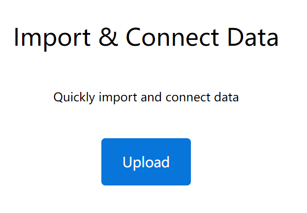
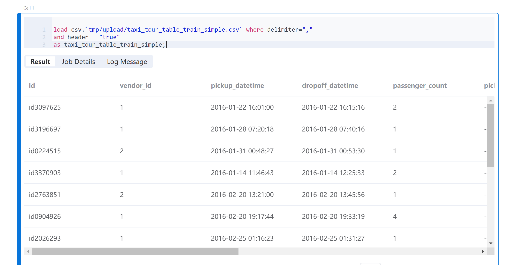

# Byzer

This article demonstrates how to use [OpenMLDB](https://github.com/4paradigm/OpenMLDB) and [Byzer](https://www.byzer.org/home) together to accomplish a complete machine-learning application. In this example, OpenMLDB receives instructions and data sent by Byzer, performs real-time feature computation on the data, and returns the processed dataset through feature engineering to Byzer for subsequent machine learning training and inference.

## Preparation

### Install OpenMLDB

1. This example recommends using the OpenMLDB cluster version running in a Docker container. For installation steps, please refer to [OpenMLDB Quickstart](../../quickstart/openmldb_quickstart.md).
2. In this example, although the Byzer engine is on the same host, it needs to access OpenMLDB services from outside the container. Therefore, the service port of the OpenMLDB cluster needs to be exposed. It is recommended to use the `--network host` method, as detailed in the [IP Configuration Documentation - CLI/SDK->containeronebox](../../reference/ip_tips.md#clisdk-containeronebox).
3. For simplicity, we use the file format to import and export OpenMLDB cluster data, so Byzer and OpenMLDB need to share the file path. Here, we map `/mlsql/admin` to `/byzermnt`, and use `/byzermnt` as the file path in SQL commands that interact with OpenMLDB.
4. We also need to create a database named `db1` in the OpenMLDB cluster, and then use this database in Byzer (currently cannot be executed in Byzer, and Byzer must specify a usable db to connect to OpenMLDB).

The command is as follows:
```
docker run --network host -dit --name openmldb -v /mlsql/admin/:/byzermnt 4pdosc/openmldb:0.8.5 bash
docker exec -it openmldb bash
/work/init.sh
echo "create database db1;" | /work/openmldb/bin/openmldb --zk_cluster=127.0.0.1:2181 --zk_root_path=/openmldb --role=sql_client
exit # exit container
```

### Install Byzer Engine and Byzer Notebook

The example uses [Byzer All In One Deployment](https://docs.byzer.org/#/byzer-lang/zh-cn/installation/server/byzer-all-in-one-deployment) and [Byzer Notebook Binary System Installation](https://docs.byzer.org/#/byzer-notebook/zh-cn/installation/install_uninstall) method to install Byzer component.

```{note}
If you only need to install the OpenMLDB plugin offline, you can also use the [Sandbox Container Deployment](https://docs.byzer.org/#/byzer-lang/zh-cn/installation/containerized-deployment/sandbox-standalone), where you can start and install the OpenMLDB plugin offline with just one click.

If you use VSCode, you can also choose the [Byzer Plugin in VSCode] (https://docs.byzer.org/#/byzer-Lang/zh-cn/installation/vscode/byzer-vscode-extension-installation). The plugin includes the built-in Byzer All In One, eliminating the need for manual installation.

For other deployment methods, please refer to the [Byzer Engine Deployment Guidelines] (https://docs.byzer.org/#/byzer-Lang/zh-cn/installation/README).
```

1. Install Byzer All In One
```
wget https://download.byzer.org/byzer/2.3.0/byzer-lang-all-in-one-linux-amd64-3.1.1-2.3.0.tar.gz
tar -zxvf byzer-lang-all-in-one-linux-amd64-3.1.1-2.3.0.tar.gz 
cd byzer-lang-all-in-one-linux-amd64-3.1.1-2.3.0
# If you have a Java (jdk8 or higher) environment, you can skip two steps to export
export JAVA_HOME=$(pwd)/jdk8
export PATH=$JAVA_HOME/bin:$PATH
./bin/byzer.sh start
```
You can visit `http://<ip>:9003/`.

2. Install Byzer Notebook. As Byzer Notebook [Requires mysql](https://docs.byzer.org/#/byzer-notebook/zh-cn/installation/prerequisites), if you do not have a MySQL engine, you can start one through Docker mode.
```
docker run -d --name mysql -e MYSQL_ROOT_PASSWORD=root -e MYSQL_ROOT_HOST=% -p 3306:3306 byzer/mysql:8.0-20.04_beta
wget https://download.byzer.org/byzer-notebook/1.2.3/Byzer-Notebook-1.2.3.tar.gz
tar -zxvf Byzer-Notebook-1.2.3.tar.gz
cd Byzer-Notebook-1.2.3
./bin/bootstrap.sh start
```
You can visit `http://<ip>:9002/`. The user id and password are admin/admin. The webpage is shown below. This article uses Byzer Notebook for demonstration.


### Byzer OpenMLDB Plugin

This example requires the use of the [OpenMLDB Plugin](https://github.com/byzer-org/byzer-extension/tree/master/byzer-openmldb) provided by Byzer to accomplish message delivery with OpenMLDB. We can install it in Byzer Notebook, create a Notebook, add Cells, and execute the following commands:

```
!plugin app add - "byzer-openmldb-3.0";
```

After running Cell, the plugin will be downloaded and installed. The process will take some time.
```{note}
If the installation is not successful or the download is too slow, you can manually download the jar package and then go offline (https://docs.byzer.org/#/byzer-lang/zh-cn/extension/installation/offline_install) for installation and configuration.
```

### Prepare Dataset

This article utilizes the Kaggle taxi driving time dataset. For the sake of demonstration, we will only use a portion of the data, which can be downloaded from [here](https://openmldb.ai/download/taxi_tour_table_train_simple.csv) and then uploaded to Byzer Notebook.



After uploading, you can find it in the Data Catalog-File System of the Byzer Notebook.
```{note}
If you prefer to use the full dataset, you can obtain it from the following website: [Kaggle Taxi Driving Time Prediction Problem](https://www.kaggle.com/c/nyc-taxi-trip-duration/overview). After downloading the dataset locally, it needs to be imported into Byzer Notebook.
```
## Machine Learning Process

By creating a Notebook in Byzer Notebook, you can start writing the entire machine learning process.

### Step 1: Check Dataset
[Prepare Dataset](#prepare-dataset) has been imported into the File System with the path `tmp/upload`. Use the Byzer Lang `load` command to load the data.

```sql
load csv.`tmp/upload/taxi_tour_table_train_simple.csv` where delimiter=","
and header = "true"
as taxi_tour_table_train_simple;
```
After running Cell, you can see the browsing result of the data.


### Step 2: OpenMLDB Create Tables and Import Data

To connect to the OpenMLDB engine, we will use plugins. Since the OpenMLDB cluster and Byzer are deployed on the same host, we can access OpenMLDB using the local address `127.0.0.1:2181`. Before running this code block in Byzer Notebook, make sure that the OpenMLDB engine is started.

```sql
run command as FeatureStoreExt.`` where
zkAddress="127.0.0.1:2181"
and zkPath="/openmldb"
and `sql-0`='''
SET @@execute_mode='offline';
'''
and `sql-1`='''
SET @@sync_job=true;
'''
and `sql-2`='''
SET @@job_timeout=20000000;
'''
and `sql-3`='''
CREATE TABLE IF NOT EXISTS t1(id string, vendor_id int, pickup_datetime timestamp, dropoff_datetime timestamp, passenger_count int, pickup_longitude double, pickup_latitude double, dropoff_longitude double, dropoff_latitude double, store_and_fwd_flag string, trip_duration int);
'''
and `sql-4`='''
LOAD DATA INFILE '/byzermnt/tmp/upload/taxi_tour_table_train_simple.csv'
INTO TABLE t1 options(format='csv',header=true,mode='overwrite');
'''
and db="db1"
and action="ddl";
```
After the task is completed, the Result should have a prompt of `FINISHED`. Please enter the openmldb container to check the job log if it is `FAILED`.

### Step 3: Perform Offline Feature Computation

Usually, this step involves feature design. However, in this example, we will skip the design phase and directly use the features designed in [OpenMLDB + LightGBM: Taxi Travel Time Prediction](../../use_case/taxi_tour_duration_prediction.md) for offline feature computation. The processed dataset will be exported as a local parquet file (parquet format is recommended; CSV load requires additional schema).

```sql
run command as FeatureStoreExt.`` where
zkAddress="127.0.0.1:2181"
and zkPath="/openmldb"
and `sql-0`='''
SET @@execute_mode='offline';
'''
and `sql-1`='''
SET @@sync_job=true;
'''
and `sql-2`='''
SET @@job_timeout=20000000;
'''
and `sql-3`='''
SELECT trip_duration, passenger_count,
sum(pickup_latitude) OVER w AS vendor_sum_pl,
max(pickup_latitude) OVER w AS vendor_max_pl,
min(pickup_latitude) OVER w AS vendor_min_pl,
avg(pickup_latitude) OVER w AS vendor_avg_pl,
sum(pickup_latitude) OVER w2 AS pc_sum_pl,
max(pickup_latitude) OVER w2 AS pc_max_pl,
min(pickup_latitude) OVER w2 AS pc_min_pl,
avg(pickup_latitude) OVER w2 AS pc_avg_pl ,
count(vendor_id) OVER w2 AS pc_cnt,
count(vendor_id) OVER w AS vendor_cnt
FROM t1 
WINDOW w AS (PARTITION BY vendor_id ORDER BY pickup_datetime ROWS_RANGE BETWEEN 1d PRECEDING AND CURRENT ROW),
w2 AS (PARTITION BY passenger_count ORDER BY pickup_datetime ROWS_RANGE BETWEEN 1d PRECEDING AND CURRENT ROW) INTO OUTFILE '/byzermnt/tmp/feature_data' OPTIONS(mode='overwrite', format='parquet');
'''
and db="db1"
and action="ddl";
```
After the task is completed, the Result should show a prompt of `FINISHED`. If it shows `FAILED`, please enter the openmldb container to check the job log. Refresh the Data Catalog of the Byzer Notebook to see the generated feature file path and the `tmp/feature_data` in the File System.

### Step 4: Load Data in Byzer

Load the feature data generated in the previous step into the Byzer environment:
```sql
load parquet.`tmp/feature_data` as feature_data;
```

Convert all int-type fields to double.

```
select *, 
cast(passenger_count as double) as passenger_count_d,
cast(pc_cnt as double) as pc_cnt_d,
cast(vendor_cnt as double) as vendor_cnt_d
from feature_data
as new_feature_data;
```

Then merge all the fields into one vector.

```sql
select vec_dense(array(
passenger_count_d,
vendor_sum_pl,
vendor_max_pl,
vendor_min_pl,
vendor_avg_pl,
pc_sum_pl,
pc_max_pl,
pc_min_pl,
pc_avg_pl,
pc_cnt_d,
vendor_cnt
)) as features,cast(trip_duration as double) as label
from new_feature_data
as training_table;

```

### Step 5: Model Training

Use the `train` command with the [Built-In Linear Regression Algorithm]([https://docs.byzer.org/#/byzer-lang/en-us/](https://docs.byzer.org/#/byzer-lang/zh-cn/ml/algs/linear_regression)) to train the model and save it to the specified path `/model/taxi-trip`.

```sql
train training_table as LinearRegression.`/model/taxi-trip` where
keepVersion="true"
and evaluateTable="training_table"
and `fitParam.0.labelCol`="label"
and `fitParam.0.featuresCol`= "features"
and `fitParam.0.maxIter`="50";
```

```{note}
View the relevant parameters of Byzer's Built-In Linear Regression Model using the command `!show et/params/LinearRegression;`.
```

### Step 6: Feature Deployment

Use `DEPLOY` (must be in online mode) to deploy the feature computation SQL to OpenMLDB. The SQL should be consistent with the offline feature calculation SQL and it will be named as `d1` for deployment.

```{note}
Note: The deployment name for `DEPLOY must be unique. If you want to change the deployment after it has been successful, you will need to change the deployment name or delete the existing deployment d1 before re-deploying.
```

```sql
run command as FeatureStoreExt.`` where
zkAddress="127.0.0.1:2181"
and zkPath="/openmldb"
and `sql-0`='''
SET @@execute_mode='online';
'''
and `sql-1`='''
DEPLOY d1 SELECT trip_duration, passenger_count,
sum(pickup_latitude) OVER w AS vendor_sum_pl,
max(pickup_latitude) OVER w AS vendor_max_pl,
min(pickup_latitude) OVER w AS vendor_min_pl,
avg(pickup_latitude) OVER w AS vendor_avg_pl,
sum(pickup_latitude) OVER w2 AS pc_sum_pl,
max(pickup_latitude) OVER w2 AS pc_max_pl,
min(pickup_latitude) OVER w2 AS pc_min_pl,
avg(pickup_latitude) OVER w2 AS pc_avg_pl ,
count(vendor_id) OVER w2 AS pc_cnt,
count(vendor_id) OVER w AS vendor_cnt
FROM t1 
WINDOW w AS (PARTITION BY vendor_id ORDER BY pickup_datetime ROWS_RANGE BETWEEN 1d PRECEDING AND CURRENT ROW),
w2 AS (PARTITION BY passenger_count ORDER BY pickup_datetime ROWS_RANGE BETWEEN 1d PRECEDING AND CURRENT ROW);
'''
and db="db1"
and action="ddl";
```

### Step 7: Import Online Data

Online real-time prediction often involves importing recent historical data into online storage. In addition to importing data files, real-time data sources can also be accessed in the production environment. For simplicity, this example directly imports the original dataset (real-time prediction uses new real-time data as a request, so there will be no "feature data for prediction training").

```sql
run command as FeatureStoreExt.`` where
zkAddress="127.0.0.1:2181"
and zkPath="/openmldb"
and `sql-0`='''
SET @@execute_mode='online';
'''
and `sql-1`='''
SET @@sync_job=true;
'''
and `sql-2`='''
SET @@job_timeout=20000000;
'''
and `sql-3`='''
LOAD DATA INFILE '/byzermnt/tmp/upload/taxi_tour_table_train_simple.csv'
INTO TABLE t1 options(format='csv',mode='append');
'''
and db="db1"
and action="ddl";
```

### Step 8: Model Deployment

Register the previously saved and trained model as a function that can be used directly.

```sql
register LinearRegression.`/model/taxi-trip` as taxi_trip_model_predict;
```

### Step 9: Real-Time Predictive Testing

Typically, real-time feature prediction is driven by real-time data. For the convenience of this demonstration, we will still perform "real-time feature computation + prediction" in the Notebook. We will use the [Python Environment]([https://docs.byzer.org/#/byzer-lang/en-us/](https://docs.byzer.org/#/byzer-lang/zh-cn/python/env)) for real-time feature computation by using the requirements file.

```
pyarrow==4.0.1
ray[default]==1.8.0
aiohttp==3.7.4
pandas>=1.0.5; python_version < '3.7'
pandas>=1.2.0; python_version >= '3.7'
requests
matplotlib~=3.3.4
uuid~=1.30
pyjava
protobuf==3.20.0 # New, if the protobuf version is too high, there will be import ray errors
```
```
pip install -r requirements.txt
```

We will construct "real-time data" and request OpenMLDB to compute real-time features using HTTP. The computed features will be saved as a file and then loaded into the Byzer environment.
```
!python env "PYTHON_ENV=:";
!python conf "runIn=driver";
!python conf "schema=file";
run command as Ray.`` where 
inputTable="command"
and outputTable="test_feature"
and code='''
import numpy as np
import os
import pandas as pd
import ray
import requests
import json
from pyjava.api.mlsql import RayContext,PythonContext

ray_context = RayContext.connect(globals(),None)

resp = requests.post('http://127.0.0.1:9080/dbs/db1/deployments/d1', json=json.loads('{"input":[["id0376262", 1, 1467302350000, 1467304896000, 2, -73.873093, 40.774097, -73.926704, 40.856739, "N", 1]], "need_schema":true}'))

res = json.loads(resp.text)["data"]
schema_names = [(col["name"], col["type"]) for col in res["schema"]]
df = pd.DataFrame.from_records(np.array([tuple(res["data"][0])], dtype=schema_names))
df.to_parquet('/mlsql/admin/tmp/test_feature.parquet')

context.build_result([])
''';
```

Convert all int-type fields of the processed online data to double.

```sql
select *, 
cast(passenger_count as double) as passenger_count_d,
cast(pc_cnt as double) as pc_cnt_d,
cast(vendor_cnt as double) as vendor_cnt_d
from feature_data_test
as new_feature_data_test;
```

Then perform vectorization.

```sql
select vec_dense(array(
passenger_count_d,
vendor_sum_pl,
vendor_max_pl,
vendor_min_pl,
vendor_avg_pl,
pc_sum_pl,
pc_max_pl,
pc_min_pl,
pc_avg_pl,
pc_cnt_d,
vendor_cnt
)) as features
from new_feature_data_test
as testing_table;
```

Using the processed test set for prediction, the result is the predicted `trip_duration`.

```sql
select taxi_trip_model_predict(testing_table) as predict_label;
```
