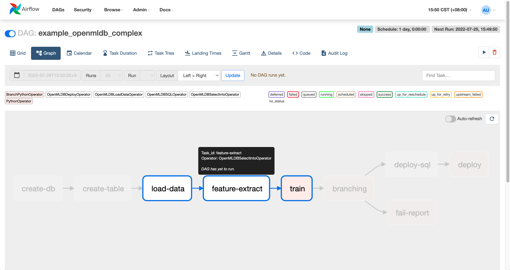
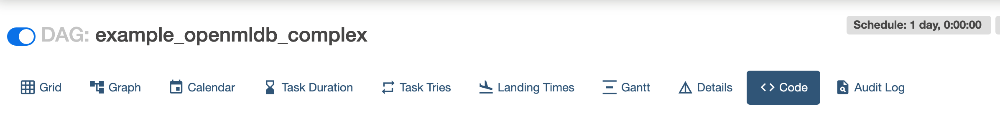
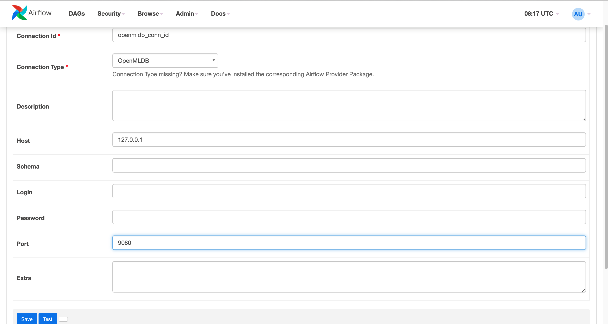
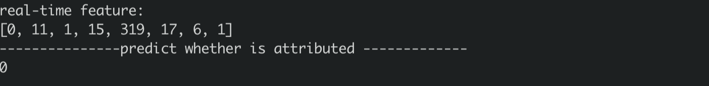

# Airflow 
We have prepared a guideline for using the [Airflow OpenMLDB Provider](https://github.com/4paradigm/OpenMLDB/tree/main/extensions/airflow-provider-openmldb), which facilitates the integration of OpenMLDB with Airflow DAG.

This specific case will undergo training and execution using the arrangements made in Airflow's [TalkingData](https://chat.openai.com/talkingdata_demo).

## TalkingData DAG

To implement this workflow in Airflow, a DAG (Directed Acyclic Graph) file needs to be written. We have provided an example DAG file named [example_openmldb_complex.py](https://github.com/4paradigm/OpenMLDB/blob/main/extensions/airflow-provider-openmldb/openmldb_provider/example_dags/example_openmldb_complex.py) for reference.



The diagram above illustrates the steps in the DAG process. It begins by creating a table, followed by online data import and feature extraction. If the model performs well (AUC >= 99.0), the workflow proceeds to execute SQL queries and launch the model. Otherwise, a failure report is generated.

To run this DAG in Airflow, you can directly import it and follow the demonstration provided.

## Demonstration

To complete the feature computation and launch process in the TalkingData Demo, import the provided DAG. After the launch, you can perform real-time inference testing using the predict server of TalkingData Demo.

### 0 Preparation

#### 0.1 Download DAG

Along with the DAG files, training scripts are also necessary. For convenience, a [Download Package](https://openmldb.ai/download/airflow_demo/airflow_demo_files.tar.gz) is available for direct download. If you prefer to use the latest version, you can obtain it from [github example_dags](https://github.com/4paradigm/OpenMLDB/tree/main/extensions/airflow-provider-openmldb/openmldb_provider/example_dags).

```
wget https://openmldb.ai/download/airflow_demo/airflow_demo_files.tar.gz
tar zxf airflow_demo_files.tar.gz
ls airflow_demo_files
```
#### 0.2 Start Image

For the smooth functioning of the setup, we recommend starting OpenMLDB using the docker image and installing Airflow within the docker container.

Since Airflow Web requires an external port for login, the container's port needs to be exposed. Additionally, you must directly map the downloaded file from the previous step to the `/work/airflow/dags` directory. This step is crucial for Airflow to load the DAGs from this folder correctly.

```
docker run -p 8080:8080 -v `pwd`/airflow_demo_files:/work/airflow_demo_files -it 4pdosc/openmldb:0.8.0 bash
```

#### 0.3 Download and Install Airflow and Airflow OpenMLDB Provider
In the docker container, execute:
```
pip3 install airflow-provider-openmldb
```
Due to airflow-provider-openmldb relying on airflow, they will be downloaded together.

#### 0.4 Source Data and DAG Preparation
To ensure the successful execution of the DAG, we must copy the sample data file, named `/tmp/train_sample.csv`, to the tmp directory. Additionally, both the Airflow DAG files and the training scripts used in the DAG must be copied to the Airflow directory.

```
cp /work/airflow_demo_files/train_sample.csv /tmp/
mkdir -p /work/airflow/dags
cp /work/airflow_demo_files/example_openmldb_complex.py /work/airflow_demo_files/xgboost_train_sample.py /work/airflow/dags
```

### 1 Start OpenMLDB and Airflow
The command provided below will initiate the OpenMLDB cluster, enabling support for predict server online testing, and launch Airflow in standalone mode.
```
/work/init.sh
python3 /work/airflow_demo_files/predict_server.py --no-init > predict.log 2>&1 &
export AIRFLOW_HOME=/work/airflow
cd $AIRFLOW_HOME
airflow standalone
```

When running Airflow standalone, you will be prompted to log in with your username and password, as illustrated in the figure below.


To access the Airflow Web interface, visit `http://localhost:8080` and enter your designated username and password.

```{caution}
`airflow standalone` is a front-end program that exits with Airflow. You can exit Airflow with [Step 3-Testing](#3-Testing) after completing the Dag run, or place the Airflow process in the background.
```

### 2 Running DAG

To check the status of the DAG named "example_openmldb_complex" in Airflow Web, click on the DAG and select the `Code` tab, as demonstrated in the figure below.



In the code, you will notice the usage of `openmldb_conn_id`, as depicted in the following figure. The DAG doesn't directly employ the address of OpenMLDB; instead, it uses a connection, so you need to create a new connection with the same name.


#### 2.1 Create Connection
Click connections on the Admin page.


Then, add the connection.


The Airflow OpenMLDB Provider is linked to the OpenMLDB API Server. Therefore, you should provide the address of the OpenMLDB API Server in this configuration, rather than the Zookeeper address.



The completed create connection is shown in the figure below.


#### 2.2 Running DAG
Run the DAG to complete the training of the model, SQL deployment, and model deployment. A successful operation will yield results similar to the figure below.


### 3 Test

If Airflow is currently running in the foreground within the container, you may exit the process now. The upcoming tests will not be dependent on Airflow.

#### 3.1 Import Online
The SQL and model launch stages have been successfully executed in the Airflow DAG. However, there is currently no data in the online storage, necessitating an online data import.

```
curl -X POST http://127.0.0.1:9080/dbs/example_db -d'{"mode":"online", "sql":"load data infile \"file:///tmp/train_sample.csv\" into table example_table options(mode=\"append\");"}'
```

This import process is asynchronous, but since the data volume is small, it will be completed swiftly. You can monitor the status of the import operations by using the `SHOW JOBS` command.
```
curl -X POST http://127.0.0.1:9080/dbs/example_db -d'{"mode":"online", "sql":"show jobs"}'
```

#### 3.2 Prediction
Execute a prediction script and make a prediction using the newly deployed SQL and model.
```
python3 /work/airflow_demo_files/predict.py
```
The result is as shown.



### Non-Interactive Testing

Check if DAG has been successfully load-on:
```
airflow dags list | grep openmldb
```
The required connection when adding DAG:
```
airflow connections add openmldb_conn_id --conn-uri http://127.0.0.1:9080
airflow connections list --conn-id openmldb_conn_id
```
DAG test:
```
airflow dags test example_openmldb_complex 2022-08-25
```
