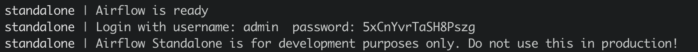

# Airflow 
We provide [Airflow OpenMLDB Provider](https://github.com/4paradigm/OpenMLDB/tree/main/extensions/airflow-provider-openmldb), which facilitates the integration of OpenMLDB with Airflow DAG.

This specific case will undergo training and execution with Airflow's [TalkingData](https://chat.openai.com/talkingdata_demo).

## TalkingData DAG

To implement this workflow in Airflow, a DAG (Directed Acyclic Graph) file needs to be written. Here we use an example DAG file in [example_openmldb_complex.py](https://github.com/4paradigm/OpenMLDB/blob/main/extensions/airflow-provider-openmldb/openmldb_provider/example_dags/example_openmldb_complex.py).


The diagram above illustrates the work process in DAG. It begins by creating a table, followed by offline data loading, feature extraction, and model training. If the model trained performs well (AUC >= 99.0), the workflow proceeds to execute deploy SQL and model serving online. Otherwise, a failure report is generated.

In the following demonstration, you can directly import this DAG and run in Airflow.


## Demonstration

We import the above DAG to perform feature computation and deployment for the TalkingData Demo, then perform real-time inference using the predict server of TalkingData Demo.

### Preparation

#### Download DAG

Along with the DAG files, training scripts are also required. For convenience, we provide the [code package](https://openmldb.ai/download/airflow_demo/airflow_demo_files.tar.gz) for direct download. If you prefer to use the latest version, you can obtain it from [github example_dags](https://github.com/4paradigm/OpenMLDB/tree/main/extensions/airflow-provider-openmldb/openmldb_provider/example_dags).

```
wget https://openmldb.ai/download/airflow_demo/airflow_demo_files.tar.gz
tar zxf airflow_demo_files.tar.gz
ls airflow_demo_files
```
#### Start Docker Image

For smooth function, we recommend starting OpenMLDB using the docker image and installing Airflow within the docker container.

Since Airflow Web requires an external port for login, the container's port must be exposed. Then map the downloaded file from the previous step to the `/work/airflow/dags` directory. This step is crucial for Airflow to load the DAGs from this folder correctly.

```
docker run -p 8080:8080 -v `pwd`/airflow_demo_files:/work/airflow_demo_files -it 4pdosc/openmldb:0.9.1 bash
```

#### Download and Install Airflow and Airflow OpenMLDB Provider
In the docker container, execute:
```
pip3 install airflow-provider-openmldb
```
Airflow will be downloaded as a dependency.

#### Source Data and DAG Preparation
Copy the sample data file, named `/tmp/train_sample.csv`, to the tmp directory. Airflow DAG files and training scripts used in the DAG must also be copied to the Airflow directory.

```
cp /work/airflow_demo_files/train_sample.csv /tmp/
mkdir -p /work/airflow/dags
cp /work/airflow_demo_files/example_openmldb_complex.py /work/airflow_demo_files/xgboost_train_sample.py /work/airflow/dags
```

### Step 1: Start OpenMLDB and Airflow
The command provided below will initiate the OpenMLDB cluster, enabling support for predict server and Airflow standalone.
```
/work/init.sh
python3 /work/airflow_demo_files/predict_server.py --no-init > predict.log 2>&1 &
export AIRFLOW_HOME=/work/airflow
cd $AIRFLOW_HOME
airflow standalone
```

Airflow standalone will show username and password as shown below.



In Airflow Web interface at `http://localhost:8080`, enter username and password.

```{caution}
`airflow standalone` is a front-end program that exits with Airflow. You can exit Airflow after DAG completion to run [Step 3-Testing](#3-Testing), or place the Airflow process in the background.
```

### Step 2: Running DAG

To check the status of the DAG "example_openmldb_complex" in Airflow Web, click on the DAG and select the `Code` tab, as shown below.


In this code, you will notice the usage of `openmldb_conn_id`, as depicted in the following figure. The DAG doesn't directly employ the address of OpenMLDB; instead, it uses a connection, so you need to create a new connection with the same name.


#### Create Connection
Click on connections in the Admin tab.


Add the connection.


The Airflow OpenMLDB Provider is linked to the OpenMLDB API Server. Therefore, you should provide the address of the OpenMLDB API Server in this configuration, rather than the Zookeeper address.


The completed connection is shown in the figure below.


#### Running DAG
Run the DAG to complete the training of the model, SQL deployment, and model deployment. A successful operation will yield results similar to the figure below.


### Step 3: Test

If Airflow is currently running in the foreground within the container, you may exit the process now. The upcoming tests will not be dependent on Airflow.

#### Online Data Import
The SQL and model deployment have been successfully executed in the Airflow DAG. However, there is currently no data in the online storage, necessitating an online data import.

```
curl -X POST http://127.0.0.1:9080/dbs/example_db -d'{"mode":"online", "sql":"load data infile \"file:///tmp/train_sample.csv\" into table example_table options(mode=\"append\");"}'
```

This import process is asynchronous, but since the data volume is small, it will be completed quickly. You can monitor the status of the import operations by using the `SHOW JOBS` command.
```
curl -X POST http://127.0.0.1:9080/dbs/example_db -d'{"mode":"online", "sql":"show jobs"}'
```

#### Prediction
Execute the prediction script to make a prediction using the newly deployed SQL and model.
```
python3 /work/airflow_demo_files/predict.py
```
The result is as shown.


### Non-Interactive Testing

Check if DAG has been successfully loaded:
```
airflow dags list | grep openmldb
```
Add required connection:
```
airflow connections add openmldb_conn_id --conn-uri http://127.0.0.1:9080
airflow connections list --conn-id openmldb_conn_id
```
DAG test:
```
airflow dags test example_openmldb_complex 2022-08-25
```
