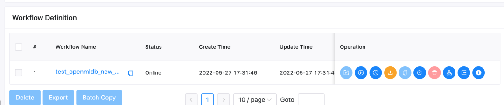
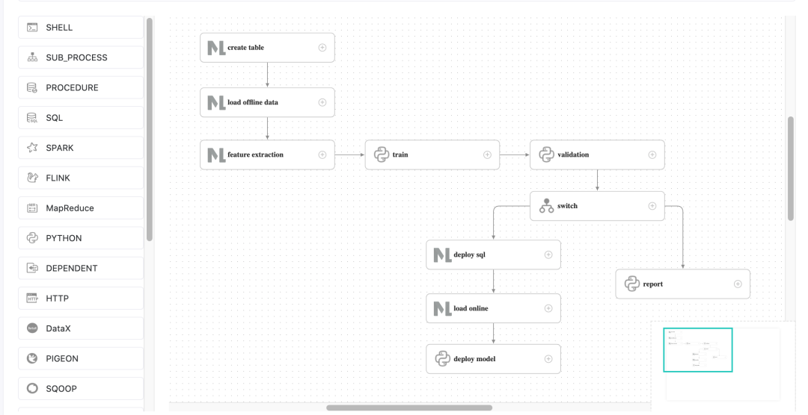
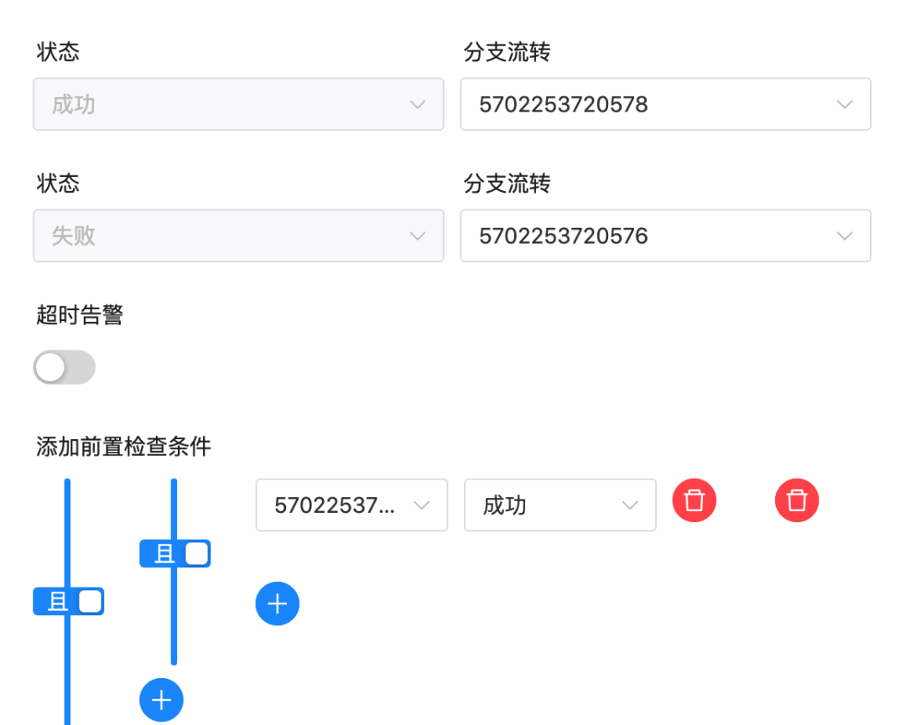

# DolphinScheduler

## Introduction
In the whole process of machine learning from development to deployment, tasks including data processing, feature development, and model training demand significant time and effort. To streamline the development and deployment of AI models and simplify the overall machine-learning process, we introduce the DolphinScheduler OpenMLDB Task. It seamlessly integrates the capabilities of the feature platform into DolphinScheduler's workflow, effectively bridging feature engineering with scheduling, resulting in a comprehensive end-to-end MLOps workflow. In this article, we present a concise introduction and practical demonstration of the procedures for using the DolphinScheduler OpenMLDB Task.

```{seealso}
For detailed information on the OpenMLDB Task, please refer to the [DolphinScheduler OpenMLDB Task Official Documentation](https://dolphinscheduler.apache.org/zh-cn/docs/3.1.5/guide/task/openmldb).
```

## Scenarios and Functions
### Why Develop DolphinScheduler OpenMLDB Task


As an open-source machine learning database providing a comprehensive solution for production-level data and feature development, the key to enhancing OpenMLDB's usability and reducing usage barriers lies in upstream and downstream connectivity. As depicted in the diagram above, the ability to access the data source allows seamless data flow from DataOps into OpenMLDB. Then the generated features by OpenMLDB need to smoothly integrate with ModelOps for training. To alleviate the significant workload resulting from manual integration by developers using OpenMLDB, we have also developed the function for OpenMLDB integration into Deployment and Monitoring. In this article, we introduce the framework for integrating OpenMLDB into the DolphinScheduler workflow. The DolphinScheduler OpenMLDB Task simplifies the usage of OpenMLDB. In the meantime, OpenMLDB tasks are efficiently managed by Workflow, enabling greater automation.

### What Can DolphinScheduler OpenMLDB Task Do

OpenMLDB aims to expedite development launch, enabling developers to focus on the essence of their work rather than expending excessive effort on engineering implementation. By writing OpenMLDB Tasks, we can fulfill the offline import, feature extraction, SQL deployment, and online import requirements of OpenMLDB. Furthermore, we can also implement complete training and online processes using OpenMLDB in DolphinScheduler.


For instance, the most straightforward user operation process we envision, as illustrated in the diagram above, involves steps 1-4: offline data import, offline feature extraction, SQL deployment, and online data import. All of these steps can be achieved by utilizing the DolphinScheduler OpenMLDB Task.

In addition to SQL execution in OpenMLDB, real-time prediction also requires model deployment. Therefore in the following sections, we will demonstrate how to utilize the DolphinScheduler OpenMLDB Task to coordinate a comprehensive machine learning training and online deployment process, based on the TalkingData adtracking fraud detection challenge from Kaggle. Further information about the TalkingData competition can be found at [talkingdata-adtracking-fraud-detection](https://www.kaggle.com/competitions/talkingdata-adtracking-fraud-detection/discussion).

## Demonstration
### Environment Configuration

**Run OpenMLDB Docker Image**

The test can be executed on macOS or Linux, and we recommend running this demo within the provided OpenMLDB docker image. In this setup, both OpenMLDB and DolphinScheduler will be launched inside the container, with the port of DolphinScheduler exposed.
```
docker run -it -p 12345:12345 4pdosc/openmldb:0.9.1 bash
```
```{attention}
For proper configuration of DolphinScheduler, the tenant should be set up as a user of the operating system, and this user must have sudo permissions. It is advised to download and initiate DolphinScheduler within the OpenMLDB container. Otherwise, please ensure that the user has sudo permissions.
```

As our current docker image does not have sudo installed, and DolphinScheduler requires sudo for running workflows, please install sudo in the container first: 
```
apt update && apt install sudo
```

The DolphinScheduler runs the task using sh, but in the docker, sh is `dash` as default. Thus modify it to `bash` with the following command:
```
dpkg-reconfigure dash
```
Enter `no`.

**Data Preparation**

The workflow loads data from `/tmp/train_Sample.csv ` to OpenMLDB. Thus, first download the source data to this address:
```
curl -SLo /tmp/train_sample.csv https://openmldb.ai/download/dolphinschduler-task/train_sample.csv
```

**Run OpenMLDB Cluster and Predict Server**

Run the following command in the container to start a OpenMLDB cluster：
```
/work/init.sh
```

We will run a workflow that includes data import, offline training, and model deployment. The deployment of the model is done by sending the model address to the predict server. Let's begin by downloading and running the predict server in the background:
```
cd /work
curl -SLo predict_server.py https://openmldb.ai/download/dolphinschduler-task/predict_server.py
python3 predict_server.py --no-init > predict.log 2>&1 &
```
```{tip}
If an error occurred in the 'Online Prediction Test', please check `/work/predict.log`.
```

**Download and Run DolphinScheduler**

Please note that DolphinScheduler supports OpenMLDB Task versions 3.1.3 and above. In this article, we will be using version 3.1.5, which can be downloaded from the [Official Website](https://dolphinscheduler.apache.org/zh-cn/download/3.1.5) or from a mirrored website.

To start the DolphinScheduler standalone, follow the steps outlined in the [Official Documentation](https://dolphinscheduler.apache.org/zh-cn/docs/3.1.5/guide/installation/standalone) for more information.

```
# Official
curl -SLO https://dlcdn.apache.org/dolphinscheduler/3.1.5/apache-dolphinscheduler-3.1.5-bin.tar.gz
# Image curl -SLO http://openmldb.ai/download/dolphinschduler-task/apache-dolphinscheduler-dev-3.1.5-bin.tar.gz
tar -xvzf apache-dolphinscheduler-*-bin.tar.gz
cd apache-dolphinscheduler-*-bin
sed -i s#/opt/soft/python#/usr/bin/python3#g bin/env/dolphinscheduler_env.sh
./bin/dolphinscheduler-daemon.sh start standalone-server
```

```{hint}
In the official release version of DolphinScheduler, there is an issue with OpenMLDB Task in versions older than 3.1.3, which cannot be used directly. If you are using an older version, you can contact us to obtain a corresponding version. This problem has been resolved in versions 3.1.3 and later, making them suitable for use with the official release version.

In other versions of DolphinScheduler, there may be a change in `bin/env/dolphinscheduler_env.sh`. If `PYTHON_HOME` does not exist in `bin/env/dolphinscheduler_env.sh`, additional configuration is required. You can modify it using the command `echo "export PYTHON_HOME=/usr/bin/python3" >>bin/env/dolphinscheduler_env.sh`.
```

To access the system UI, open your browser and go to the address http://localhost:12345/dolphinscheduler/ui (the default configuration allows cross-host access, but you need to ensure a smooth IP connection). The default username and password are admin/dolphinscheduler123.

```{note}
The DolphinScheduler worker server requires the OpenMLDB Python SDK. For the DolphinScheduler standalone worker, you only need to install the OpenMLDB Python SDK locally. We have already installed it in our OpenMLDB docker image. If you are in a different environment, please install the openmldb SDK using the command `pip3 install openmldb`.
```

**Download Workflow Configuration**

Workflow can be manually created, but for the purpose of simplifying the demonstration, we have provided a JSON workflow file directly, which you can download from the following link: [Click to Download](http://openmldb.ai/download/dolphinschduler-task/workflow_openmldb_demo.json). You can upload this file directly to the DolphinScheduler environment and make simple modifications (as shown in the demonstration below) to complete the entire workflow.

Please note that the download will not be saved within the container but to the browser host you are using. The upload will be done on the web page later.

### Run Demo

#### Step 1: Initial Configuration

To create a tenant in DolphinScheduler web, navigate to the tenant management interface, and fill in the required fields. Make sure to fill in **user with sudo permission**. You can use the default settings for the queue. You can use root in the docker container.


Bind the tenant to the user again. For simplicity, we directly bind to the admin user. Enter User Management page and click Edit Admin User.


After binding, the user status is similar as shown below.


#### Step 2: Create Workflow
In DolphinScheduler, you need to create a project first, and then create a workflow within that project.

To begin, create a test project. As shown in the following figure, click on "Create Project" and enter the project name.


Once inside the project page, you can import the downloaded workflow file. In the workflow definition tab, click on "Import Workflow".


After importing, the workflow table will show as follows.



Click on the workflow name to view the detailed content of the workflow, as shown in the following figure.



**Note**: A minor modification is required here since the task ID will change after importing the workflow. Specifically, the upstream and downstream IDs in the switch task will not exist and need to be manually modified.



As depicted in the above figure, there are non-existent IDs in the settings of the switch task. Please modify the "branch flow" and "pre-check conditions" for successful and failed workflows to match the tasks of the current workflow.

The correct results are shown in the following figure:


Once the modifications are completed, save the workflow directly. The default tenant in the imported workflow is "default," which is also **executable**. If you want to specify your own tenant, please select the tenant when saving the workflow, as shown in the following figure.


#### Step 3: Deploy Online Workflow

After saving the workflow, it needs to be launched before running. Once it goes online, the run button will be activated. As illustrated in the following figure.


After clicking "Run," wait for the workflow to complete. You can view the details of the workflow operation in the Workflow Instance page, as shown in the following figure.


To demonstrate the process of a successful product launch, validation was not actually validated but returned a successful validation and flowed into the deploy branch. After running the deploy branch and successfully deploying SQL and subsequent tasks, the predict server receives the latest model.

```{note}
If the `Failed` appears on the workflow instance, please click on the instance name and go to the detailed page to see which task execution error occurred. Double-click on the task and click on "View Log" in the upper right corner to view detailed error information.

`load offline data`, `feature extraction`, and `load online` may display successful task execution in the DolphinScheduler, but actual task execution fails in OpenMLDB. This may lead to errors in the `train` task, where there is no source feature data to concatenate (Traceback `pd.concat`).

When such problems occur, please query the true status of each task in OpenMLDB and run it directly using the command: `echo "show jobs;" | /work/openmldb/bin/openmldb --zk_cluster=127.0.1:2181 --zk_root_path=/openmldb --role=SQL_client`. If the status of a task is `FAILED`, please query the log of that task. The method can be found in [Task Log](../../quickstart/beginninger_mustread.md#offline).
```

#### Step 4: Test Online Prediction
The predict server also provides online prediction services, through `curl/predict`. You can construct a real-time request and send it to the predict server.
```
curl -X POST 127.0.0.1:8881/predict -d '{"ip": 114904,
       "app": 11,
       "device": 1,
       "os": 15,
       "channel": 319,
       "click_time": 1509960088000,
       "is_attributed": 0}'
```
The return result is as follows：


#### Note

If the workflow is run repeatedly, the `deploy SQL` task may fail because the deployment `demo` already exists. Please delete the deployment in the docker container before running the workflow again:
```
/work/openmldb/bin/openmldb --zk_cluster=127.0.0.1:2181 --zk_root_path=/openmldb --role=sql_client --database=demo_db --interactive=false --cmd="drop deployment demo;"
```

You can confirm whether the deployment has been deleted by using the following command:
```
/work/openmldb/bin/openmldb --zk_cluster=127.0.0.1:2181 --zk_root_path=/openmldb --role=sql_client --database=demo_db --interactive=false --cmd="show deployment demo;"
```

Restart the DolphinScheduler server (Note that restarting this will clear the metadata and require reconfiguring the environment and creating workflows):
```
./bin/dolphinscheduler-daemon.sh stop standalone-server
./bin/dolphinscheduler-daemon.sh start standalone-server
```

If you want to preserve metadata, please refer to [Pseudo Cluster Deployment](https://dolphinscheduler.apache.org/zh-cn/docs/3.1.5/guide/installation/pseudo-cluster) to configure the database.
