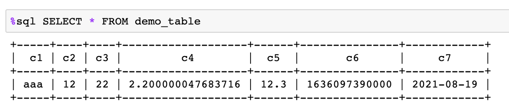
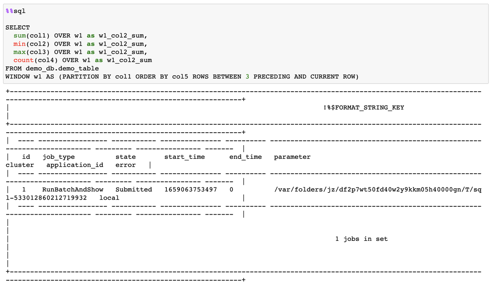
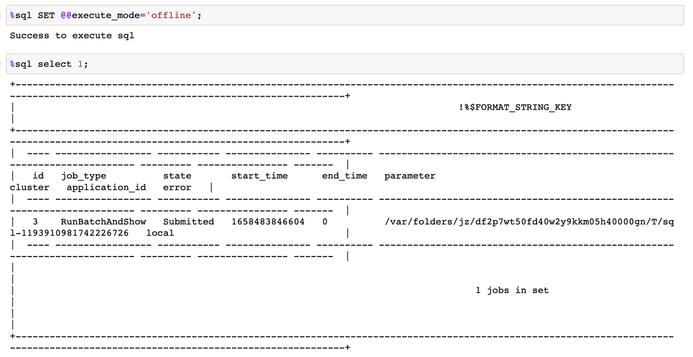

# Jupyter Notebook

Jupyter Notebook offers various functionalities, such as data computation, code development, document editing, code execution, and result display, through a browser-based web page. It is currently one of the most popular and user-friendly development environments. This article introduces the seamless integration of OpenMLDB and Notebook, harnessing the functional features of OpenMLDB and the convenience of Notebook to create a fast and user-friendly machine-learning development environment.

## Integration of the Magic Function

The SQL magic function is an extension of Notebook that allows users to execute SQL statements directly in a Notebook cell without writing complex Python code. It also supports customized output. OpenMLDB provides a standard SQL magic function that allows users to write and run OpenMLDB-supported SQL statements directly in the Notebook. These statements are submitted to OpenMLDB for execution, and the results are previewed and displayed in the Notebook.

### Register OpenMLDB SQL Magic Function

To support OpenMLDB magic function in Notebook, register as follows:

  ```Python
  import openmldb
  db = openmldb.dbapi.connect(database='demo_db',zk='0.0.0.0:2181',zkPath='/openmldb')
  openmldb.sql_magic.register(db)
  ```

### Execute a Single SQL Statement

Developers can use the prompt `%` to execute a single-line SQL statement, as shown in the following figure.



### Execute multiple SQL statement

Developers can also use the prompt `%%` to write multi-line SQL statements, as shown in the following figure.



Please note that currently, executing multiple SQL statements simultaneously within a Notebook cell is not supported. Each SQL statement needs to be executed separately in different cells.

### Magic Function

The SQL magic function provided by OpenMLDB can execute all supported SQL syntax, including the unique offline mode of OpenMLDB, which allows for asynchronously submitting complex big data SQL statements to the offline execution engine, as shown in the following figure.



For more detailed instructions on using the OpenMLDB magic function, please refer to [The Use of Notebook Magic Function](https://openmldb.ai/docs/en/main/quickstart/sdk/python_sdk.html#notebook-magic-function).

## Integration of OpenMLDB Python SDK with Notebook

Notebook supports the Python runtime kernel, enabling the import and usage of various Python libraries through import statements. OpenMLDB provides a fully functional Python SDK that can be called within Notebook. OpenMLDB Python SDK not only offers a DBAPI based on the Python PEP249 standard but also supports the mainstream SQLAlchemy interface, which enables connecting to existing OpenMLDB clusters with just one line of code.

### The Use of OpenMLDB DBAPI

Using the DBAPI interface is straightforward. You only need to specify the ZooKeeper address and node path for connection. Upon successful connection, corresponding log information will be displayed. You can call the DBAPI interface of the OpenMLDB Python SDK within Notebook for development, as detailed in [The Use of OpenMLDB DBAPI](https://openmldb.ai/docs/en/main/quickstart/sdk/python_sdk.html#openmldb-dbapi).

```Python
import openmldb.dbapi
db = openmldb.dbapi.connect('demo_db','0.0.0.0:2181','/openmldb')
```

### Using OpenMLDB SQLAlchemy

Using SQLAlchemy is also simple. You can establish the connection by specifying the URI of OpenMLDB through the SQLAlchemy library. Alternatively, you can connect to a standalone OpenMLDB database using IP and port as parameters, as shown below.

```Python
import sqlalchemy as db
engine = db.create_engine('openmldb://demo_db?zk=127.0.0.1:2181&zkPath=/openmldb')
connection = engine.connect()
```

After a successful connection, development can be carried out through the SQLAlchemy interface of the OpenMLDB Python SDK, as detailed in [Using OpenMLDB SQLAlchemy](https://openmldb.ai/docs/en/main/quickstart/sdk/python_sdk.html#openmldb-sqlalchemy).
