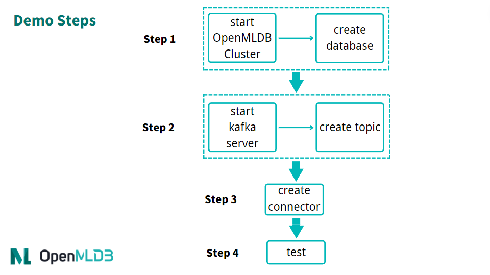

# Kafka

## Introduction

Apache Kafka is an event streaming platform that can be used as an online data source for OpenMLDB, allowing real-time data streams to be imported into OpenMLDB online. For more information on Kafka, please refer to the official website https://kafka.apache.org/. We have developed a Kafka Connector to seamlessly connect Kafka and OpenMLDB, facilitating data integration between the two platforms. In this document, you will learn about the concepts and usage of this connector.

Please note that, for the sake of simplicity, this article will demonstrate the use of the Kafka Connect standalone mode to start the connector. However, the connector can also be fully started in distributed mode.

```{seealso}
The implementation of the OpenMLDB Kafka Connector can be found in the [extensions/kafka-connect-jdbc](https://github.com/4paradigm/OpenMLDB/tree/main/extensions/kafka-connect-jdbc) directory. For information on features, configuration, and development, please refer to the [Development Guide](https://github.com/4paradigm/OpenMLDB/blob/main/extensions/kafka-connect-jdbc/DEVELOP.md).
```

## Enhanced Features

- Auto Schema

The OpenMLDB Kafka Connector supports automatically using the table schema of OpenMLDB to parse messages without a schema registry. Therefore, messages can be simple JSON-formatted data maps. For detailed configuration and format, refer to [Auto Schema](https://github.com/4paradigm/OpenMLDB/blob/main/extensions/kafka-connect-jdbc/DEVELOP.md#auto-schema).

When Auto Schema is enabled, versions prior to 0.8.5 require messages to contain all columns in the schema. Timestamp and date columns only support integers. Versions 0.8.5 and later support importing messages with only a subset of columns, with other columns filled with default values. Timestamp and date columns can also support string formats for year, month, day, hour, minute, and second.

- Topic Table Mapping

The OpenMLDB Kafka Connector supports mapping topics to tables, which is more flexible than the `table.name.format` configuration. See [Topic Table Mapping](https://github.com/4paradigm/OpenMLDB/blob/main/extensions/kafka-connect-jdbc/DEVELOP.md#topic-table-mapping) for the configuration method.

This feature can be used independently. If this field is empty, the `table.name.format` rule will be used. The `table.name.format` rule replaces `${topic}` with the topic name. The default configuration is `${topic}`, which means the table and topic have the same name. A more complex example is configuring the format as `kafka_${topic}`. If the topic name is "t1", the table name will be "kafka_t1". Therefore, the format configuration is only applicable to fixed table names or those that include the topic name.

## Performance

When importing data from Kafka to the OpenMLDB cluster using the OpenMLDB Kafka Connector, the performance is influenced by both the Kafka sender and the OpenMLDB receiver. We provide performance test reports for both single-node and cluster scenarios, which can be found in [Kafka Perf Test](https://github.com/vagetablechicken/openmldb-compose?tab=readme-ov-file).

Assuming that the data volume of the topic is large enough, the efficiency of Kafka import is mainly determined by the number of partitions in the Kafka topic and the number of tasks in the Connector. If these two factors are not large enough, the concurrency of writing to OpenMLDB will be limited. When the number of tasks is large, a single Kafka Connect service will also be limited by the physical resources of the machine. In this case, it is necessary to deploy a distributed Kafka Connect, evenly distributing the tasks across multiple machines to increase concurrency.

Observing the pqs and latency of the report, in the case of a single machine, with 40 CPU cores available, the Kafka Connector can be configured with a larger number of tasks, and the write qps of OpenMLDB on a single machine is 50k, totaling 100k. However, the internal write latency of OpenMLDB did not significantly increase, it is just limited by the performance of a single machine, resulting in such write performance. Cluster performance testing also proved this point. After making OpenMLDB a cluster, deploying Kafka Connect on a single machine, changing the Kafka topic partition and task count, qps will not have a significant improvement. However, after deploying Kafka Connect in a distributed manner, qps will significantly increase. With 78 sink tasks being evenly distributed to two Kafka Connect instances, TabletServer QPS can reach 90k on a single machine, totaling 180k. With 120 sink tasks being evenly distributed to three Kafka Connect instances, TabletServer QPS can reach 100k on a single machine, totaling 200k.

## Overview

### Download and Preparation

- If you need to download Kafka, please click on the [Kafka Official Download](https://kafka.apache.org/downloads) link and download `kafka_2.13-3.1.0.tgz`.
- If you need to download the connector package and its dependencies, please click on [kafka-connect-jdbc.tgz](http://openmldb.ai/download/kafka-connector/kafka-connect-jdbc.tgz).
- If you need to download the configuration and script files required in this article, please click on [kafka_demo_files.tgz](http://openmldb.ai/download/kafka-connector/kafka_demo_files.tgz).

This article will use Docker mode to start OpenMLDB, so there is no need to download OpenMLDB separately. Additionally, both Kafka and the connector can be started in the same container.

We recommend that you bind all three downloaded file packages to the `kafka` directory. Alternatively, you can download the file packages after starting the container. For our demonstration, we assume that the file packages are all in the `/work/kafka` directory.

```
docker run -it -v `pwd`:/work/kafka 4pdosc/openmldb:0.8.5 bash
```

### Note

Timestamp is in ms, value is set to JsonConvertor, only integer is supported. Depending on different messages, other Convertor can be selected. 

Connector can be used in earlier versions of Kafka Server, e.g. 1.1.1. However, note that the earlier versions may not have Kafka Broker "auto create topics" on. You will need to [enable it](https://kafka.apache.org/documentation/#brokerconfigs_auto.create.topics.enable).


### Process

The brief process of using a connector is shown in the following figure. We will now provide a detailed introduction to each step.

Overall, the usage process can be summarized into four steps:

1. Start OpenMLDB and create a database

2. Start Kafka and create a topic

3. Start OpenMLDB Kafka Connector

4. Conduct testing or normal use



## Step 1: Start OpenMLDB and Create Database

### Start OpenMLDB Cluster

Start cluster in OpenMLDB container:

```
/work/init.sh
```

```{caution}
Currently, only the OpenMLDB cluster version can serve as the receiver of sink, and data will only be sink to the online storage of the cluster.
```

### Create Database

We can quickly create a database through the pipe without logging into the client CLI:

```
echo "create database kafka_test;" | /work/openmldb/bin/openmldb --zk_cluster=127.0.0.1:2181 --zk_root_path=/openmldb --role=sql_client
```

## Step 2: Start Kafka and Create Topic

### Start Kafka

Unzip Kafka, and then use the start script to start Kafka.

```
cd kafka
tar -xzf kafka_2.13-3.1.0.tgz
cd kafka_2.13-3.1.0
./bin/kafka-server-start.sh -daemon config/server.properties
```

```{note}
The OpenMLDB service has already started ZooKeeper using port 2181, and Kafka does not need to start ZooKeeper again. So, all you need to do here is start the server.
```

You can use the `ps` command to check whether Kafka is running normally. If the startup fails, please check the log file `logs/server.log`.

```
ps axu|grep kafka
```

### Create Topic

We have created a topic named `topic1`. Please note that special characters should be avoided as much as possible in the topic name.

```
./bin/kafka-topics.sh --create --topic topic1 --bootstrap-server localhost:9092
```

You can `describe` topic to double-check if it is running normally.

```
./bin/kafka-topics.sh --describe --topic topic1 --bootstrap-server localhost:9092
```


## Step 3: Start Connector

First, upzip `/work/kafka` in the connector and kafka_demo_files package.

```
cd /work/kafka
tar zxf kafka-connect-jdbc.tgz
tar zxf kafka_demo_files.tgz
```

To start the connector, you need two configuration files from the `kafka_demo_files` and place the connector plugin in the correct location.

The first configuration file is `connect-standalone.properties` for the connect worker. The key configuration to focus on is the "plugin.path," please make sure this configuration is set as follows:

```
plugin.path=/usr/local/share/java
```

The connector and all dependent packages required to run, need to be placed in this directory. The command is as follows:

```
mkdir -p /usr/local/share/java
cp -r /work/kafka/kafka-connect-jdbc /usr/local/share/java/
```

The second configuration file is the Sink Connector configuration for connecting to OpenMLDB, named `openmldb-sink.properties`, as shown below:

```
name=test-sink
connector.class=io.confluent.connect.jdbc.JdbcSinkConnector
tasks.max=1
topics=topic1 
connection.url=jdbc:openmldb:///kafka_test?zk=127.0.0.1:2181&zkPath=/openmldb
auto.create=true
value.converter=org.apache.kafka.connect.json.JsonConverter
value.converter.schemas.enable=true
```

In the connection configuration, it is essential to fill in the correct OpenMLDB URL address. This connector receives messages from `topic1` and automatically creates a table (auto.create). We have set the value converter in the `openmldb-sink.properties` configuration of the connector. Alternatively, you can set the default converter in the `connect-standalone.properties` of the connector worker without the need for additional configuration in the connector.

```{tip}
Details of configuration items can be found in the Kafka documentation under [Configuring Connectors](https://kafka.apache.org/documentation/#connect_configuring).

Among them, `connection.url` needs to be configured with the correct OpenMLDB cluster address and database name, and the database must already exist.

Attributes such as `value.converter` can also be configured at the connector, and they will override the default configuration of the connector worker. After the connector is started, properties can also be dynamically modified through the HTTP API.
```

Next, use Kafka Connector standalone mode to start the connect worker.

```
cd /work/kafka/kafka_2.13-3.1.0
./bin/connect-standalone.sh -daemon ../kafka_demo_files/connect-standalone.properties ../kafka_demo_files/openmldb-sink.properties
```

Please confirm whether the connect worker is running and if the sink task is correctly connected to the OpenMLDB cluster. You can check the `logs/connect.log`, and under normal circumstances, the log should display `Executing sink task`.

## Step 4: Testing

### Send Message

For testing, we will use the console producer provided by Kafka as the messaging tool.

Since the table has not been created yet, our message should include a schema to help Kafka parse the information and write it to OpenMLDB.

```
{"schema":{"type":"struct","fields":[{"type":"int16","optional":true,"field":"c1_int16"},{"type":"int32","optional":true,"field":"c2_int32"},{"type":"int64","optional":true,"field":"c3_int64"},{"type":"float","optional":true,"field":"c4_float"},{"type":"double","optional":true,"field":"c5_double"},{"type":"boolean","optional":true,"field":"c6_boolean"},{"type":"string","optional":true,"field":"c7_string"},{"type":"int64","name":"org.apache.kafka.connect.data.Date","optional":true,"field":"c8_date"},{"type":"int64","name":"org.apache.kafka.connect.data.Timestamp","optional":true,"field":"c9_timestamp"}],"optional":false,"name":"foobar"},"payload":{"c1_int16":1,"c2_int32":2,"c3_int64":3,"c4_float":4.4,"c5_double":5.555,"c6_boolean":true,"c7_string":"c77777","c8_date":19109,"c9_timestamp":1651051906000}}
```

To simplify the process, we will save the above information in the file `kafka_demo_files/message`. You can use this file directly to send the message to Kafka using the console producer.

```
./bin/kafka-console-producer.sh --topic topic1 --bootstrap-server localhost:9092 < ../kafka_demo_files/message
```

```{tip}
If you prefer the messages not to contain a schema but do not have additional components like Schema Registry, you can first create a table in OpenMLDB and then configure `auto.schema=true` in the connector. For detailed configuration methods, please refer to the [kafka connect jdbc documentation](https://github.com/4paradigm/OpenMLDB/blob/main/extensions/kafka-connect-jdbc/DEVELOP.md). Currently, this method only supports usage with JsonConverter.
```

### Check

We can query whether the insertion was successful in OpenMLDB. Query script `kafka_demo_files/select.sql`, the content is as follows:

```
set @@execute_mode='online';
use kafka_test;
select * from topic1;
```

You can directly run the query script to query:

```
/work/openmldb/bin/openmldb --zk_cluster=127.0.0.1:2181 --zk_root_path=/openmldb --role=sql_client < ../kafka_demo_files/select.sql
```


## Debugging

### Log

The logs of the Kafka server can be found in `log/server.log`. If Kafka itself is not functioning correctly, please check this log for potential issues.

The log for the connector can be found in `log/connect.log`. If the producer is not running as expected or you encounter difficulties querying data in OpenMLDB, please check this log for any relevant information.

### Reinitialization

If you encounter any problems during testing, you can reinitialize the environment to facilitate the retry process.

To stop Kafka, you need to terminate the two daemon processes by using the command `kill kafka`.

```
ps axu|grep kafka | grep -v grep | awk '{print $2}' | xargs kill -9
```

Kafka's data can also be deleted, please refer to [TERMINATE THE KAFKA ENVIRONMENT](https://kafka.apache.org/quickstart#quickstart_kafkaterminate):

```
rm -rf /tmp/kafka-logs /tmp/kraft-combined-logs
```

Please do not delete the `/tmp/zookeeper` directory here, nor kill the zookeeper process, as OpenMLDB also uses this zookeeper cluster. When reinitializing OpenMLDB, it will handle the zookeeper termination and deletion of this directory.

```
/work/init.sh
```

To start a new OpenMLDB cluster, run the command `init.sh`. Afterward, you can create a database in OpenMLDB and restart Kafka for further testing.

## Deployment using Kubernetes

To deploy the OpenMLDB Kafka Connect service, you need to prepare the configuration files locally. It is recommended to modify the "plugin.path=/tmp" configuration item and adjust the ZK address of the OpenMLDB connection.

Configuration files required for the deployment:

- connect-standalone.properties
- openmldb-sink.properties

After preparing the configuration files locally, create a ConfigMap using the following command.

```
kubectl create configmap openmldb-kafka-connect-configmap --from-file=connect-standalone.properties=connect-standalone.properties --from-file=openmldb-sink.properties=openmldb-sink.properties
```

Next, use the provided Dockerfile by OpenMLDB to create images and push them to the image repository.

```
docker build -t registry.cn-shenzhen.aliyuncs.com/tobe43/openmldb-kafka-connect -f Dockerfile .
```

Use the Yaml file provided by OpenMLDB to create a deployment, and make necessary modifications to the launched configuration repository. Please note that currently, only a single node Connect service is supported, so the replica configuration for deployment must be set to 1.

```
kubectl create -f ./openmldb-kafka-connect-deployment.yaml
```

Once the deployment is created, you can check the running status and logs of the corresponding Pod, and then send a message to Kafka to verify if the service functions correctly.

If you want to access the RESTful interface of the Connect service, you can refer to the provided Yaml file by OpenMLDB to create the service. By default, NodePort is used, and the corresponding service can be accessed on port 8083 of the host.

```
kubectl create -f ./openmldb-kafka-connect-service.yaml
```
