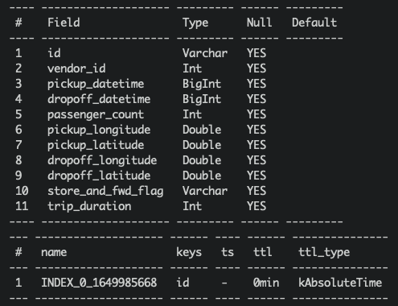
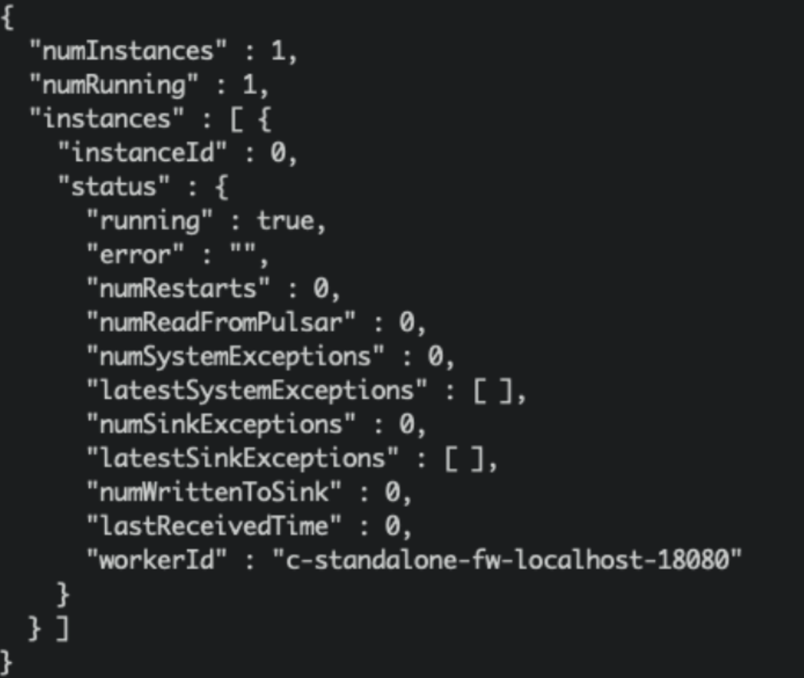
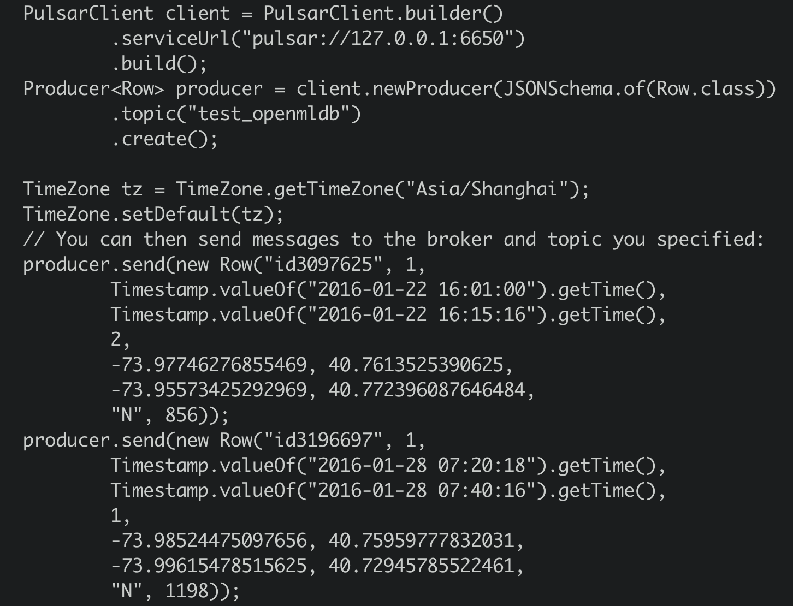

# Pulsar

## Introduction

Apache Pulsar is a cloud-native, distributed messaging platform that can serve as an online data source for OpenMLDB, allowing real-time data streams to be imported into OpenMLDB online. For more information about Pulsar, please refer to the official website https://pulsar.apache.org/. We have developed the OpenMLDB JDBC Connector for Pulsar, which facilitates the seamless connection between Pulsar and OpenMLDB. In this document, you will learn about the concept and usage of this connector.

Please note that for the sake of simplicity, this article will use Pulsar Standalone, an OpenMLDB cluster, and a simple JSON message producer program to demonstrate how the OpenMLDB JDBC Connector works. However, this connector is fully functional in a Pulsar Cluster.

```{seealso}
For detailed information on Pulsar's OpenMLDB Connector, you can also refer to Pulsar's [Official Website for Relevant Information]（https://pulsar.apache.org/docs/en/next/io-connectors/#jdbc-Openmldb).
```

## Overview

### Download

- To proceed with the usage, you will need to download all the necessary files for this article. Please click on [files](https://openmldb.ai/download/pulsar-connector/files.tar.gz) to download them. These files include the connector packages, schema files, configuration files, and more.

- Alternatively, if you only want to download the connector package for your own project, please click on [connector snapshot](https://github.com/4paradigm/OpenMLDB/releases/download/v0.4.4/pulsar-io-jdbc-openmldb-2.11.0-SNAPSHOT.nar).

### The Process

The overall process of using the connector is illustrated in the figure below. We will now provide a detailed introduction to each step. Additionally, we have recorded the complete steps, and the details can be found in [terminalizer](https://terminalizer.com/view/be2309235671). You can also download the script in [demo.yml](https://github.com/vagetablechicken/pulsar-openmldb-connector-demo/blob/main/demo.yml).

In summary, the usage process can be broken down into three steps:

1. Create the relevant databases and tables in OpenMLDB.
2. Create a sink in Pulsar to connect the Pulsar data stream with OpenMLDB and configure the corresponding schema in Pulsar to ensure that the data stream is correctly received by OpenMLDB and stored in the online database.
3. Conduct testing or normal usage.


## Step 1: Create a Database and Data Table in OpenMLDB

### Start OpenMLDB Cluster

Using Docker, you can quickly start OpenMLDB and create tables for testing. For more information on creating an OpenMLDB cluster, please refer to [Quickstart](../../quickstart/openmldb_quickstart.md).

```{caution}
Currently, only the OpenMLDB cluster version can act as the receiver of sinks, and data will only be sunk to the online storage of the cluster.
```

We recommend using the 'host network' mode to run Docker and bind the file directory 'files' where the SQL script is located.

```
docker run -dit --network host -v `pwd`/files:/work/pulsar_files --name openmldb 4pdosc/openmldb:0.9.0 bash
docker exec -it openmldb bash
```

Start cluster in OpenMLDB cluster:

```
./init.sh
```

```{caution}
Please note that on the macOS platform, even when using the host network, it is not supported to connect to the OpenMLDB server inside the container from outside. However, it is feasible to connect to OpenMLDB services in other containers from within the container.
```

### Create Table

We use a script to quickly create tables, with the following content:

```
create database pulsar_test;
use pulsar_test;
create table connector_test(id string, vendor_id int, pickup_datetime bigint, dropoff_datetime bigint, passenger_count int, pickup_longitude double, pickup_latitude double, dropoff_longitude double, dropoff_latitude double, store_and_fwd_flag string, trip_duration int);
desc connector_test;
```

Execute script:

```
/work/openmldb/bin/openmldb --zk_cluster=127.0.0.1:2181 --zk_root_path=/openmldb --role=sql_client < /work/pulsar_files/create.sql
```



```{note}
Currently, both JSONSchema and JDBC base connectors in Pulsar do not support 'java.sql.Timestamp'. Therefore, we use 'long' as the data type for the timestamp column (in OpenMLDB, long can be used as the timestamp).
```

## Step 2: Create Sink and Schema in Pulsar

### Start Pulsar Standalone

Using Docker makes it easier and quicker to launch Pulsar. We recommend using the 'host network' mode to run Docker, as it can avoid many container-related network connection issues. Additionally, we need to use `pulsar-admin` for sink creation, which is within the Pulsar image. Therefore, we use bash to run the container and execute commands one by one inside the container. It is also necessary to bind the 'files' directory.

```
docker run -dit --network host -v `pwd`/files:/pulsar/files --name pulsar apachepulsar/pulsar:2.9.1 bash
docker exec -it pulsar bash
```

Start the standalone server in Pulsar container.

```
bin/pulsar-daemon start standalone --zookeeper-port 5181
```

```{note}
Since the OpenMLDB service is already using port 2181, we will set a different zk port for Pulsar. We will use port 2181 to connect to OpenMLDB, but the zk port within Pulsar standalone will not have any external impact.
```

You can use `ps` to check whether Pulsar is running normally. If the startup fails, check the log `logs/pulsar-standalone-....log`.

```
ps axu|grep pulsar
```

When you start a local standalone cluster, it will automatically create a 'public/default' namespace. This namespace is used for development, as mentioned in the [Pulsar Documentation](https://pulsar.apache.org/docs/en/2.9.0/standalone/#start-pulsar-standalone).

**We will create sink in this namespace**

```{seealso}
If you want to directly start Pulsar locally, refer to [Set Up a Standalone Pulsar Locally] (https://pulsar.apache.org/docs/en/standalone/)
```

#### Q&A

Q: What is the reason when encountering such issue?

```
2022-04-07T03:15:59,289+0000 [main] INFO  org.apache.zookeeper.server.NIOServerCnxnFactory - binding to port 0.0.0.0/0.0.0.0:5181
2022-04-07T03:15:59,289+0000 [main] ERROR org.apache.pulsar.zookeeper.LocalBookkeeperEnsemble - Exception while instantiating ZooKeeper
java.net.BindException: Address already in use
```

A: Pulsar requires an unused port to start zk. Port 5181 is already in use, and the port number of '--zookeeper-port' needs to be changed.

Q: Is port 8080 already in use?

A: Port 8080 is the default configuration port for 'webServicePort', which can be replaced in `conf/standalone.conf`. However, note that pulsar-admin will use the 'webServiceUrl' in `conf/client.conf` to connect, and changes will also need to be synchronized.

Q: Is port 6650 already in use?

A: Changes need to be synchronized to the 'brokerServicePort' in `conf/standalone.conf` and the 'brokerServiceUrl' configuration item in `conf/client.conf`.

### Install Connector (Optional)

In the previous steps, we bound the 'files' directory, which already provides the nar package for the connector. We can use the "non-built-in connector" mode to set the connector (i.e. specify the 'archive' configuration item in the sink configuration, which will be described in the next step).

But if you want to use the OpenMLDB connector as a built-in connector, you need to create the 'connectors' directory and copy the nar file to the 'connectors' directory.

```
mkdir connectors
cp files/pulsar-io-jdbc-openmldb-2.11.0-SNAPSHOT.nar  connectors/
```

If you want to change or add a connector while Pulsar is running, you can notify Pulsar to update the information:

```
bin/pulsar-admin sinks reload
```

When the OpenMLDB connector becomes a built-in connector, its sink type name is 'jdbc-openmldb', and you can directly use this type name to specify the use of the OpenMLDB connector.

### Create Sink

We use the 'public/default' namespace to create a sink, and we need a configuration file for the sink, which is located in `files/pulsar-openmldb-jdbc-sink.yaml`. The content is as follows:

```
 tenant: "public"
 namespace: "default"
 name: "openmldb-test-sink"
 archive: "files/pulsar-io-jdbc-openmldb-2.11.0-SNAPSHOT.nar"
 inputs: ["test_openmldb"]
 configs:
     jdbcUrl: "jdbc:openmldb:///pulsar_test?zk=localhost:2181&zkPath=/openmldb"
     tableName: "connector_test"
```

```{note}
'name': The name of the sink.

'archive': We use 'archive' to specify the sink connector, so here we use the OpenMLDB connector as a non-built-in connector.

'input': This can be the name of multiple topics, but in this article, we will use only one topic.

'config': JDBC configuration used to connect to the OpenMLDB cluster.
```

Next, create a sink and check. Please note that the input topic we set is 'test_openmldb', which will be used in subsequent steps.

```
./bin/pulsar-admin sinks create --sink-config-file files/pulsar-openmldb-jdbc-sink.yaml
./bin/pulsar-admin sinks status --name openmldb-test-sink
```



### Create Schema

Upload the schema to the topic 'test_openmldb', and the schema type is in JSON format. In the following steps, we will produce JSON messages with the same schema. The schema file is `files/openmldb-table-schema`, and its content is as follows:

```
{
    "type": "JSON",
    "schema":"{\"type\":\"record\",\"name\":\"OpenMLDBSchema\",\"namespace\":\"com.foo\",\"fields\":[{\"name\":\"id\",\"type\":[\"null\",\"string\"],\"default\":null},{\"name\":\"vendor_id\",\"type\":\"int\"},{\"name\":\"pickup_datetime\",\"type\":\"long\"},{\"name\":\"dropoff_datetime\",\"type\":\"long\"},{\"name\":\"passenger_count\",\"type\":\"int\"},{\"name\":\"pickup_longitude\",\"type\":\"double\"},{\"name\":\"pickup_latitude\",\"type\":\"double\"},{\"name\":\"dropoff_longitude\",\"type\":\"double\"},{\"name\":\"dropoff_latitude\",\"type\":\"double\"},{\"name\":\"store_and_fwd_flag\",\"type\":[\"null\",\"string\"],\"default\":null},{\"name\":\"trip_duration\",\"type\":\"int\"}]}",
    "properties": {}
}
```

The command to upload and check the schema is as follows:

```
./bin/pulsar-admin schemas upload test_openmldb -f ./files/openmldb-table-schema
./bin/pulsar-admin schemas get test_openmldb
```


## Step 3: Testing

### Send Message

We use two OpenMLDB images with `data/taxi_tour_table_train_simple.csv` as the sample data of the testing message. The data is shown in the following figure:


#### Java Producer

For the Producer JAVA code, see detailed in [demo producer](https://github.com/vagetablechicken/pulsar-client-java). The core code is as follows:


As you can see, the producer will send two messages to the topic 'test_openmldb'. Afterward, Pulsar will read the messages and write them to the online storage of the OpenMLDB cluster.

The program package is located in the 'files' directory, and you can run it directly:

```
java -cp files/pulsar-client-java-1.0-SNAPSHOT-jar-with-dependencies.jar org.example.Client
```

#### Python Producer

The producer can also be implemented using Python, as detailed in `files/pulsar_client.py`. Before running, it is necessary to install the Pulsar Python client:

```
pip3 install pulsar-client==2.9.1
```

Run：

```
python3 files/pulsar_client.py
```

```{note}
Known issue: If the value of a Long type in the message is relatively small, during the jdbc bindValue phase of the Pulsar Function sink, it may read the value from the JsonRecord as a Java Integer type, resulting in using `statement.setInt` instead of `setLong` when calling [setColumnValue](https://github.com/apache/pulsar/blob/82237d3684fe506bcb6426b3b23f413422e6e4fb/pulsar-io/jdbc/core/src/main/java/org/apache/pulsar/io/jdbc/BaseJdbcAutoSchemaSink.java#L170)) for the Long type column. As a result, it will generate an SQLException with `data type not match`.

If you want to see which specific column has the data type issue, please open the function's debug level logs. The method is described in [Debugging](#debugging).
```

### Check

#### Check in Pulsar

We can check the sink status in Pulsar:

```
./bin/pulsar-admin sinks status --name openmldb-test-sink 
```


```{note}
"numReadFromPulsar": Pulsar sent 2 messages to the sink example.

"numWritenToSink": The sink example wrote 2 messages to OpenMLDB.
```

#### Check in OpenMLDB

We can query these message data in OpenMLDB online storage. The content of the query script select.sql is as follows:

```
set @@execute_mode='online';
use pulsar_test;
select *, string(timestamp(pickup_datetime)), string(timestamp(dropoff_datetime)) from connector_test;
```

Execute the script in OpenMLDB container:

```
/work/openmldb/bin/openmldb --zk_cluster=127.0.0.1:2181 --zk_root_path=/openmldb --role=sql_client < /work/pulsar_files/select.sql
```


### Debugging

If OpenMLDB does not have data and the sink's status is reasonable, then there might be an issue with the sink writing. Please check the sink log at the address `logs/functions/public/default/openmldb-test-sink/openmldb-test-sink-0.log`. If you are using a different sink name, please locate the correct sink log.

Pulsar will repeatedly attempt to write messages that were not successfully written before, so if you have previously sent an error message, even if the new message is successfully written, there will still be an error message written in the log. During testing, it is recommended to directly truncate the topic and retest it:

```
./bin/pulsar-admin topics truncate persistent://public/default/test_openmldb
```

If you have a self-named sink name, you can use `./bin/pulsar-admin topics list public/default` to query the full name of the topic.

#### Debug Log

If the sink log information is not sufficient to locate the issue, you can open the debug log. You will need to modify the configuration and restart the sink by editing `vim conf/functions_log4j2.xml` and making the following modifications:

```xml
        <Property>
            <name>pulsar.log.level</name>
            <value>debug</value> <!-- set as debug level -->
        </Property>
```

```xml
        <Root>
            <level>${sys:pulsar.log.level}</level> <!-- change the info here as ${sys:pulsar.log.level}or debug -->
            <AppenderRef>
                <ref>${sys:pulsar.log.appender}</ref>
                <level>${sys:pulsar.log.level}</level>
            </AppenderRef>
        </Root>
```

Then, restart sink:

```
./bin/pulsar-admin sinks restart --name openmldb-test-sink
```

#### Restart Pulsar

```
bin/pulsar-daemon stop standalone --zookeeper-port 5181
rm -r data logs
bin/pulsar-daemon start standalone --zookeeper-port 5181
```
