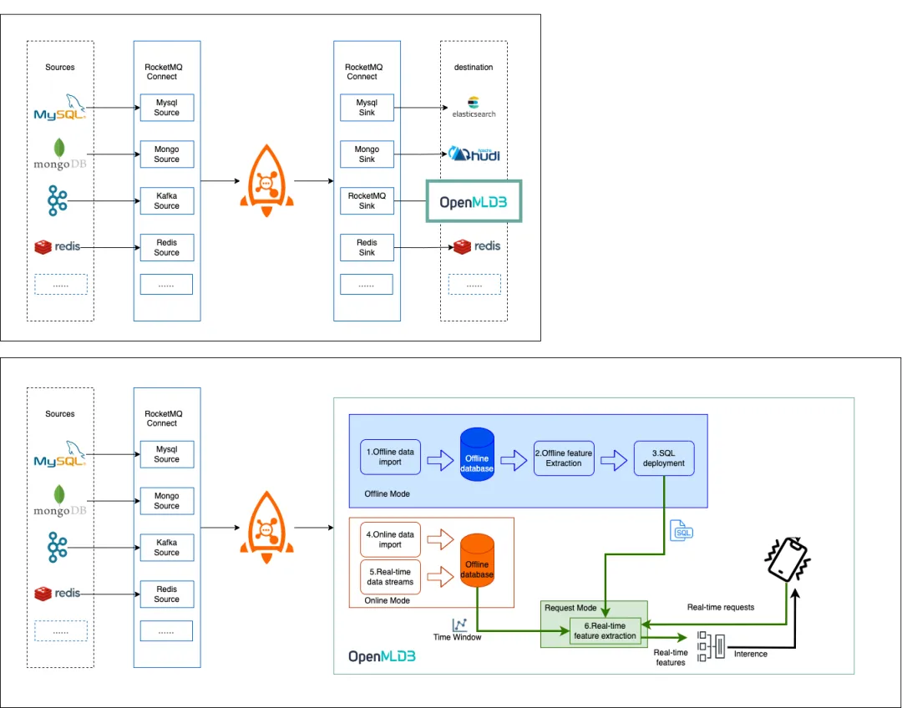
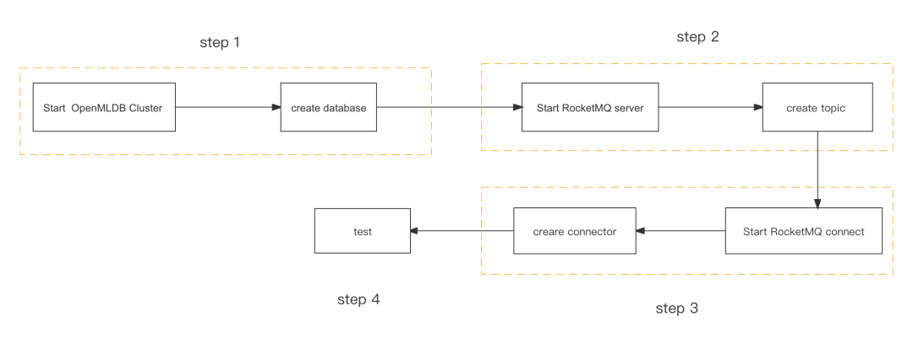
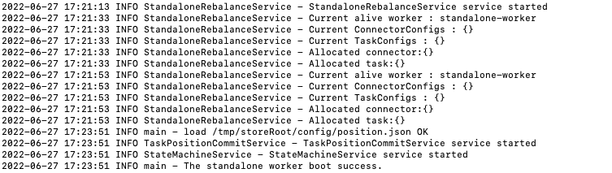
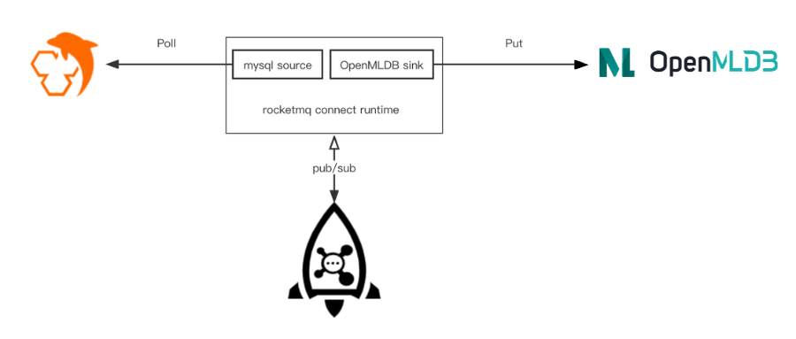

# RocketMQ

## 1. 为什么选择 RocketMQ OpenMLDB Connector

为了使 OpenMLDB 与 RocketMQ 拥有高效稳定的传输通道，RocketMQ OpenMLDB connector 具有诸多优秀特性，包括但不限于：

- **易上手。**无需编写任何代码，只需进行**简单配置**，便可通过 RocketMQ OpenMLDB Connector 将 RocketMQ 的消息流入 OpenMLDB 。简化的数据导入过程能**大幅提升**企业数据的有效使用率。
- **易部署。**能够根据不同场景的实际业务需求，选择在**单机或集群**上运行 RocketMQ OpenMLDB Connector ，助力企业构建实时数据管道。
- **高可靠。**RocketMQ OpenMLDB Connector 集群部署的方式具备 Failover 能力，可以将有问题节点的任务调度到正常节点并保证集群负载均衡，使企业能**更专注和更高效**地探索数据的商业价值。
- **低延时。秒级延迟**，满足实时数据及特征开发场景。

## 2. RocketMQ OpenMLDB Connector

### 2.1. Connector 概述

**定位**

RocketMQ Connect是RocketMQ数据集成重要组件，它具备具有低延时，可靠性，高性能，低代码，扩展性强等特点，可以实现各种异构数据系统的连接，构建数据管道，ETL，CDC，数据湖等能力。

RocketMQ OpenMLDB Connector 是一个用于在 RocketMQ 和 OpenMLDB 之间可扩展的、可靠的流式传输数据的工具。让 RocketMQ 及 RocketMQ connect 生态组件导入数据到 OpenMLDB 变得简单。

**功能**

可以使 RocketMQ 的消息流入 OpenMLDB 在线存储。



**Connector 插件编译**

RocketMQ OpenMLDB Connector

```bash
$ git clone git@github.com:apache/rocketmq-connect.git
$ cd rocketmq-connect/connectors/rocketmq-connect-jdbc/
$ mvn clean package -Dmaven.test.skip=true
```

最终将编译好的插件包放在 RocketMQ connect 指定的加载地址。

### 2.2. Connector 使用演示

**流程介绍**

RocketMQ OpenMLDB Connector 用于 OpenMLDB 线上模式的实时数据流接入。使用 connector 的简要流程，如下图所示。我们接下来将详细介绍每一步。

整体上，使用流程可以概括为四步：

- 启动 OpenMLDB 并创建数据库
- 启动 RocketMQ 并创建 topic
- 启动 RocketMQ OpenMLDB Connector
- 进行测试或者正常使用



**关键步骤**

以下仅列出使用此 connector 的关键步骤

**步骤1 | 启动 OpenMLDB**

启动 OpenMLDB，并创建数据库 rocketmq_test，用于测试。表可以被 RocketMQ Connector 自动创建，所以这里不需要手动创建表。

```bash
cd /work
./init.sh
echo "create database rocketmq_test;" | /work/openmldb/bin/openmldb --zk_cluster=127.0.0.1:2181 --zk_root_path=/openmldb --role=sql_client
```

**步骤2 | 启动 RocketMQ**

```bash
RocketMQ 搭建，启动 RocketMQ
1、下载RocketMQ
$ wget https://dlcdn.apache.org/rocketmq/4.9.3/rocketmq-all-4.9.3-source-release.zip


2、编译RocketMQ
如果是已经编译好的请直接执行第3部启动RocketMQ


$ unzip rocketmq-all-4.9.3-source-release.zip  
$ cd rocketmq-all-4.9.3/  
$ mvn -Prelease-all -DskipTests clean install -U  
$ cd distribution/target/rocketmq-4.9.3/rocketmq-4.9.3


3、启动RocketMQ
启动namesrv
$ nohup sh bin/mqnamesrv &  
查看namesrv是否启动成功
$ tail -f ~/logs/rocketmqlogs/namesrv.log  
The Name Server boot success...


启动broker
$ nohup sh bin/mqbroker -n localhost:9876 &
查看broker是否启动成功
$ tail -f ~/logs/rocketmqlogs/broker.log    
The broker[%s, 172.30.30.233:10911] boot success...
```

**步骤3 | 启动 RocketMQ** **OpenMLDB Connector**

首先, 搭建 RocketMQ connect runtime 环境

项目下载

```bash
$ git clone git@github.com:apache/rocketmq-connect.git
```

构建项目

```bash
$ cd rocketmq-connect
$ mvn -Prelease-connect -DskipTests clean install -U
```

修改配置`connect-standalone.conf` ，重点配置如下

```bash
$ cd distribution/target/rocketmq-connect-0.0.1-SNAPSHOT/rocketmq-connect-0.0.1-SNAPSHOT
$ vim conf/connect-standalone.conf
```

```yaml
# 当前的节点的独特Id
workerId=DEFAULT_WORKER_1

# REST API的端口地址
httpPort=8081

# 本地存储路径
storePathRootDir=～/storeRoot

# 需要修改为自己的rocketmq NameServer的端口地址
# Rocketmq namesrvAddr
namesrvAddr=127.0.0.1:9876  

#需要修改为connector-plugins文件夹所在的位置
# Source or sink connector jar file dir
pluginPaths=/usr/local/connector-plugins/
```

我们需要将 OpenMLDB RocketMQ Connector 编译好的包放入这个目录。命令如下：

```bash
mkdir -p /usr/local/connector-plugins/rocketmq-connect-jdbc
cd ../../../../
cp connectors/rocketmq-connect-jdbc/target/rocketmq-connect-jdbc-0.0.1-SNAPSHOT-jar-with-dependencies.jar /usr/local/connector-plugins/rocketmq-connect-jdbc
```

使用 standalone 的模式启动 RocketMQ Connect Runtime 环境。

```bash
$ cd distribution/target/rocketmq-connect-0.0.1-SNAPSHOT/rocketmq-connect-0.0.1-SNAPSHOT
$ sh bin/connect-standalone.sh -c conf/connect-standalone.conf &
```

以下表示 Rocketmq connect runtime 运行成功：



**步骤4 | 测试**



- 创建 Mysql 数据表 ，并初始化测试数据
- 创建 mysql source， 从测试表中拉取数据
- 创建 OpenMLDB sink，将 source 拉取的数据写入到 OpenMLDB 中

初始化 MySQL 测试数据；

```sql
SET NAMES utf8mb4;
SET FOREIGN_KEY_CHECKS = 0;


-- ----------------------------
-- Table structure for employee_test
-- ----------------------------
DROP TABLE IF EXISTS `employee_test`;
CREATE TABLE `employee_test` (
  `id` bigint NOT NULL AUTO_INCREMENT,
  `name` varchar(128) DEFAULT NULL,
  `howold` int DEFAULT NULL,
  `male` int DEFAULT NULL,
  `company` varchar(128) DEFAULT NULL,
  `money` double DEFAULT NULL,
  `begin_time` datetime DEFAULT NULL,
  PRIMARY KEY (`id`)
) ENGINE=InnoDB AUTO_INCREMENT=15 DEFAULT CHARSET=utf8;


-- ----------------------------
-- Records of employee_test
-- ----------------------------
BEGIN;
INSERT INTO `employee_test` VALUES (2, 'name-02', 19, 7, 'company', 32232, '2021-12-29 08:00:00');
INSERT INTO `employee_test` VALUES (4, 'gjk', 25, 8, 'company', 3232, '2021-12-24 20:43:36');
INSERT INTO `employee_test` VALUES (12, 'name-06', 19, 3, NULL, NULL, NULL);
INSERT INTO `employee_test` VALUES (14, 'name-08', 25, 15, 'company', 32255, '2022-02-08 19:06:39');
COMMIT;


SET FOREIGN_KEY_CHECKS = 1;
```

创建并启动 RocketMQ conect mysql source connector ，如下所示：

```bash
curl -X POST -H "Content-Type: application/json" http://127.0.0.1:8082/connectors/jdbc-mysql-source-test
-d  '{
    "connector-class":"org.apache.rocketmq.connect.jdbc.connector.JdbcSourceConnector",
    "max-task":"1",
    "connection.url":"jdbc:mysql://127.0.0.1:3306", 
    "connection.user":"*****",   
    "connection.password":"*****", 
    "table.whitelist":"test_database.employee_test",
    "mode": "incrementing",     // 增量拉取方式
    "incrementing.column.name":"id",   // 指定增量拉取的字段
    "source-record-converter":"org.apache.rocketmq.connect.runtime.converter.JsonConverter"
}'st
```

确认任务启动并开始拉取数据:


建立一个 OpenMLDB RocketMQ sink connector 将数据写入到 OpenMLDB 表中，信息如下。（注：监听的 Topic 为 source 拉取表的表名）

```bash
curl -X POST -H "Content-Type: application/json" http://127.0.0.1:8082/connectors/jdbc-openmldb-sink-test
-d '{
    "connector-class":"org.apache.rocketmq.connect.jdbc.connector.JdbcSinkConnector",
    "max-task":"1",
    "connect-topicname":"employee_test",
    "connection.url":"jdbc:openmldb:///rocketmq_test?zk=127.0.0.1:2181&zkPath=/openmldb_cluster",
    "insert.mode":"INSERT",
    "db.timezone":"UTC",
    "table.types":"TABLE",
    "auto.create":"true",
    "source-record-converter":"org.apache.rocketmq.connect.runtime.converter.JsonConverter"
}'
```

观察数据是否入库，我们可以在 OpenMLDB 中查询是否插入成功。内容如下:

```sql
set @@execute_mode='online';
use rocketmq_test;
select * from employee_test;
```

