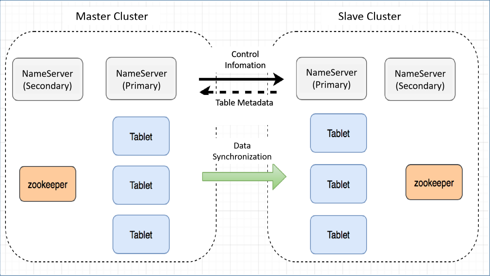

# [Alpha] The Disaster Recovery Plan of the Cross-Generator Room

## Background

In a single-cluster deployment environment, OpenMLDB ensures high availability at the node level within the cluster. However, certain uncontrollable factors such as power outages or natural disasters in the generator room can disrupt normal operations, rendering the majority of nodes or the entire generator room inoperable. This leads to an abnormal cluster state, resulting in interruptions to online services. To tackle this challenge, OpenMLDB offers a cross-generator room disaster recovery solution.

In this solution, users can establish independent OpenMLDB clusters in multiple remote generator rooms and configure them in a master-slave replication mode. In this deployment architecture, if the master cluster becomes unavailable, users can seamlessly switch to the slave cluster to ensure uninterrupted business operations.

## Architecture

### Definition of Terms

- **Master Cluster**: This cluster supports both read and write operations and synchronizes data with sub-clusters. A main cluster can consist of multiple sub-clusters.
- **Slave Cluster**: A cluster dedicated to providing read requests, maintaining data consistency with the main cluster. It can be seamlessly promoted to the main cluster when necessary and can be deployed in multiple instances.
- **Partition Leader**: The primary partition responsible for receiving both read and write data.
- **Partition Follower**: A secondary partition that exclusively accepts data synchronized from the partition leader. It does not directly accept write requests from clients.
- **Offset**: This term refers to the data offset stored in OpenMLDB's binlog. A larger offset value indicates newer data.

For a more comprehensive understanding of these terms, please consult the OpenMLDB [Architecture Documentation for the Online Module](https://chat.openai.com/link-to-documentation).

### Goals

- The master cluster facilitates write operations, while both the master and slave clusters support read operations.
- A master cluster can be supplemented with multiple slave clusters for redundancy.
- In the event of an unexpected master cluster outage, a manual switch can promote a slave cluster to the master cluster role.
- Automatic handling is in place for scenarios involving offline or unavailable master clusters and internal nodes within the slave clusters, including nameservers and tablets.

### Technical Solutions

The overall technical architecture of the master-slave cluster is shown in the following figure:



Synchronization information between master-slave clusters primarily encompasses data synchronization and metadata information synchronization.

**Initial State**

The initial state of the master-slave cluster can fall into one of the following categories:

- Both the master and slave clusters contain empty data.
- Either the master or slave cluster contains data. The table name and schema are consistent across the master-slave clusters, and the master cluster's offset is equal to or greater than the slave cluster's offset. Any discrepancies result in an error.

**Metadata Information Synchronization**

Metadata information synchronization occurs between the nameservers of the master-slave cluster, following these steps:

- Upon establishing the master-slave relationship, the master cluster's nameserver syncs table information with the slave cluster and creates corresponding tables within the cluster. Note that node count need not match between master-slave clusters, but partition counts in each table must align.
- The master cluster's nameserver periodically fetches table topology information from the slave cluster.

**Data Synchronization**

Data synchronization between master and slave clusters primarily relies on binlogs. The overarching synchronization logic unfolds as follows:

- Within a single cluster: Leader nodes transmit data to follower nodes for synchronization.
- Between master and slave clusters: The leader node of the master cluster transmits data to the leader node of the slave cluster for synchronization.

The subsequent visualization illustrates the synchronization logic and data flow direction.


Assuming a slave cluster comprises three replicas of a table, the specific process unfolds as follows: The leader of the master cluster partition initiates the creation of two replicator threads responsible for intra-cluster data synchronization, along with one replicator thread dedicated to synchronizing data to the leader of the slave cluster. Furthermore, two replicator threads are generated from the leader of the slave cluster to synchronize data with the followers within that slave cluster.

The replicator operates based on the following synchronization logic:

- It reads the binlog and forwards the data to the follower.
- The follower receives the data, appends it to the local binlog, and simultaneously writes it to the local partition table.

By default, the replicator continuously reads the most recent binlog. If no recent data is available, it waits for a brief period (default is 100ms) before attempting to read. In scenarios with stringent synchronization timeliness requirements, adjusting the default configuration (parameter `binlog_sync_wait_time`, see documentation [Configuration Document](https://chat.openai.com/deploy/conf.md)) can reduce latency but may lead to increased CPU resource consumption.

**Automatic Failover Within a Cluster**

When the master cluster's nameserver is offline:

- Upon the primary nameserver's outage in the master cluster, the secondary nameserver in the master cluster is promoted to the new primary nameserver. The updated topology information from the slave cluster's tables is incorporated into the new primary nameserver.
- The secondary nameserver in the master cluster remains offline and inactive.

When the slave cluster's nameserver is offline:

- Following the primary nameserver's unavailability in the slave cluster, the secondary nameserver in the slave cluster is promoted to the new primary nameserver. If the master cluster attempts to acquire table topology information from the slave cluster, an error is returned. Subsequently, the master cluster retrieves the latest primary nameserver from the slave cluster's ZooKeeper information and updates the table topology details accordingly.
- No operations are performed upon taking the nameserver offline in the slave cluster.

When the master cluster's tablet is offline:

- Internal failover mechanisms activate within the master cluster, and new leaders are selected based on corresponding partitions.
- A data synchronization relationship is established between the new leader and the tablet where the partition resides within the slave cluster.

When the slave cluster's tablet is offline:

- Failover procedures are executed within the slave cluster, and a new leader is selected based on corresponding partitions.
- The master cluster's nameserver acquires the topology structure from the slave cluster's table and detects changes. Consequently, data synchronization relationships related to altered partitions are deleted and re-established.

**Manual Failover between Master and Slave Clusters**

When the master cluster is unavailable:

Utilizing maintenance commands, elevate the slave cluster to the master cluster status. Concurrently, the business needs to divert write and read traffic to the new master cluster. The transition of this traffic should be managed by the business system.

When the slave cluster is unavailable:

If the business initially directed read traffic to the slave cluster (if applicable), it is necessary to switch all such traffic to the master cluster. The business system must oversee the process of this traffic migration.

## Master-Slave Cluster-Related Commands

Once the cluster is up and running, it defaults to the master cluster state. Additional clusters can be introduced as slave clusters to existing ones, and manipulation such as switching or removal can be carried out via commands.

**Start NS client**

Management of the master-slave cluster is handled through the NS (Nameserver) client, which can be initiated using the provided command.

The command structure is as follows:

```Bash
$ ./bin/openmldb --zk_cluster=172.27.2.52:12200 --zk_root_path=/onebox --role=ns_client
```

In this context, `zk_Cluster` represents the ZooKeeper address, `zk_root_path` corresponds to the root path of the cluster in ZooKeeper, and `role` specifies the starting role as `ns_client`.

For more comprehensive details about the NS client, please consult the [Operations CLI](https://chat.openai.com/cli.md) documentation.

**Adding a Slave Cluster**

The `addrepcluster` command is employed to include a slave cluster, structured as follows:

```Bash
addrepcluster $zk_cluster_follower $zk_root_path_follower $cluster_alias
```

For instance, if you intend to add a slave cluster with the ZooKeeper address `10.1.1.1:2181` and the OpenMLDB root path on ZooKeeper being `10.1.1.2:2181 /openmldb_cluster`, and you want to assign the alias `prod_dc01` to the slave cluster, execute the following command within the NS client of the master cluster:

```Bash
addrepcluster 10.1.1.1:2181,10.1.1.2:2181 /openmldb_cluster  prod_dc01
```

This operation integrates the designated slave cluster into the master-slave cluster configuration.

**Removing the Slave Cluster**

To remove a slave cluster, you can use the `removerepcluster` command. For instance, to delete the previously added slave cluster named `prod_dc01`, execute:

```Bash
removerepcluster prod_dc01
```

**Switching Cluster Roles**

The `switchmode` command is utilized to alter a cluster's role. The parameter options are `leader` or `normal`. To promote a slave cluster to the master cluster, set the parameter as `leader`. To change it to a regular cluster, set the parameter to `normal`.

```undefined
switchmode leader
```

**Query the Slave Cluster**

To retrieve information about all slave clusters, the `showrepcluster` command is employed. The output provides results in a similar format:


## FAQ

1. **Resolving the Distributed "Brain Split" Issue**

In distributed environments, encountering the "brain split" problem is not uncommon. This phenomenon arises when two clusters independently elect different leaders due to certain abnormal conditions, often related to network congestion. Consistency protocols like Raft effectively address similar challenges by enforcing conditions such as the requirement for leaders to garner over half of the votes. OpenMLDB's approach to host selection, guided by ZooKeeper and nameserver, differs from these protocols. Offline node detection is achieved through ZooKeeper's ephemeral node mechanism. When choosing a nameserver master, the one with the highest offset among all followers within the cluster is selected as the new leader. Consequently, the fundamental design of OpenMLDB's master-slave cluster solution eliminates the potential for brain-splitting issues.

2. **Determining Master Cluster Unavailability and Need for Master-Slave Switching**

Currently, OpenMLDB does not autonomously ascertain or perform master-slave switching based on overall cluster unavailability. The master-slave cluster scheme primarily addresses major disruptions such as generator room power outages. Therefore, the decision to switch between master and slave clusters depends on subjective evaluation. Common indicators of master cluster unavailability include uncontrolled access issues across the entire cluster, unrecoverable ZooKeeper instances, unresponsive tablets, or extended recovery durations.

3. **Possible Data Loss Scenarios**

While the master-slave cluster scheme enhances high availability, it does not guarantee absolute data preservation. Potential data loss scenarios exist, and related matters are slated for resolution or optimization in subsequent versions:

- After an internal master cluster table failover, if the newly elected leader's offset is smaller than that of the slave cluster's leader, data loss may occur within the offset difference.
- During master-slave switching, ongoing write traffic in the master cluster might lead to untimely data loss, particularly if synchronization to the slave cluster has not yet taken place.
- Changes to the topology of a slave cluster table, without capturing the master cluster, could result in data loss from the moment of topology alteration to a successful switch.

4. **Support for Multiple Slave Clusters**

A master cluster can indeed support multiple slave clusters by executing the `addrepcluster` command on the master cluster.

5. **Comparison with Other Master-Slave Cluster Solutions in the Industry**


For comparison, two widely-used databases in the industry, TiDB and MySQL, were mentioned. OpenMLDB's architecture bears similarities to both. TiDB transfers data from TiKV to TiFlash in a manner analogous to OpenMLDB's leader of the slave cluster concept. TiFlash's Learner parallels this role, synchronizing data from TiKV and performing in-cluster data synchronization. MySQL's master-slave replication shares similarities, periodically synchronizing data to slave clusters through binlogs and subsequently propagating the synchronization within the cluster via binlogs.

## Development Progress

Currently, the alpha version of the master-slave cluster solution is in the experimental phase, with its core functionalities fully developed and thoroughly tested. The primary outstanding issues are as follows:

- Presently, SQL commands are automatically synchronized between the master and slave clusters solely for actions like table creation, table deletion, and data insertion. Other commands (such as bringing SQL online, modifying TTL, etc.) do not yet support automatic synchronization. These commands need to be manually executed separately on both the master and slave clusters.
