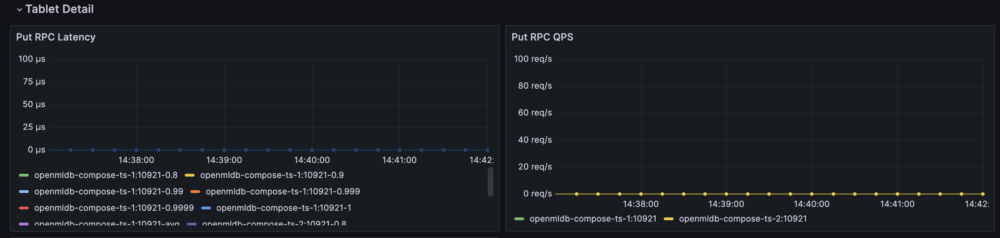
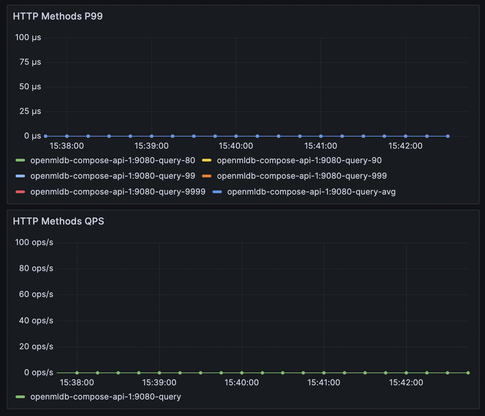
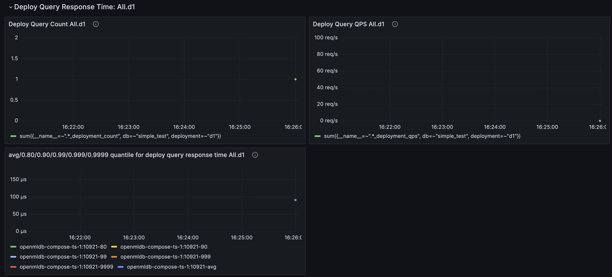

# Performance Tuning Guide

The cluster's read and write operations may encounter performance issues. This document will introduce how to monitor and tune performance. First, it is necessary to identify the performance bottleneck of the cluster through monitoring, and then optimize based on the bottleneck.

## Metric Collection

If you only need to monitor and collect data for the performance of a specific phase, you do not need to deploy a complete monitoring system. For a complete monitoring setup, refer to [Monitoring](./monitoring.md). Here, you can deploy only Prometheus and Grafana.

The collection target, which is the Prometheus targets configuration, can refer to the following configuration:
```yaml
global:
  scrape_interval:     15s # By default, scrape targets every 15 seconds.

# A scrape configuration containing exactly one endpoint to scrape:
# Here it's Prometheus itself.
scrape_configs:
  # The job name is added as a label `job=<job_name>` to any timeseries scraped from this config.
  - job_name: openmldb_components
    metrics_path: /brpc_metrics
    static_configs:
      - targets:
        - nameserver_ip
        - tablet_ip
        - tablet_ip
        - apiserver_ip
```
`metrics_path` remains unchanged, only modify the IP in the targets section, and **do not** add the TaskManager's IP.

After the deployment is complete, access the Prometheus or Grafana web page to see that the metrics have been collected. Since only the necessary components are deployed, there may be some charts with no data on the Grafana interface, which is normal. We only need to ensure that the metrics we care about have data.

## Write Performance Debugging

Before observing the write performance metrics in Grafana, it is necessary to clarify the following two write paths:

- Importer (Clients/LoadData) <-> Network <-> Tablet Server
- HTTP Clients <-> Network <-> API Server <-> Network <-> Tablet Server

In the first case, data is directly imported into OpenMLDB in various ways. Since the network is not visible and there are diverse types of importers, it is difficult to summarize them all. Therefore, we first focus on the performance metrics of the Tablet Server. If the Tablet Server performs well, then we check if there are any issues with the importers. If the Tablet Server metrics are abnormal, then we proceed with Tablet Server tuning.

In the second case, data is written to OpenMLDB through HTTP requests using the API Server. In this scenario, we first focus on the performance metrics of the API Server. If the API Server performs well, then we check if there are any issues with the importers. If the API Server metrics are abnormal, then we investigate whether the issue lies with the Tablet Server or if API Server tuning is required.

### TabletServer Metrics



Pay attention to the metrics in the above image. The left graph represents latency, and the right graph represents QPS. These two metrics measure the complete time of Put (inserting a single piece of data) in the TabletServer.

Generally speaking, even with the default configuration, TabletServer can support high write QPS. If the TabletServer load is low and the hardware resources can support the default configuration, the write latency P99 is around 0.1ms, and the QPS reaches 100k per node with a P99 of around 1ms. The write latency P9999 may reach the level of 100ms due to high QPS, but the proportion is not high. If you are not sensitive to occasional high latency, you can focus on P99. In simple terms, a QPS of around 100k is generally not a performance concern.

If not affected by other factors, these two metrics of TabletServer reflect its stable write performance. Let's discuss the following scenarios:

- High latency + High QPS

If both metrics are high, it may be due to a high QPS that makes the TabletServer busy. You need to consider whether there are hotspots in the table and whether the QPS exceeds the capacity of a single node. If there are hotspots, it may be due to improper table partitioning and indexing. If the table data is evenly distributed or allows large shards, you can consider TabletServer configuration parameter tuning (see [Parameter Tuning Details](#parameter-tuning-details)) to utilize more hardware resources or increase TabletServer nodes to distribute write requests.

- Low latency + Low QPS

Low latency indicates normal write performance, but the QPS is low. It may be due to insufficient concurrency on the import side or significant network latency, which requires performance analysis of the import side. If the QPS is not bad but does not meet your requirements, you can perform TabletServer configuration parameter tuning (see [Parameter Tuning Details](#parameter-tuning-details)) or increase TabletServer nodes.

- High latency + Low QPS

Low QPS with high latency is highly unreasonable and requires specific analysis. It may be due to the lack of guarantee against other read and write interferences, where resources are occupied by other operations. It could also be due to insufficient hardware resources or improper TabletServer configuration.

### APIServer

It is generally not recommended to use APIServer for production-level writes because it introduces additional network latency and is not suitable for latency-sensitive scenarios. However, if your write path includes APIServer, you can monitor the performance metrics of APIServer. The performance metrics of APIServer can be viewed in Grafana, as shown in the following image. This chart combines all methods together, so you only need to focus on the latency and QPS of the put method.



The put metrics of APIServer include the entire process of write requests in APIServer, including the request to TabletServer and the result returned. If the write metrics of TabletServer are normal but the latency in APIServer is high, it may be due to network latency. If the latency of APIServer is normal but the QPS does not meet the requirements, you can perform configuration parameter tuning (see [Parameter Tuning Details](#parameter-tuning-details)) to increase the concurrency of a single APIServer. You can also add more APIServer nodes to distribute write requests (APIServer nodes are independent and have no communication between them, so load balancing needs to be handled by the client).

## Read Performance Debugging

We will not discuss the read performance of the online preview mode as its scope is too large and there are too many select statements with varying result sizes. If a single select statement returns a large result set, it can also slow down the query. Therefore, in this chapter, we will only discuss the performance of Deployment requests.

The metrics for Deployment requests can be viewed in Grafana, as shown in the following image. Pay attention to the latency and QPS. In Grafana, each Deployment is displayed separately, and you can select the Deployment name at the top to filter out individual Deployments for easier viewing.



Note that the Deployment metrics require the statistics switch to be turned on. You need to execute the SQL `SET GLOBAL deploy_stats = 'on';` and make at least one request before these metrics are generated. Otherwise, it will show as `no data`. Turning off the statistics switch will clear all Deployment metrics in the server and stop the statistics (data already captured by Prometheus will not be affected).

Each Deployment has a request line, and different request lines will result in different data ranges for calculations. For ease of debugging, it is recommended to repeatedly request tests with the same request line. If the QPS is not high and the request latency is still stable but slow, you need to perform tests on the Deployment SQL calculations. It may be because a certain function takes a long time, the calculation is complex, or the request line requires too much data for aggregation. If the request latency is reasonable but the QPS is low, it may be due to insufficient concurrency on the client side. If you need a very high QPS, you may need to optimize the TabletServer configuration parameters (see [Parameter Tuning Details](#parameter-tuning-details)) to increase the concurrency of the TabletServer.

## Parameter Tuning Details

- `thread_pool_size`

The ability of TabletServer and APIserver to handle concurrent read and write requests is affected by the size of their thread pool. This can be adjusted through the configuration option `thread_pool_size`, which is equivalent to `brpc::ServerOptions.num_threads`. For a detailed explanation of this configuration, refer to [brpc worker thread number](https://brpc.apache.org/docs/server/basics/#number-of-worker-pthreads). The difference is that it is not automatically set to the number of cores on the machine. TabletServer is configured as 24 in the configuration file by default, while APIServer uses the default value of 16 if not specifically configured in the file.

If it is confirmed that the client concurrency is sufficient and the low QPS is due to insufficient number of threads in the server, you can increase the thread pool size appropriately. However, it is not recommended to set it too large, and it is suggested not to exceed the number of cores on the machine.
