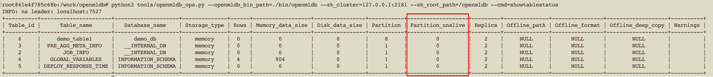

# Operation and Maintenance Command Status

After executing various maintenance operations, you can monitor the outcomes of these operations, along with the current health status of the database, through a series of commonly used command combinations. By sequentially running the `showopstatus` and `showtablestatus` commands, you can ultimately verify the successful completion of the relevant maintenance tasks.

## Step 1: View Command Status `showopstatus`

The `showopstatus` command serves the purpose of observing the execution status of specific maintenance commands. The current NS client supports this command to track the status of maintenance commands like `addreplica`, `delreplica`, `migrate`, `offlineendpoint`, `recoverendpoint`, `changeleader`, and `recovertable`. For a comprehensive understanding of these supported maintenance commands, refer to the [Operations CLI](https://chat.openai.com/cli.md) document.

You can monitor the status of relevant commands by utilizing the `showopstatus` command of the [OpenMLDB Operations Tool](https://chat.openai.com/openmldb_ops.md) `openmldb_ops.py`, as shown in the example below:

```bash
python tools/openmldb_ops.py --openmldb_bin_path=./bin/openmldb --zk_cluster=127.0.0.1:2181 --zk_root_path=/openmldb --cmd=showopstatus
```

Due to the asynchronous nature of maintenance command execution, you might need to run the `showopstatus` command multiple times to confirm the final state. The state transitions for related commands can occur in three stages:

1. kInited => kDoing => kDone: Indicates successful command execution.
2. kInited => kDoing => kFailed: Denotes a failed command execution.
3. kInited => kCancelled: This state may arise after manually executing the `cancelop` command.

Once the command running status changes to `kDone`, it signifies successful execution of relevant commands. You can then proceed to the subsequent steps and use the `showtablestatus` command to inspect the status of tables.

## Step 2: View Table Status `showtablestatus`

After successfully executing the relevant maintenance commands, it's crucial to perform an additional verification to identify any anomalies in the table status. This verification can be conducted using the `showtablestatus` command within the [OpenMLDB Operations and Maintenance Tool](https://chat.openai.com/openmldb_ops.md). For instance:

```bash
python tools/openmldb_ops.py --openmldb_bin_path=./bin/openmldb --zk_cluster=127.0.0.1:2181 --zk_root_path=/openmldb --cmd=showtablestatus
```

Upon execution, this command will generate a series of table-related information. Of particular importance is the column labeled `Partition_unalive`. If this column's value is 0, it signifies that the table is in a normal state. Conversely, any non-zero value indicates the presence of an anomaly, as illustrated in the following example:


