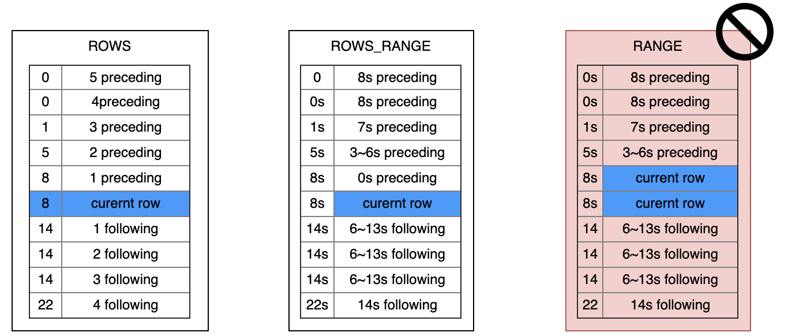

# WINDOW Clause

## Syntax

```yacc
window_clause:
  WINDOW named_window_expression [, ...]

named_window_expression:
  named_window AS { named_window | ( window_specification ) }

window_specification:
  [ UNION ( from_item [, ...] ) ]
  PARTITION BY expression [ ORDER BY ordering_expression ]
  window_frame_clause [ window_attr [, ...] ]

window_frame_clause:
  frame_units BETWEEN frame_bound AND frame_bound [ MAXSIZE numeric_expression ] )

frame_unit:
  ROWS 
  | ROWS_RANGE

frame_boud:
  { UNBOUNDED | numeric_expression | interval_expression } [ OPEN ] PRECEDING
  | CURRENT ROW

window_attr:
  EXCLUDE CURRENT_TIME
  | EXCLUDE CURRENT_ROW
  | INSTANCE_NOT_IN_WINDOW
```

*Window function* is similar to aggregate functions. The difference is that the window function does not need to pack the query results into a single line when output the results. Instead, each line is separated when using WINDOW clause. 
However, the window function can scan all rows that may be part of the current row's group, depending on the grouping specification of the window function (the `PARTITION BY` on columns).
The syntax for calling a function over a window is shown bellow:

```
function_name ([expression [, expression ... ]]) OVER ( window_definition )
function_name ([expression [, expression ... ]]) OVER window_name
function_name ( * ) OVER ( window_definition )
function_name ( * ) OVER window_name
```

## SQL Statement Template

- ROWS WINDOW SQL template

```sqlite
SELECT select_expr [, select_expr ...], window_function_name(expr) OVER window_name, ... FROM ... WINDOW AS window_name (PARTITION BY ... ORDER BY ... ROWS BETWEEN ... AND ...)

```

- ROWS RANGE WINDOW SQL Template

```sql
SELECT select_expr [,select_expr...], window_function_name(expr) OVER window_name, ... FROM ... WINDOW AS window_name (PARTITION BY ... ORDER BY ... ROWS_RANEG BETWEEN ... AND ...)
```

## Getting Started

First, choose the window type—time-based or count-based.

Next, determine the desired size for the window. The window types are explained below:

1. **Time Window:** Time windows typically use time units such as s, m, h, d, etc. If no unit is specified, the default is ms. For example:
   - [3 hours ago, current row] - 3h preceding and current row
   - [3 hours ago, 30 minutes ago] - 3h preceding and 30m preceding

2. **Row Window:** The number of rows does not require a unit. For example:
   - [10 rows, current row] - 10 preceding and current row
   - [10 rows, 3 rows] - 10 preceding and 3 preceding

### How to Infer a Window?

First, clarify the execution mode:

- Batch mode: Offline mode or online preview mode, collectively referred to as batch mode. In this mode, window partitioning and calculations are performed for each row of the FROM table. Therefore, each row corresponds to one SQL result.
- Request mode: A request mode brings one request row, treating it as the data from the FROM table. Only window partitioning and calculations are performed for this row, resulting in a single SQL result. Note that the request row is not inserted into the table.

Batch mode is considered as multiple instances of request mode. Therefore, the window partitioning for request mode queries is divided into three segments:

- For a single request row, the window **may only** include itself and rows with equal partition key values.
  
- All rows with equal partition key values are not randomly ordered but sorted by the **ORDER BY columns.**

- Exclude data outside the window range based on rows/rows_range.
  - For example, in a row window with 10 preceding and current row, data rows beyond the first 10 rows (including the current row) are discarded. As it includes the current row, the window consists of a total of 11 rows.
  - For rows_range, like 10s preceding and current row for a time window, data rows beyond the first 10 seconds (including the current row) are discarded. This also includes the current row, resulting in a window of data rows with order key values in the range `[current_row_order_key - 10s, current_row_order_key]`.

```{note}
The window partitioning range is only related to the ORDER BY columns. If the number of rows in the window or specific data does not match the expected range, it is generally due to a misunderstanding of the window syntax, with a very low probability of calculation errors by the SQL engine. To troubleshoot:
- Extract all data with the same key using `SELECT * FROM table WHERE partition_key = xxx` or use the source data file and tools like pandas/spark.
- Sort the data by the ORDER BY columns, similar to setting an unbounded preceding and current row window. Compare the manually processed data with the results of OpenMLDB's unbounded window calculations.
  - Since OpenMLDB only supports aggregation within the window, it is difficult to see the full picture of the window data. Usually, count/min/max/lag functions are used to measure the quantity and range of data within the window.
  - If you still need to confirm with specific data within the window, use top to display the top k values, but note that it will re-sort the columns and cannot be equated with the window sorting (ORDER BY columns sorting). For other aggregation functions, refer to [UDF functions](../udfs_8h.md).
- Finally, check if the rows/rows_range settings of the window meet expectations.
  - In most cases, if the first two steps are correct, there should be no issues with row partitioning.
  - For time partitioning, pay attention to the time unit. OpenMLDB supports using time units in the window settings, but it will not make any assumptions about the order by column values in the table. For example, if the order by column is not a timestamp but an integer `20230905`, and a time window of 5ms is set, the window range is `[20230905 - 5, 20230905]`, not `[20230905 00:00:00 - 5ms, 20230905]`. **Exercise caution with order by columns. The most convenient approach is to convert any time format to a timestamp or an integer in milliseconds**.
```

* Preceding is a closed interval, including the specified row. To use an open interval, open preceding should be used.

Windows can also exclude current time, current row, etc., as explained later.

## Boundary Explanation

| `SELECT` Statement Elements                            | Offline Mode | Online Preview Mode | Online Request Mode | Note                                                                                                                                                                                                                                                                                                                                                                                      |
|:-------------------------------------------------------|--------------|---------------------|---------------------|:------------------------------------------------------------------------------------------------------------------------------------------------------------------------------------------------------------------------------------------------------------------------------------------------------------------------------------------------------------------------------------------|
| WINDOW Clause                                          | **``✓``**    |   **``✓(since 0.6.4)``**  | **``✓``**           | The window clause is used to define one or several windows. Windows can be named or anonymous. Users can call aggregate functions on the window to perform analysis (```sql agg_func() over window_name```). For Online Request Mode, please follow the [specification of WINDOW Clause under Online Request](../deployment_manage/ONLINE_REQUEST_REQUIREMENTS.md#specifications-of-window-under-online-request-mode
) |

## Basic WINDOW SPEC Syntax Elements

### Window Partition Clause And Window OrderBy Clause

```sql
WindowPartitionClause
        ::= ( 'PARTITION' 'BY' ByList )

WindowOrderByClause
        ::= ( 'ORDER' 'BY' ByList )
```

The `PARTITION BY` option groups the rows of the query into *partitions*, which are processed separately in the window function. `PARTITION BY` and the query level `GROUP BY` clause do similar work, except that its expressions can only be used as expressions and not as output column names or numbers. OpenMLDB requires that `PARTITION BY` must be configured. And currently **only supports grouping by column**, cannot support grouping by operation and function expression.

The `ORDER BY` option determines the order in which rows within a partition are processed by window functions. It performs a similar function to the `ORDER BY` clause at the query level. The `ORDER BY` in the window function cannot be used as an output column or output column ID. Currently, OpenMLDB only supports sorting by columns. The `ORDER BY` list must have exactly one column, and sorting by expressions or function expressions is not supported. Starting from **OpenMLDB 0.8.4**, in online mode, the `ORDER BY` clause can be omitted (offline mode does not support this for now), indicating that the columns within the window will be processed in an indeterminate order. Windows without an `ORDER BY` clause need to satisfy the following additional conditions:

1. It cannot have `EXCLUDE CURRENT_TIME`.
2. For ROWS-type windows, there are no additional restrictions. For ROWS_RANGE-type windows:
   1. The window frame boundaries cannot be in the format `offset [OPEN] PRECEDING/FOLLOWING`. Currently, the situation can only be `UNBOUNDED PRECEDING AND CURRENT ROW`.

```{note}
For windows without the ORDER BY clause, the calculation results are indeterminate for online preview mode. It is impossible to predict which rows go into the window and which rows do not. Also, for some common window functions, such as `lag, first_value`, the calculation results are indeterminate in all modes. The order of rows within the window cannot be predicted.
```

### Window Frame Clause

```
WindowFrameClause
        ::= ( WindowFrameUnits WindowFrameBounds [WindowFrameMaxSize] )

WindowFrameUnits
        ::= 'ROWS'
          | 'ROWS_RANGE'

WindowFrameBounds
        ::= 'BETWEEN' WindowFrameBound 'AND' WindowFrameBound

WindowFrameBound
        ::= ( 'UNBOUNDED' | NumLiteral | IntervalLiteral ) ['OPEN'] 'PRECEDING'
          | 'CURRENT' 'ROW'
```

In three parts:
1. WindowFrameUnits: window type
2. WindowFrameBounds: lower and upper bound
3. WindowFrameMaxSize (Optional) refer [Window With MAXSIZE](#4.-window-with-maxsize)

#### Window Frame Units

WindowFrameUnits defines the frame type of the window. OpenMLDB supports two types of window frames: ROWS and ROWS_RANGE

The SQL standard RANGE class window OpenMLDB system does not currently support it. Their direct comparison differences are shown in the figure below



- ROWS: The window is drawn into the window by rows, and the window is slid out according to the number of rows
- ROWS_RANGE: The window is drawn into the window by rows, and slides out of the window according to the time interval
- RANGE: The window is divided into the window according to the time granularity (may slide in multiple data rows at the same time at a time), and slide out of the window according to the time interval

#### Window Frame Bounds

 **WindowFrameBounds** defines the upper and lower bounds of a window.

- `CURRENT ROW` is the row currently being computed.
- `UNBOUNDED PRECEDING` indicates the upper bound of this window is unlimited.
- `expr PRECEDING`
  - When the window is `ROWS` type, `expr` must be a positive integer, which indicates the upper boundary is the `expr`th row before current row.
  - When the window type is `ROWS_RANGE`,`expr` should be a time interval, like `10s`, `10m`,`10h`, `10d`. The upper bound is the `expr` ahead of the time of current row.
- By default, OpenMLDB uses closed interval. To change this, you can use keyword `OPEN`.
- Please note that, standard SQL also supports `FOLLOWING` keyword, but OpenMLDB doesn't support it currently.

#### Examples

- **Named Window**

```SQL
SELECT sum(col2) OVER w1 as w1_col2_sum FROM t1
WINDOW w1 AS (PARTITION BY col1 ORDER BY col5 ROWS BETWEEN 3 PRECEDING AND CURRENT ROW)
```

- **Anonymous Window**

```SQL
SELECT id, pk1, col1, std_ts,
sum(col1) OVER (PARTITION BY pk1 ORDER BY std_ts ROWS BETWEEN 1 PRECEDING AND CURRENT ROW) as w1_col1_sum
from t1;
```

- **ROWS Window**

The following `WINDOW` clause defines a `ROWS` window containing preceding 1000 rows and current row. The window will contain a maximum of 1001 rows.
```SQL
SELECT sum(col2) OVER w1 as w1_col2_sum FROM t1
WINDOW w1 AS (PARTITION BY col1 ORDER BY col5 ROWS BETWEEN 1000 PRECEDING AND CURRENT ROW);
```

- **ROWS_RANGE Window**

The following `WINDOW` clause defines a `ROWS_RANGE` window containing preceding 10s rows and current row.
```SQL
SELECT sum(col2) OVER w1 as w1_col2_sum FROM t1
WINDOW w1 AS (PARTITION BY col1 ORDER BY col5 ROWS_RANGE BETWEEN 10s PRECEDING AND CURRENT ROW);
```

## WindowSpec Elements Specifically Designed by OpenMLDB

### 1. WINDOW ... UNION

```sql
WindowUnionClause
        :: = ( 'UNION' TableRefs)
```

#### Example
- **Window with `UNION` On 2 Tables**

```SQL
SELECT col1, col5, sum(col2) OVER w1 as w1_col2_sum FROM t1
WINDOW w1 AS (UNION t2 PARTITION BY col1 ORDER BY col5 ROWS_RANGE BETWEEN 10s PRECEDING AND CURRENT ROW);
```


- **Window with `UNION` on Multiple Tables**

```SQL
SELECT col1, col5, sum(col2) OVER w1 as w1_col2_sum FROM t1
WINDOW w1 AS (UNION t2, t3 PARTITION BY col1 ORDER BY col5 ROWS_RANGE BETWEEN 10s PRECEDING AND CURRENT ROW);
```


- **Window with `UNION` and `INSTANCE_NOT_IN_WINDOW`**

Using `INSTANCE_NOT_IN_WINDOW` to modify the window, other rows in the sample table except the current row are not included in the window calculation.

```SQL
SELECT col1, col5, sum(col2) OVER w1 as w1_col2_sum FROM t1
WINDOW w1 AS (UNION t2 PARTITION BY col1 ORDER BY col5 ROWS_RANGE BETWEEN 10s PRECEDING AND CURRENT ROW INSTANCE_NOT_IN_WINDOW);
```


- **Window with `UNION` Containing Subquery**

```SQL
SELECT col1, col5, sum(col2) OVER w1 as w1_col2_sum FROM t1
WINDOW w1 AS
(UNION (select c1 as col1, c2 as col2, 0.0 as col3, 0.0 as col4, c5 as col5, "NA" as col6 from t2),
(select c1 as col1, c2 as col2, 0.0 as col3, 0.0 as col4, c5 as col5, "NA" as col6 from t3)
PARTITION BY col1 ORDER BY col5 ROWS_RANGE BETWEEN 10s PRECEDING AND CURRENT ROW);
```

### 2. Window with EXCLUDE CURRENT_TIME

Only rows whose `timestamp` values are different to `CURRENT ROW` will be included in the window.

```
WindowExcludeCurrentTime 
        ::= 'EXCLUDE' 'CURRENT_TIME'  
```
#### Example
- **ROWS Window with EXCLUDE CURRENT_TIME**

The following `WINDOW` clause defines a `ROWS` window containing preceding 1000 rows and current row. Any other rows in the window will not have the same time as the `CURRENT ROW`.

```SQL
SELECT sum(col2) OVER w1 as w1_col2_sum FROM t1
WINDOW w1 AS (PARTITION BY col1 ORDER BY col5 ROWS BETWEEN 1000 PRECEDING AND CURRENT ROW EXCLUDE CURRENT_TIME);
```

- **ROWS_RANGE Window with EXCLUDE CURRENT_TIME**

The following `WINDOW` clause defines a `ROWS_RANGE` window containing preceding 10s rows and current row. Any other rows in the window will not have the same time as the `CURRENT ROW`.

```SQL
SELECT sum(col2) OVER w1 as w1_col2_sum FROM t1
WINDOW w1 AS (PARTITION BY col1 ORDER BY col5 ROWS_RANGE BETWEEN 10s PRECEDING AND CURRENT ROW EXCLUDE CURRENT_TIME);
```


### 3. WINDOW with EXCLUDE CURRENT_ROW

Current row do not go into window.

```
WindowExcludeCurrentRow
        ::= 'EXCLUDE' 'CURRENT_ROW'
```

#### Example
- **ROWS_RANGE Window with EXCLUDE CURRENT_ROW**

```sql
SELECT sum(col2) OVER w1 as w1_col2_sum FROM t1
WINDOW w1 AS (PARTITION BY col1 ORDER BY col5 ROWS_RANGE BETWEEN 10s PRECEDING AND CURRENT ROW EXCLUDE CURRENT_ROW);
```
  

### 4. WINDOW with MAXSIZE

The keyword `MAXSIZE` is used to limit the number of rows in the window.

The `MaxSize` property is only supported for windows of type `ROWS_RANGE`.

```sql
WindowFrameMaxSize
        :: = MAXSIZE NumLiteral
```


#### Example
- **ROWS_RANGE Window with MAXSIZE**

The following `WINDOW` clause defines a `ROWS_RANGE` window containing preceding 10s rows and current row. There are at most 3 rows in the window.
```sql
SELECT sum(col2) OVER w1 as w1_col2_sum FROM t1
WINDOW w1 AS (PARTITION BY col1 ORDER BY col5 ROWS_RANGE BETWEEN 10s PRECEDING AND CURRENT ROW MAXSIZE 3);
```

```{seealso}
Please refer to [Built-in Functions](../udfs_8h.md) for aggregate functions that can be used in window computation.
````
