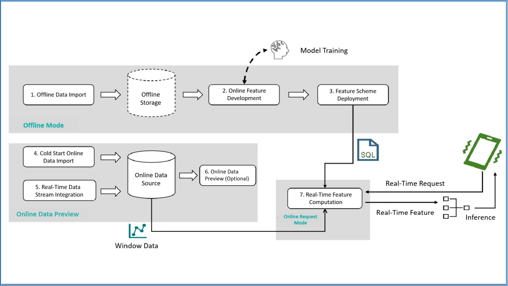

# Workflow and Execution Modes 

OpenMLDB supports different execution modes at different stages of the feature engineering development process. This article will introduce the process of using OpenMLDB for feature engineering development and deployment, as well as the different execution modes used in the process.

## Workflow Overview 

The following diagram illustrates the typical process of using OpenMLDB for feature engineering development and deployment, as well as the execution modes used in the process:

1. Offline Data Import: Import offline data for offline feature engineering development and debugging.
2. Offline Feature Development: Develop feature engineering scripts and debug them until satisfactory results are achieved. This step involves joint debugging of machine learning models (such as XGBoost, LightGBM, etc.), but this article mainly focuses on feature engineering development related to OpenMLDB.
3. Feature Scheme Deployment: Deploy the feature scripts after satisfactory results are achieved.
4. Cold Start Online Data Import: Before official deployment, it is necessary to import the data within the required window for the online storage engine. For example, if the feature scheme involves feature aggregation calculations for data in the past three months, the previous three months' data needs to be imported for cold start.
5. Real-time Data Access: After the system is deployed, the latest data needs to be collected to maintain the window calculation logic, so real-time data access is required.
6. Online Data Preview (optional): Preview and check online data using supported SQL commands. This step is not mandatory.
7. Real-time Feature Calculation: After the feature scheme is deployed and the data is correctly accessed, a real-time feature calculation service that can respond to online requests will be obtained.

## Overview of Execution Mode

As the data objects for offline and online scenarios are different, their underlying storage and computing nodes are also different. Therefore, OpenMLDB provides several built-in execution modes to support the above steps. The following table summarizes the execution modes and development tools used for each step, and three execution modes will be discussed in detail later.

| Steps                          | Execution Mode      | Development Tool                                             |
| ------------------------------ | ------------------- | ------------------------------------------------------------ |
| 1. Offline Data Import         | Offline Mode        | OpenMLDB CLI, SDKs                                           |
| 2. Offline Feature Development    | Offline Mode        | OpenMLDB CLI, SDKs                                           |
| 3. Feature Deployment             | Offline Mode        | OpenMLDB CLI, SDKs                                           |
| 4. Cold Start Online Data Import  | Online Preview Mode | OpenMLDB CLI, SDKs, [Data Import Tool](../../tutorial/data_import.md) |
| 5. Real-time Data Integration     | Online Preview Mode | Connectors, SDKs                                             |
| 6. Online Data Preview (optional) | Online Preview Mode | OpenMLDB CLI, SDKs, [Data Export Tool](../../tutorial/data_export.md) |
| 7. Real-time Feature Calculation  | Online Request Mode | CLI (REST APIs), SDKs                                        |

### Offline Mode

After starting OpenMLDB CLI, the **default mode is offline mode**. Offline data import, offline feature development, and feature deployment are all executed in offline mode. The purpose of offline mode is to manage and compute offline data. The computing nodes involved are supported by [OpenMLDB Spark Distribution](../../tutorial/openmldbspark_distribution.md) optimized for feature engineering, and the storage nodes support commonly used storage systems such as HDFS.

Offline mode has the following main features:

- The offline mode supports most of the SQL syntax provided by OpenMLDB, including complex SQL syntax such as `LAST JOIN` and `WINDOW UNION`.
- In offline mode, some SQL commands are executed asynchronously, such as `LOAD DATA`, `SELECT`, and `SELECT INTO`. Other SQL commands are executed synchronously.
- The asynchronous SQL is managed by the internal TaskManager and can be viewed and managed through commands such as `SHOW JOBS`, `SHOW JOB`, and `STOP JOB`.

:::{tip}
Unlike many relational database systems, the `SELECT` command in offline mode is executed asynchronously by default. If you need to set it to synchronous execution, refer to setting the command to run synchronously in offline mode. During offline feature development, if asynchronous execution is used, it is strongly recommended to use the `SELECT INTO` statement for development and debugging, which can export the results to a file for easy viewing.
:::

The `DEPLOY` command for feature deployment is also executed in offline mode. Its specification can refer to the [OpenMLDB SQL online specification and requirements](../../openmldb_sql/deployment_manage/ONLINE_REQUEST_REQUIREMENTS.md).

Offline mode setting command (OpenMLDB CLI): `SET @@execute_mode='offline'`.

### Online Preview Mode

Cold start online data import, real-time data access, and online data preview are executed in online preview mode. The purpose of the online preview mode is to manage and preview online data. Storage and computation of online data are supported by the tablet component.

The main features of the online preview mode are:

- `LOAD DATA`, used for online data import, can be done either locally (load_mode='local') or on the cluster (load_mode='cluster'). Local import is synchronous, while cluster import is asynchronous (same as in offline mode). Other operations are synchronous.
- Online preview mode is mainly used for previewing limited data. Selecting and viewing data directly through SELECT in OpenMLDB CLI or SDKs may result in data truncation. If the data volume is large, it is recommended to use an [export tool](../../tutorial/data_export.html) to view the complete data.
- SELECT statements in online preview mode currently do not support more complex queries such as `LAST JOIN` and `ORDER BY`. Refer to [SELECT](../../openmldb_sql/dql/SELECT_STATEMENT.html).
- The server in the online preview mode executes SQL statements on a single thread. For large data processing, it may be slow and may trigger a timeout. To increase the timeout period, the `--request_timeout` can be configured on the client.
- To prevent impact on online services, you can limit the maximum number of accessed records and the number of different keys in online preview mode. This can be configured using `--max_traverse_cnt` and `--max_traverse_key_cnt`. Similarly, the maximum result size can be set using `--scan_max_bytes_size`. For detailed configuration, refer to the [configuration file](../../deploy/conf.md).

The command for setting online preview mode in OpenMLDB CLI: `SET @@execute_mode='online'`

### Online Request Mode

After deploying feature scripts and accessing online data, the real-time feature computing service is ready to use, and real-time feature extraction can be performed through the online request mode. REST APIs and SDKs support the online request mode. The online request mode is a unique mode in OpenMLDB that supports real-time online computing and is very different from common SQL queries in databases.

The online request mode requires three inputs:

1. SQL feature script, which is the SQL script used in the feature deployment and online process, specifying the calculation logic for feature extraction.
2. Online data, which is the online data that has been imported during cold start or in real-time. Generally, it is the latest data for window computing in conjunction with SQL. For example, if the aggregation function in the SQL script defines a time window of the latest three months, then the online storage needs to retain the corresponding latest three months of data.
3. Real-time request row, which includes the current real-time behavior and is used for real-time feature extraction. For example, credit card information in anti-fraud scenarios or search keywords in recommendation scenarios.

Based on the above inputs, for each real-time request row, the online request mode will return a feature extraction result. The computing logic is as follows: The request row is virtually inserted into the correct position of the online data table based on the logic in the SQL script (such as `PARTITION BY`, `ORDER BY`, etc.), and then only the feature aggregation computing is performed on that row, returning the unique corresponding extraction result. The following diagram intuitively explains the operation process of the online request mode.

Online request mode is supported in the following ways:

- OpenMLDB CLI: Not supported

- [REST API](https://openmldb.ai/docs/zh/main/quickstart/sdk/rest_api.html): Supports requests for single or multiple request rows

- [Java SDK](https://openmldb.ai/docs/zh/main/quickstart/sdk/java_sdk.html): Supports requests for single or multiple request rows

- [Python SDK](https://openmldb.ai/docs/zh/main/quickstart/sdk/python_sdk.html): Only supports requests for a single request row

- [C++ SDK](https://openmldb.ai/docs/zh/main/quickstart/sdk/cxx_sdk.html): Only supports requests for a single request row
