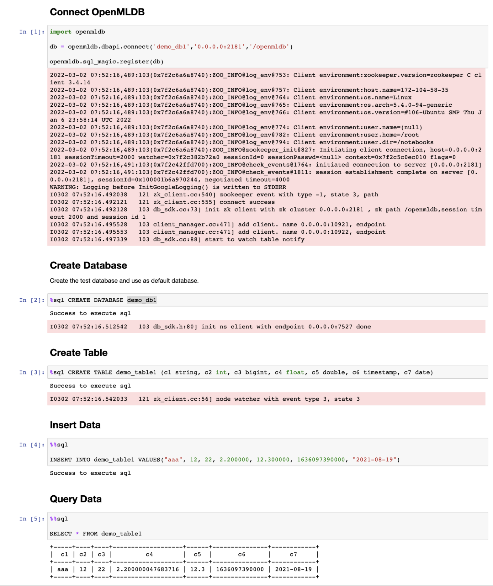

# Python SDK

The default execution mode is Online.

## Python SDK Installation

Execute the following command to install Python SDK:

```bash
pip install openmldb
```

## OpenMLDB DBAPI

This section demonstrates the basic use of the OpenMLDB DB API. For all DBAPI interfaces, if an execution fails, it will raise a `DatabaseError` exception. Users can catch this exception and handle it as needed. The return value is a `Cursor`. For DDL SQL, you do not need to handle the return value. For other SQL statements, you can refer to the specific examples below for how to handle the return value.

### Create Connection

Parameter `db_name` name must exist, and the database must be created before the connection is created. To continue, create a connection without a database and then use the database db through the `execute ("USE<db>")` command.

```python
import openmldb.dbapi
db = openmldb.dbapi.connect(zk="$zkcluster", zkPath="$zkpath")
# You can set the username and password as follows. If no username is set, it defaults to 'root', and the password defaults to being empty
# db = openmldb.dbapi.connect(zk="$zkcluster", zkPath="$zkpath", user="$user", password="$password")
cursor = db.cursor()
```

#### Configuration Details

Zk and zkPath configurations are required.

The Python SDK can be used through OpenMLDB DBAPI/SQLAlchemy. The optional configurations are basically the same as those of the Java client. Please refer to the [Java SDK configuration](./java_sdk.md#sdk-configuration-details) for details.

### Create Database

Create database `db1`:

```python
cursor.execute("CREATE DATABASE db1")
cursor.execute("USE db1")
```

### Create Table

Create table `t1`:

```python
cursor.execute("CREATE TABLE t1 (col1 bigint, col2 date, col3 string, col4 string, col5 int, index(key=col3, ts=col1))")
```

### Insert Data into Table

Insert one sentence of data into the table:

```python
cursor.execute("INSERT INTO t1 VALUES(1000, '2020-12-25', 'guangdon', 'shenzhen', 1)")
```

### Execute SQL Query

```python
result = cursor.execute("SELECT * FROM t1")
print(result.fetchone())
print(result.fetchmany(10))
print(result.fetchall())
```

### SQL Batch Query

```python
#In the Batch Request mode, the input parameters of the interface are "SQL", "Common_Columns", "Request_Columns"
result = cursor.batch_row_request("SELECT * FROM t1", ["col1","col2"], ({"col1": 2000, "col2": '2020-12-22', "col3": 'fujian', "col4":'xiamen', "col5": 2}))
print(result.fetchone())
```
### Execute Deployment

Please note that the execution of deployments is only supported by DBAPI, and there is no equivalent interface in OpenMLDB SQLAlchemy. Additionally, deployment execution supports single requests only and does not support batch requests.

```python
cursor.execute("DEPLOY d1 SELECT col1 FROM t1")
# dict style
result = cursor.callproc("d1", {"col1": 1000, "col2": None, "col3": None, "col4": None, "col5": None})
print(result.fetchall())
# tuple style
result = cursor.callproc("d1", (1001, "2023-07-20", "abc", "def", 1))
print(result.fetchall())
# drop deployment before drop table
cursor.execute("DROP DEPLOYMENT d1")
```

### Delete Table

Delete table `t1`:

```python
cursor.execute("DROP TABLE t1")
```

### Delete Database

Delete database `db1`:

```python
cursor.execute("DROP DATABASE db1")
```

### Close Connection

```python
cursor.close()
```

## OpenMLDB SQLAlchemy

This section demonstrates the use of the Python SDK through OpenMLDB SQLAlchemy. Similarly, if any of the DBAPI interfaces fail, they will raise a `DatabaseError` exception. Users can catch and handle this exception as needed. The handling of return values should follow the SQLAlchemy standard.

The integrated SQLAlchemy defaults to version 2.0 while remaining compatible with the old version 1.4. If a user's SQLAlchemy version is 1.4, they can adjust the interface names according to the [version differences](python_sdk.md#sqlalchemy-version-differences). OpenMLDB SDK only supports version 1.4 in version 0.8.5 and before. Starting from version 0.8.5 (excluding 0.8.5), it begins to support version 2.0.

### Create Connection

```python
create_engine('openmldb:///db_name?zk=zkcluster&zkPath=zkpath')
```

Parameter `db_name` must exist, and the database must be created before the connection is created. First, create a connection without a database, and then use the database `db` through the `execute ("USE<db>")` command.

```python
import sqlalchemy as db
engine = db.create_engine('openmldb:///?zk=127.0.0.1:2181&zkPath=/openmldb')
# You can set the username and password as follows.
# create_engine('openmldb:///db_name?zk=zkcluster&zkPath=zkpath&user=root&password=123456')
connection = engine.connect()
```

### Create Database

Use the `connection.exec_driver_sql()` interface to create database `db1`:

```python
try:
    connection.exec_driver_sql("CREATE DATABASE db1")
except Exception as e:
    print(e)

connection.exec_driver_sql("USE db1")
```

### Create Table

Use the `connection.exec_driver_sql()` interface to create table `t1`:

```python
try:
    connection.exec_driver_sql("CREATE TABLE t1 ( col1 bigint, col2 date, col3 string, col4 string, col5 int, index(key=col3, ts=col1))")
except Exception as e:
    print(e)
```

### Insert Data into Table

Use the `connection.exec_driver_sql (ddl)` interface to execute the SQL insert statement, and you can insert data into the table:

```python
try:
    connection.exec_driver_sql("INSERT INTO t1 VALUES(1000, '2020-12-25', 'guangdon', 'shenzhen', 1);")
except Exception as e:
    print(e)
```

Use the `connection.exec_driver_sql (ddl, data)` interface to execute the insert statement of SQL with placeholder. You can specify the insert data dynamically or insert multiple rows:

```python
try:
    insert = "INSERT INTO t1 VALUES(1002, '2020-12-27', ?, ?, 3);"
    connection.exec_driver_sql(insert, ({"col3":"fujian", "col4":"fuzhou"}))
    connection.exec_driver_sql(insert, [{"col3":"jiangsu", "col4":"nanjing"}, {"col3":"zhejiang", "col4":"hangzhou"}])
except Exception as e:
    print(e)
```

### Execute SQL Batch Query

Use the `connection.exec_driver_sql (sql)` interface to execute SQL batch query statements:

```python
try:
    rs = connection.exec_driver_sql("SELECT * FROM t1")
    for row in rs:
        print(row)
    rs = connection.exec_driver_sql("SELECT * FROM t1 WHERE col3 = ?;", tuple(['hefei']))
except Exception as e:
    print(e)
```

### Execute SQL Query

Use the `connection.exec_driver_sql (sql, request)` interface to execute the SQL request query. You can put the input data into the second parameter of the execute function:

```python
try:
    rs = connection.exec_driver_sql("SELECT * FROM t1", ({"col1":9999, "col2":'2020-12-27', "col3":'zhejiang', "col4":'hangzhou', "col5":100}))
except Exception as e:
    print(e)
```

### Delete Table

Use the `connection.exec_driver_sql (ddl)` interface to delete table `t1`:

```python
try:
    connection.exec_driver_sql("DROP TABLE t1")
except Exception as e:
    print(e)
```

### Delete Database

Use the connection.exec_driver_sql（ddl）interface to delete database `db1`:

```python
try:
    connection.exec_driver_sql("DROP DATABASE db1")
except Exception as e:
    print(e)
```

### SQLAlchemy Version Differences

Differences in Native SQL Usage: In SQLAlchemy 1.4, the method `connection.execute()` is used, while in SQLAlchemy 2.0, the method `connection.exec_driver_sql()` is used. The general differences between these two methods are as follows, for more details, refer to the official documentation.

```python
# DDL Example1 - [SQLAlchemy 1.4]
connection.execute("CREATE TABLE t1 (col1 bigint, col2 date)")
# DDL Example1 - [SQLAlchemy 2.0]
connection.exec_driver_sql("CREATE TABLE t1 (col1 bigint, col2 date)")

# Insert Example1 - [SQLAlchemy 1.4]
connection.execute("INSERT INTO t1 VALUES(1000, '2020-12-25');")
connection.execute("INSERT INTO t1 VALUES(?, ?);", ({"col1":1001, "col2":"2020-12-26"}))
connection.execute("INSERT INTO t1 VALUES(?, ?);", [{"col1":1002, "col2":"2020-12-27"}])
# Insert Example1 - [SQLAlchemy 2.0]
connection.exec_driver_sql("INSERT INTO t1 VALUES(1000, '2020-12-25');")
connection.exec_driver_sql("INSERT INTO t1 VALUES(?, ?);", ({"col1":1001, "col2":"2020-12-26"}))
connection.exec_driver_sql("INSERT INTO t1 VALUES(?, ?);", [{"col1":1002, "col2":"2020-12-27"}])

# Query Example1 - [SQLAlchemy 1.4] - Native SQL Query
connection.execute("select * from t1 where col3 = ?;", 'hefei') 
connection.execute("select * from t1 where col3 = ?;", ['hefei'])
connection.execute("select * from t1 where col3 = ?;", [('hefei')])
# Query Example1 - [SQLAlchemy 2.0] - Native SQL Query
connection.exec_driver_sql("select * from t1 where col3 = ?;", tuple(['hefei']))

# Query Example2 - [SQLAlchemy 1.4] - ORM Query
connection.execute(select([self.test_table]))
# Query Example2 - [SQLAlchemy 2.0] - ORM Query
connection.execute(select(self.test_table))

# Query Example3 - [SQLAlchemy 1.4] - SQL Request Query
connection.execute("SELECT * FROM t1", ({"col1":9999, "col2":'2020-12-28'}))
# Query Example3 - [SQLAlchemy 2.0] - SQL Request Query
connection.exec_driver_sql("SELECT * FROM t1", ({"col1":9999, "col2":'2020-12-28'}))

```

## Notebook Magic Function

The OpenMLDB Python SDK supports the expansion of Notebook magic function. Use the following statement to register the function.

```python
import openmldb
db = openmldb.dbapi.connect(database='demo_db',zk='0.0.0.0:2181',zkPath='/openmldb')
openmldb.sql_magic.register(db)
```

Then you can use line magic function `%sql` and block magic function `%%sql` in Notebook.



## A Complete Example

Refer to the [Python quickstart demo](https://github.com/4paradigm/OpenMLDB/tree/main/demo/python_quickstart/demo.py), which includes the above DBAPI and SQLAlchemy usage.

## Q&A

- **What do I do when error `ImportError：dlopen (.. _sql_router_sdk. so, 2): initializer function 0xnnnn not in mapped image for` appears when using SQLAlchemy?**

In addition to importing OpenMLDB, you may also have imported other third-party libraries, which may cause confusion in the loading order. Due to the complexity of the system, you can try to use the virtual env environment (such as conda) to avoid interference. In addition, import OpenMLDB before importing SQLAlchemy, and ensure that the two imports are in the first place.

If the error still occurs, it is recommended to connect to OpenMLDB by request http to connect to apiserver.

- **What do I do if Python SDK encounters the following problems?**

```plain
[libprotobuf FATAL /Users/runner/work/crossbow/crossbow/vcpkg/buildtrees/protobuf/src/23fa7edd52-3ba2225d30.clean/src/google/protobuf/stubs/common.cc:87] This program was compiled against version 3.6.1 of the Protocol Buffer runtime library, which is not compatible with the installed version (3.15.8).  Contact the program author for an update. ...
```

This problem may be due to the import of other versions of protobuf from other libraries. You can try to use the virtual env environment (such as conda).
