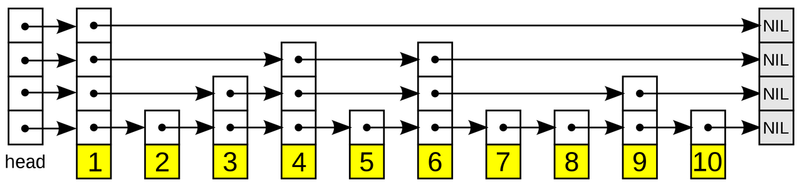
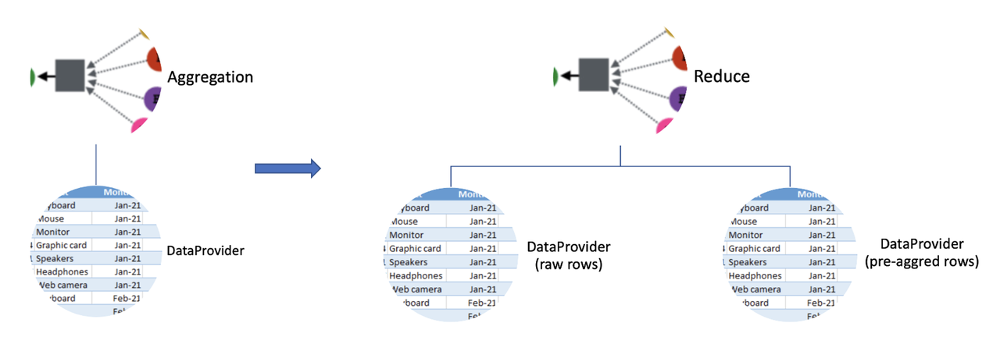
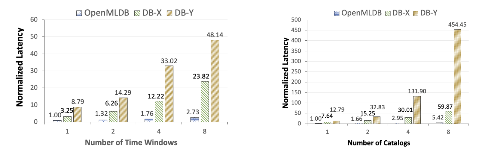
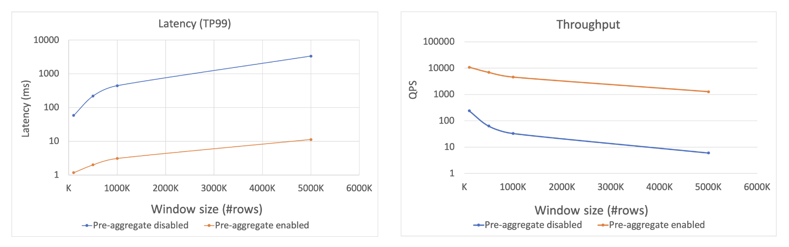

# Real-Time Engine Core Data Structure and Optimization Analysis

The [Real-Time Engine Performance Test Report](https://openmldb.feishu.cn/wiki/EXB5wI8M8iCquBkErJjcn6JVn0g) demonstrates that OpenMLDB's real-time SQL engine can achieve millisecond-level latency. This article provides an in-depth look at the core technical architecture responsible for achieving such low latency in real-time computing. The real-time engine relies on two key technologies: Double-layer skip list indexing (optimized for temporal data) and query pre-aggregation technology. This article offers a detailed exploration of these critical technologies.

## Background Introduction

OpenMLDB integrates two sets of SQL engines, one for batch processing and the other for real-time operations, catering to both offline development and online inference scenarios in machine learning while ensuring consistency between online and offline processes. The default memory-based real-time SQL engine has undergone extensive performance optimization, enabling it to achieve millisecond-level computation latency. This article delves into the internal architecture and optimization techniques of the real-time engine, focusing on two core optimization technologies:

1. **Double Layer Skip List:** This is a memory index data structure explicitly designed to optimize access to temporal data.
2. **Pre-aggregation Technology:** This technique enhances performance by reducing duplicate computations in scenarios involving large datasets within a time window.

## Double Layer Skip List Indexing

### Skip List

Skip lists were initially proposed by William Pugh in 1990 in their paper, [Skip Lists: A Probabilistic Alternative to Balanced Trees](https://15721.courses.cs.cmu.edu/spring2018/papers/08-oltpindexes1/pugh-skiplists-cacm1990.pdf). Skip lists employ a probabilistic balancing strategy instead of strict balancing strategy used in balanced trees. This approach significantly simplifies and speeds up element insertion and deletion compared to balanced trees. Skip lists can be considered an extension of the basic linked list data structure by introducing multi-level indexes to enable fast localization and lookup operations. They offer the flexibility of data management associated with linked lists, with data lookup and insertion having a time complexity of O(logn).



The image below (source: https://en.wikipedia.org/wiki/Skip_list) illustrates a skip list structure with a fourth-level index. Each value corresponds to a pointer array over the sorted data. When searching for a specific value, the process starts from the sparser top-level index, progressively moving down through the right and down pointer arrays within the index until the desired value is found. For an in-depth explanation of skip lists' operations and implementation, please refer to https://en.wikipedia.org/wiki/Skip_list.

Skip lists are employed in many open-source products as core data structures to achieve fast lookup and insertion operations. Examples include:

- Ordered sets in Redis (`zset`)
- `Memtable` in LevelDB, RocksDB, and HBase
- `TermDictionary` and `Posting List` in Apache Lucene

### Double Layer Skip List


In the development of machine learning applications, many features involve the computation of temporal windows. For instance, in anti-fraud scenarios, it's essential to calculate the total number of transactions and the average transaction amount for a specific card number within a recent period (e.g., three days). Real-time requirements, particularly in risk control, anti-fraud, and real-time recommendation scenarios, demand extremely low latency, typically less than 20 milliseconds, for feature computations. Accessing historical data of specific dimension values over a period of time with millisecond-level latency presents a technical challenge for such databases.

To efficiently access temporal data, OpenMLDB has implemented a distributed memory storage engine. It employs a core index data structure known as a double-layer skip list, which has been extended and optimized based on the skip list structure. Here's an overview:

```{image} images/core_data_structure/2.png
:alt: double-layer skip list
:class: bg-primary
:width: 600px
:align: center
```

This index structure maintains a double-layer skip list for each indexed column:

1. **First-Level Skip List:** The key here corresponds to the specific value of the index column, and the value is a pointer to the set of all rows associated with that key value. These rows are aggregated under the second-level skip list. This indexing is optimized for grouping operations, similar to `group by` operations in databases. It facilitates the rapid retrieval of all relevant records of a specific key value (e.g., a user) in a data table.
2. **Second-Level Skip List:** The key in this layer is typically a timestamp, and the value is the corresponding data row. These data rows are sorted in descending chronological order based on the timestamp. This level of skip list optimization is designed for aggregation computations within a specific time window, where efficiently discovering all data within the window is crucial.

Using this upper-level skip list structure, for time window aggregation computations, locating the corresponding key from the first-level skip list has a time complexity of `O(logn)`. Typically, when computing features, the time window is traced back from the current time. Therefore, since the second-level skip list is sorted backward by timestamp, it's sufficient to traverse the specified range of window data starting from the first node. If the backtracking doesn't begin from the current time, searching through has a time complexity of `O(logn)`. This double-layer skip list index structure is well-suited for time-window-based aggregation operations in feature engineering, offering a typical time complexity of approximately `O(logn)`.

## Pre-Aggregation

In some scenarios, such as portrait systems, temporal feature windows may span a considerable amount of data (e.g., spanning three years), referred to as "long window" features. Traditional real-time computation methods for long windows involve traversing all window data and performing complete aggregations, resulting in linearly increasing computation times as data volume grows, making it challenging to meet online performance requirements. Additionally, multiple adjacent feature computations often include duplicate calculations (window overlap), wasting computational resources.

To enhance the performance of long windows, Pre-Aggregation Technology has been introduced. By pre-aggregating certain feature results during data insertion, it's possible to compute most of the aggregated features instantly during online real-time feature computation. Compared to working with raw data, pre-aggregated data significantly reduces the amount of data to process and can achieve millisecond-level computation latency.

The pre-aggregation logic is shown in the following figure:


The pre-aggregation logic involves constructing multi-layer pre-aggregation tables based on the original data. For instance, the first layer of pre-aggregation may involve aggregating data at an hourly level, and the second layer can perform day-level pre-aggregation based on the first layer's results. When calculating a long window feature, pre-aggregated features from various layers are used, alongside real-time data, to accumulate aggregated features efficiently.

- The second layer of pre-aggregation features `aggr3`

- The first layer of pre-aggregation features `aggr2`and `aggr4`

- Real-time computation of raw data features `aggr1`and `aggr5`

Implementation of pre-aggregation technology involves two key components: pre-aggregation modules and SQL engine execution plan optimization. The pre-aggregation module handles pre-aggregation computations during data insertion, generating multi-layer pre-aggregation tables. SQL engine pre-aggregation optimization requires modifying the SQL plan based on pre-aggregation table information, prioritizing the use of pre-aggregation data to compute window aggregations. The following figure illustrates this:



The left side shows real-time computations without pre-aggregation, using raw data only, while the right side depicts an optimized SQL execution plan that leverages both raw and pre-aggregated data for efficient real-time feature computation.

## Performance

For specific performance testing details of OpenMLDB, please refer to the respective reference reports for comprehensive information. Below, we outline the primary test scenarios that were selected for presentation.

### Performance Comparison

As OpenMLDB is a memory-based temporal database, we initiated a comparative analysis with two widely used commercial-grade in-memory databases. We selected typical feature computation scripts related to temporal windows and assessed the performance differences among the three databases. The complexity of the queries, indicated by the number of time windows and the number of columns in the data table, was varied (with normalized latency values used for comparison). It's important to note that in this testing scenario, pre-aggregation optimization was not enabled, as the data level within the window was relatively low.

 

From the figure above, it's evident that OpenMLDB exhibits significant performance advantages over DB-X and DB-Y in typical feature extraction workloads. When queries become more complex, such as when the number of time windows or table columns increases to 8, OpenMLDB achieves substantial performance advantages of 1-2 orders of magnitude.

For detailed experiment configurations, datasets, and performance ratios, please refer to the VLDB publication linked below:

- Cheng Chen, et al. [Optimizing in-memory database engine for AI-powered on-line decision augmentation using persistent memory.](http://vldb.org/pvldb/vol14/p799-chen.pdf) International Conference on Very Large Data Bases (VLDB) 2021.

### Performance Improvement of Pre-Aggregation Technology

In cases where there is a substantial amount of data within the window, we investigated the performance improvements when pre-aggregation is enabled. A typical feature computation query based on temporal windows was designed to observe the impact of pre-aggregation optimization, both with and without, while varying the volume of data within the window.

 

As shown in the figure above, when the volume of data within the window reaches the million-level, enabling pre-aggregation technology results in improved latency and throughput. Without pre-aggregation technology, latency may reach the second-level range, while with pre-aggregation enabled, latency can be reduced to less than 10 milliseconds. Similarly, in terms of throughput performance, enabling pre-aggregation optimization significantly enhances throughput, achieving more than a two-order-of-magnitude improvement.
