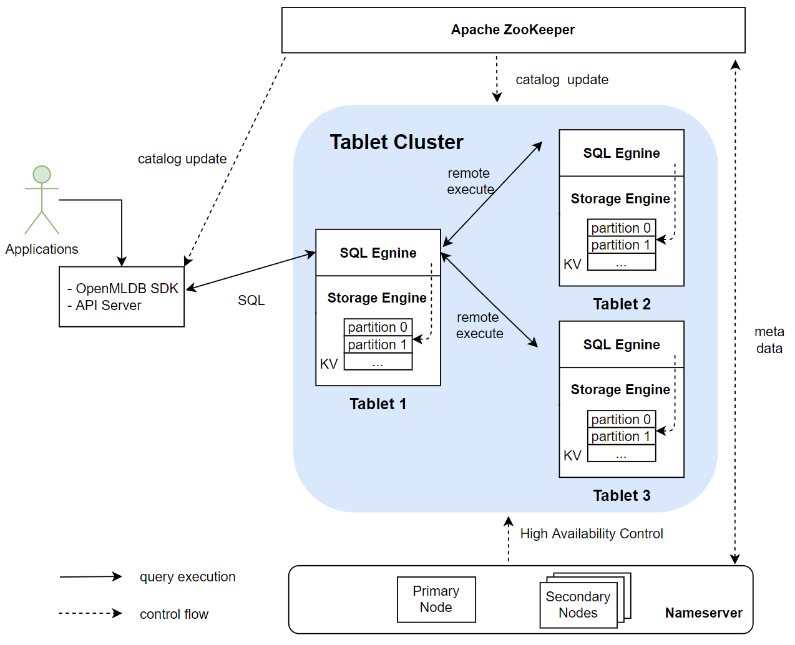
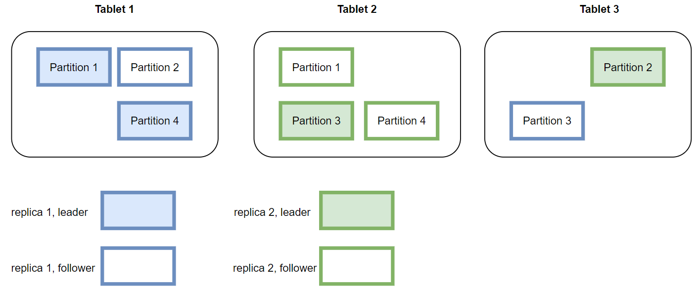
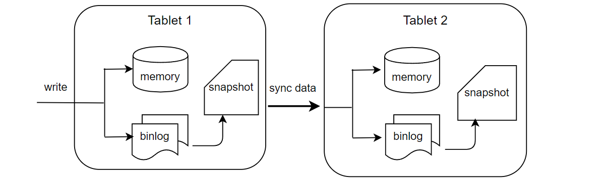

# Online Module Architecture

## 1. Overview

The main modules of OpenMLDB's online architecture include an Apache ZooKeeper, a nameserver cluster, and a tablet cluster. A tablet consists of a SQL engine and a storage engine. The following figure shows the relationships between these modules. Among them, tablets are the core modules of the entire OpenMLDB storage and computing, and they also consume more resources than other types of modules. ZooKeeper and nameserver are mainly used for auxiliary functions, such as metadata management and high availability. The function of each module will be described in detail below.

## 2. Apache ZooKeeper
OpenMLDB relies on ZooKeeper for service discovery and for the storage and management of metadata. ZooKeeper will interact with OpenMLDB SDK/API server, tablets and nameserver for distributing and updating metadata.

## 3. Nameserver
Nameserver is mainly used for tablet management and fail over. When a tablet node goes down, the nameserver will be triggered to execute a series of tasks to perform a failover. When the tablet node recovers, nameserver will reload the data into this node. In order to ensure the high availability of nameserver itself, multiple nameserver instances will be deployed at the same time with the primary/secondary node deployment mode. Only one primary node can exist at the same time. The primary node will be determined from multiple nameserver instances by preemption through ZooKeeper. If the current primary node unexpectedly goes offline, remaining secondary nodes will use ZooKeeper to elect a new primary node.

## 4. Tablets
Tablet is used by OpenMLDB to execute SQL and data storage. It is the core part of the entire OpenMLDB function implementation and the bottleneck of resource consumption. From the functional point of view, a tablet includes two modules: a SQL engine and a storage engine. Tablet is also the smallest configurable unit of OpenMLDB deployment resources. A tablet cannot be split across multiple physical nodes; however, there can be multiple tablets on a single physical node.

### 4.1 SQL Engine
The SQL engine is responsible for executing SQL queries. The execution process after the SQL engine receives the request of the SQL query is shown in the following figure:

The SQL engine parses SQL into an AST syntax tree through [ZetaSQL](https://github.com/4paradigm/zetasql). We have optimized the open source ZetaSQL to added special SQL syntax ( such as `LAST JOIN`, `WINDOW UNION`, etc) for feature engineering. After compiling, optimization, and LLVM-based codegen as shown in the figure above, the execution plan is finally generated. Then the SQL engine will access the storage layer data through the catalog and perform the final computation based on the execution plan. In the cluster version, a distributed execution plan will be generated, and the computation task will be sent to other tablet nodes to execute. Currently, the SQL engine  adopts the **push** mode, which distributes tasks to the nodes where the data is located for execution instead of pulling the data back. This has the benefit of reducing data transfers.

### 4.2 Storage Engine
The Storage engine is responsible for the storage of data and supports the corresponding high-availability-related functions.

:::{note}
OpenMLDB supports two kinds storage engines: memory-based and disk-based. This article introduces the memory storage engine which is self-developed especially for OpenMLDB. The disk storage engine is based on RocksDB and has the same mechanism. See [RocksDB](https://github.com/facebook/rocksdb) for details.
:::

#### Data Distribution
OpenMLDB cluster version is a distributed database. One table will be partitioned, and multiple copies will be created and finally distributed in different nodes. There are two important concepts: replicas and partitioning. 

- Replication: In order to ensure high availability and improve the efficiency of distributed queries, the data table will be stored in multiple copies, which are called replicas.

- Partition: When a table (or specifically a copy) is stored, it will be further divided into multiple partitions for distributed computing. The number of partitions can be specified when the table is created, but once created, the number of partitions cannot be dynamically modified. A partition is the smallest unit of leader-follower synchronization, expansion and contraction of a storage engine. A partition can be flexibly migrated between different tablets. At the same time, different partitions of a table can be computed in parallel, improving the performance of distributed computing. OpenMLDB will automatically try to balance the number of partitions on each tablet to improve the overall performance of the system. Multiple partitions of a table may be distributed on different tablets. Partitions are divided into primary partitions (leader) and secondary partition (followers). When a computing request is received, the request will be sent to the primary partition corresponding to the data for computation; the secondary partition is used to ensure high availability.

The figure below shows the storage layout of a data table on three tablets based on four partitions in the case of two replicas. In actual use, if the load of one or several tablets is too high, data migration can be performed based on partitioning to improve the load balance and overall throughput of the system.

#### Data Persistence and Leader-Follower Synchronization
In current version, the online data is all stored in memory. In order to achieve high availability, the data will be persisted to the disks in the form of binlog and snapshot.

As shown in the figure above, the server will write memory and binlog at the same time after receiving the write request from the SDK. Binlog is used for leader-follower synchronization. After the data is written to binlog, a background thread will asynchronously read the data from binlog and write it to follower nodes. After receiving the synchronization request, the follower will write memory and binlog as well. Snapshot can be regarded as a mirror of memory data, but for performance reasons, snapshot is not dumped from memory, but generated by merging binlog and the previous snapshot. Expired data will be deleted during the merging process. OpenMLDB will record the leader-follower synchronization and the offset merged into the snapshot. If all the data in a binlog file is synchronized to the followers and merged into the snapshot, the binlog file will be deleted by the background thread.

