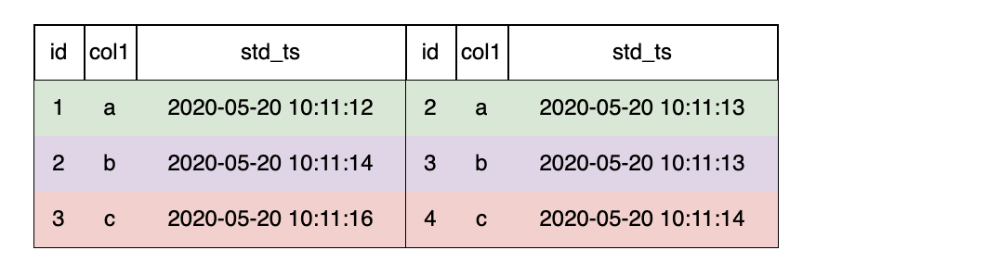

# JOIN Clause

OpenMLDB currently only supports `LAST JOIN`.

`LAST JOIN` can be seen as a special kind of `LEFT JOIN`. On the premise that the JOIN condition is met, each row of the left table is joined with the last row of the right table that meets the condition. There are two types of `LAST JOIN`: unsorted join and sorted join.

- The unsorted join will join two tables directly without sorting the right table.
- The sorted join will sort the right table first, and then join two tables.

Like `LEFT JOIN`, `LAST JOIN` returns all rows in the left table, even if there are no matched rows in the right table.
## Syntax

```
JoinClause
         ::= TableRef JoinType 'JOIN' TableRef [OrderClause] 'ON' Expression 
JoinType ::= 'LAST'       
```

## SQL Statement Template

```sql
SELECT ... FROM table_ref LAST JOIN table_ref ON expression;
```

## Description

| `SELECT` Statement Elements                                | Offline Mode | Online Preview Mode | Online Request Mode | Note                                                                                                                                                                                                                                                                                                         |
|:-----------------------------------------------------------|--------------|---------------------|---------------------|:-------------------------------------------------------------------------------------------------------------------------------------------------------------------------------------------------------------------------------------------------------------------------------------------------------------|
| JOIN Clause                | **``✓``**    | **``x``**           | **``✓``**           | The Join clause indicates that the data source comes from multiple joined tables. OpenMLDB currently only supports LAST JOIN. For Online Request Mode, please follow [the specification of LAST JOIN under Online Request Mode](../deployment_manage/ONLINE_REQUEST_REQUIREMENTS.md#the-usage-specification-of-last-join-under-online-serving) |


### LAST JOIN without ORDER BY

#### Example of the Computation Logic

The unsorted `LAST JOIN` will concat every row of the left table with the last matched row of the right table.  


Take the second row of the left table as an example. The right table is unordered, and there are 2 matched rows. The last one `5, b, 2020-05-20 10:11:12` will be joined with the second row of the left.  
The final result is shown in the figure bellow.


```{note}
To realize the above JOIN result, please follow [the specification of LAST JOIN under Online Request mode](../deployment_manage/ONLINE_REQUEST_REQUIREMENTS.md#specifications-of-last-join-under-online-request-mode) like the SQL example bellow, even if you are using offline mode.
Otherwise, you may not obtain the above result because of the uncertainty of the underlying storage order, although the result is correct as well.
```

#### SQL Example

The following SQL commands created the left table t1 as mentioned above and inserted corresponding data.
In order to check the results conveniently, it is recommended to create index on `col1` and use `std_ts` as timestamp. It doesn't matter if you create t1 without index, since it doesn't affect the concatenation in this case.
```sql
>CREATE TABLE t1 (id INT, col1 STRING,std_ts TIMESTAMP,INDEX(KEY=col1,ts=std_ts));
SUCCEED
>INSERT INTO t1 values(1,'a',20200520101112);
SUCCEED
>INSERT INTO t1 values(2,'b',20200520101114);
SUCCEED
>INSERT INTO t1 values(3,'c',20200520101116);
SUCCEED
>SELECT * from t1;
 ---- ------ ----------------
  id   col1   std_ts
 ---- ------ ----------------
  1    a      20200520101112
  2    b      20200520101114
  3    c      20200520101116
 ---- ------ ----------------

3 rows in set
```      
The following SQL commands created the right table t2 as mentioned above and inserted corresponding data.

```{note}
The storage order of data rows is not necessarily the same as their insert order. And the storage order will influence the matching order when JOIN.
In this example, we want to realize the storage order of t2 as the above figure displayed, which will lead to a result that is convenient to check. 
To guarantee the storage order of t2, please create following index, do not set `ts`, and sequentially instert data one by one. 
Detail explanation is in [columnindex](../ddl/CREATE_TABLE_STATEMENT.md#columnindex).  
```
```sql
>CREATE TABLE t2 (id INT, col1 string,std_ts TIMESTAMP,INDEX(KEY=col1));
SUCCEED
>INSERT INTO t2 values(1,'a',20200520101112);
SUCCEED
>INSERT INTO t2 values(2,'a',20200520101113);
SUCCEED
>INSERT INTO t2 values(3,'b',20200520101113);
SUCCEED
>INSERT INTO t2 values(4,'c',20200520101114);
SUCCEED
>INSERT INTO t2 values(5,'b',20200520101112);
SUCCEED
>INSERT INTO t2 values(6,'c',20200520101113);
SUCCEED
>SELECT * from t2;
 ---- ------ ----------------
  id   col1   std_ts
 ---- ------ ----------------
  2    a      20200520101113
  1    a      20200520101112
  5    b      20200520101112
  3    b      20200520101113
  6    c      20200520101113
  4    c      20200520101114
 ---- ------ ----------------

6 rows in set
```
The result of `SELECT` with `LAST JOIN` is shown below.
```sql
> SELECT * from t1 LAST JOIN t2 ON t1.col1 = t2.col1;
 ---- ------ ---------------- ---- ------ ----------------
  id   col1   std_ts           id   col1   std_ts
 ---- ------ ---------------- ---- ------ ----------------
  1    a      20200520101112   2    a      20200520101113
  2    b      20200520101114   5    b      20200520101112
  3    c      20200520101116   6    c      20200520101113
 ---- ------ ---------------- ---- ------ ----------------

3 rows in set
```
If you create t1 without index, the result of `JOIN` is the same but the order of `SELECT` result is different.
```sql
> SELECT * from t1 LAST JOIN t2 ON t1.col1 = t2.col1;
 ---- ------ ---------------- ---- ------ ----------------
  id   col1   std_ts           id   col1   std_ts
 ---- ------ ---------------- ---- ------ ----------------
  3    c      20200520101116   6    c      20200520101113
  1    a      20200520101112   2    a      20200520101113
  2    b      20200520101114   5    b      20200520101112
 ---- ------ ---------------- ---- ------ ----------------

3 rows in set
```

```{note}
The execution of `LAST JOIN` can be optimized by index. If there is index corresponding with the `ORDER BY` and conditions in `LAST JOIN` clause, its `ts` will be used as the implicit order for unsorted `LAST JOIN`. If there is not index like this, the implicit order is the storage order. But the storage order of a table without index is unpredictable.
If the `ts` was not given when create index, OpenMLDB uses the time when the data was inserted as `ts`. 
```


### LAST JOIN with ORDER BY

#### Example of the Computation Logic

When `LAST JOIN` is configured with `ORDER BY`, the right table is sorted by the specified order, and the last matched data row will be joined.


Taking the second row of the left table as an example, there are 2 rows in the right table that meet the conditions. After sorting by `std_ts`, the last row `3, b, 2020-05-20 10:11:13` will be joined.



The final result is shown in the figure above.

#### SQL Example


The following SQL commands created the left table t1 as mentioned above and inserted corresponding data.
```SQL
>CREATE TABLE t1 (id INT, col1 STRING,std_ts TIMESTAMP);
SUCCEED
>INSERT INTO t1 values(1,'a',20200520101112);
SUCCEED
>INSERT INTO t1 values(2,'b',20200520101114);
SUCCEED
>INSERT INTO t1 values(3,'c',20200520101116);
SUCCEED
>SELECT * from t1;
 ---- ------ ----------------
  id   col1   std_ts
 ---- ------ ----------------
  1    a      20200520101112
  2    b      20200520101114
  3    c      20200520101116
 ---- ------ ----------------

3 rows in set
```
The following SQL commands created the right table t2 as mentioned above and inserted corresponding data.

```sql
>CREATE TABLE t2 (id INT, col1 string,std_ts TIMESTAMP);
SUCCEED
>INSERT INTO t2 values(1,'a',20200520101112);
SUCCEED
>INSERT INTO t2 values(2,'a',20200520101113);
SUCCEED
>INSERT INTO t2 values(3,'b',20200520101113);
SUCCEED
>INSERT INTO t2 values(4,'c',20200520101114);
SUCCEED
>INSERT INTO t2 values(5,'b',20200520101112);
SUCCEED
>INSERT INTO t2 values(6,'c',20200520101113);
SUCCEED
>SELECT * from t2;
 ---- ------ ----------------
  id   col1   std_ts
 ---- ------ ----------------
  2    a      20200520101113
  1    a      20200520101112
  5    b      20200520101112
  3    b      20200520101113
  6    c      20200520101113
  4    c      20200520101114
 ---- ------ ----------------

6 rows in set
```
The result of `SELECT` with `LAST JOIN` is shown below.
```sql
>SELECT * from t1 LAST JOIN t2 ON t1.col1 = t2.col1;
 ---- ------ ---------------- ---- ------ ----------------
  id   col1   std_ts           id   col1   std_ts
 ---- ------ ---------------- ---- ------ ----------------
  1    a      20200520101112   2    a      20200520101113
  2    b      20200520101114   3    b      20200520101113
  3    c      20200520101116   4    c      20200520101114
 ---- ------ ---------------- ---- ------ ----------------
```

### LAST JOIN with No Matched Rows
The following example shows the result of LAST JOIN with no matched rows.

Please insert a new row into t1 (created in [Example of LAST JOIN with ORDER BY](#last-join-with-order-by)) as follows, then run `LAST JOIN` command.

```sql
>INSERT INTO t1 values(4,'d',20220707111111);
SUCCEED
>SELECT * from t1 LAST JOIN t2 ORDER BY t2.std_ts ON t1.col1 = t2.col1;
 ---- ------ ---------------- ------ ------ ----------------
  id   col1   std_ts           id     col1   std_ts
 ---- ------ ---------------- ------ ------ ----------------
  4    d      20220707111111   NULL   NULL   NULL
  3    c      20200520101116   4      c      20200520101114
  1    a      20200520101112   2      a      20200520101113
  2    b      20200520101114   3      b      20200520101113
 ---- ------ ---------------- ------ ------ ----------------
```
