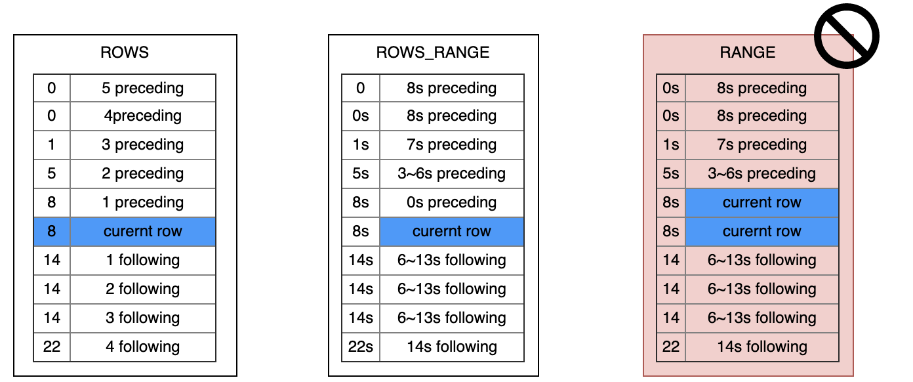
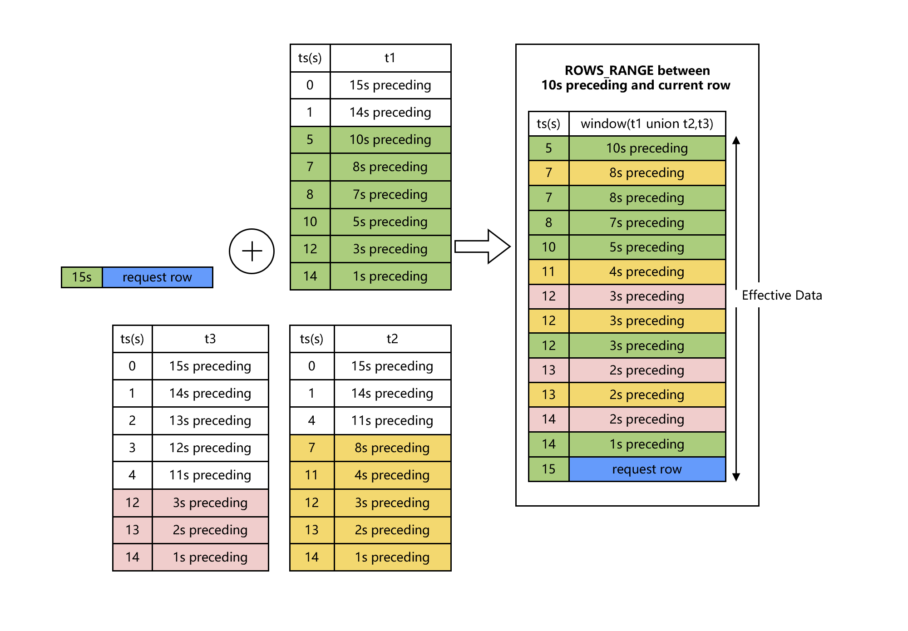
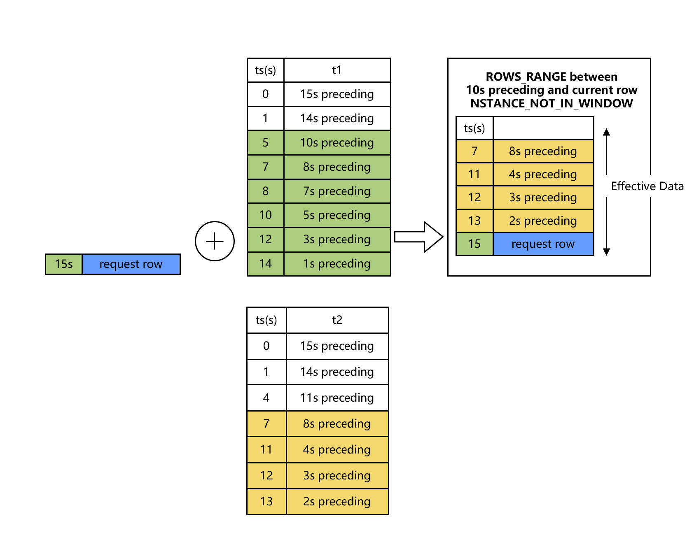
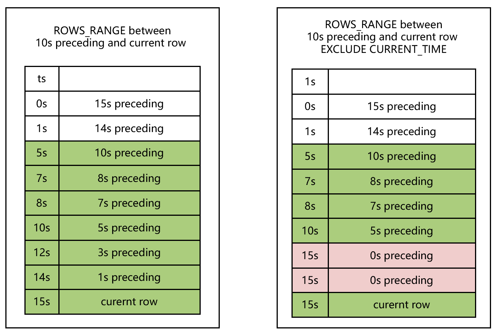
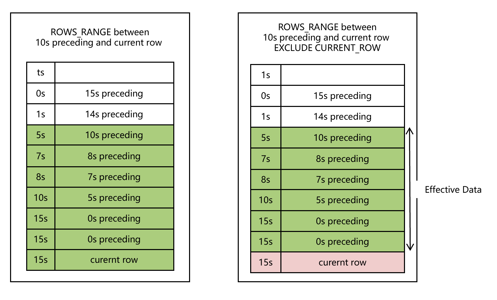
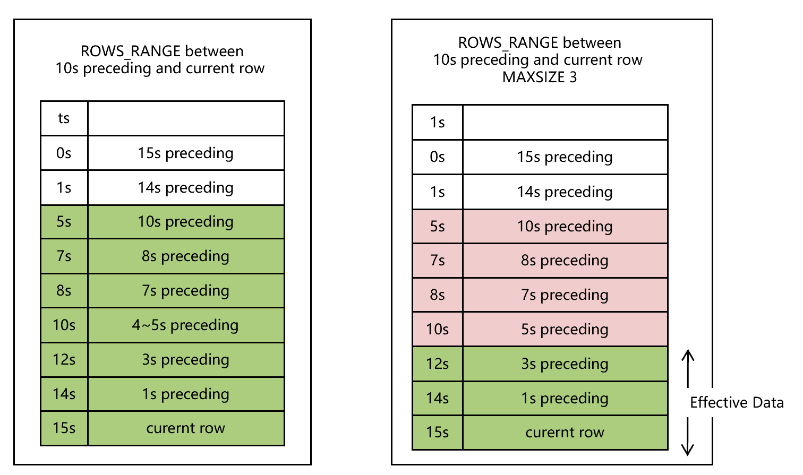

# WINDOW Clause

## Syntax

```sql
WindowClauseOptional
        ::= ( 'WINDOW' WindowDefinition ( ',' WindowDefinition )* )?

WindowDefinition
        ::= WindowName 'AS' WindowSpec

WindowSpec
        ::= '(' WindowSpecDetails ')'

WindowSpecDetails
        ::= [ExistingWindowName] [WindowUnionClause] WindowPartitionClause WindowOrderByClause WindowFrameClause (WindowAttribute)*

WindowUnionClause
        :: = ( 'UNION' TableRefs)

WindowPartitionClause
        ::= ( 'PARTITION' 'BY' ByList )

WindowOrderByClause
        ::= ( 'ORDER' 'BY' ByList )

WindowFrameClause
        ::= ( WindowFrameUnits WindowFrameBounds [WindowFrameMaxSize] )

WindowFrameUnits
        ::= 'ROWS'
          | 'ROWS_RANGE'

WindowFrameBounds
        ::= 'BETWEEN' WindowFrameBound 'AND' WindowFrameBound

WindowFrameBound
        ::= ( 'UNBOUNDED' | NumLiteral | IntervalLiteral ) ['OPEN'] 'PRECEDING'
          | 'CURRENT' 'ROW'

WindowAttribute
        ::= WindowExcludeCurrentTime
          | WindowExcludeCurrentRow
          | WindowInstanceNotInWindow

WindowExcludeCurrentTime
        ::= 'EXCLUDE' 'CURRENT_TIME'

WindowExcludeCurrentRow
        ::= 'EXCLUDE' 'CURRENT_ROW'

WindowInstanceNotInWindow
        :: = 'INSTANCE_NOT_IN_WINDOW'
```

*Window function* is similar to aggregate functions. The difference is that the window function does not need to pack the query results into a single line when output the results. Instead, each line is separated when using WINDOW clause. 
However, the window function can scan all rows that may be part of the current row's group, depending on the grouping specification of the window function (the `PARTITION BY` on columns).
The syntax for calling a function over a window is shown bellow:

```
function_name ([expression [, expression ... ]]) OVER ( window_definition )
function_name ([expression [, expression ... ]]) OVER window_name
function_name ( * ) OVER ( window_definition )
function_name ( * ) OVER window_name
```

## SQL Statement Template

- ROWS WINDOW SQL template

```sqlite
SELECT select_expr [, select_expr ...], window_function_name(expr) OVER window_name, ... FROM ... WINDOW AS window_name (PARTITION BY ... ORDER BY ... ROWS BETWEEN ... AND ...)

```

- ROWS RANGE WINDOW SQL Template

```sql
SELECT select_expr [,select_expr...], window_function_name(expr) OVER window_name, ... FROM ... WINDOW AS window_name (PARTITION BY ... ORDER BY ... ROWS_RANEG BETWEEN ... AND ...)
```

## Description

| `SELECT` Statement Elements                            | Offline Mode | Online Preview Mode | Online Request Mode | Note                                                                                                                                                                                                                                                                                                                                                                                      |
|:-------------------------------------------------------|--------------|---------------------|---------------------|:------------------------------------------------------------------------------------------------------------------------------------------------------------------------------------------------------------------------------------------------------------------------------------------------------------------------------------------------------------------------------------------|
| WINDOW Clause                                          | **``✓``**    |                     | **``✓``**           | The window clause is used to define one or several windows. Windows can be named or anonymous. Users can call aggregate functions on the window to perform analysis (```sql agg_func() over window_name```). For Online Request Mode, please follow the [specification of WINDOW Clause under Online Request](../deployment_manage/ONLINE_REQUEST_REQUIREMENTS.md#window-usage-specification-under-online-serving) |

## Basic WINDOW SPEC Syntax Elements

### Window Partition Clause And Window OrderBy Clause

```sql
WindowPartitionClause
        ::= ( 'PARTITION' 'BY' ByList )

WindowOrderByClause
        ::= ( 'ORDER' 'BY' ByList )
```

The `PARTITION BY` option groups the rows of the query into *partitions*, which are processed separately in the window function. `PARTITION BY` and the query level `GROUP BY` clause do similar work, except that its expressions can only be used as expressions and not as output column names or numbers. OpenMLDB requires that `PARTITION BY` must be configured. And currently **only supports grouping by column**, cannot support grouping by operation and function expression.

The `ORDER BY` option determines the order in which the rows in the partition are processed by the window function. It does a similar job as a query-level `ORDER BY` clause, but again it cannot be used as an output column name or number. Likewise, OpenMLDB requires that `ORDER BY` must be configured. And currently **only supports sorting by column**, and cannot support sorting by operation and function expression.

### Window Frame Clause

```
WindowFrameClause
        ::= ( WindowFrameUnits WindowFrameBounds [WindowFrameMaxSize] )

WindowFrameUnits
        ::= 'ROWS'
          | 'ROWS_RANGE'

WindowFrameBounds
        ::= 'BETWEEN' WindowFrameBound 'AND' WindowFrameBound

WindowFrameBound
        ::= ( 'UNBOUNDED' | NumLiteral | IntervalLiteral ) ['OPEN'] 'PRECEDING'
          | 'CURRENT' 'ROW'
```

In three parts:
1. WindowFrameUnits: window type
2. WindowFrameBounds: lower and upper bound
3. WindowFrameMaxSize (Optional) refer [Window With MAXSIZE](#4.-window-with-maxsize)

#### Window Frame Units

```sql
WindowFrameUnits
        ::= 'ROWS'
          | 'ROWS_RANGE'
```

WindowFrameUnits defines the frame type of the window. OpenMLDB supports two types of window frames: ROWS and ROWS_RANGE

The SQL standard RANGE class window OpenMLDB system does not currently support it. Their direct comparison differences are shown in the figure below



- ROWS: The window is drawn into the window by rows, and the window is slid out according to the number of rows
- ROWS_RANGE: The window is drawn into the window by rows, and slides out of the window according to the time interval
- RANGE: The window is divided into the window according to the time granularity (may slide in multiple data rows at the same time at a time), and slide out of the window according to the time interval

#### Window Frame Bounds

 **WindowFrameBounds** defines the upper and lower bounds of a window.

- `CURRENT ROW` is the row currently being computed.
- `UNBOUNDED PRECEDING` indicates the upper bound of this window is unlimited.
- `expr PRECEDING`
  - When the window is `ROWS` type, `expr` must be a positive integer, which indicates the upper boundary is the `expr`th row before current row.
  - When the window type is `ROWS_RANGE`,`expr` should be a time interval, like `10s`, `10m`,`10h`, `10d`. The upper bound is the `expr` ahead of the time of current row.
- By default, OpenMLDB uses closed interval. To change this, you can use keyword `OPEN`.


```{Note}
Standard SQL also supports `FOLLOWING` keyword, but OpenMLDB doesn't support it currently.
````

#### Examples

- **Named Window**

```SQL
SELECT sum(col2) OVER w1 as w1_col2_sum FROM t1
WINDOW w1 AS (PARTITION BY col1 ORDER BY col5 ROWS BETWEEN 3 PRECEDING AND CURRENT ROW)
```

- **Anonymous Window**

```SQL
SELECT id, pk1, col1, std_ts,
sum(col1) OVER (PARTITION BY pk1 ORDER BY std_ts ROWS BETWEEN 1 PRECEDING AND CURRENT ROW) as w1_col1_sum
from t1;
```

- **ROWS Window**

The following `WINDOW` clause defines a `ROWS` window containing preceding 1000 rows and current row. The window will contain a maximum of 1001 rows.
```SQL
SELECT sum(col2) OVER w1 as w1_col2_sum FROM t1
WINDOW w1 AS (PARTITION BY col1 ORDER BY col5 ROWS BETWEEN 1000 PRECEDING AND CURRENT ROW);
```


- **ROWS_RANGE Window**

The following `WINDOW` clause defines a `ROWS_RANGE` window containing preceding 10s rows and current row.
```SQL
SELECT sum(col2) OVER w1 as w1_col2_sum FROM t1
WINDOW w1 AS (PARTITION BY col1 ORDER BY col5 ROWS_RANGE BETWEEN 10s PRECEDING AND CURRENT ROW);
```

## WindowSpec Elements Specifically Designed by OpenMLDB


### 1. WINDOW ... UNION


```sql
WindowUnionClause
        :: = ( 'UNION' TableRefs)
```


#### Example
- **Window with `UNION` On 2 Tables**


```SQL
SELECT col1, col5, sum(col2) OVER w1 as w1_col2_sum FROM t1
WINDOW w1 AS (UNION t2 PARTITION BY col1 ORDER BY col5 ROWS_RANGE BETWEEN 10s PRECEDING AND CURRENT ROW);
```


- **Window with `UNION` on Multiple Tables**

```SQL
SELECT col1, col5, sum(col2) OVER w1 as w1_col2_sum FROM t1
WINDOW w1 AS (UNION t2, t3 PARTITION BY col1 ORDER BY col5 ROWS_RANGE BETWEEN 10s PRECEDING AND CURRENT ROW);
```




- **Window with `UNION` and `INSTANCE_NOT_IN_WINDOW`**


```SQL
SELECT col1, col5, sum(col2) OVER w1 as w1_col2_sum FROM t1
WINDOW w1 AS (UNION t2 PARTITION BY col1 ORDER BY col5 ROWS_RANGE BETWEEN 10s PRECEDING AND CURRENT ROW INSTANCE_NOT_IN_WINDOW);
```




- **Window with `UNION` Containing Subquery**


```SQL
SELECT col1, col5, sum(col2) OVER w1 as w1_col2_sum FROM t1
WINDOW w1 AS
(UNION (select c1 as col1, c2 as col2, 0.0 as col3, 0.0 as col4, c5 as col5, "NA" as col6 from t2),
(select c1 as col1, c2 as col2, 0.0 as col3, 0.0 as col4, c5 as col5, "NA" as col6 from t3)
PARTITION BY col1 ORDER BY col5 ROWS_RANGE BETWEEN 10s PRECEDING AND CURRENT ROW);
```


### 2. Window with EXCLUDE CURRENT_TIME
Only rows whose `timestamp` values are different to `CURRENT ROW` will be included in the window.

```
WindowExcludeCurrentTime 
        ::= 'EXCLUDE' 'CURRENT_TIME'  
```


#### Example
- **ROWS Window with EXCLUDE CURRENT_TIME**

The following `WINDOW` clause defines a `ROWS` window containing preceding 1000 rows and current row. Any other rows in the window will not have the same time as the `CURRENT ROW`.
```SQL
SELECT sum(col2) OVER w1 as w1_col2_sum FROM t1
WINDOW w1 AS (PARTITION BY col1 ORDER BY col5 ROWS BETWEEN 1000 PRECEDING AND CURRENT ROW EXCLUDE CURRENT_TIME);
```


- **ROWS_RANGE Window with EXCLUDE CURRENT_TIME**


The following `WINDOW` clause defines a `ROWS_RANGE` window containing preceding 10s rows and current row. Any other rows in the window will not have the same time as the `CURRENT ROW`.
```SQL
SELECT sum(col2) OVER w1 as w1_col2_sum FROM t1
WINDOW w1 AS (PARTITION BY col1 ORDER BY col5 ROWS_RANGE BETWEEN 10s PRECEDING AND CURRENT ROW EXCLUDE CURRENT_TIME);
```



### 3. Window with EXCLUDE CURRENT_ROW

Current row do not go into window.

```
WindowExcludeCurrentRow
        ::= 'EXCLUDE' 'CURRENT_ROW'
```

#### Example
- **ROWS_RANGE Window with EXCLUDE CURRENT_ROW**

```sql
SELECT sum(col2) OVER w1 as w1_col2_sum FROM t1
WINDOW w1 AS (PARTITION BY col1 ORDER BY col5 ROWS_RANGE BETWEEN 10s PRECEDING AND CURRENT ROW EXCLUDE CURRENT_ROW);
```
  

### 4. Window with MAXSIZE


The keyword `MAXSIZE` is used to limit the number of rows in the window.

```sql
WindowFrameMaxSize
        :: = MAXSIZE NumLiteral
```



#### Example
- **ROWS_RANGE Window with MAXSIZE**

The following `WINDOW` clause defines a `ROWS_RANGE` window containing preceding 10s rows and current row. There are at most 3 rows in the window.
```sql
SELECT sum(col2) OVER w1 as w1_col2_sum FROM t1
WINDOW w1 AS (PARTITION BY col1 ORDER BY col5 ROWS_RANGE BETWEEN 10s PRECEDING AND CURRENT ROW MAXSIZE 3);
```

```{seealso}
Please refer to [Built-in Functions](../functions_and_operators/Files/udfs_8h.md) for aggregate functions that can be used in window computation.
````
