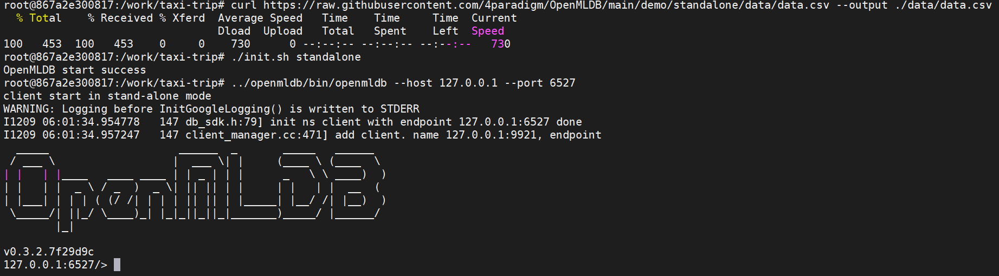

# OpenMLDB QuickStart (Standalone Mode)

In this tutorial, we demonstrate a typical life-cycle of using OpenMDLB, including creating database, data import, offline feature extraction, online SQL deployment, and online feature extraction.

## 1. Preparation

> :warning: Required docker engine version >= 18.03

We first need to download the sample data set and start the OpenMLDB CLI. We strongly recommend to use our docker image for quick start:

1. Pull the image (download size around 500 MB) and start the container 

   ```bash
   docker run -it 4pdosc/openmldb:0.4.0 bash
   ```

   **:bulb: After starting the container successfully, the following commands are all executed in the container.**

2. Download the sample data

   ```bash
   curl https://raw.githubusercontent.com/4paradigm/OpenMLDB/main/demo/quick_start/data/data.csv --output ./data/data.csv
   ```

3. Start the OpenMLDB service and CLI

   ```bash
   # 1. initialize the environment
   ./init.sh standalone
   # 2. Start the OpenMLDB CLI for the standalone mode
   ../openmldb/bin/openmldb --host 127.0.0.1 --port 6527
   ```

The below figure illustrates the successful execution of above commands and the CLI:



## 2. Usage Guideline
:bulb: The following commands are executed in the OpenMLDB CLI by default, unless specified otherwise (the command line prompt `>`is used by CLI for differentiation).

### 2.1. Creating Database and Tables
```sql
> CREATE DATABASE demo_db;
> USE demo_db;
> CREATE TABLE demo_table1(c1 string, c2 int, c3 bigint, c4 float, c5 double, c6 timestamp, c7 date, INDEX(key=c1, ts=c6));
```
The `INDEX` function used in `CREATE TABLE` accepts two important parameters `key` and `ts`. 

- `key` specifies the index column. If it is not specified, OpenMLDB will use the first applicable column as the index column automatically. Necessary indexes will be built when deploying online SQL. 
- `ts` specifies the ordered column, which is used by `ORDER BY`. Only the `timestamp` and `bigint` columns can be specified as `ts`. 

### 2.2. Data Import
We import the sample data file (downloaded in [1. Preparation](#1-prepartition)) for feature extraction.
```sql
> LOAD DATA INFILE 'data/data.csv' INTO TABLE demo_table1;
```
### 2.3. Offline Feature Extraction

The below SQL performs the feature extraction and outputs the result features into a file, which can be used by subsequent model training algorithms.

```sql
> SELECT c1, c2, sum(c3) OVER w1 as w1_c3_sum FROM demo_table1 WINDOW w1 AS (PARTITION BY demo_table1.c1 ORDER BY demo_table1.c6 ROWS BETWEEN 2 PRECEDING AND CURRENT ROW) INTO OUTFILE '/tmp/feature.csv';
```
### 2.4. Online SQL Deployment

Now we are ready to deploy our feature extraction SQL for the online serving. Note that the same SQL script should be used for both offline and online feature extraction.

```sql
> DEPLOY demo_data_service SELECT c1, c2, sum(c3) OVER w1 AS w1_c3_sum FROM demo_table1 WINDOW w1 AS (PARTITION BY demo_table1.c1 ORDER BY demo_table1.c6 ROWS BETWEEN 2 PRECEDING AND CURRENT ROW);
```
After that, we can list deployments like using the command `SHOW DEPLOYMENTS`, and also can discard a deployment by `DROP DEPLOYMENT`.

:bulb: Note that, in this example, the same data set is used for both offline and online feature extraction. In practice, importing another recent data set is usually necessary.

### 2.5 Quit the CLI

```sql
> quit;
```

Now we have finished all tasks about development and deployment under the CLI, and also returned back to the OS command line.

### 2.6. Online Feature Extraction

We can use RESTful APIs to execute online feature extraction. The format of URL is as follows:

```bash
http://127.0.0.1:8080/dbs/demo_db/deployments/demo_data_service
        \___________/      \____/              \_____________/
              |               |                        |
       APIServer endpoint  Database name        Deployment name
```
The input data of an online request is in `json` format, and we should pack a row into the field `input`.  For example:

```bash
curl http://127.0.0.1:8080/dbs/demo_db/deployments/demo_data_service -X POST -d'{"input": [["aaa", 11, 22, 1.2, 1.3, 1635247427000, "2021-05-20"]]}'
```
The expected return of the above request is shown below (the return features are packed in the field `data`):
```json
{"code":0,"msg":"ok","data":{"data":[["aaa",11,22]],"common_cols_data":[]}}
```

## 3. Demo

In order to help better understand the workflow, we provide another more complete demo that can be found [here](https://github.com/4paradigm/OpenMLDB/tree/main/demo).
