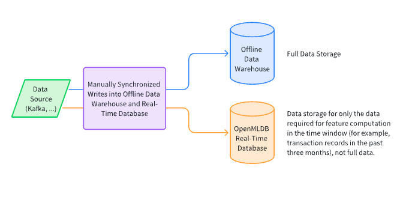
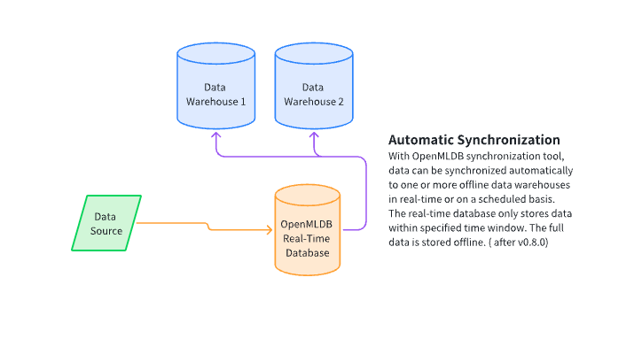
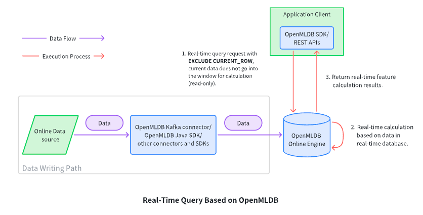

# Common architecture integration methods of OpenMLDB in real-time decision systems

OpenMLDB provides a real-time feature computing platform that maintains consistency between online and offline environments. OpenMLDB also offers flexible support for integrating into actual business systems and building complete machine-learning platforms. This article focuses on common architectures used in enterprise-level business systems based on OpenMLDB, with a particular emphasis on storage and computation:

- Offline and online data storage architecture: How to store offline and online data in a reasonable manner while maintaining consistency between the two.
- Real-time decision application architecture: How to build online applications based on OpenMLDB's real-time request computation model, including common architectures for in-process decision-making and real-time query applications.

## Storage architecture for offline data

Due to different performance and data volume requirements, in general, OpenMLDB's offline and online data are stored separately in a physical sense:

- **Online Data Storage**:

   OpenMLDB provides an efficient real-time database (based on external memory or disk) primarily for storing online data used for real-time feature computations, rather than full data. Its main features are:

  - Millisecond-level access for time series data, default based on external memory
  - The ability to automatically eliminate expired data (TTL), which can be set according to the granularity of the table, is used to store only the necessary data within a certain time window
  - The default external memory-based storage engine has high performance but may consume a large amount of external memory. A disk-based storage engine can be used if performance requirements are met.

- **Offline Data Warehouse:** OpenMLDB does not provide a standalone offline storage engine, but can flexibly support different offline data warehouses and architecture forms.

The following discusses common storage architectures for offline and online data.

### Full data storage in a real-time database (not recommended)


Users can choose to store full data in OpenMLDB's real-time database. The advantage of this usage is its simplicity and having only one copy of the data in physical storage, which saves management and maintenance costs. However, this usage method is rarely used in practice due to the following potential problems:

- Full data is generally large, and to ensure online performance, OpenMLDB uses an external memory-based storage engine by default. Storing full data in external memory will result in a large hardware cost burden.
- Although OpenMLDB also provides disk-based storage engines, disk storage can result in a 3-7x performance decrease, which may not meet the requirements of some online business scenarios.
- Storing offline and online data on the same physical medium may significantly negatively impact the performance and stability of real-time computations.

Therefore, in practice, to fully leverage OpenMLDB's real-time computation capabilities, we do not recommend storing full data in OpenMLDB, but rather using it in conjunction with an offline data warehouse.

### Separate management architecture for offline data storage



Currently, in practical usage scenarios, most users adopt a separate storage architecture for offline and online data management. Based on this architecture, data is simultaneously written to both the offline data warehouse and the real-time database of OpenMLDB. The real-time database of OpenMLDB sets table-level data expiration (TTL), which corresponds to the size of the time window required in the feature script, which is the real-time database only stores necessary data for real-time feature computation, rather than the entire dataset. Some important points to note are:

- In actual enterprise architecture, data sources are generally based on subscription mechanisms of message queues such as Kafka. Different applications will consume data separately. Under this architecture, the channels for writing to the real-time database of OpenMLDB and storing it in the offline data warehouse can be considered as two independent consumers.
- If it is not based on a subscription mechanism of message queues, it can also be considered that there are one or more data-receiving programs upstream of OpenMLDB, which are used to implement and manage the online and offline storage of OpenMLDB.
- The expiration time of the real-time database of OpenMLDB needs to be correctly set so that the data stored in the real-time database can be used for correct real-time feature computation.
- The main disadvantage of this architecture is that it is slightly more complicated to manage, as users need to manage offline and online data separately.

### A unified view of architecture for offline data storage (expected to support during v0.7.4)



Under this architecture of a unified view for online and offline data, users' perspectives on data synchronization and management have been simplified. We are planning to release an automated synchronization mechanism from a real-time database to an offline data warehouse in version 0.7.4. While we still have two storage engines, a real-time database, and an offline data warehouse, in physical terms, users can focus on a single writing channel. Users only need to write new data into OpenMLDB real-time database and set up the real-time to offline synchronization mechanism, and OpenMLDB can automatically synchronize data in real-time or periodically to one or more offline data warehouses. OpenMLDB's real-time database still relies on a data expiration mechanism to only save data necessary for online feature computation, while the offline data warehouse retains all full data. This feature is expected to be added in the early April 2023 release of version 0.7.4.

## Real-time decision-making application architecture

### Real-time request computation mode

Before understanding the real-time decision application architecture, it is necessary to understand the request-based real-time computation mode provided by the OpenMLDB online real-time computing engine, which mainly includes three steps:

1. The client sends a computation request (request) through REST APIs or OpenMLDB SDKs, which may optionally include state information data of the current event, such as the swiped amount and shop ID of the current swipe event.
2. The OpenMLDB real-time engine accepts the request and performs on-demand real-time feature computation based on the deployed feature computation logic.
3. OpenMLDB returns the real-time computation results to the client who initiated the request, completing the real-time computation request.

This article will start with practical application scenarios and explain the common application architecture of the real-time request computation mode based on OpenMLDB. We will introduce two common application architectures.

### Application architecture for decision-making in matters

The default computation mode of OpenMLDB supports in-process decision-making applications, meaning that decision-making behavior takes place during the event occurrence. Therefore, its main characteristic is that **behavioral data generated by the current event is also taken into consideration for decision-making**. The most typical example is credit card anti-fraud. When a credit card transaction occurs, the anti-fraud system makes a decision before the transaction is completed, taking into account the current transaction behavioral data (such as the amount, time, and location of the current transaction), along with data from a recent time window. This architecture is widely used in fields such as anti-fraud and risk control.

Let's take a concrete example. The following figure shows the functional logic of the entire system when a credit card transaction occurs. As shown in the figure, the system maintains a history of transaction records, and when a new transaction behavior occurs, the current behavioral data is **virtually inserted into the table** along with recent transaction records for feature computation, then given to the model for inference, and finally evaluated to determine whether it is a fraudulent transaction.


Note that in the above figure, the new swipe record data is shown being **virtually inserted** into the historical transaction table. This is because, in OpenMLDB's request mode, the system by default virtually inserts the in-event data carried by the request into the table, participating in the overall feature computation (if in special circumstances the current request row information is not needed for decision-making, the "EXCLUDE CURRENT_ROW" keyword can be used, see "Appendix: EXCLUDE CURRENT_ROW semantic interpretation" for details). At the same time, the current request row is also useful for subsequent decision-making in general, so after completing the current feature computation, it should be physically inserted into the database. To build an in-event decision-making system like the above business process, a typical architecture flowchart is listed below.


The architecture is based on the OpenMLDB SDK and achieves strict in-event decision-making, which consists of two stages:

1. Steps 1, 2, and 3 in the above diagram constitute a real-time request of OpenMLDB, which includes the necessary data (card number, transaction amount, timestamp) at the time of the event.
2. After the real-time request is completed, the client initiates an additional data insertion request through the OpenMLDB SDK to insert the current transaction data into OpenMLDB for subsequent real-time request computations.

The above strict in-event decision-making architecture based on the OpenMLDB SDK is the default and recommended architecture of OpenMLDB. In actual enterprise application architectures, there may be some variations due to the complexity of peripheral coupling architectures or internal permissions. For example, the data writing path is completely separated and uses Kafka or other methods for separate data writing. However, if this architecture is not supported by additional mandatory guarantees, there may be problems with the order of read and write operations, resulting in duplicate or missing data computation within the time window. Therefore, in general, we still recommend using the strict in-event decision-making architecture shown in the above diagram.

### Real-time query application architecture

In some recommendation scenarios, it is often necessary to perform a real-time computation query at a specific time, which does not carry any meaningful data. For example, when a user browses products, it is necessary to query the most popular products on the platform that match the user's interests in the last ten minutes when the user opens the browser and recommends the products based on their order. In such scenarios, the user's request and the writing of related material data can be completely decoupled, and the user's request does not carry any meaningful data, only to trigger a real-time computation request, which can be achieved using the SQL keyword `EXCLUDE CURRENT_ROW`.



In the above architecture, the real-time request (read-only) and the data writing path are decoupled.

- For the data writing path, users can continuously write relevant material data to the OpenMLDB database through streaming (such as Kafka connector) or OpenMLDB SDK.
- For the real-time request part, there are two main features:
  - After the request is completed, there is no need for additional steps to write real-time data (related data is completed by the data writing path, and the request itself does not carry meaningful data).
  - Since the default request computation behavior of OpenMLDB will perform virtual data insertion, in this architecture, the data carried by the real-time request is no longer meaningful. Therefore, the extended SQL keyword `EXCLUDE CURRENT_ROW` is needed to achieve this goal.

### Other extended architectures

In addition to the two architectures mentioned above, OpenMLDB can also be extended to support offline feature online query architectures and streaming feature-based architectures. In subsequent articles, other enterprise-level architectures applied in practical applications will gradually be introduced.

## Appendix: EXCLUDE CURRENT_ROW semantic interpretation

The request mode of OpenMLDB by default will virtually insert the current data row into the table and include it in the window computation. If the current row's data is not needed for the computation, `EXCLUDE CURRENT_ROW` can be used. This syntax excludes the data of the current request row from the window computation, but the `PARTITION BY KEY` and `ORDER BY KEY` provided by the request row still need to be used to locate the specific data and time window of the request.

The following example illustrates its semantics using a specific example, assuming the schema of the data table `txn` used to store transaction records is as follows.

| **Column** | card_id | amout  | txn_time  |
| ---------- | ------- | ------ | --------- |
| **Type**   | string  | double | timestamp |

The following example is used, adding to the SQL of `EXCLUDE CURRENT_ROW`:

```SQL
SELECT card_id, sum(amount) OVER (w1) AS w1_amount_sum FROM txn 
    WINDOW w1 AS (PARTITION BY card_id ORDER BY txn_time 
    ROWS BETWEEN 2 PRECEDING AND CURRENT ROW EXCLUDE CURRENT_ROW);
```

The statement defines a window based on `card_id` as the key, sorted by `txn_time`, and includes two rows before the current request row. At the same time, because `EXCLUDE CURRENT_ROW` is specified, the current request row is excluded from the window for computation.

For simplicity, let's assume that the table only has the following two rows:

```SQL
 --------- ----------- --------------- 
  card_id   amount      txn_time       
 --------- ----------- --------------- 
  aaa       22.000000   1636097890000  
  aaa       20.000000   1636097290000  
 --------- ----------- --------------- 
```

We send a real-time computing request, which includes the following request data:

| **Column**  | card_id                       | amount                                                       | txn_time                             |
| ----------- | ----------------------------- | ------------------------------------------------------------ | ------------------------------------ |
| **Value**   | aaa                           | 23.0                                                         | 1637000000000                        |
| Description | Key used to locate the window | This column of information does not actually enter the window for computation | Time stamp used to locate the window |

If `EXCLUDE CURRENT_ROW` is not used, both the current request row and the two rows which are already in the database will be included in the window and participate in the real-time computation, resulting in a return value of "aaa, 65.0". However, since `EXCLUDE CURRENT_ROW` is included in the deployed SQL, the current row will not be included in the window computation, so the return value is actually "aaa, 42.0". Note that although the value of the `amount` in the current row does not participate in the window computation, its `card_id` (used to mark the classification key) and `txn_time` (used to mark the timestamp information) still need to be correctly set to locate the correct window data.