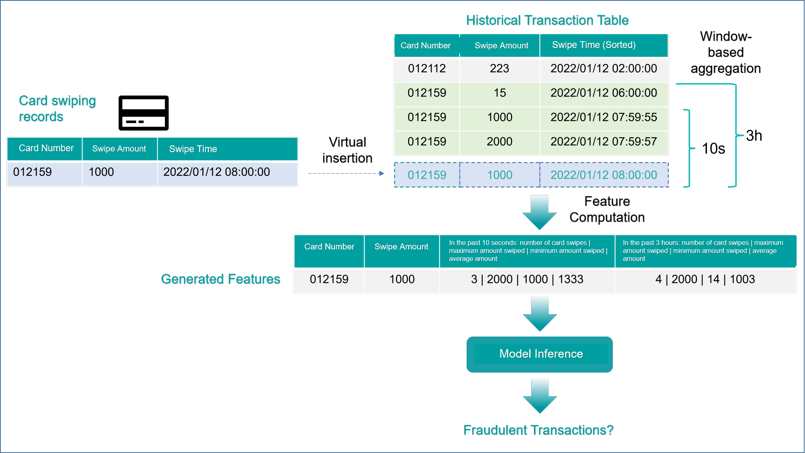

# Common Architecture Integration Methods of OpenMLDB in Real-Time Decision Systems

OpenMLDB provides a real-time feature computing platform that ensures consistency between online and offline environments. It also offers flexible support for integrating into actual business systems and building complete machine-learning platforms. This article focuses on the common architectures used to integrate OpenMLDB into enterprise-level business systems, with a particular emphasis on **storage** and **application** computation architecture:

- Offline and online data **storage** architecture: How to store **offline** and **online** data in a reasonable manner while maintaining consistency between the two.

- Real-time decision-making **application** architecture: How to build online applications based on OpenMLDB’s real-time request model, including architectures for real-time **computation** and real-time **query** applications.


## Storage Architecture for Offline and Online Data

Due to different performance and data volume requirements, in general, OpenMLDB’s offline and online data are stored separately:

- **Online Data Storage:** OpenMLDB provides an efficient real-time database (based on memory or hard disk) primarily for storing online data used for real-time feature computations, rather than full data. The main features are:

   - Millisecond-level access for time series data (based on memory, by default).

   - The ability to automatically expire data (TTL). TTL can be set according to the granularity of the table, which is used to store only the necessary data within a certain time window.

   - The memory-based storage engine has high performance but may consume a large amount of external memory. A disk-based storage engine can be used to complement if performance requirements can be met.

- **Offline Data Warehouse:** OpenMLDB does not provide a standalone offline storage engine, but can flexibly support different offline data warehouses and architecture forms.

The following section discusses the common storage architectures for offline and online data.

### Full Data Storage in a Real-Time Database (not recommended)


sers can choose to store full data in OpenMLDB’s real-time database. The advantage of this method is its simplicity and having only one copy of the data in physical storage, which saves management and maintenance costs. However, this usage method is rarely used in practice due to the following potential problems:

- Full data is generally large, and to ensure online performance, OpenMLDB uses an external memory-based storage engine by default. Storing full data in external memory will result in a large hardware cost.

- Although OpenMLDB provides disk-based storage engines, disk storage can result in a 3–7x performance decrease, which may not meet the requirements of some online business scenarios.

- Storing offline and online data on the same physical medium may significantly impact the performance and stability of real-time computations.

Therefore, in practice, to fully leverage OpenMLDB’s real-time computation capabilities, we do not recommend storing full data in OpenMLDB, but rather using it in conjunction with an offline data warehouse.

### Separate Storage for Offline Data Warehouse and Online Real-Time Database


Currently, in practice, most users adopt a separate storage architecture for offline and online data. Based on this architecture, data is simultaneously written to both the offline data warehouse and the real-time database. The real-time database of OpenMLDB sets table-level data expiration (TTL), which corresponds to the size of the time window required in the feature script. In this way, the real-time database only stores necessary data for real-time feature computation, rather than the entire dataset. Some important points to note are:

- In actual enterprise architecture, data sources are generally based on subscription mechanisms of message queues such as Kafka. Different applications will consume data separately. Under this architecture, the channels for writing to the real-time database of OpenMLDB and storing it in the offline data warehouse can be considered as two independent consumers.

- If it is not based on a subscription mechanism of message queues, it can also be considered that there are one or more data-receiving programs upstream of OpenMLDB, which are used to implement and manage the online and offline storage of OpenMLDB.

- The expiration time of the real-time database of OpenMLDB needs to be correctly set so that the data stored in the real-time database can be used for correct real-time feature computation.

- The main disadvantage of this architecture is that it is more complicated to manage, as users need to manage offline and online data separately.

### Unified Storage for Offline Data Warehouse and Online Real-Time Database (Support from v0.8.0)


With this architecture of unified management for online and offline data, users’ perspectives on data synchronization and management have been simplified. While we still have two storage engines: a real-time database, and an offline data warehouse physically, from users’ perspective, a single writing channel is presented. Users only need to write new data into OpenMLDB’s real-time database and set up the synchronization mechanism, and OpenMLDB will automatically synchronize data in real time or periodically to one or more offline data warehouses. OpenMLDB’s real-time database still relies on a data expiration mechanism to only save data necessary for online feature computation, while the offline data warehouse retains all full data. This feature is available after version 0.8.0.

## Real-time Decision-making Application Architecture

### OpenMLDB Execution Mode: Real-Time Request Mode

Let us first understand the real-time request mode offered by OpenMLDB online real-time computing engine. It mainly includes three steps:

 1. The client sends a computation request through REST APIs or OpenMLDB SDKs, which may optionally include state information of the current event, such as the swiped amount and shop ID of the current swipe event.

 2. The OpenMLDB real-time engine accepts the request and performs on-demand real-time feature computation based on the deployed feature computation logic.

 3. OpenMLDB returns the real-time computation results to the client who initiated the request, completing the real-time computation request.

With the execution mode in mind, we will start with practical application scenarios and explain the application architecture for real-time decision-making applications: **computation** and **query**.

### Application Architecture for Real-Time Computation — for Real-Time Decision-Making

The real-time request mode (default) of OpenMLDB supports in-event (real-time) decision-making applications, meaning that decision-making behavior takes place during the event occurrence. Therefore, its main characteristic is that **behavioral data generated by the current event is also taken into consideration for decision-making**.

The most typical example is credit card anti-fraud. When a credit card transaction occurs, the anti-fraud system makes a decision before the transaction is completed, taking into account the current transaction behavioral data (such as the amount, time, and location of the current transaction), along with data from a recent time window. This architecture is widely used in fields such as anti-fraud and risk control.

Let’s take a concrete example. The following figure shows the functional logic of the entire system when a credit card transaction occurs. As shown in the figure, the system maintains a history of transaction records, and when a new transaction behavior occurs, the current behavioral data is **virtually inserted into the table** along with recent transaction records for feature computation, then given to the model for inference, and finally evaluated to determine whether it is a fraudulent transaction.



Note that in the above figure, the new swipe record data is shown as being **virtually inserted** into the historical transaction table. This is because, in OpenMLDB’s default execution mode, the system virtually inserts the in-event data carried by the request into the table, participating in the overall feature computation (if in special circumstances where the request row is not needed for decision-making, see section below “Application Architecture for Real-time Query”). At the same time, the current request row is also useful for subsequent decision-making in general, so after completing the current feature computation, it will be physically inserted into the database. To build an in-event decision-making system like the above business process, a typical architecture flowchart is listed below.


The architecture is based on the OpenMLDB SDK and achieves strict in-event decision-making, which consists of two stages:

 1. Steps 1, 2, and 3 in the above diagram constitute a real-time feature computation with OpenMLDB. The request includes the necessary data (card number, transaction amount, timestamp) at the time of the event.

 2. After the real-time computation request is completed, the client initiates an additional data insertion request through the OpenMLDB SDK to insert the current transaction data into OpenMLDB for subsequent real-time request computations.

The above strict in-event decision-making architecture based on the OpenMLDB SDK is the default and recommended architecture. In actual enterprise application architectures, there may be some variations due to the complexity of peripheral coupling or permission issues. For example, the data writing path can be completely separated, with Kafka or other methods for data writing. However, if such architecture is not verified and guaranteed, there may be problems with the order of read and write operations, resulting in duplicate or missing data computation. In general, we still recommend using the strict in-event decision-making architecture shown in the above diagram.

### Application Architecture for Real-time Query

In some scenarios, the application may need to perform a real-time query only, which does not carry any meaningful data. For example, when a user browses products, it is helpful to query the most popular products on the platform that match the user’s interests in the last ten minutes to recommend relevant products. In such scenarios, the user’s request does not carry any meaningful data and thus can be completely decoupled with the data writing path. Such query requests only trigger a calculation (read-only, no data writes), which can be achieved using `EXCLUDE CURRENT_ROW`.


In the above architecture, the real-time query request (read-only) and the data writing path are decoupled.

- For the data writing path, users can continuously write data to the OpenMLDB database through streaming (such as Kafka connector) or OpenMLDB SDK.

- For real-time query requests, there are two main features:

 1. After the query request is completed, there is no additional step to write into real-time data (data write is completed by the data writing path).

 2. Since data carried by query request is not meaningful, the extended SQL keyword `EXCLUDE CURRENT_ROW` is required to avoid virtual insertion.

### Other Architectures

In addition to the two architectures mentioned above, OpenMLDB can also be extended to support architectures for online queries of offline features and architectures for streaming features. We will gradually introduce other enterprise-level architectures applied in practical scenarios in subsequent articles.

## Appendix: EXCLUDE CURRENT_ROW Semantics

he real-time request mode of OpenMLDB by default will virtually insert the current data row into the table and include it in the window computation. If the current row’s data is not required for the computation, `EXCLUDE CURRENT_ROW` can be used. This syntax excludes the data of the current request row from the window computation, but the `PARTITION BY KEY` and `ORDER BY KEY` provided by the request row still need to be used to locate the specific data and time window of the request.

The following example illustrates its semantics, assuming the schema of the data table `txn` used to store transaction records is as follows.

| **Column** | card_id | amount | txn_time  |
| ---------- | ------- | ------ | --------- |
| **Type**   | string  | double | timestamp |

The following SQL with `EXCLUDE CURRENT_ROW` is used:

```SQL
SELECT card_id, sum(amount) OVER (w1) AS w1_amount_sum FROM txn 
        WINDOW w1 AS (PARTITION BY card_id ORDER BY txn_time 
        ROWS BETWEEN 2 PRECEDING AND CURRENT ROW EXCLUDE CURRENT_ROW);
```

The statement defines a window based on card_id as the key, sorted by txn_time, and includes two rows before the current request row. At the same time, because EXCLUDE CURRENT_ROW is specified, the current request row is excluded from the window for computation.

For simplicity, let’s assume that the table only has the following two rows:


```SQL
 --------- ----------- --------------- 
  card_id   amount      txn_time       
 --------- ----------- --------------- 
  aaa       22.000000   1636097890000  
  aaa       20.000000   1636097290000  
 --------- ----------- --------------- 
```

We send a real-time computing request, which includes the following request data:

| **Column**  | card_id                       | amount                                                       | txn_time                             |
| ----------- | ----------------------------- | ------------------------------------------------------------ | ------------------------------------ |
| **Value**   | aaa                           | 23.0                                                         | 1637000000000                        |
| Description | Key to locate the time window | This data does not enter the window for computation | Timestamp to locate the time window |

If `EXCLUDE CURRENT_ROW` is not used, both the current request row and the two rows that are already in the database will be included in the window for computation, resulting in a return value of "aaa, 65.0". However, since `EXCLUDE CURRENT_ROW` is used, the current row will not be included in the window computation, so the return value is actually "aaa, 42.0".

Note that although the value of the `amount` in the current row does not participate in the window computation, its `card_id` (key) and `txn_time` ( timestamp) still need to be correctly set to correctly locate the time window.
