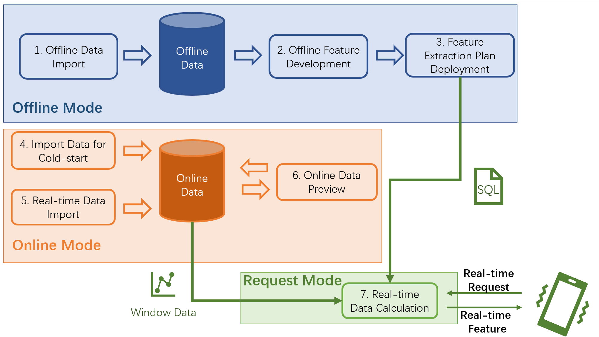
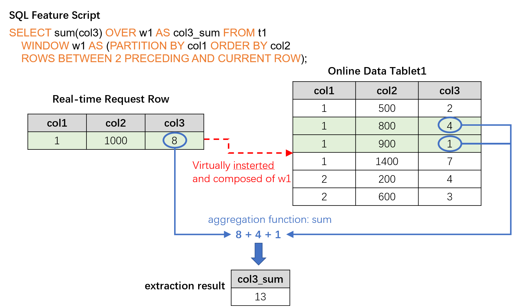

# The Workflow of Cluster Version and Execution Mode 

OpenMLDB provides different execution modes at different stages of whole feature engineering workflow.  Execution modes have been classified in detail to match every working steps, especially for the cluster version that often used in a production environment. You can find out the whole process, from feature extraction to online deployment, and corresponding execution mode in this manual.


## 1. Overview of OpenMLDB Workflow

### 1.1 The Whole Workflow of Feature Engineering

The typical feature engineering process based on openMLDB, from feature extraction to online deployment, is as follows.

1. **Offline Data Import**

   Offline data should be imported in this stage for subsequent offline feature extraction.

2. **Offline Feature Development**

   The feature engineering script is developed and optimized until the quality is satisfied. Note that machine learning model development and tunning are involved as well during this step. However this article only focuses on the feature engineering based on OpenMLDB.

3. **Online Deployment for Feature Scripts**

   After obtaining satisfactory feature extraction script, it is deployed online.

4. **Import Data for Cold-start**

   Data in the windows of the online storage engine must be imported before it goes online. For example, if the script will aggregate data for the last three months, the data for those three months needs to be imported for cold-start.

5. **Real-time Data Import**

   After the system being deployed online, the latest data needs to be imported to maintain the window computing logic as time goes by. Therefore, real-time data import is required.

6. **Online Data Preview (Optional)** 

   You can preview online data by running SQL commands in this stage.

7. **Request Service in Real Time**

   After the solution is deployed and the input data stream is correctly connected, a real-time feature computing service is ready to respond to real-time requests.

   

### 1.2 Overview of Cluster Execution Modes

Since data objects are different in offline and online scenarios, their underlying storage and computing nodes are different. Therefore, OpenMLDB provides different execution modes to complete the processes mentioned in 1.1. The following table summarizes the execution modes used for each step in feature engineering. Important concepts about execution modes will be introduced later.


| Stage                                     | Execution Mode | Development Tool           | Introduction                                                 |
| ----------------------------------------- | -------------- | -------------------------- | ------------------------------------------------------------ |
| 1.**Offline Data Import**                 | the offline mode        | CLI                        | - `LOAD DATA` command<br />                                  |
| 2. **Offline Feature Development**        | the offline mode        | CLI                        | - all SQL statements of OpenMLDB are supported<br />- some SQL queries (e.g.,`SELECT`) run in non-blocking asynchronous mode |
| 3. **Feature Extraction Plan Deployment** | the offline mode        | CLI                        | - `DEPLOY` command                                           |
| 4. **Import Data for Cold-start**         | the online preview mode        | CLI, Import Tools          | - `LOAD DATA` command for CLI <br />- or you can use the independent import tool `openmldb-import` |
| 5. **Real-time Data Import**              | the online preview mode         | REST APIs, Java/Python SDK | - Data insert APIs of OpenMLDB are called by third-party data sources to import real-time data. |
| 6. **Online Data Preview (Optional)**     | the online preview mode         | CLI, Java/Python SDK       | - Currently `LAST JOIN`, `ORDER BY` are not supported temporarily |
| 7. **Real-time Feature Processing**       | the online request mode       | REST APIs, Java/Python SDK | - all SQL syntax of  OpenMLDB is supported<br />- both REST APIs and Java SDK support single-line and batch request<br />- Python SDK only support single-line request |

As the table shown above, execution modes can be categorized as `the offline mode`, `the online preview mode` and `the online request mode`. The following figure summarizes the entire feature engineering process and corresponding execution modes. Detailed introduction of each of these modes will be shown later in this page. 



### 1.3 Notes for the Standalone Version

Although this doc focuses on the cluster version, it is necessary to involve a brief description of standalone version's execution modes. The execution modes of the standalone version are relatively simple. Because the storage nodes and compute nodes are unified for its offline data and online data, standalone version does not distinguish between the offline and online modes. That is, standalone version doesn't have the concept of execution mode using CLI. Any SQL syntax supported by OpenMLDB can directly run on the CLI. Therefore, the standalone version is especially suitable for quick evaluation and learning OpenMLDB SQL. However, in the stage of **real-time feature processing**, the standalone version still run in online request mode, which is the same as the cluster version.

:::{note}
If you only want to try OpenMLDB in a non-production environment, or learn and practice SQL, it is highly recommended to use the standalone version because of its faster and easier deployment.
:::

## 2. The Offline Mode

As mentioned earlier, the offline data import, offline feature development and feature extraction deployment stages of cluster version are all running in offline mode. The management and computing of offline data are completed in this mode. Related computing nodes are supported by Spark release version, which has [been optimized for feature engineering by OpenMLDB](./openmldbspark_distribution.md). Common storage systems such as HDFS can be used on the storage nodes.

The offline mode has following main features.

- Offline mode supports all SQL syntax provided by OpenMLDB, including extended and optimized LAST JOIN, WINDOW UNION and other complicated SQL queries.

- In the offline mode, some SQL commands run in non-blocking asynchronous mode. These commands include `LOAD DATA`, `SELECT` and `SELECT INTO` .

- The above-mentioned non-blocking SQL commands is managed by TaskManager, try following commands to check and manage the execution.

  ```bash
  SHOW JOBS
  SHOW JOB
  STOP JOB
  ```

+ :::{Tip}
  Please pay attention that the `SELECT` command runs asynchronously in offline mode, which is totally different with many common relational database. Therefore, it is highly recommended to use `SELECT INTO`  instead of `SELECT` for development and debugging. With `SELECT INTO`, the results can be exported to an external file and checked.
  :::

+ The feature extraction plan deploying command `DEPLOY` executes in offline mode as well. 
:::{note}
The deployment criterion has certain requirements for SQL, see [The Specification and Requirements of OpenMLDB SQL Deployment](../../reference/sql/deployment_manage/ONLINE_REQUEST_REQUIREMENTS.md) for more details. 
:::
The offline mode can be set in following ways:

- CLI: `SET @@execute_mode='offline'`

  The default CLI mode is also offline.

- REST APIs, Java/Python SDK: offline mode is not supported.

## 3. The Online Preview Mode

The cold-start's online data import, real-time data import and online data preview are all running in online preview mode. This mode is responsible for online data management and preview. Online data storage and computation is supported by the Tablet.

The online preview mode has following main features.

- In online preview mode, `LOAD DATA` with `load_mode='cluster'` is executed asynchronously in non-blocking mode as the way it executed in offline mode, 
while `load_mode='local'` will load the data locally in the synchronous way.
All the other commands are executed synchronously.
- `Last Join ` and `Order By` commands are not supported in online preview mode currently.
- As SQL is executed in a single thread in online engine, it may run for long time for big data，
which may trigger timeout. The timeout can be configured by `--request_timeout` in the client side;
- In order not to degrade the performance of online request, we limit the max traverse number and pk numbers,
which can be configured by `--max_traverse_cnt` and `--max_traverse_pk_cnt`.
In additional, the result size is limited by `--scan_max_bytes_size`. Details can be found in [Configuration File](../deploy/conf.md).

The online preview mode can be set in following ways:

- CLI： `SET @@execute_mode='online'`
- REST APIs, Java/Python SDK: these tools can be executed only in online mode.

## 4. The Online Request mode

After feature extraction plan is deployed and online data is imported, the real-time feature extraction service is ready. Then real-time features can be extracted via request mode, which is supported by REST APIs and Java/Python SDK. The online request mode is OpenMLDB's unique execution mode for supporting real-time computation online, which is distinct from common SQL queries in other databases.

The online request mode requires following three inputs.

1. **SQL feature script**, which is the SQL script used during feature deployment stage, defining the computing logic for feature extraction.
2. **Online data**, acting as the window data in cold-start stage and real-time imported data after cold-start. Generally, it is the latest data in the time window that is defined by the feature script. For example, the aggregation function of an SQL script defines a time window for the last three months, so the online storage needs to keep the corresponding data for the last three months.
3. **A real-time request row** ,  containing real-time behaviors that are currently taking place. The real-time request row is used for real-time feature extraction, such as credit card information in anti-fraud scenarios or search keywords in recommendation scenarios. 

Based on these three inputs, the online request mode will return a feature extraction result for each real-time request row. Its computing logic is: the request row will be virtually inserted into the correct position of the online data table according to the logic of SQL script (such as  `PARTITION BY`, `ORDER BY`, etc.), and then the feature script will be applied to that request row, finally the result feature will be returned. The following diagram illustrates the procedure of the request mode.



The online request mode can be set in the following ways:

- CLI: The online request mode isn't supported currently.
- REST APIs: Support single-line and batch **request rows** request, see: [REST APIs](https://openmldb.ai/docs/en/main/quickstart/rest_api.html) for deatil.
- Java SDK: Support single-line and batch **request rows** request, see: [Java SDK Quickstart ](https://openmldb.ai/docs/en/main/quickstart/java_sdk.html) for detail.
- Python SDK: Only support single-line **request row** request, see:[Python SDK Quickstart](https://openmldb.ai/docs/en/main/quickstart/python_sdk.html)for detail.