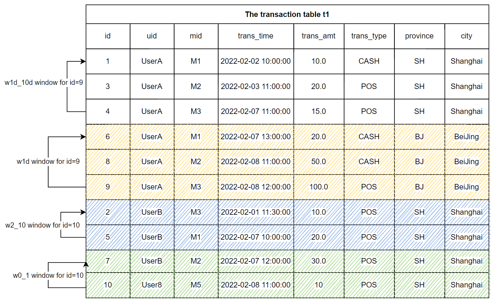

# SQL for Feature Extraction (Part 1)


## 1. The Feature Engineering of Machine Learning

A real-world machine learning application generally includes two main processes, namely **Feature Engineering** and **Machine Learning Model** (hereinafter referred to as **Model**). We must know a lot about the model, from the classic logistic regression and decision tree models to the deep learning models, we all focus on how to develop high-quality models. We may pay less attention to feature engineering. 
However, as the saying goes, data and features determine the upper limit of machine learning, while models and algorithms only approach this limit. It can be seen that we have long agreed on the importance of Feature Engineering.

In one sentence, Feature Engineering is defined as: using domain knowledge to extract useful information (features) from the original data. It emphasizes domain knowledge, that is to say, feature extraction is not a standardized process, it needs different experience and methodology in different scenarios. 
For example, for the real-time recommendation system, the original data may only be the keywords entered by users, such as "washing machine", and the corresponding user and commodity data tables stored in the database. 
In order to make better real-time recommendation, the following features may be more helpful:

- The home appliance brand that the user purchased the most in the past year.
- The average consumption level of the user in the past three years.
- The top three models of washing machines purchased most by clients of the same gender and the same age group as the user, and were over 30% off in the past one hour.

As can be seen from the above example, features can be made quite complex and can have very high timeliness. So extracting good features according to specific problems is the ability that data scientists need and powerful feature extracting tools can play very important roles helping scientists accomplish this task. 
This tutorial will introduce how to do feature engineering in practice.

## 2. Feature Extracting Tool – OpenMLDB

Before introducing the feature engineering method, it is necessary to be familiar with the development and deployment tools of feature engineering. 
The following table roughly categorizes and summarizes the popular tools' advantages and disadvantages.

| Development Tool                                                               | Usability                                                             | Functional Support                                                                                                                        | Engineering                                                                                                                                                                                                                      |
|--------------------------------------------------------------------------------|-----------------------------------------------------------------------|-------------------------------------------------------------------------------------------------------------------------------------------|----------------------------------------------------------------------------------------------------------------------------------------------------------------------------------------------------------------------------------|
| Python                                                                         | High, widely used by data scientists.                                 | The Python programming is very flexible and can be used to implement any functions.                                                       | Difficult. Python programs are generally inefficient and their performance generally cannot meet the requirements of online real-time computing. In addition, users need to solve production problems such as high availability. |
| Relational Database                                                            | Medium, developed based on SQL.                                       | There is no specific optimization for feature engineering, using the standard SQL to implement some functions is complex and inefficient. | Acceptable. However, the functions that are not well supported by standard SQL may not meet the needs of production.                                                                                                             |
| The hybrid approach, such as using Python offline, and database or C++ online. | The development cost is very high and requires two development teams. | Based on development and customization, the functional requirements can be met.                                                           | Acceptable but costly. In addition to the development and operation cost, ensuring the online and offline consistency also costs a lot.                                                                                          |
| OpenMLDB                                                                       | Medium, developed based on SQL.                                     | The standard SQL is extended and highly optimized to fully support feature engineering.                                                   | Low cost and high efficiency. Since being developed by SQL, the script can be directly deployed online, which naturally ensure the online and offline consistency.                                                               |

From the table, we can see that OpenMLDB has unique advantages for feature engineering in production. Especially for real-time feature extraction on time-series data, OpenMLDB has a lot of targeted optimization. If you want to learn more about OpenMLDB, you can visit our [GitHub repo]( https://github.com/4paradigm/OpenMLDB).

## 3. From 0 to 1, Feature Engineering Practice

We will introduce the common processing methods of feature engineering in two parts. This part will focus on single table feature processing, and the [next part](tutorial_sql_2.md) will focus on more complex multi-table feature computing. 
This tutorial will use the anti-fraud dataset, which is common in the financial field, as an example.

Note that if you want to run the SQL in this tutorial, please follow these two steps:

- It is recommended to use the docker image to run this tutorial under the standalone version. For image pulling and CLI operation methods, please refer to [OpenMLDB Quick Start](../quickstart/openmldb_quickstart.md). If you want to use the cluster version, please use the offline mode (`SET @@execute_mode='offline'` ). The CLI of cluster version only supports online preview mode and offline mode. And the online preview mode only supports the simple data preview function, so most of the SQL in the tutorial cannot run in the online preview mode.
- All data and SQL scripts related to this tutorial can be downloaded [here]( https://openmldb.ai/download/tutorial_sql/tutoral_sql_data.zip)

## 3.1. Basic Concepts
### 3.1.1. Primary and Secondary Tables

**Primary Table** is the main data table of feature extraction. Intuitively, the primary table is a dataset with label required for training in machine learning. 
In the process of feature engineering, each row of the primary table will be processed to finally generate the corresponding **Feature Table**. 
For example, the following user transaction table (hereinafter referred as data table `t1`) is the primary table of the use case in this tutorial.

| Field      | Type      | Description                            |
| ---------- | --------- | -------------------------------------- |
| id         | BIGINT    | Sample ID, each sample has a unique ID |
| uid        | STRING    | User ID                                |
| mid        | STRING    | Merchant ID                            |
| cardno     | STRING    | Card Number                            |
| trans_time | TIMESTAMP | Transaction Time                       |
| trans_amt  | DOUBLE    | Transaction Amount                     |
| trans_type | STRING    | Transaction Type                       |
| province   | STRING    | Province                               |
| city       | STRING    | City                                   |
| label      | BOOL      | Sample label, true\|false              |

In addition to the primary table, there may also be tables storing relevant auxiliary information in the database, which can be combined with the primary table through the JOIN operation. These tables are called **Secondary Tables** (note that there may be multiple secondary tables). For example, we can have a secondary table storing the merchants' history flow. In the process of feature engineering, more valuable information can be obtained by combining the primary and secondary tables. The feature engineering over multiple tables will be introduced in detail in the  [next part](tutorial_sql_2.md) of this series.

### 3.1.2. Types of Features

Before discussing the details of feature extraction, we can categorize the features commonly used in machine learning. There are four common features in machine learning according to feature datasets' building and data aggregation methods:

- Single-row features on the primary table: Computing expressions and functions for one or more columns on the primary table.
- Time-series features on the primary table: Building sliding windows for the primary table and extracting time-series features over the windows.
- Single-row features on multiple tables: The primary table joins the secondary tables, and then single-row features are extracted on the joined table.
- Time-series features on multiple tables: A row of the primary table matches multiple rows from a secondary table, and then time-series features are extracted on the matched rows.

The first part of this tutorial will focus on the single-row and time-series features on the primary table. The  [next part](tutorial_sql_2.md) will specifically introduce the single-row and time-series features on multiple tables.

## 3.2. Single-Row Features on the Primary Table

**In-line Extraction**

Some columns of the main table can be directly used as features in training.
```sql
SELECT uid, trans_type FROM t1;
```
**Multiple Columns  Processing**

Several columns of the main table can be processed into a feature using expressions or functions, such as the following example where 'province' and 'city' are concatenated together into a string as a new feature.
```sql
SELECT concat(province, city) as province_city FROM t1
```

**Functions or UDFs**

Features can be extracted through built-in functions or UDFs, such as the following example where days, hours and minutes are extracted as features.

```sql
SELECT 
day(trans_time) as f_trans_day, 
hour(trans_time) as f_trans_hour, 
minute(trans_time) as f_trans_minute FROM t1;
```

Other related functions also include numerical feature computation (such as `ceiling`) and string feature processing (such as `substr`).

## 3.3. Time-Series Features on the Primary Table

In many scenarios, feature construction is based on the time window. Two steps need to be completed to construct the time-series features on the primary table:

- Step 1: Define time windows.
- Step 2: Extract features based on time windows.

### 3.3.1. Step 1: Define the Window

The window size can either be the time interval (such as a month) or the number of rows in the window (such as 100). The most basic definition of timing window:

```sql
window window_name as (PARTITION BY partition_col ORDER BY order_col ROWS_RANGE｜ROWS BETWEEN StartFrameBound AND EndFrameBound)
```

Important parameters include:

- `PARTITION BY partition_col`: The data is grouped by `partition_col`column.

- `ORDER BY order_col`: The data in the window is sorted by `order_col` columns.

- `ROWS_RANGE`: Indicates that the window slides by time; `ROWS`: Indicates that the window slides by the number of rows.

- `StartFrameBound`: Represents the upper bound of the window. In OpenMLDB, the upper bound of the window can be:

  - `UNBOUNDED PRECEDING`: No upper bound.
  - `time_expression PRECEDING`: If it is a `ROWS_RANGE` window, you can define a time offset. For example, `30d predicting` means that the upper bound of the window is 30 days before the time of the current row.
  - `number PRECEDING`: If it is a `ROWS` window, you can define the number of rows offset. For example, `100 predicting` indicates that the upper bound of the window is 100 lines before the current line.

- `EndFrameBound`: Represents the lower bound of the window. In OpenMLDB, the lower bound of the window can be:

  - `CURRENT ROW`： Current row
  - `time_expression PRECEDING`: A certain time offset, such as `1D forecasting` which indicates that the lower bound of the window is 1 day before the time of the current row.
  - `number PRECEDING`: If it is a `ROWS` window, you can define the number of rows offset. For example,`1 PRECEDING` represents that the lower bound of the window is 1 line before the current line.

- When configuring the upper and lower boundaries of the window, please note that:

  - At present, OpenMLDB cannot support using the time after the current row as the upper or lower bounds, such as,`1d FOLLOWING`. In other words, we can only deal with the historical time window. This also basically meets most of the application scenarios of feature engineering.
  - The lower bound time must be `>=` the upper bound time.
  - The lower bound row must follow the upper bound row.


#### Example

For the transaction table T1 shown above, we define two `ROWS_RANGE` windows and two `ROWS` windows. The windows of each row are grouped by user ID (' uid ') and sorted by transaction time (' trans_time '). The following figure shows the result of grouping and sorting.



Note that the following window definitions are not completed SQL. We will add aggregate functions later to complete runnable SQL.

- w1d: the window within the most recent day
The window of the user's most recent day containing the rows from the current to the most recent day
```sql
window w1d as (PARTITION BY uid ORDER BY trans_time ROWS_RANGE BETWEEN 1d PRECEDING AND CURRENT ROW)
```

The `w1d` window shown in the above figure is for the partition `id=9`, and the `w1d` window contains three rows (`id=6`, `id=8`, `id=9`). These three rows fall in the time window [2022-02-07 12:00:00, 2022-02-08 12:00:00] .

- w1d_10d: the window from 1 day ago to the last 10 days
```sql
window w1d_10d as (PARTITION BY uid ORDER BY trans_time ROWS_RANGE BETWEEN 10d PRECEDING AND 1d PRECEDING)
```

The window `w1d_10d` for the partition `id=9` contains three rows, which are `id=1`, `id=3` and `id=4`. These three rows fall in the time window of [2022-01-29 12:00:00, 2022-02-07 12:00:00]。

- w0_1: the window contains the last 0 ~ 1 rows
The window contains the last 0 ~ 1 rows, including the previous line and the current line.
```sql
window w0_1 as (PARTITION BY uid ORDER BY trans_time ROWS BETWEEN 1 PRECEDING AND CURRENT ROW)
```

The window `w0_1` for the partition `id=10` contains 2 rows, which are `id=7` and `id=10`.

- w2_10: the window contains the last 2 ~ 10 rows

```sql
window w2_10 as (PARTITION BY uid ORDER BY trans_time ROWS BETWEEN 10 PRECEDING AND 2 PRECEDING)
```

The window `w2_10` for the partition `id=10` contains 2 rows, which are `id=2` and `id=5`.

### 3.3.2. Step 2: Construct Features Based on Time Window

After defining the time window, we can apply aggregate functions over windows.

**Aggregate Functions**

Currently, the supported aggregate functions are: `count()`, `sum()`, `max()`, `min()`, `avg()`.

```sql
SELECT 
-- Total transaction amount in the last 30 days
sum(trans_amt) over w30d as w30d_sum_trans_amt,
-- Maximum transaction amount in the last 30 days
max(trans_amt) over w30d as w30d_max_trans_amt,
-- Average single transaction amount in the last 30 days
avg(trans_amt) over w30d as w30d_avg_trans_amt,
-- Total number of transactions in the last 30 days
count(trans_amt) over w30d as w30d_count_trans_amt
FROM t1 
window w30d as (PARTITION BY uid ORDER BY trans_time ROWS_RANGE BETWEEN 30d PRECEDING AND CURRENT ROW);
```

**Aggregate Functions with Filtering**

Such functions are defined as  `xxx_where`:

```sql
xxx_where(col, filter_condition) over w
```

- `col`：The column to be applied the aggregate function.
- `filter_condition`：Filter condition expression.

Currently, the supported functions are: `count_where`, `sum_where`, `avg_where`, `max_where`, `min_where` .

Examples are as follows:

```sql
SELECT 
-- Total POS transaction amount in the last 30 days
sum_where(trans_amt, trans_type = "POS") over w30d as w30d_sum_pos_trans_amt,
-- Maximum POS transaction amount in the last 30 days
max_where(trans_amt, trans_type = "POS") over w30d as w30d_max_pos_trans_amt,
-- Average single POS transaction amount in the last 30 days
avg_where(trans_amt, trans_type = "POS") over w30d as w30d_avg_pos_trans_amt,
-- Total number of POS transactions in the last 30 days
count_where(trans_amt, trans_type = "POS") over w30d as w30d_count_pos_trans_amt
FROM t1 
window w30d as (PARTITION BY uid ORDER BY trans_time ROWS_RANGE BETWEEN 30d PRECEDING AND CURRENT ROW);
```

**Aggregate Functions with Grouping**

Data is grouped first, and then applied with aggregate functions. The results are saved as a string `"k1:v1,k2:v2,k3:v3"`.

Such functions are defined as `xxx_cate`:

```sql
xxx_cate(col, cate) over w
```

- `col`: The column to be applied the aggregate function.
- `cate`: The column for grouping.

Currently, the supported functions are: `count_cate`, `sum_cate`, `avg_cate`, `max_cate`, `min_cate`

Relevant examples are as follows:

```sql
SELECT 
-- Total number of transactions in each city in the last 30 days, "beijing:10,shanghai:3"
count_cate(trans_amt, city) over w30d as w30d_city_count_trans_amt,
-- Total transaction volume of each city in the last 30 days, "beijing:100,shanghai:30"
sum_cate(trans_amt, city) over w30d as w30d_city_sum_trans_amt,
-- Average transaction volume of each city in the last 30 days, "beijing:10,shanghai:10"
avg_cate(trans_amt, city) over w30d as w30d_city_avg_trans_amt,
-- Maximum transaction volume of each city in the last 30 days, "beijing:30,shanghai:15"
max_cate(trans_amt, city) over w30d as w30d_city_max_trans_amt,
-- Minimum transaction volume of each city in the last 30 days, "beijing:5,shanghai:5"
min_cate(trans_amt, city) over w30d as w30d_city_max_trans_amt
FROM t1 
window w30d as (PARTITION BY uid ORDER BY trans_time ROWS_RANGE BETWEEN 30d PRECEDING AND CURRENT ROW);
```

**Aggregate Functions with Filtering and Grouping**

These functions will filter, group, and finally aggregate the data.
Such functions are defined as `xxx_cate_where`:

```text
xxx_cate_where(col, filter_condition, cate) over w
```

- `col`: The column to be applied the aggregate function.
- `filter_condition`: Filter condition expression.
- `cate`: The column for grouping.

Currently, the supported functions are:`count_cate_where`, `sum_cate_where`, `avg_cate_where`, `max_cate_where`, `min_cate_where`.

Examples are as follows:

```sql
SELECT 
-- Number of POS transactions in each city in the last 30 days, "beijing:5,shanghai:2"
count_cate_where(trans_amt, trans_type = "POS", city) over w30d as w30d_city_count_pos_trans_amt,
-- Total POS transactions by city in the last 30 days, "beijing:60,shanghai:25"
sum_cate_where(trans_amt, trans_type = "POS", city) over w30d as w30d_city_sum_pos_trans_amt,
-- Average POS transaction volume of each city in the last 30 days, "beijing:12,shanghai:12.5"
avg_cate_where(trans_amt, trans_type = "POS", city) over w30d as w30d_city_avg_pos_trans_amt,
-- Maximum POS turnover of each city in the last 30 days, "beijing:30,shanghai:15"
max_cate_where(trans_amt, trans_type = "POS", city) over w30d as w30d_city_count_pos_trans_amt,
-- Minimum POS transaction volume of each city in the last 30 days, "beijing:5,shanghai:10"
min_cate_where(trans_amt, trans_type = "POS", city) over w30d as w30d_city_count_pos_trans_amt
FROM t1 
window w30d as (PARTITION BY uid ORDER BY trans_time ROWS_RANGE BETWEEN 30d PRECEDING AND CURRENT ROW);
```

**Frequency Statistics**

We make frequency statistics for a given column as we may need to know the type of the highest frequency, the proportion of the type with the largest number, etc., in each category.

`top1_ratio`: Find out the type with the largest number and compute the proportion of its number in the window.

The following SQL uses `top1_ratio` to find out the city with the most transactions in the last 30 days and compute the proportion of the number of transactions of the city to the total number of transactions in t1.
```sql
SELECT 
top1_ratio(city) over w30d as top_city_ratio 
FROM t1 
window w30d as (PARTITION BY uid ORDER BY trans_time ROWS_RANGE BETWEEN 30d PRECEDING AND CURRENT ROW);
```

`topn_frequency(col, top_n)`: Find the `top_n` categories with the highest frequency in the window

The following SQL uses `topn_frequency` to find out the top 2 cities with the highest number of transactions in the last 30 days in t1.
```sql
SELECT 
topn_frequency(city, 2) over w30d as top_city_ratio
FROM t1 
window w30d as (PARTITION BY uid ORDER BY trans_time ROWS_RANGE BETWEEN 30d PRECEDING AND CURRENT ROW);
```

