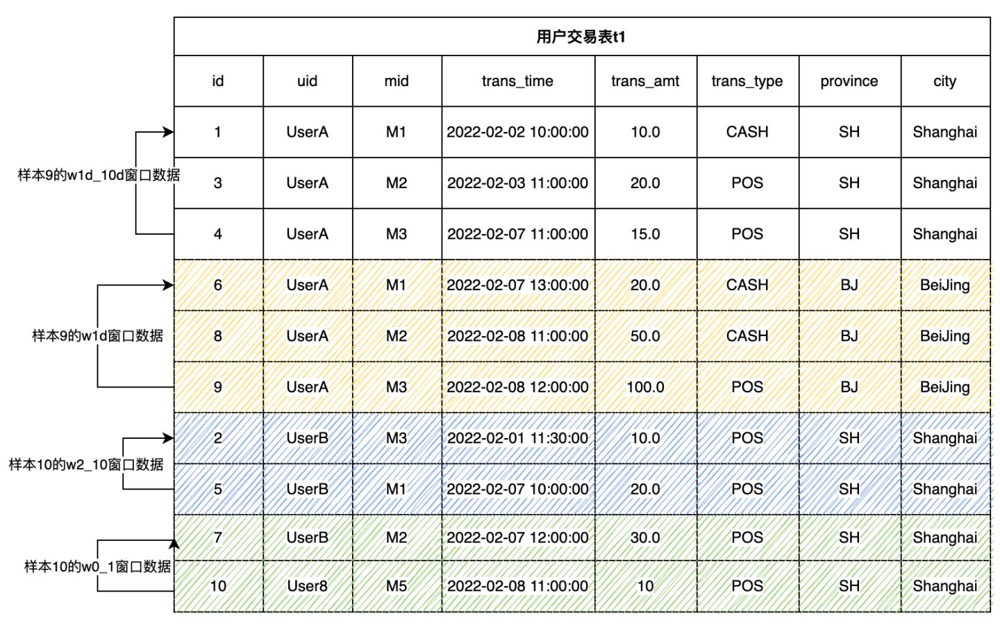

# Guidelines for Feature Engineering Development (Part 1)


## 1. What is the feature engineering of machine learning

A machine learning application in a real scene generally includes two main processes, namely **Feature Engineering** and **Machine Learning Model** (hereinafter referred to as **Model**). We must know a lot about the model and have the most contact at ordinary times. For example, from the classic logical regression and decision tree model to the deep learning model of the fire in recent years, we all focus on how to develop high-quality models. We may pay less attention to engineering features. However, you must have heard a famous saying that data and features determine the upper limit of machine learning, while models and algorithms only approach this upper limit. It can be seen that we have long agreed on the importance of Feature Engineering.

In one sentence, Feature Engineering is defined: Use specific domain knowledge to extract useful feature information from the original data. It emphasizes domain knowledge, that is to say, feature extraction is not a standardized process, but has different experience and methodology based on different scenarios. For a simple example, for the real-time recommendation system, the original data may only be the search keywords entered by users in real time, such as "washing machine", and the corresponding user and commodity data tables stored in the database. In order to make better real-time recommendation, the following more meaningful features can be considered:

- The home appliance brand that the user purchased the most in the past year
- The average consumption level of the user in the past three years
- In the past hour, the discount on the platform has been more than 70%, which is in line with the top three washing machine models purchased by users in this user gender and age group

As can be seen from the above example, features can be made quite complex and can have very high timeliness. So how to extract good features according to specific scenes is what data scientists need. At the same time, they need to be equipped with powerful tools to do Feature Engineering well. This tutorial will introduce you to how to do Feature Engineering in practice.

## 2. Feature Engineering Development Tool – OpenMLDB

Before introducing the Feature Engineering algorithm, it is necessary to understand the development and deployment tools of Feature Engineering. According to experience, we roughly classify them and summarize their advantages and disadvantages.

| Development Tool                                             | Entry Threshold                                              | Functional Support                                           | Engineering Landing                                          |
| ------------------------------------------------------------ | ------------------------------------------------------------ | ------------------------------------------------------------ | ------------------------------------------------------------ |
| Python                                                       | Low; Data is widely used by scientists                       | The function realization is relatively free. Through python programming, you can basically realize any operation script | More difficult. Python programs are generally inefficient and can be developed offline, but their performance generally can not meet the requirements of online real-time computing. In addition, users need to solve production-level features such as high availability. |
| General Database                                             | Medium, Development based on SQL                             | There is no optimization for Feature Engineering, the implementation of some features is awkward, or the operation efficiency is low after implementation. | Acceptable. However, the function or performance of feature calculation functions that support less friendly features may not meet the needs of production environment. |
| Hybrid Development, such as Offline Python, Online Database or C++ | It is very high and requires two skill stack teams to develop and maintain | Through development and customization, the functional requirements can be met. | Acceptable but costly. In addition to the development and operation cost, it is also necessary to solve the problem of online and offline consistency to ensure the consistency of offline and online effects. |
| OpenMLDB                                                     | Medium, Development based on SQL                             | For Feature Engineering optimization, it is extended based on standard SQL to efficiently support the common calculation methods of Feature Engineering | Low cost and efficient landing. Based on SQL development, the online development is realized, which naturally solves the problems of performance and online and offline consistency. |

From the above table, we can see that openmldb has unique advantages in function and engineering landing. Especially for the calculation of timing characteristics with high real-time performance, openmldb has a lot of targeted optimization. If you want to learn more about openmldb, you can read the relevant [introduction document]( https://zhuanlan.zhihu.com/p/462559609 ), and [GitHub repo of OpenMLDB]( https://github.com/4paradigm/OpenMLDB).

In this series of tutorials, we will demonstrate how to develop Feature Engineering scripts based on SQL syntax of openmldb. You can get started quickly by reading our document - [OpenMLDB]( http://docs-cn.openmldb.ai/2620852), to learn how to try out openmldb (based on docker image, it is recommended to try it quickly through stand-alone version); You can also find our [complete product description document](http://docs-cn.openmldb.ai/ ) here.

## 3. From 0 to 1, Feature Engineering Practice

We will introduce the common processing methods of Feature Engineering in two parts. This part will focus on single table feature processing, and the next part will focus on more complex multi-table feature computing. This paper uses the anti-fraud commonly used in the financial field as an actual case to describe.


Note that if you want to run the SQL illustrated in this tutorial, please follow the following two steps to prepare：

- It is recommended to use docker image to run this tutorial under **Stand-alone Version**. Refer to [OpenMLDB Quick Start](http://docs-cn.openmldb.ai/2620852 ) for image pull and CLI operation mode If using the clustered version, please use the offline mode（`SET @@execute_mode='offline'` ）. The normal online mode under the clustered CLI only supports the simple data preview function, so most of the SQL in the tutorial cannot be run.
- All data related to this tutorial and the import operation script can be downloaded [here]( https://openmldb.ai/download/tutorial_sql/tutoral_sql_data.zip)

### 3.1.1. Primary and Secondary Tables

**Main Table** is the main data table of feature extraction. Intuitively, it can be understood that the main table is a data table with label columns required for model training. In the process of Feature Engineering, feature calculation will be performed on each row of the main table to finally generate the corresponding **Feature Width Table**. For example, the following user transaction table (hereinafter referred to as data table t1) is the main table of the case described in this paper.

| Field      | Type      | Description                            |
| ---------- | --------- | -------------------------------------- |
| id         | BIGINT    | Sample ID, each sample has a unique ID |
| uid        | STRING    | User ID                                |
| mid        | STRING    | Merchant ID                            |
| cardno     | STRING    | Card Number                            |
| trans_time | TIMESTAMP | Transaction Time                       |
| trans_amt  | DOUBLE    | Transaction Amount                     |
| trans_type | STRING    | Transaction Type                       |
| province   | STRING    | Province                               |
| city       | STRING    | City                                   |
| label      | BOOL      | Sample label, true\|false              |

In addition to the main table, there may also be data tables in the database that store relevant auxiliary information, which can be spliced with the main table through the join operation. These tables are called **Secondary Tables** (note that there may be multiple secondary tables). For example, we can have a secondary table to store the merchant flow history. In the process of Feature Engineering, more valuable information can be obtained by splicing the information of main table and sub-standard. The Feature Engineering of multi-table will be introduced in detail in the next part of this series.

### 3.1.2. Types of Features

Before discussing the details of feature construction in depth, we need to classify the features commonly used in machine learning. From the perspective of building feature data sets and aggregation methods, there are four common features in machine learning:

- Single line feature of the main table: Processing and calculating expressions and functions for one or more columns of the main table.
- Timing characteristics of main table window: Build a timing window for the main table and process the timing characteristics in the window.
- Single line feature of sub table: The current main table row matches a record from the sub table and splices it, and then processes the single line feature of the spliced data row.
- Multi-row aggregation feature of sub table: The current main table row matches multiple records from the sub table and performs feature processing on multiple records.

The first part of this paper will focus on the single line characteristics of the main table and the time sequence characteristics of the main table window. The next part will specifically introduce the single line characteristics of the sub table and the multi-line aggregation characteristics of the sub table.

### 3.2. The Features of the Main Table Single Line

Perform expression and function processing calculation on one or more columns of the current main table row. It mainly includes the following ways.

**In-line Extraction**

Some columns of the main table can be directly used as features to participate in model training.

```sql
SELECT uid, trans_type FROM t1;
```

**Multi-row Machining**

Several columns of the main table can be processed into a feature through expressions or functions. For example, the following example splices province and city into a string as a feature.

```sql
SELECT concat(province, city) as province_city FROM t1
```

**Single Line Function Processing**

Calculate and process through the built-in function of the system or UDF. For example, days, hours and minutes are extracted as features.

```sql
SELECT 
day(trans_time) as f_trans_day, 
hour(trans_time) as f_trans_hour, 
minute(trans_time) as f_trans_minute FROM t1;
```

Other related functions also include numerical feature calculation (such as 'ceiling') and string feature calculation (such as 'substr').

### 3.3. Time-Series Features of Main Table Window

In many scenarios, the more commonly used feature construction method is based on the feature construction of time window. For example, transaction data and user behavior are time-series data with time stamp. Two steps need to be completed to construct the timing characteristics of the main table window:

- Step 1: Define Timing Window
- Step 2: Construct Features on the Timing Window

### 3.3.1. Step 1: Define Timing Window

We can define a specific timing window size either through the time interval (such as a month) or through the number of lines in the window (such as 100). The most basic definition of timing window:

```sql
window window_name as (PARTITION BY partition_col ORDER BY order_col ROWS_RANGE｜ROWS BETWEEN StartFrameBound AND EndFrameBound)
```

Among them, the most basic and indispensable grammatical elements include：

- `PARTITION BY partition_col`: Indicates that the window is in accordance with`partition_col`column grouping

- `ORDER BY order_col`: Indicates that the window is in accordance with`order_col`sorting columns

- `ROWS_RANGE`: Indicates that the window slides by time；`ROWS` Indicates that the window type is sliding by the number of bars

- `StartFrameBound`: Represents the upper bound of the window. In OpenMLDB, we can generally define the upper bound of the window as:

- - `UNBOUNDED PRECEDING`: No upper bound.
  - `time_expression PRECEDING`: If it is a time window, you can define a time offset. For example, '30d predicting' means that the upper bound of the window is the time of the current line - 30 days.
  - `number PRECEDING`: If it is the number of bars window, you can define the number of bars offset. For example, '100 predicting' indicates the first 100 lines of the current line whose upper bound is.

- `EndFrameBound`: Represents the lower bound of the time window. In OpenMLDB, we can generally define the lower bound of the window as:

- - `CURRENT ROW`： Current row
  - `time_expression PRECEDING`: A certain time offset, such as' 1D forecasting '. This indicates that the lower bound of the window is the time of the current line - 1 day.
  - `number PRECEDING`: If it is the number of bars window, you can define the number of bars offset. For example,`1 PRECEDING` represents the first row of the current row whose upper bound of the window is.

- When configuring the upper and lower boundaries of the window, please note:

- - At present, OpenMLDB cannot support the time after the current row as the upper and lower bounds. For example,`1d FOLLOWING`. In other words, we can only deal with the historical time window. This also basically meets most of the application scenarios of Feature Engineering.
  - Lower bound time of OpenMLDB must be > = Upper bound time
  - The number of lower bound entries of OpenMLDB must be < = The number of upper bound entries

For more syntax and features, please refer to [OpenMLDB window reference manual]( http://docs-cn.openmldb.ai/2620896)



The following example shows that for the transaction table t1 shown above, we define two time windows and two number windows. The window of each sample line is by user ID (`uid`) grouping and by the transaction time (`trans_time`) sorting. Note that the following window definitions are not a completed SQL. We will add aggregate functions later to complete runnable SQL.

- w1d: User most recent window

```sql
-- The window of the user's most recent day contains the data lines from the current line to the most recent day
window w1d as (PARTITION BY uid ORDER BY trans_time ROWS_RANGE BETWEEN 1d PRECEDING AND CURRENT ROW)
```

The w1d window of sample 9 contains three rows of data. Samples 6, 8 and 9 respectively. These three pieces of data fall within the time window of sample 9 [2022-02-07 12:00:00, 2022-02-08 12:00:00]。

- w1d_10d: User's windows 1 day ago and the last 10 days

```sql
-- The window of user 1d ~ 10d contains data lines 1 day ago and within 10 days
window w1d_10d as (PARTITION BY uid ORDER BY trans_time ROWS_RANGE BETWEEN 10d PRECEDING AND 1d PRECEDING)
```

w1d_10d of sample 9 window contains three rows of data. Samples 1, 3 and 4 respectively. These three pieces of data fall within the time window of sample 9[2022-01-29 12:00:00, 2022-02-07 12:00:00]。

- w0_1: User's last 0 ~ 1 line window

```sql
-- The last line window of the user, including the previous line and the current line
window w0_1 as (PARTITION BY uid ORDER BY trans_time ROWS BETWEEN 1 PRECEDING AND CURRENT ROW)
```

w0_1 of sample 10 window contains 2 rows of data. Sample 7 and sample 10, respectively。

- w2_10: User's last 2 ~ 10 lines of window

```sql
-- The last 2 ~ 10 lines of windows of the user, including the first 2 ~ 10 lines
window w2_10 as (PARTITION BY uid ORDER BY trans_time ROWS BETWEEN 10 PRECEDING AND 2 PRECEDING)
```

w2_10 of sample 10 window contains 2 rows of data. Sample 2 and sample 5, respectively.

### 3.3.2. Step 2: Multi-line Aggregate Function Processing

After defining the time window, we can calculate the multi-line aggregate function in the time window.

**Simple Aggregation Statistics**

Aggregate functions are currently supported with examples such as：`count()`, `sum()`, `max()`, `min()`, `avg()`

```sql
SELECT 
-- Total transaction amount in the last 30 days
sum(trans_amt) over w30d as w30d_sum_trans_amt,
-- Maximum transaction amount in the last 30 days
max(trans_amt) over w30d as w30d_max_trans_amt,
-- Average single transaction amount in the last 30 days
avg(trans_amt) over w30d as w30d_avg_trans_amt,
-- Total number of transactions in the last 30 days
count(trans_amt) over w30d as w30d_count_trans_amt
FROM t1 
window w30d as (PARTITION BY uid ORDER BY trans_time ROWS_RANGE BETWEEN 30d PRECEDING AND CURRENT ROW);
```

**Aggregate Statistics after Filtering**

First, filter the data set according to the conditions, and then make simple statistics. Example of the function shape of `xxx_where`:

```sql
xxx_where(col, filter_condition) over w
```

- Parameter `col`：The columns that participate in the aggregation calculation.
- Parameter `filter_condition`：Filter condition expression of data.

Currently supported with `_where` aggregate functions of type are:`count_where`, `sum_where`, `avg_where`, `max_where`, `min_where` .

Relevant examples are as follows:

```sql
SELECT 
-- Total POS transaction amount in the last 30 days
sum_where(trans_amt, trans_type = "POS") over w30d as w30d_sum_pos_trans_amt,
-- Maximum POS transaction amount in the last 30 days
max_where(trans_amt, trans_type = "POS") over w30d as w30d_max_pos_trans_amt,
-- Average single POS transaction amount in the last 30 days
avg_where(trans_amt, trans_type = "POS") over w30d as w30d_avg_pos_trans_amt,
-- Total number of POS transactions in the last 30 days
count_where(trans_amt, trans_type = "POS") over w30d as w30d_count_pos_trans_amt
FROM t1 
window w30d as (PARTITION BY uid ORDER BY trans_time ROWS_RANGE BETWEEN 30d PRECEDING AND CURRENT ROW);
```

**Aggregate Statistics after Grouping**

The data set is grouped according to a column, and then grouped for statistics. The statistical results are saved as `"k1:v1,k2:v2,k3:v3"` type of String.

Function shape of `xxx_cate`:

```sql
xxx_cate(col, cate) over w
```

- Parameter `col`：The columns that participate in the aggregation calculation.
- Parameter `cate`：Grouping column.

Currently supported with _cate, the aggregate function of suffix is:`count_cate`, `sum_cate`, `avg_cate`, `max_cate`, `min_cate`

Relevant examples are as follows:

```sql
SELECT 
-- Total number of transactions in each city in the last 30 days, "beijing:10,shanghai:3"
count_cate(trans_amt, city) over w30d as w30d_city_count_trans_amt,
-- Total transaction volume of each city in the last 30 days, "beijing:100,shanghai:30"
sum_cate(trans_amt, city) over w30d as w30d_city_sum_trans_amt,
-- Average transaction volume of each city in the last 30 days, "beijing:10,shanghai:10"
avg_cate(trans_amt, city) over w30d as w30d_city_avg_trans_amt,
-- Maximum transaction volume of each city in the last 30 days, "beijing:30,shanghai:15"
max_cate(trans_amt, city) over w30d as w30d_city_max_trans_amt,
-- Minimum transaction volume of each city in the last 30 days, "beijing:5,shanghai:5"
min_cate(trans_amt, city) over w30d as w30d_city_max_trans_amt
FROM t1 
window w30d as (PARTITION BY uid ORDER BY trans_time ROWS_RANGE BETWEEN 30d PRECEDING AND CURRENT ROW);
```

**Group Aggregation Statistics after Filtering**

First, filter the window according to conditions. Then, group the data set according to a column, and then group statistics. The statistical results are saved as`"k1:v1,k2:v2,k3:v3"`type of String

Function shape of `xxx_cate_where`:

```text
xxx_cate_where(col, filter_condition, cate) over w
```

- Parameter `col`：The columns that participate in the aggregation calculation.
- Parameter `filter_condition`：Filter condition expression of data.
- Parameter `cate`: Group columns.

Currently, the supported statistical functions of grouping and aggregation after filtering are:`count_cate_where`, `sum_cate_where`, `avg_cate_where`, `max_cate_where`, `min_cate_where`

Relevant examples are as follows:

```sql
SELECT 
-- Number of POS transactions in each city in the last 30 days, "beijing:5,shanghai:2"
count_cate_where(trans_amt, trans_type = "POS", city) over w30d as w30d_city_count_pos_trans_amt,
-- Total POS transactions by city in the last 30 days, "beijing:60,shanghai:25"
sum_cate_where(trans_amt, trans_type = "POS", city) over w30d as w30d_city_sum_pos_trans_amt,
-- Average POS transaction volume of each city in the last 30 days, "beijing:12,shanghai:12.5"
avg_cate_where(trans_amt, trans_type = "POS", city) over w30d as w30d_city_avg_pos_trans_amt,
-- Maximum POS turnover of each city in the last 30 days, "beijing:30,shanghai:15"
max_cate_where(trans_amt, trans_type = "POS", city) over w30d as w30d_city_count_pos_trans_amt,
-- Minimum POS transaction volume of each city in the last 30 days, "beijing:5,shanghai:10"
min_cate_where(trans_amt, trans_type = "POS", city) over w30d as w30d_city_count_pos_trans_amt
FROM t1 
window w30d as (PARTITION BY uid ORDER BY trans_time ROWS_RANGE BETWEEN 30d PRECEDING AND CURRENT ROW);
```

**Frequency Statistics by Type Column**

Usually, we make frequency statistics for type characteristics. For example, we may need to count the types with the highest frequency and the frequency proportion of the types with the highest frequency in various categories.

The features of Top ratio `fz_top1_ratio`：Find the proportion of the maximum count of a category count in the window to the total data of the window.

```sql
SELECT 
-- Proportion of transactions in cities with the largest number of transactions in the last 30 days
fz_top1_ratio(city) over w30d as top_city_ratio 
FROM t1 
window w30d as (PARTITION BY uid ORDER BY trans_time ROWS_RANGE BETWEEN 30d PRECEDING AND CURRENT ROW);
```

The feature of Top N `fz_topn_frequency(col, top_n)`: Find the N categories with the highest classification frequency in the window

```sql
SELECT 
-- Two cities with the largest number of transactions in the last 30 days, "beijing,shanghai"
fz_topn_frequency(city, 2) over w30d as top_city_ratio
FROM t1 
window w30d as (PARTITION BY uid ORDER BY trans_time ROWS_RANGE BETWEEN 30d PRECEDING AND CURRENT ROW);
```

## 4. Extended Reading and the Next Preview

- [Open-source Machine Learning Database OpenMLDB v0.4.0 Product Introduction](https://zhuanlan.zhihu.com/p/462559609)
- Want to quickly try the OpenMLDB to start writing feature calculation scripts? Let's take a look at [OpenMLDB Quick Start](http://docs-cn.openmldb.ai/2620852)
- Complete SQL syntax reference [China Mirror Site]( http://docs-cn.openmldb.ai/2620876), [International Site](https://docs.openmldb.ai/)
- The second part of this series of tutorials: [4PD Developer Community: In Simple Terms, Feature Engineering -- A Practical Guide based on OpenMLDB (Part 2)](https://zhuanlan.zhihu.com/p/472080344)

