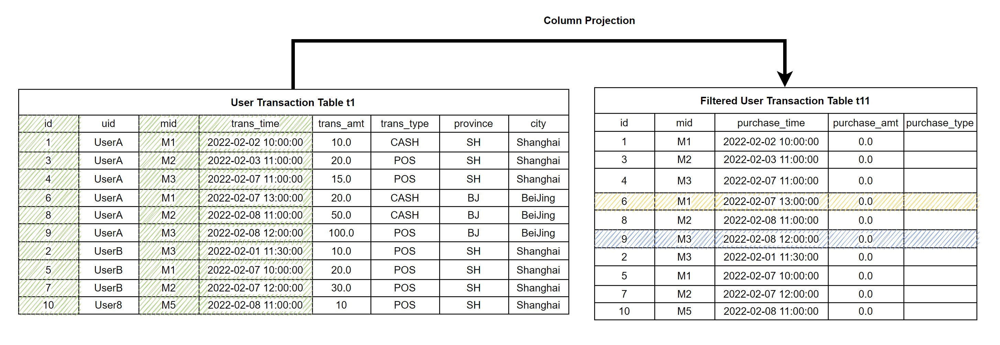
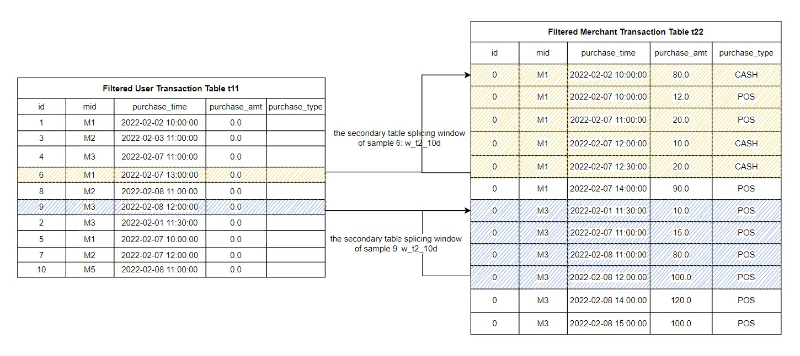

# Guidelines for Feature Engineering Development (Part 2)

## 1. Preliminary Knowledge

In the previous series of articles [Hands-On Tutorial for Feature Engineering Based on OpenMLDB (Part 1)](./tutorial_sql_1.md)）, we introduce the basic concepts and practical tools of Feature Engineering, as well as the basic feature script development based on single table. In this article, we will introduce in detail the more complex and powerful feature script development of the multi-table based on the main table and sub table. At the same time, we still rely on the SQL syntax provided by OpenMLDB for Feature Engineering script examples. For more information about OpenMLDB, please visit [GitHub repo of OpenMLDB](https://github.com/4paradigm/OpenMLDB), and the [document website](http://docs-cn.openmldb.ai/).

If you want to run the SQL illustrated in this tutorial, please follow the following two steps to prepare:

- It is recommended to use the OpenMLDB docker image to run this tutorial under **Stand-alone Version**. Refer to [OpenMLDB Quick Start](http://docs-cn.openmldb.ai/2620852) for the operation mode. If using the clustered version, please use the offline mode（`SET @@execute_mode='offline'` ）. The common online mode of the cluster version only supports the simple data preview function, so most of the SQL in the tutorial cannot be run.
- All data related to this tutorial and the import operation script can be downloaded [here](https://openmldb.ai/download/tutorial_sql/tutoral_sql_data.zip).

In this article, we will use the main table and sub table to illustrate. We still use the sample data of anti-fraud transactions in the previous article, including a main table user transaction table (Table 1, t1) and a sub table merchant flow table (Table 2, t2). In order to avoid the consistency of multiple data tables in the database design, it is necessary to store multiple data tables in the database design according to the general design principle. In Feature Engineering, in order to obtain enough effective information, data needs to be extracted from multiple tables thus, Feature Engineering needs to be carried out based on multiple tables.

**Table 1: Main Table, User Transaction Table t1**

| Field      | Type      | Description                             |
| ---------- | --------- | --------------------------------------- |
| id         | BIGINT    | Sample ID, each sample has an unique ID |
| uid        | STRING    | User ID                                 |
| mid        | STRING    | Merchant ID                             |
| cardno     | STRING    | Card Number                             |
| trans_time | TIMESTAMP | Transaction Time                        |
| trans_amt  | DOUBLE    | Transaction Amount                      |
| trans_type | STRING    | Transaction Type                        |
| province   | STRING    | Province                                |
| city       | STRING    | City                                    |
| label      | BOOL      | Sample label, true\|false               |

**Sub Table: Table 2, Merchant Flow Table t2**

| Field         | Type      | Description                      |
| ------------- | --------- | -------------------------------- |
| mid           | STRING    | Merchant ID                      |
| card          | STRING    | Card Number                      |
| purchase_time | TIMESTAMP | Purchase Time                    |
| purchase_amt  | DOUBLE    | Purchase Amount                  |
| purchase_type | STRING    | Purchase Type: Cash, Credit Card |

In the traditional relational database, in order to obtain the information of multiple tables, the most common way is to use join for splicing. However, for the requirements of Feature Engineering, the database join can not meet the requirements very efficiently. The main reason is that our main table sample table has a label column for model training, and each value can only correspond to one row of data records. Therefore, in practice, we hope that after join, the number of rows in the result table should be consistent with that in the main table.

## 2. Sub Table Single Line Feature

## 2.1 LAST JOIN

OpenMLDB currently supports`LAST JOIN`to perform database like join operations. LAST JOIN can be regarded as a special LEFT JOIN. On the premise of meeting the JOIN conditions, each row of the left table will spell the last row that meets the conditions. LAST JOIN is divided into disordered splicing and ordered splicing. Let's take a simpler table as an example and assume that the schemas of tables s1 and s2 are

```sql
(id int, col1 string, std_ts timestamp)
```

Then, we can do the following join operation:

```sql
-- des c: In view of LAST JOIN splicing based on ORDER BY
SELECT * FROM s1 LAST JOIN s2 ORDER BY s2.std_ts ON s1.col1 = s2.col1;
```

As shown below, when `LAST JOIN` configure in `ORDER BY`，right click `std_ts` sort and splice the last hit data row. Take the second behavior of the left table as an example. There are 2 qualified right tables. Press `std_ts` after sorting and select the last item `3, b, 2020-05-20 10:11:13` .


## 3. Multi-Row Aggregation Feature of Sub Table

For the sub table splicing scenario, OpenMLDB extends the standard window syntax and adds [WINDOW UNION]( http://docs-cn.openmldb.ai/2620896) characteristic. It supports splicing multiple pieces of data from the sub table to form a sub table window. Based on the sub table splicing window, it is convenient to construct the multi-row aggregation feature of the sub table. Similarly, two steps need to be completed to construct the multi-row aggregation feature of the sub table:

- Step 1: Define the sub table splicing window.
- Step 2: Construct the multi-row aggregation feature of the sub table on the sub table splicing window.

## 3.1 Step 1: Define the Sub Table Splicing Window

Each sample row of the main table can splice multiple rows of data according to a column from the sub table, and it is allowed to define the time interval or number interval of spliced data. We use the special window syntax WINDOW UNION to define the sub table splicing condition and interval range. For the convenience of understanding, we call this kind of window as sub table splicing window.

The syntax of sub table splicing window is defined as:

```sql
window window_name as (UNION other_table PARTITION BY key_col ORDER BY order_col ROWS_RANGE｜ROWS BETWEEN StartFrameBound AND EndFrameBound)
```

Among them, the most basic and indispensable grammatical elements include:

- `UNION other_table`： `other_table` refers to the secondary table for WINDOW UNIOB. The primary and secondary tables need to keep the schema consistent. In most cases, the schema of the primary table and the secondary table are different. Therefore, we can ensure that the schema of the primary and secondary tables involved in window calculation is consistent by column filtering and default column configuration for the primary and secondary tables. Column filtering can also remove useless columns and only do WINDOW UNION and aggregation on key columns.

- `PARTITION BY key_col`: Indicates by column `key_col` splice matching data from the secondary table.

- `ORDER BY order_col`: Indicates that the sub table splicing data set is in accordance with`order_col`sorting columns

- `ROWS_RANGE BETWEEN StartFrameBound AND EndFrameBound`: Represents the time interval of the sub table splicing window

- - `StartFrameBound`Represents the upper bound of the window.

  - - `UNBOUNDED PRECEDING`: No upper bound.
    - `time_expression PRECEDING`: If it is a time interval, you can define a time offset. For example, `30d preceding` means that the upper bound of the window is the time of the current line - 30 days.

  - `EndFrameBound`Represents the lower bound of the time window.

  - - `CURRENT ROW`： Current row
    - `time_expression PRECEDING`: If it is a time interval, you can define a time offset, such as `1d PRECEDING`. This indicates that the lower bound of the window is the time of the current line - 1 day.

- `ROWS BETWEEN StartFrameBound AND EndFrameBound`: Represents the time interval of the sub table splicing window.

- - `StartFrameBound`Represents the upper bound of the window.

  - - `UNBOUNDED PRECEDING`: No upper bound.
    - `number PRECEDING`: If it is a number interval, you can define the number of time items. For example, `100 PRECEDING` indicates the first 100 lines of the current line whose upper bound is.

  - `EndFrameBound`Represents the lower bound of the time window.

  - - `CURRENT ROW`： Current row
    - `number PRECEDING`: If it is a number window, you can define the number of time bars. For example,`1 PRECEDING` indicates the first line of the current line whose upper bound is

- When configuring the window interval boundary, please note:

- - At present, OpenMLDB cannot support the time after the current row as the upper and lower bounds. For example, `1d FOLLOWING`. In other words, we can only deal with the historical time window. This also basically meets most of the application scenarios of Feature Engineering.
  - Lower bound time of OpenMLDB must be > = Upper bound time
  - The number of lower bounds of OpenMLDB must be < = The number of upper bounds

- `INSTANCE_NOT_IN_WINDOW`: Mark as a secondary table splicing window. Except for the current row, other data in the main table will not enter the window.

For more syntax and features, please refer to [OpenMLDB WINDOW UNION Reference Manual](https://link.zhihu.com/?target=http%3A//docs-cn.openmldb.ai/2620896).

The following describes the splicing window definition operation of WINDOW UNION through specific examples. For the user transaction table t1 mentioned above, we need to define the splicing window on the sub table of merchant flow table t2, which is based on `mid`. Because the schemas of t1 and t2 are different, we first extract the same columns from t1 and t2 respectively. For non-existent columns, you can configure default values. Among them, `mid` column is used for the splicing of two tables, so it is necessary. Secondly, the timestamp column（`trans_time` in t1 and `purchase_time` in t2）contains timing information, which is also necessary when defining the time window; The remaining columns are filtered and retained as required by the aggregation function.

The following SQL and schematic diagrams extract the necessary columns from t1 to generate t11.

```sql
(select id, mid, trans_time as purchase_time, 0.0 as purchase_amt, "" as purchase_type from t1) as t11
```



The following SQL and diagram extract the necessary columns from t2 to generate t22.

```sql
(select 0L as id, mid, purchase_time, purchase_amt, purchase_type from t2) as t22
```


It can be seen that the tables t11 and t22 generated after extraction have the same schema, and they can perform logical union operation. However, in OpenMLDB, the WINDOW UNION is not really for the UNION operation in the traditional database, but to build the time window on the sub table t22 for each sample row in t11. According to the merchant ID `mid` ，we obtain the corresponding splicing data from t22 for each row of data in t11, and then sort it according to the consumption time (`purchase_time`) to construct the sub table splicing window. For example, we define a `w_t2_10d` window: It does not include the data rows of the main table except the current row, plus the data within ten days spliced by the sub table through `mid`. The schematic diagram is as follows. It can be seen that the yellow and blue shaded parts define the sub table splicing windows of sample 6 and sample 9 respectively.



The SQL script of the window definition process is as follows (Note that this is not a complete SQL):

```sql
(SELECT id, mid, trans_time as purchase_time, 0.0 as purchase_amt, "" as purchage_type FROM t1) as t11
window w_t2_10d as (
UNION (SELECT 0L as id, mid, purchase_time, purchase_amt, purchase_type FROM t2) as t22 
PARTITION BY mid ORDER BY purchase_time
ROWS_RANGE BETWEEN 10d PRECEDING AND 1 PRECEDING INSTANCE_NOT_IN_WINDOW)
```

## 3.2 Step 2: Build Multi-row Aggregation Feature of Sub Table

For the sub table splicing window, the multi-row aggregation function is processed to construct the multi-row sub table aggregation feature, so that the number of rows finally generated is the same as that of the main table. Taking the simple aggregation function as an example, we can construct the sub table splicing feature of the sample: The total retail sales of merchants in the last 10 days `w10d_merchant_purchase_amt_sum` and the total consumption times of the merchant in the last 10 days `w10d_merchant_purchase_count`. The following SQL constructs the multi-row aggregation feature based on the sub table splicing window defined in 3.1 above.

```sql
SELECT 
id, 
-- Total retail sales of sample merchants in the last 10 days
sum(purchase_amt) over w_t2_10d as w10d_merchant_purchase_amt_sum,
-- Transaction times of sample merchants in the last 10 days
count(purchase_amt) over w_t2_10d as w10d_merchant_purchase_count 
FROM   
(SELECT id, mid, trans_time as purchase_time, 0.0 as purchase_amt, "" as purchase_type FROM t1) as t11
window w_t2_10d as (
UNION (SELECT 0L as id, mid, purchase_time, purchase_amt, purchase_type FROM t2) as t22 
PARTITION BY mid ORDER BY purchase_time
ROWS_RANGE BETWEEN 10d PRECEDING AND 1 PRECEDING INSTANCE_NOT_IN_WINDOW)
```

## 4. Feature Group Construction

Generally speaking, a complete feature extraction script will extract dozens, hundreds or even ten of hundreds of features. We can divide these features into several groups according to the feature type, the table and window associated with the feature, and then put each group of features into different SQL sub queries. Finally, these sub queries are spliced together according to the main table ID. In this section, we will continue the previous examples to demonstrate that if various features are spliced together to form a feature wide table.

First, we divide the features into 3 groups:

| Feature Group | Feature Group Description                                    |
| ------------- | ------------------------------------------------------------ |
| 1             | Single line characteristics of sample users (primary table) and sample merchants (secondary table) |
| 2             | Window aggregation characteristics of sample users (main table) in the last 30 days and window aggregation characteristics of users in the last 7 days |
| 3             | Aggregation characteristics of sample merchants (sub table) in the last 30 days |

Then, we use OpenMLDB SQL to build the same set of features in the same sub query:

- Feature Group 1

```sql
  -- Main table single line features
  SELECT 
  -- Column direct extraction
  id, uid, trans_type, 
  -- Single line time characteristics：day of week
  dayofweek(trans_time) as f_trans_day_of_week, 
  -- Time characteristics of single line: Transaction day
  day(trans_time) as f_trans_day, 
  -- Single line time characteristics: Transaction hours
  hour(trans_time) as f_trans_hour, 
  -- Single line time characteristics: Transaction minutes
  minute(trans_time),
  -- Mathematical characteristics of single line: The transaction amount is rounded up and then taken as logarithm
  log(ceiling(trans_amt)) as f_trans_amt_log,
  -- Single line string feature: The first four digits of card number
  substr(cardno, 1, 4),
  -- Secondary table features
  t2.purchase_time as f_purchase_time, 
  t2.purchase_amt as f_purchase_amt, 
  t2.purchase_type as f_purchase_type
  
  FROM t1 LAST JOIN t2 ORDER BY t2.purchase_time ON t1.mid = t2.mid
```

- Feature Group 2

```sql
  -- Main table window features
  SELECT 
  id as out2id,
  -- Total POS transaction amount in the last 30 days
  sum_where(trans_amt, trans_type = "POS") over w30d as w30d_sum_pos_trans_amt,
  -- Maximum POS transaction amount in the last 30 days
  max_where(trans_amt, trans_type = "POS") over w30d as w30d_max_pos_trans_amt,
  -- Average single POS transaction amount in the last 30 days
  avg_where(trans_amt, trans_type = "POS") over w30d as w30d_avg_pos_trans_amt,
  -- Total number of POS transactions in the last 30 days
  count_where(trans_amt, trans_type = "POS") over w30d as w30d_count_pos_trans_amt,
  
  -- Total transaction amount in the last week
  sum(trans_amt) over w7d as w7d_sum_trans_amt,
  -- Total number of transactions in the last week
  count(trans_amt) over w7d as w7d_count_trans_amt,
  from t1
  -- Windows in the last 30 days
  window w30d as (PARTITION BY uid ORDER BY trans_time ROWS_RANGE BETWEEN 30d PRECEDING AND CURRENT ROW),
  -- Last week's window
  w7d as (PARTITION BY uid ORDER BY trans_time ROWS_RANGE BETWEEN 7d PRECEDING AND CURRENT ROW)
```

- Feature Group 3

```sql
-- Side table aggregation feature
  SELECT 
  id as out3id,
  -- Total retail sales of sample merchants in the last week
  sum(purchase_amt) over w7d_merchant as w7d_merchant_purchase_amt_sum,
  -- Transaction times of sample merchants in the last week
  count(purchase_amt) over w7d_merchant as w7d_merchant_purchase_count,
  -- Main table merchant's flow in the last week
  FROM (select id, mid, cardno as card, trans_time as purchase_time, 0.0 as purchase_amt, "" as purchase_type from t1) as t11
   window w7d_merchant as (UNION (select 0L as id, mid, card, purchase_time, purchase_amt, purchase_type from t2) as t22 PARTITION BY mid ORDER BY purchase_time ROWS_RANGE BETWEEN 30d PRECEDING AND 1 PRECEDING INSTANCE_NOT_IN_WINDOW)
```

Finally, the three groups of features are spliced together according to the main table ID:

```sql
SELECT * FROM 
-- Feature group 1
(
  -- Main table single line features
  SELECT 
  -- Column direct extraction
  id, uid, trans_type, 
  -- Single line time characteristics：Day of week
  dayofweek(trans_time) as f_trans_day_of_week, 
  -- Time characteristics of single line: Transaction day
  day(trans_time) as f_trans_day, 
  -- Single line time characteristics: Transaction hours
  hour(trans_time) as f_trans_hour, 
  -- Single line time characteristics: Transaction minutes
  minute(trans_time),
  -- Mathematical characteristics of single line: The transaction amount is rounded up and then taken as logarithm
  log(ceiling(trans_amt)) as f_trans_amt_log,
  -- Single line string feature: The first four digits of card number
  substr(cardno, 1, 4),
  
  -- Secondary table features
  t2.purchase_time as f_purchase_time, 
  t2.purchase_amt as f_purchase_amt, 
  t2.purchase_type as f_purchase_type
  
  FROM t1 LAST JOIN t2 ORDER BY t2.purchase_time ON t1.mid = t2.mid
) as out1 LAST JOIN 
-- Feature group 2
(
  -- Main table window features
  SELECT 
  id as out2id,
  -- Total POS transaction amount in the last 30 days
  sum_where(trans_amt, trans_type = "POS") over w30d as w30d_sum_pos_trans_amt,
  -- Maximum POS transaction amount in the last 30 days
  max_where(trans_amt, trans_type = "POS") over w30d as w30d_max_pos_trans_amt,
  -- Average single POS transaction amount in the last 30 days
  avg_where(trans_amt, trans_type = "POS") over w30d as w30d_avg_pos_trans_amt,
  -- Total number of POS transactions in the last 30 days
  count_where(trans_amt, trans_type = "POS") over w30d as w30d_count_pos_trans_amt,
  
  -- Total transaction amount in the last week
  sum(trans_amt) over w7d as w7d_sum_trans_amt,
  -- Total number of transactions in the last week
  count(trans_amt) over w7d as w7d_count_trans_amt 
  from t1
  -- Windows in the last 30 days
  window w30d as (PARTITION BY uid ORDER BY trans_time ROWS_RANGE BETWEEN 30d PRECEDING AND CURRENT ROW),
  -- Last week's window
  w7d as (PARTITION BY uid ORDER BY trans_time ROWS_RANGE BETWEEN 7d PRECEDING AND CURRENT ROW)
) as out2 ON out1.id = out2.out2id LAST JOIN
-- Feature group 3
(
   -- Side table aggregation feature
   SELECT
   id as out3id,
   -- Total retail sales of sample merchants in the last week
   sum(purchase_amt) over w7d_merchant as w7d_merchant_purchase_amt_sum,
   -- Transaction times of sample merchants in the last week
   count(purchase_amt) over w7d_merchant as w7d_merchant_purchase_count
   -- Main table merchant's flow in the last week
   FROM (select id, mid, cardno as card, trans_time as purchase_time, 0.0 as purchase_amt, "" as purchase_type from t1) as t11
   window w7d_merchant as (UNION (select 0L as id, mid, card, purchase_time, purchase_amt, purchase_type from t2) as t22 PARTITION BY mid ORDER BY purchase_time ROWS_RANGE BETWEEN 30d PRECEDING AND 1 PRECEDING INSTANCE_NOT_IN_WINDOW)
) as out3 ON out1.id = out3.out3id;
```

## 5. Extended Reading

- [Open-source Machine Learning Database OpenMLDB v0.4.0 Product Introduction](https://zhuanlan.zhihu.com/p/462559609)
- Want to quickly try the OpenMLDB to start writing feature calculation scripts? Let's take a look at [OpenMLDB Quick Start](http://docs-cn.openmldb.ai/2620852)
- Complete SQL syntax reference document: [China Mirror Site](http://docs-cn.openmldb.ai/2620876) and  [International Site](https://docs.openmldb.ai/)
- The first part of this series of tutorials: [4PD Developer Community: In Simple Terms, Feature Engineering - Practice Guide based on OpenMLDB (Part 1)](https://zhuanlan.zhihu.com/p/467625760)