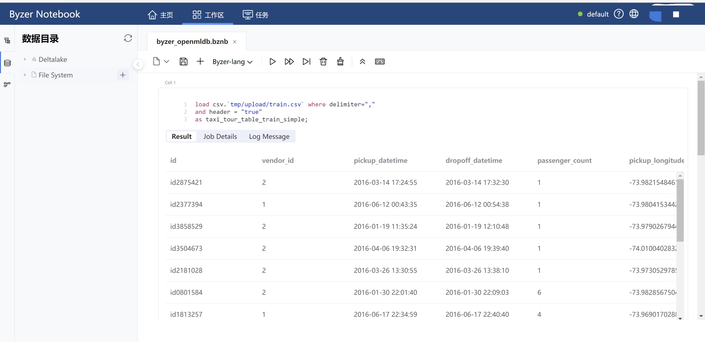

# Build End-to-end Machine Learning Applications Based on SQL (OpenMLDB + Byzer)

This tutorial will show you how to complete a machine learning workflow with the help of [OpenMLDB](https://github.com/4paradigm/OpenMLDB) and [Byzer](https://www.byzer.org/home).
The OpenMLDB will compute the features of the real-time data in terms of the commands and data sent by Byzer and will return the dataset been processed to Byzer for later training and prediction.

## 1. Preparations

### 1.1 Install OpenMLDB

1. The demo will use the OpenMLDB cluster version running in Docker. See [OpenMLDB Quickstart](../quickstart/openmldb_quickstart.md) for detail installation procedures.
2. Please modify the OpenMLDB IP configuration in order to enable the Byzer engine to access the OpenMLDB service out of the container. See [IP Configuration](../reference/ip_tips.md) for detail guidance.

### 1.2 Install the Byzer Engine and the Byzer Notebook 

1. For detail installation procedures of Byzer engine, see [Byzer Language Doc](https://docs.byzer.org/#/byzer-lang/en-us/).

2. We have to use the [OpenMLDB plugin](https://github.com/byzer-org/byzer-extension/tree/master/byzer-openmldb) developed by Byzer to transmit messages between two platforms. To use plugin in Byzer, please configure `streaming.datalake.path`, see [the manual of Byzer Configuration](https://docs.byzer.org/#/byzer-lang/zh-cn/installation/configuration/byzer-lang-configuration) for detail.

3. Byzer Notebook is used in this demo. Please install it after the installation of Byzer engine. You can also use the [VSCode Byzer plugin](https://docs.byzer.org/#/byzer-lang/zh-cn/installation/vscode/byzer-vscode-extension-installation) to connect your Byzer engine. The interface of Byzer Notebook is shown below, see [Byzer Notebook Doc](https://docs.byzer.org/#/byzer-notebook/zh-cn/) for more about it. 



### 1.3 Dataset Preparation
In this case, the dataset comes from the Kaggle taxi trip duration prediction problem. If it is not in your Byzer `Deltalake`, [download](https://www.kaggle.com/c/nyc-taxi-trip-duration/overview) it first. Please remember to import it into Byzer Notebook after download.


## 2. The Workflow of Machine Learning

### 2.1 Load the Dataset

Please import the origin dataset into the `File System` of Byzer Notebook, it will automatically generate the storage path `tmp/upload`.
Use the `load` Byzer Lang command as below to load this dataset.
```sql
load csv.`tmp/upload/train.csv` where delimiter=","
and header = "true"
as taxi_tour_table_train_simple;
```

### 2.2 Import the Dataset into OpenMLDB

Install the OpenMLDB plugin in Byzer.

```sql
!plugin app add - "byzer-openmldb-3.0";
```

Now you can use this plugin to connect OpenMLDB. **Please make sure the OpenMLDB engine has started and there is a database named `db1` before you run the following code block in Byzer Notebook.**

```sql
run command as FeatureStoreExt.`` where
zkAddress="172.17.0.2:7527"
and `sql-0`='''
SET @@execute_mode='offline';
'''
and `sql-1`='''
SET @@job_timeout=20000000;
'''
and `sql-2`='''
CREATE TABLE t1(id string, vendor_id int, pickup_datetime timestamp, dropoff_datetime timestamp, passenger_count int, pickup_longitude double, pickup_latitude double, dropoff_longitude double, dropoff_latitude double, store_and_fwd_flag string, trip_duration int);
'''
and `sql-3`='''
LOAD DATA INFILE 'tmp/upload/train.csv'
INTO TABLE t1 options(format='csv',header=true,mode='append');
'''
and db="db1"
and action="ddl";
```

```{note}
1. The port number of zkAddress should correspond with the files' IP configuration under the OpenMLDB `conf/` path.
2. You can check the `streaming.plugin.clzznames` of the `\byzer.properties.override` file, which is under the `$BYZER_HOME\conf` path of Byzer, to see if the `byzer-openmldb-3.0` plugin is successfully installed. You can see the main class name `tech.mlsql.plugins.openmldb.ByzerApp` after installation. 
3. If the plugin installation fail, download the `.jar` files and [install it offline](https://docs.byzer.org/#/byzer-lang/zh-cn/extension/installation/offline_install). 
```

### 2.3 Real-time Feature Extractions

本例借用[OpenMLDB + LightGBM：出租车行程时间预测](./taxi_tour_duration_prediction.md)2.3节中设计的特征进行特征计算，并将处理后的数据集导出为本地csv文件。

```sql
run command as FeatureStoreExt.`` where
zkAddress="172.17.0.2:7527"
and `sql-0`='''
SET @@execute_mode='offline';
'''
and `sql-1`='''
SET @@job_timeout=20000000;
'''
and `sql-2`='''
SELECT trp_duration, passanger_count,
sum(pickup_latitude) OVER w AS vendor_sum_pl,
max(pickup_latitude) OVER w AS vendor_max_pl,
min(pickup_latitude) OVER w AS vendor_min_pl,
avg(pickup_latitude) OVER W AS vendor_avg_pl,
sum(pickup_latitude) OVER w2 AS pc_sum_pl,
max(pickup_latitude) OVER w2 AS pc_max_pl,
min(pickup_latitude) OVER w2 AS pc_min_pl,
avg(pickup_latitude) OVER w2 AS pc_avg_pl,
count(vendor_id) OVER w2 AS pc_cnt,
count(vendor_id) OVER w AS vendor_cnt
FROM t1
WINDOW w AS(PARTITION BY vendor_id ORDER BY ickup_datetime ROWS_RANGE BETWEEN 1d PRECEDING AND CURRENT ROW),
w2 AS(PARTITION BY passenger_count ORDER BY pickup_datetime ROWS_RANGE BETWEEN 1d PRECEDING AND CURRENT ROW) INTO OUTFILE '/tmp/feature_data';
'''
and db="db1"
and action="ddl";
```


### 2.4 Data Vectorization 

在Byzer Noetbbook中将所有int 类型字段都转化为 double。

```sql
select *, 
cast(passenger_count as double) as passenger_count_d,
cast(pc_cnt as double) as pc_cnt_d,
cast(vendor_cnt as double) as vendor_cnt_d
from feature_data
as new_feature_data;
```

接着把所有字段合并成一个向量。

```sql
select vec_dense(array(
passenger_count_d,
vendor_sum_pl,
vendor_max_pl,
vendor_min_pl,
vendor_avg_pl,
pc_sum_pl,
pc_max_pl,
pc_min_pl,
pc_avg_pl,
pc_cnt_d,
vendor_cnt
)) as features,cast(trip_duration as double) as label
from new_feature_data
as trainning_table;

```


### 2.5 Training

使用Byzer Lang的train命令和其[内置的线性回归算法](https://docs.byzer.org/#/byzer-lang/zh-cn/ml/algs/linear_regression)训练模型，并将训练好的模型保存到/model/tax-trip路径下。

```sql
train trainning_table as LinearRegression.`/model/tax-trip` where

keepVersion="true"

and evaluateTable="trainning_table"
and `fitParam.0.labelCol`="label"
and `fitParam.0.featuresCol`= "features"
and `fitParam.0.maxIter`="50";

```

```{note}
可以使用`!show et/params/LinearRegression;`命令查看Byzer内置的线性回归模型的相关参数。 
```

### 2.6 Feature Deployment

将特征计算逻辑部署到OpenMLDB上：将最满意的一次特征计算的代码拷贝后修改执行模式为online即可。本例使用的是前文展示的特征工程中的代码。

```sql
run command as FeatureStoreExt.`` where
zkAddress="172.17.0.2:7527"
and `sql-0`='''
SET @@execute_mode='online';
'''
and `sql-1`='''
SET @@job_timeout=20000000;
'''
and `sql-2`='''
SELECT trp_duration, passanger_count,
sum(pickup_latitude) OVER w AS vendor_sum_pl,
max(pickup_latitude) OVER w AS vendor_max_pl,
min(pickup_latitude) OVER w AS vendor_min_pl,
avg(pickup_latitude) OVER W AS vendor_avg_pl,
sum(pickup_latitude) OVER w2 AS pc_sum_pl,
max(pickup_latitude) OVER w2 AS pc_max_pl,
min(pickup_latitude) OVER w2 AS pc_min_pl,
avg(pickup_latitude) OVER w2 AS pc_avg_pl,
count(vendor_id) OVER w2 AS pc_cnt,
count(vendor_id) OVER w AS vendor_cnt
FROM t1
WINDOW w AS(PARTITION BY vendor_id ORDER BY ickup_datetime ROWS_RANGE BETWEEN 1d PRECEDING AND CURRENT ROW),
w2 AS(PARTITION BY passenger_count ORDER BY pickup_datetime ROWS_RANGE BETWEEN 1d PRECEDING AND CURRENT ROW) INTO OUTFILE '/tmp/feature_data_test';
'''
and db="db1"
and action="ddl";

```

导入在线数据，本例使用的是原始数据集中的test集。生产环境中可以接入实时数据源。

```sql
run command as FeatureStoreExt.`` where
zkAddress="172.17.0.2:7527"
and `sql-0`='''
SET @@execute_mode='online';
'''
and `sql-1`='''
SET @@job_timeout=20000000;
'''
and `sql-2`='''
CREATE TABLE t1(id string, vendor_id int, pickup_datetime timestamp, dropoff_datetime timestamp, passenger_count int, pickup_longitude double, pickup_latitude double, dropoff_longitude double, dropoff_latitude double, store_and_fwd_flag string, trip_duration int);
'''
and `sql-3`='''
LOAD DATA INFILE 'tmp/upload/test.csv'
INTO TABLE t1 options(format='csv',header=true,mode='append');
'''
and db="db1"
and action="ddl";
```


### 2.7 Model Deployment

在Byzer Noetbook中将之前保存的、训练好的模型注册为一个可以直接使用的函数。

```sql
register LinearRegression.`/model/tax-trip` as tax_trip_model_predict;
```

### 2.8 Prediction

将经OpenMLDB处理后的数据集所有int类型字段转成double。

```sql
select *, 
cast(passenger_count as double) as passenger_count_d,
cast(pc_cnt as double) as pc_cnt_d,
cast(vendor_cnt as double) as vendor_cnt_d
from feature_data_test
as new_feature_data_test;
```

再进行向量化。

```sql
select vec_dense(array(
passenger_count_d,
vendor_sum_pl,
vendor_max_pl,
vendor_min_pl,
vendor_avg_pl,
pc_sum_pl,
pc_max_pl,
pc_min_pl,
pc_avg_pl,
pc_cnt_d,
vendor_cnt
)) as features,
from new_feature_data_test
as testing_table;
```

使用处理后的训练集进行预测。

```sql
select tax_trip_model_predict(testing_table) as predict_label;
```


