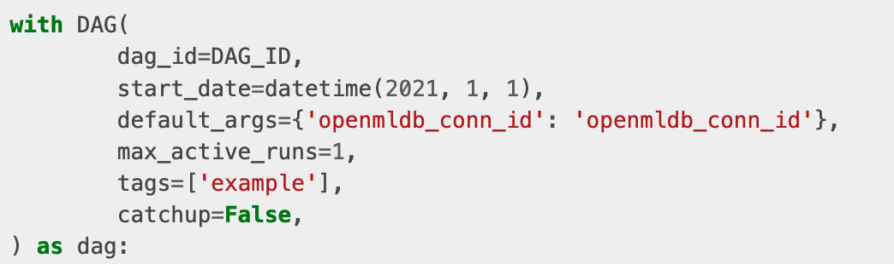
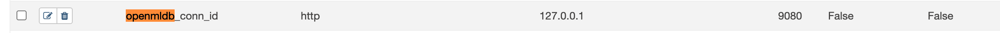
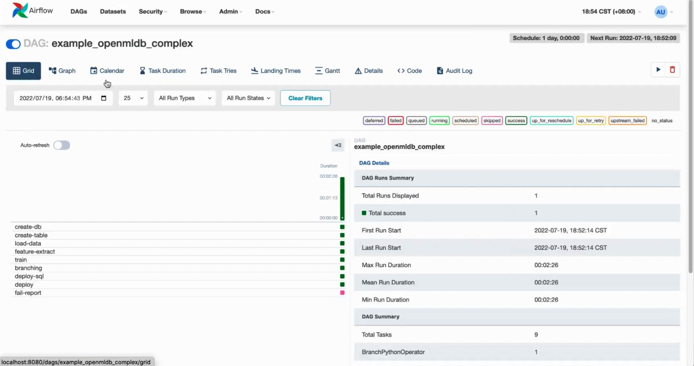

# Airflow OpenMLDB Provider 
We provide the [Airflow OpenMLDB Provider](https://github.com/4paradigm/OpenMLDB/tree/main/extensions/airflow-provider-openmldb) to use the OpenMLDB in Airflow DAG more easily.
This manual will use the Airflow to manage the training and deployment tasks in the [TalkingData Demo](talkingdata_demo).

## TalkingData DAG

We will use the DAG created by [example_openmldb_complex.py](https://github.com/4paradigm/OpenMLDB/blob/main/extensions/airflow-provider-openmldb/openmldb_provider/example_dags/example_openmldb_complex.py) in the Airflow.
You can import the DAG into the Airflow and run it directly.


The workflow of the DAG is shown above. The tables will be created at first, then the offline data will be imported and processed for feature extraction. After training, if the AUC of the model is greater than 99.0, then the SQL script and the model can be deployed. Otherwise, the workflow will report failure. 

## Demo

The DAG mentioned above will be used to complete the feature extraction and deployment work in the [TalkingData Demo](talkingdata_demo), and the predict_server in this demo is responsible for the real-time prediction after deployment.

### 0 Preparations

#### 0.1 Download DAG
Both the DAG and the training script can be gained by downloading [airflow_demo_files](https://openmldb.ai/download/airflow_demo/airflow_demo_files.tar.gz). 

```
wget https://openmldb.ai/download/airflow_demo/airflow_demo_files.tar.gz
tar zxf airflow_demo_files.tar.gz
ls airflow_demo_files
```
For the newest version, please visit [GitHub example_dags](https://github.com/4paradigm/OpenMLDB/tree/main/extensions/airflow-provider-openmldb/openmldb_provider/example_dags).


#### 0.2 Start the Docker Image

- It is recommended to install and start the OpenMLDB image and the Airflow in Docker. 
- The port of the container needs to be exposed for the Airflow Web login.
- Please project the previously downloaded files to the path `/work/airflow/dags`, where Airflow will access for the DAG.

```
docker run -p 8080:8080 -v `pwd`/airflow_demo_files:/work/airflow/dags -it 4pdosc/openmldb:0.6.5 bash
```

#### 0.3 Download and Install the Airflow and the Airflow OpenMLDB Provider 
Run the following command in Docker.
```
pip3 install airflow-provider-openmldb
```
Since the Airflow OpenMLDB Provider relies on the Airflow, they will be downloaded together.

#### 0.4 Prepare the Dataset
Since the data import path of the DAG is `/tmp/train_sample.csv`, we have to copy the data file to `/tmp` directory.
```
cp /work/talkingdata/train_sample.csv /tmp/
```

### 1 Start the OpenMLDB and the Airflow
The following commands will start the OpenMLDB cluster. The `predict_server` supports deployment and test, and the standalone Airflow.

```
/work/init.sh
python3 /work/talkingdata/predict_server.py --no-init > predict.log 2>&1 &
export AIRFLOW_HOME=/work/airflow
cd /work/airflow
airflow standalone
```

The username and the password for the Airflow standalone are shown in the picture below.


Please visit `http://localhost:8080`, enter the username and the password as shown.

```{caution}
`Airflow standalone` is a foreground process, the exit will lead to the whole termiantion of the process.
You can quit the Airflow after the DAG is finished then go for [Step 3](#3-test) or just put the Airflow process to the background.
```

### 2 Run the DAG 
Open the DAG example_openmldb_complex in the Airflow Web and click the `Code` to check the detail of the DAG.


You can see the `openmldb_conn_id` that is used in `Code`. The DAG doesn't use the address of OpenMLDB but use the connection. We need to create a new connection and name it the same. 


#### 2.1 Create the Connection 
Click the 'connection' in the 'Admin'.


Add a connection.


Please use the address of the OpenMLDB Api Server rather than the address of zookeeper as the Airflow OpenMLDB Provider is connected to the OpenMLDB Api Server.


The created connection is shown as the picture below.


#### 2.2 Run the DAG 
Run the DAG to complete a turn of model training, SQL and model deployment.
A successful run should look like the following figure.


### 3 Test

If you run the Airflow foreground, you can quit the Airflow as the subsequent procedures do not depend on it.
#### 3.1 Import the Online Data
Although the DAG has deployed the SQL and the model, there is no data in the online database. 
You should run the following command to import the online data.
```
curl -X POST http://127.0.0.1:9080/dbs/example_db -d'{"mode":"online", "sql":"load data infile \"file:///tmp/train_sample.csv\" into table example_table options(mode=\"append\");"}'
```
This is an asynchronous operation, but it won't take too long because of the small data size.
If you want to check the execution state of the command, please use `SHOW JOBS`.
```
curl -X POST http://127.0.0.1:9080/dbs/example_db -d'{"mode":"online", "sql":"show jobs"}'
```

#### 3.2 Prediction
Run the following prediction script which will use the latest deployed SQL and model. 
```
python3  /work/talkingdata/predict.py
```
The result is shown below.


