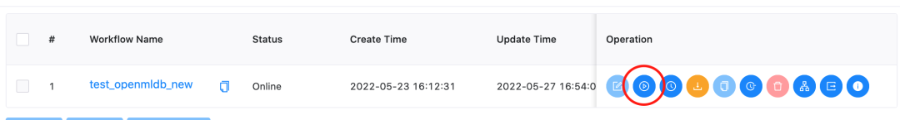

# Building End-to-End MLOps Workflows (OpenMLDB + DolphinScheduler)

## Background
In the closed loop of machine learning applications from development to deployment, data processing, feature engineering, and model training often cost a lot of time and manpower. To facilitate AI applications development and deployment, we have developed the DolphinScheduler OpenMLDB Task, which integrates feature engineering into the workflow of DolphinScheduler to build an end-to-end MLOps workflow. This article will briefly introduce and demonstrate the operation process of the DolphinScheduler OpenMLDB Task.

```{seealso}
[DolphinScheduler OpenMLDB Task Official Documentation](https://dolphinscheduler.apache.org/en-us/docs/dev/user_doc/guide/task/openmldb.html)
```

## Scenarios and Functions
### Why We Need the DolphinScheduler OpenMLDB Task


As an open-source machine learning database that provides full-stack solutions for data and feature engineering, the key point for OpenMLDB is to improve ease-of-use and integrate the open-source ecosystem. As shown in the above figure, accessing the data source can make it easier for the data in DataOps to feed into OpenMLDB, and the features provided by OpenMLDB also need to smoothly enter ModelOps for training.

In this article, we focus on the integration with the workflow scheduler platform DolphinScheduler. The DolphinScheduler OpenMLDB Task can operate OpenMLDB more easily. At the same time, the OpenMLDB task is also managed by workflow and is fully automated.

### What Can the DolphinScheduler OpenMLDB Task Do

By writing the OpenMLDB task, we can meet the requirements of OpenMLDB for offline import, feature extraction, SQL deployment, real-time data import, etc. We can build an end-to-end machine learning pipeline using OpenMLDB based on DolphinScheduler.


For example, the typical workflow of machine learning based on OpenMLDB is shown in the figure above, steps 1-4 in the process correspond to offline data import, feature extraction, SQL deployment, and real-time data import, which can be written through the DolphinScheduler OpenMLDB Task.

In addition to the feature engineering done by OpenMLDB, the prediction also requires model inference. So next, based on the TalkingData advertising fraud detection scenario from the Kaggle competition, we will demonstrate how to use the DolphinScheduler OpenMLDB Task to build an end-to-end machine learning pipeline. For details of the TalkingData competition, see [talkingdata-adtracking-fraud-detection](https://www.kaggle.com/competitions/talkingdata-adtracking-fraud-detection/discussion).

## Demo
### Configuration

** Use OpenMLDB docker image**

The demo can run on MacOS or Linux, the OpenMLDB docker image is recommended. We'll start OpenMLDB and DolphinScheduler in the same container, expose the DolphinScheduler web port:
```
docker run -it -p 12345:12345 4pdosc/openmldb:0.6.7 bash
```

```{attention}
The DolphinScheduler requires a user of the operating system with `sudo` permission. Therefore, it is recommended to download and start the DolphinScheduler in the OpenMLDB container. Otherwise, please prepare the operating system user with sudo permission.
```

The docker image doesn't have sudo, but DolphinScheduler needs it in runtime. So install it:
```
apt update && apt install sudo
```

And DolphinScheduler task running uses sh, but the docker image default sh is `dash`. Change it to `bash`:
```
dpkg-reconfigure dash
```
And eneter `no`.

**Start OpenMLDB Cluster and Predict Server**

In the container, you can directly run the following command to start the OpenMLDB cluster.
```
./init.sh
```

We will complete a workflow of importing data, offline training, and deploying the SQL and model online after successful training. For the online part of the model, you can use the simple predict server in `/work/talkingdata`. Run it in the background:
```
python3 /work/talkingdata/predict_server.py --no-init > predict.log 2>&1 &
```

**Start DolphinScheduler**

Note that, DolphinScheduler has not officially released the updated version supporting OpenMLDB Task (only on the `dev` branch), so please download [dolphinscheduler-bin](http://openmldb.ai/download/dolphinschduler-task/apache-dolphinscheduler-dev-SNAPSHOT-bin.tar.gz) that is prepared by us to have the DolphinScheduler version supporting OpenMLDB Task.

Start the DolphinScheduler standalone version. The steps are as follows. For more information, please refer to [Official Documentation](https://dolphinscheduler.apache.org/en-us/docs/3.0.0/user_doc/guide/installation/standalone.html)。
```
tar -xvzf apache-dolpSchedulerler-*-bin.tar.gz
cd apache-dolpSchedulerler-*-bin
sed -i s#/opt/soft/python#/usr/bin/python3#g bin/env/dolphinscheduler_env.sh
sh ./bin/dolpSchedulerler-daemon.sh start standalone-server
```

Now you can login to DolphinScheduler at http://localhost:12345/dolphinscheduler/ui . The default user name and password are: admin/dolphinScheduler123。

We have set the Python environment by modify `PYTHON_HOME` in `bin/env/dolphinscheduler_env.sh`, as shown in the previous code(Python Task needs to explicitly set the python environment, cuz we use Python3). If you have started the DolphinScheduler already, you can also set the environment on the web page after startup. The setting method is as follows. **Note that in this case, it is necessary to confirm that all tasks in the workflow use this environment**


```{caution}
Note that before the DolphinScheduler standalone runs, the configured temporary environment variable `PYTHON_HOME` does not affect the environment in the work server.
```

```{note}
The worker server of DolphinScheduler requires the OpenMLDB Python SDK. The worker of DolphinScheduler standalone is the local machine, so you only need to install the OpenMLDB Python SDK on the local machine. The Python SDK is ready in our OpenMLDB image. If you are not running the docker image, install the SDK by `pip3 install openmldb`.
```

**Download workflow json**

Workflows can be created manually. In this example, we directly provide JSON workflow files, [Click to Download](https://github.com/4paradigm/OpenMLDB/releases/download/v0.5.1/workflow_openmldb_demo.json), and you can directly import it later into the DolphinScheduler environment and make simple modifications to complete the whole workflow.

**Source Data**

The workflow will load data from `/tmp/train_sample.csv`，so prepare it：
```
cp /work/talkingdata/train_sample.csv /tmp
```

### Demo Steps

#### Step 1. Initialize Configuration

You need to first create a tenant in the DolphinScheduler Web, and then enter the tenant management interface, fill in the operating system user with sudo permission, and use the default for the queue. The root user can be used directly in the docker container.


Then you need to bind the tenant to the user. For simplicity, we directly bind to the admin user. Enter the user management page and click edit admin user.


After binding, the user status is similar to the following figure.


#### Step 2. Create Workflow
In the DolphinScheduler, you need to create a project first, and then create a workflow in the project. Therefore, first create a test project, as shown in the following figure. Click create a project and enter the project.


After entering the project, you can import the [downloaded workflow file](https://github.com/4paradigm/OpenMLDB/releases/download/v0.5.1/workflow_openmldb_demo.json). As shown in the following figure, please click Import workflow in the workflow definition interface.


After the import, the workflow will appear in the workflow list, similar to the following figure.


Then you click the workflow name to view the workflow details, as shown in the following figure.


**Note**: This needs to be modified because the task ID will change after importing the workflow. In particular, the upstream and downstream id in the switch task do not exist and need to be manually changed.


As shown in the above figure, there is a non-existent ID in the settings of the switch task. Please change the successful and failed "branch flow" and "pre-check condition" to the task of the current workflow.

The correct result is shown in the following figure:


After modification, we save the workflow. Tenant in the imported workflow will be deemed as default in the default mode and also can be run. If you want to specify your tenant, please select a tenant when saving the workflow, as shown in the following figure.


#### Step 3. Online Operation

After saving the workflow, you need to go online before running. The run button will not light up until it is online. As shown in the following figure.



Please click run and wait for the workflow to complete. You can view the workflow running details in the Workflow Instance interface, as shown in the following figure.


To demonstrate the process of a successful launch, the validation does not perform actual validation, but directly returns the validation success and flows into the deploy branch. After running the deploy branch, the deploy SQL and subsequent tasks are successful, the predict server receives the latest model.

The predict server also provides online prediction services, which are requested through `curl /predict`. We simply construct a real-time request and send it to the predict server.
```
curl -X POST 127.0.0.1:8881/predict -d '{"ip": 114904,
       "app": 11,
       "device": 1,
       "os": 15,
       "channel": 319,
       "click_time": 1509960088000,
       "is_attributed": 0}'
```
The returned results are as follows:


#### Supplement

If you rerun the workflow, `deploy sql` task may failed cause deployment`demo` is exists. Please delete the deployment in container before rerun the workflow:
```
/work/openmldb/bin/openmldb --zk_cluster=127.0.0.1:2181 --zk_root_path=/openmldb --role=sql_client --database=demo_db --interactive=false --cmd="drop deployment demo;"
```

You can check if deployment is deleted：
```
/work/openmldb/bin/openmldb --zk_cluster=127.0.0.1:2181 --zk_root_path=/openmldb --role=sql_client --database=demo_db --interactive=false --cmd="show deployment demo;"
```
