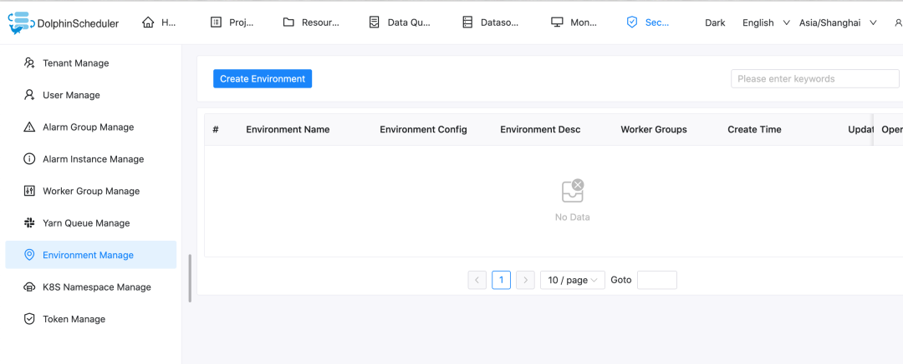
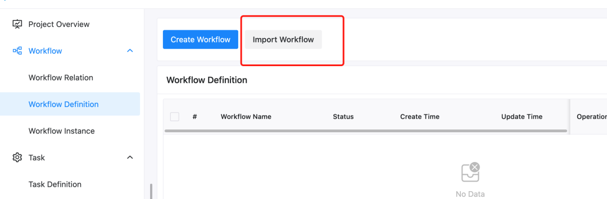

# Dolphin Scheduler OpenMLDB Task: Create End-to-End MLOps Workflow

## Reading Guide
In the business closed loop of machine learning from development to launching online, data processing, feature development, and model training often cost a lot of time and manpower.

To facilitate AI model construction and application launch, and simplify the process of machine learning modeling engineering, we have developed the DolphinScheduler OpenMLDB Task, which integrates feature platform capabilities into the workflow of DolphinScheduler, links feature engineering and scheduling links, creates an end-to-end MLOps workflow, and helps developers focus on the exploration of business value.

This article will briefly introduce and demonstrate the operation process of the DolphinScheduler OpenMLDB Task.

```{seealso}
[DolphinScheduler OpenMLDB Task Official Documentation](https://dolphinscheduler.apache.org/zh-cn/docs/dev/user_doc/guide/task/openmldb.html)
```

## Scenarios and Functions
### Why was the DolphinScheduler OpenMLDB Task Emerge


As an open-source machine learning database that provides full-stack solutions for production-level data and feature development, the key point for OpenMLDB to improve ease of use and reduce the use threshold comes from upstream and downstream connectivity. As shown in the above figure, accessing the data source can make it easier for the data in DataOps to flow into OpenMLDB, and the features provided by OpenMLDB also need to smoothly enter ModelOps for training.

To reduce the huge workload caused by each developer's manual access and improve the convenience of OpenMLDB, we have also developed the OpenMLDB access Deployment and Monitoring functions.

This time, I want to focus on the framework of OpenMLDB accessing the DolphinScheduler workflow.

The DolphinScheduler OpenMLDB Task can operate OpenMLDB more easily. At the same time, the OpenMLDB task is also managed by Workflow and is more automated.

### What can the DolphinScheduler OpenMLDB Task  Do

OpenMLDB hopes to achieve the goal that development is launched immediately so that development can return to its essence, rather than spending too much effort in engineering implementation.

By writing the OpenMLDB task, we can meet the requirements of OpenMLDB for offline import, feature extraction, SQL deployment online, online import, etc. We can also write a complete online training process using OpenMLDB in the DolphinScheduler.


For example, let's imagine the simplest user operation process, as shown in the figure above, steps 1-4 in the process correspond to offline import, feature extraction, SQL deployment online, and online import, which can be written through the DolphinScheduler OpenMLDB Task.

In addition to SQL online in OpenMLDB, real-time prediction also requires a model online. So next, based on the TalkingData advertising fraud detection scenario in the Kaggle competition, we will demonstrate how to use the DolphinScheduler OpenMLDB Task to arrange a complete process of machine learning training online. For details of the TalkingData competition, see [talkingdata-adtracking-fraud-detection](https://www.kaggle.com/competitions/talkingdata-adtracking-fraud-detection/discussion).

## Practical Demonstration
### Environment Configuration
The demo can run on MacOS or Linux, or use the OpenMLDB image provided by us:
```
docker run -it 4pdosc/openmldb:0.5.1 bash
```
```{attention}
The DolphinScheduler requires a user of the operating system with sudo permission. Therefore, it is recommended to download and start the DolphinScheduler in the OpenMLDB container. Otherwise, prepare the operating system user with sudo permission.
```

In the container, you can directly run the following command to start the OpenMLDB cluster.
```
./init.sh
```

We will complete a workflow of importing data, offline training, and putting the model online after successful training. For the online part of the model, you can use a simple predict server. See [predict server source](https://raw.githubusercontent.com/4paradigm/OpenMLDB/main/demo/talkingdata-adtracking-fraud-detection/predict_server.py). You can download it locally and run it in the background:
```
python3 predict_server.py --no-init > predict.log 2>&1 &
```

The DolphinScheduler supports the version of the OpenMLDB task. Please download [dolphinscheduler-bin](https://github.com/4paradigm/OpenMLDB/releases/download/v0.5.1/apache-dolphinscheduler-dev-SNAPSHOT-bin.tar.gz)。

Start the DolphinScheduler standalone. The steps are as follows. For more information, please refer to [Official Documentation](https://dolphinscheduler.apache.org/en-us/docs/3.0.0/user_doc/guide/installation/standalone.html)。
```
tar -xvzf apache-dolpSchedulerler-*-bin.tar.gz
cd apache-dolpSchedulerler-*-bin
sh ./bin/dolpSchedulerler-daemon.sh start standalone-server
```

Browser access address http://localhost:12345/dolphinscheduler/ui You can log in to the system UI. The default user name and password are: admin/dolpSchedulerler123。

The worker server of DolpSchedulerler requires the OpenMLDB Python SDK. The worker of DolpSchedulerler standalone is the local machine, so you only need to install the OpenMLDB Python SDK on the local machine.

It is already installed in our OpenMLDB image. If you are in another environment, run:

```
pip3 install openmldb
```

Workflows can be created manually. To simplify the presentation, we directly provide JSON workflow files, [Click to Download](https://github.com/4paradigm/OpenMLDB/releases/download/v0.5.1/workflow_openmldb_demo.json), and you can directly import it into the DolphinScheduler environment and make simple modifications to complete the whole workflow.

Python task needs to explicitly set the python environment. The simplest way is to set the python environment in bin/env/dolphinscheduler_env.sh is to modify `PYTHON_HOME`, and then start the DolphinScheduler. Please fill in the absolute path of python3 instead of the relative path.
```{caution}
Note that before the DolphinScheduler standalone runs, the configured temporary environment variable `PYTHON_HOME` does not affect the environment in the work server.
```
If you have started the DolphinScheduler, you can also set the environment on the web page after startup. The setting method is as follows **Note that in this case, it is necessary to confirm that all tasks in the workflow use this environment**



### demo Demonstration

#### 1. Initial Configuration


Create a tenant in the DolphinScheduler Web, enter the tenant management interface, fill in the operating system user with sudo permission, and use the default for the queue. The root user can be used directly in the docker container.

Then bind the tenant to the user. For simplicity, we directly bind to the admin user. Enter the user management page and click edit admin user.

After binding, the user status is similar to the following figure.


#### 2. Create Workflow
In the DolphinScheduler, you need to create a project first, and then create a workflow in the project.

Therefore, first create a test project, as shown in the following figure. Click create a project and enter the project.


After entering the project, import the downloaded workflow file. As shown in the following figure, click Import workflow in the workflow definition interface.


After import, the workflow will appear in the workflow list, similar to the following figure.


Click the workflow name to view the workflow details, as shown in the following figure.


**Note**: This needs to be modified because the task ID will change after importing the workflow. In particular, the upstream and downstream id in the switch task do not exist and need to be manually changed.


As shown in the above figure, there is a non-existent ID in the settings of the switch task. Please change the successful and failed "branch flow" and "pre-check condition" to the task of the current workflow.

The correct result is shown in the following figure:


After modification, save the workflow directly. Tenant in the imported workflow will be deemed as default in the default mode and also **can be run**. If you want to specify your tenant, please select a tenant when saving the workflow, as shown in the following figure.


#### 3. Online Operation

After saving the workflow, you need to go online before running. The run button will not light up until it is online. As shown in the following figure.


Click run and wait for the workflow to complete. You can view the workflow running details in the Workflow Instance interface, as shown in the following figure.


To demonstrate the process of a successful launch, the validation does not perform actual validation, but directly returns the validation success and flows into the deploy branch. After running the deploy branch, the deploy SQL and subsequent tasks are successful, the predict server receives the latest model.

The predict server also provides online prediction services, which are requested through `curl /predict`. We simply construct a real-time request and send it to the predict server.
```
curl -X POST 127.0.0.1:8881/predict -d '{"ip": 114904,
       "app": 11,
       "device": 1,
       "os": 15,
       "channel": 319,
       "click_time": 1509960088000,
       "is_attributed": 0}'
```
The returned results are as follows:

