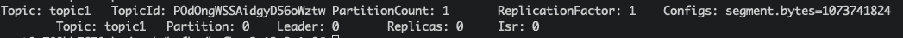

# Importing Real-Time Data Streams from Kafka

## Introduction

Apache Kafka is an event streaming platform. It can be used as the online data source of OpenMLDB, import the real-time data from data stream into OpenMLDB online. For more information about Kafka, please refer to the official website https://kafka.apache.org/. We have developed a Kafka connector to bridge the OpenMLDB, which can connect Kafka and OpenMLDB without obstacles. In this document, you will learn the concept and usage of this connector.

Please note that in order to make the demonstration easier, this article will use the Kafka Connect standalone mode to start the connector. The connector can be started in the distributed mode.

:::{seealso}

For OpenMLDB Kafka Connector implementation, please refer to [extensions/kafka-connect-jdbc](https://github.com/4paradigm/OpenMLDB/tree/main/extensions/kafka-connect-jdbc).
:::

## Overview

### Download and Preparation

- Download Kafka: please click [kafka downloads](https://kafka.apache.org/downloads) to download `kafka_2.13-3.1.0.tgz`.
- Download the connector package and dependencies: please click on [kafka-connect-jdbc.tgz](https://github.com/4paradigm/OpenMLDB/releases/download/v0.5.0/kafka-connect-jdbc.tgz).
- Download the configuration and script files (for the demonstration purpose used in this article): please click on [kafka_demo_files.tgz](http://openmldb.ai/download/kafka-connector/kafka_demo_files.tgz).

This article will start the OpenMLDB in docker container, so there is no need to download the OpenMLDB separately. Moreover, Kafka and connector can be started in the same container. We recommend that you save the three downloaded packages to the same directory. Let's assume that the packages are in the `/work/kafka` directory.

```
docker run -it -v `pwd`:/work/kafka --name openmldb 4pdosc/openmldb:0.6.9 bash
```

### Steps

The brief process of using the connector is shown in the figure below. We will describe each step in detail next.

In general, the use process can be summarized into four steps:

1. Start OpenMLDB and create the database
2. Start Kafka and create topic
3. Start OpenMLDB Kafka Connector
4. Proceed for test or normal use


## Step 1: Start the OpenMLDB and Create a Database

### Start the OpenMLDB Cluster

In the OpenMLDB container, start the cluster:

```
./init.sh
```

:::{caution}

At present, only the OpenMLDB cluster version can be used as the receiver of sink, and the data will only be sink to the online storage of the cluster.
:::

### Create Database

We can quickly create a database through the pipe without logging into the client CLI:

```
echo "create database kafka_test;" | /work/openmldb/bin/openmldb --zk_cluster=127.0.0.1:2181 --zk_root_path=/openmldb --role=sql_client
```

## Step 2: Start the Kafka and Create topic

### Start Kafka

Unzip the Kafka and start the Kafka using the start script.

```
cd kafka
tar -xzf kafka_2.13-3.1.0.tgz
cd kafka_2.13-3.1.0
./bin/kafka-server-start.sh -daemon config/server.properties
```

:::{note}

The OpenMLDB service has used port 2181 to start zookeeper. Kafka does not need to start zookeeper again. Therefore, you only need to start the server here.
:::

You can check whether Kafka is working normally. You can either use `ps` or, check the log.

```
ps axu|grep kafka
```

### Create Topics

We create a topic named `topic1`. Please note that special characters should not appear in the name of the topic.

```
./bin/kafka-topics.sh --create --topic topic1 --bootstrap-server localhost:9092
```

You can `describe` the topic to confirm whether it is normal.

```
./bin/kafka-topics.sh --describe --topic topic1 --bootstrap-server localhost:9092
```



## Step 3: Start the Connector

First, unzip the connector and the kafka_demo_files package in `/work/kafka`.

```
cd /work/kafka
tar zxf kafka-connect-jdbc.tgz
tar zxf kafka_demo_files.tgz
```

kafka_demo_files has the configuration files which are required to start the connector. And ensure to put the connector plug-in in the correct location.

The first configuration file is the configuration of the connector itself, `connect-standalone.properties`. The key configuration of the "plug-in directory" is as follows:

```
plugin.path=/usr/local/share/java
```

Connector and all dependent packages required to run it need to be put into this directory. The command is as follows:

```
mkdir -p /usr/local/share/java
cp -r /work/kafka/kafka-connect-jdbc /usr/local/share/java/
```

The second configuration is the `openmldb-sink.properties` which is the config to connect the OpenMLDB cluster, as follows:

```
name=test-sink
connector.class=io.confluent.connect.jdbc.JdbcSinkConnector
tasks.max=1
topics=topic1 
connection.url=jdbc:openmldb:///kafka_test?zk=127.0.0.1:2181&zkPath=/openmldb
auto.create=true
```

In the connection configuration, you need to fill in the correct OpenMLDB URL address. The connector receives the message of topic1 and automatically creates a table (auto.create).

Next, start the connector using the Kafka connector standalone mode.

```
cd /work/kafka/kafka_2.13-3.1.0
./bin/connect-standalone.sh -daemon ../kafka_demo_files/connect-standalone.properties ../kafka_demo_files/openmldb-sink.properties
```

Check whether the connector is started and correctly connected to the OpenMLDB cluster. You can check with `logs/connect.log`. Under normal circumstances, the log should have `Executing sink task`.

## Step 4: Test

### Send Messages

We use the console producer provided by Kafka as the message sending tool for testing.

Since we haven't created a table yet, our message should contain the schema to help Kafka parse the message and write it to OpenMLDB.

```
{"schema":{"type":"struct","fields":[{"type":"int16","optional":true,"field":"c1_int16"},{"type":"int32","optional":true,"field":"c2_int32"},{"type":"int64","optional":true,"field":"c3_int64"},{"type":"float","optional":true,"field":"c4_float"},{"type":"double","optional":true,"field":"c5_double"},{"type":"boolean","optional":true,"field":"c6_boolean"},{"type":"string","optional":true,"field":"c7_string"},{"type":"int64","name":"org.apache.kafka.connect.data.Date","optional":true,"field":"c8_date"},{"type":"int64","name":"org.apache.kafka.connect.data.Timestamp","optional":true,"field":"c9_timestamp"}],"optional":false,"name":"foobar"},"payload":{"c1_int16":1,"c2_int32":2,"c3_int64":3,"c4_float":4.4,"c5_double":5.555,"c6_boolean":true,"c7_string":"c77777","c8_date":19109,"c9_timestamp":1651051906000}}
```

More conveniently, we save the above message in the file `kafka_demo_files/message` where you can use it directly to send message to the Kafka with the console producer.

```
./bin/kafka-console-producer.sh --topic topic1 --bootstrap-server localhost:9092 < ../kafka_demo_files/message
```

### Check Results

We can query OpenMLDB to check whether the insertion is successful. The query script of `kafka_demo_files/select.sql` is as follows:

```
set @@execute_mode='online';
use kafka_test;
select * from topic1;
```

You can directly run the query script with a query:

```
/work/openmldb/bin/openmldb --zk_cluster=127.0.0.1:2181 --zk_root_path=/openmldb --role=sql_client < ../kafka_demo_files/select.sql
```


