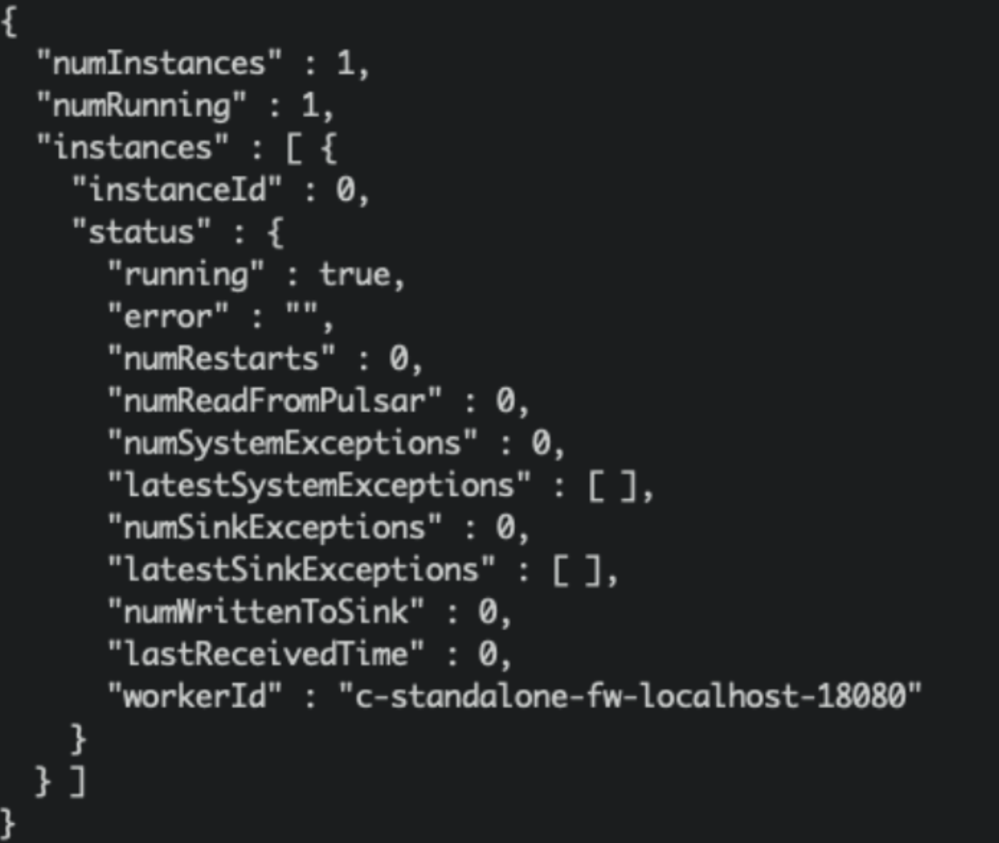
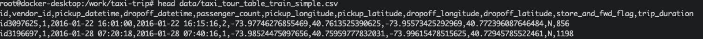

# Importing Real-Time Data Streams from Pulsar

## Introduction

Apache Pulsar is a cloud-native, distributed messaging and streaming platform. It can be used as online data source for OpenMLDB to import real-time data streams. You can learn more about Pulsar from the project website [https://pulsar.apache.org/](https://pulsar.apache.org/). We have developed an OpenMLDB JDBC Connector to work seamlessly with Pulsar. In this document, you will learn the concepts and usages of this connector.

Note that, for the sake of simplicity, for this document, we use Pulsar Standalone, OpenMLDB cluster and a simple JSON message producer to show how the OpenMLDB JDBC Connector works. The connector also works well with the Pulsar Cluster.

## Overview

### Download

- You can download the entire demo package [here](https://openmldb.ai/download/pulsar-connector/files.tar.gz), which are needed by this demo, including the connector nar, schema files, and config files. 

- If you would like to download the connector only, you can [download it here](https://github.com/4paradigm/OpenMLDB/releases/download/v0.4.4/pulsar-io-jdbc-openmldb-2.11.0-SNAPSHOT.nar) from the OpenMLDB release. 

### Workflow

The below figure summarizes the workflow of using this connector. We will further explain the detail later. Moreover, we have recorded the steps at [terminalizer page](https://terminalizer.com/view/be2309235671) for easy reference; or you can also download the demo script [demo.yml](https://github.com/vagetablechicken/pulsar-openmldb-connector-demo/blob/main/demo.yml).


## Step 1
### Create OpenMLDB Cluster
Use docker to start it simply, and we need to create a test table, you can check on [Get started with cluster version of OpenMLDB](https://openmldb.ai/docs/en/v0.5/quickstart/openmldb_quickstart.html#get-started-with-cluster-version-of-openmldb) . 
```{caution}
Only OpenMLDB cluster mode can be the sink dist, and only write to online storage.
```

We recommend that you use ‘host network’ to run docker. And bind volume ‘files’ too. The sql scripts are in it.
```
docker run -dit --network host -v `pwd`/files:/work/pulsar_files --name openmldb 4pdosc/openmldb:0.6.9 bash
docker exec -it openmldb bash
```
```{note}
Even the host network, docker on macOS cannot support connecting to the container from the host. You only can connect openmldb cluster in other containers, like pulsar container.
```
In OpenMLDB container, start the cluster:
```
./init.sh
```
### Create table
We use a script to create the table, create.sql content: 
```
create database pulsar_test;
use pulsar_test;
create table connector_test(id string, vendor_id int, pickup_datetime bigint, dropoff_datetime bigint, passenger_count int, pickup_longitude double, pickup_latitude double, dropoff_longitude double, dropoff_latitude double, store_and_fwd_flag string, trip_duration int);
desc connector_test;
```
Run the script:
```
/work/openmldb/bin/openmldb --zk_cluster=127.0.0.1:2181 --zk_root_path=/openmldb --role=sql_client < /work/pulsar_files/create.sql
```


```{note}
JSONSchema and JDBC base connector can't support 'java.sql.Timestamp' now. So we use 'bigint' to be the timestamp column type(it works in OpenMLDB).
```
## Step 2
### Start Pulsar Standalone
It’s simpler and quicker to run Pulsar in docker. 

We **recommend** that you use 'host network' to run docker, to avoid network problems about docker containers.

And we need to use pulsar-admin to create a sink, it’s in the docker container. So we will run the container in bash first, and run cmds in it.

Don’t forget to bind the dir ‘files’.

```
docker run -dit --network host -v `pwd`/files:/pulsar/files --name pulsar apachepulsar/pulsar:2.9.1 bash
docker exec -it pulsar bash
```

In Pulsar container, start the pulsar standalone server.
```
bin/pulsar-daemon start standalone --zookeeper-port 5181
```
```{note}
OpenMLDB want to use the port 2181, so we should change the zk port here. We will use zk port 2181 to connect OpenMLDB, but zk port in Pulsar standalone won’t affect anything.
```
You can check if the pulsar runs well, `ps` or check the log.
```
ps axu|grep pulsar
```

When you start a local standalone cluster, a public/default namespace is created automatically. The namespace is used for development purposes,  ref [pulsar doc](https://pulsar.apache.org/docs/en/2.9.0/standalone/#start-pulsar-standalone).

**We will create the sink in the namespace**.

```{seealso}
If you really want to start pulsar locally, see [Set up a standalone Pulsar locally](https://pulsar.apache.org/docs/en/standalone/).
```
#### Q&A
Q:
```
2022-04-07T03:15:59,289+0000 [main] INFO  org.apache.zookeeper.server.NIOServerCnxnFactory - binding to port 0.0.0.0/0.0.0.0:5181
2022-04-07T03:15:59,289+0000 [main] ERROR org.apache.pulsar.zookeeper.LocalBookkeeperEnsemble - Exception while instantiating ZooKeeper
java.net.BindException: Address already in use
```
How to fix it?
A: Pulsar wants an unused address to start zk server，5181 is used too. Change another port in '--zookeeper-port'.

Q: 8080 is already used?
A: change the port 'webServicePort' in `conf/standalone.conf`. Don’t forget the 'webServiceUrl' in `conf/client.conf`, pulsar-admin needs the conf.

Q: 6650 is already used?
A: change 'brokerServicePort' in `conf/standalone.conf` and 'brokerServiceUrl' in `conf/client.conf`.

### Connector installation(Optional)
In the previous step, we bind mount ‘files’, the connector nar is in it.
We’ll use ‘non built-in connector’ mode to set up the connector(use ‘archive’ in sink config).

If you really want the connector to be the built-in connector, copy it to ‘connectors’.
```
mkdir connectors
cp files/pulsar-io-jdbc-openmldb-2.11.0-SNAPSHOT.nar  connectors/
```
You want to change or add more connectors, you can update connectors when pulsar standalone is running:
```
bin/pulsar-admin sinks reload
```

Built-in OpenMLDB connector's sink type is 'jdbc-openmldb'.

### Create sink
We use the 'public/default' namespace to create sink, and we need a sink config file, it’s `files/pulsar-openmldb-jdbc-sink.yaml`, content:
```
 tenant: "public"
 namespace: "default"
 name: "openmldb-test-sink"
 archive: "files/pulsar-io-jdbc-openmldb-2.11.0-SNAPSHOT.nar"
 inputs: ["test_openmldb"]
 configs:
     jdbcUrl: "jdbc:openmldb:///pulsar_test?zk=localhost:2181&zkPath=/openmldb"
     tableName: "connector_test"
```
```{describe}
'name' is the sink name.

We use 'archive' to set the sink connector, so we use openmldb connector as non built-in connector.

'input' means the topic names, we use only one here.

'config' is jdbc config which used to connect openmldb cluster.
```

Then create a sink and check it, notice that the input topic is 'test_openmldb'.
```
./bin/pulsar-admin sinks create --sink-config-file files/pulsar-openmldb-jdbc-sink.yaml
./bin/pulsar-admin sinks status --name openmldb-test-sink
```


### Create Schema
Upload schema to topic 'test_openmldb', schema type is JSON. We’ll produce the JSON message in the same schema later. The schema file is ‘files/openmldb-table-schema’.
Schema content:
```
 {
     "type": "JSON",
     "schema":"{\"type\":\"record\",\"name\":\"OpenMLDBSchema\",\"namespace\":\"com.foo\",\"fields\":[{\"name\":\"id\",\"type\":[\"null\",\"string\"],\"default\":null},{\"name\":\"vendor_id\",\"type\":\"int\"},{\"name\":\"pickup_datetime\",\"type\":\"long\"},{\"name\":\"dropoff_datetime\",\"type\":\"long\"},{\"name\":\"passenger_count\",\"type\":\"int\"},{\"name\":\"pickup_longitude\",\"type\":\"double\"},{\"name\":\"pickup_latitude\",\"type\":\"double\"},{\"name\":\"dropoff_longitude\",\"type\":\"double\"},{\"name\":\"dropoff_latitude\",\"type\":\"double\"},{\"name\":\"store_and_fwd_flag\",\"type\":[\"null\",\"string\"],\"default\":null},{\"name\":\"trip_duration\",\"type\":\"int\"}]}",
     "properties": {}
 }
```

Upload schema and check it, commands:
```
./bin/pulsar-admin schemas upload test_openmldb -f ./files/openmldb-table-schema
./bin/pulsar-admin schemas get test_openmldb
```
For demonstration purposes, we omit the fields part. The result as follows:

## Test
### Send messages
We use the first 2 rows of sample data(in openmldb docker `data/taxi_tour_table_train_simple.csv`) to be the test messages, as follows.



Producer JAVA code in [demo producer](https://github.com/vagetablechicken/pulsar-client-java). Essential code is 

So the producer will send the 2 messages to topic ‘test_openmldb’. And then Pulsar will read the messages and write them to OpenMLDB cluster online storage.

The package is in ‘files’. You can run it directly.

```
java -cp files/pulsar-client-java-1.0-SNAPSHOT-jar-with-dependencies.jar org.example.Client
```


### Check
#### Check in Pulsar
We can check the sink status:
```
./bin/pulsar-admin sinks status --name openmldb-test-sink 
```

```{describe}
"numReadFromPulsar": pulsar sent 2 messages to the sink instance.
"numWrittenToSink": sink instance write 2 messages to OpenMLDB.
```

#### Check in OpenMLDB
And we can get these messages data in the OpenMLDB table’s **online storage** now. 
The script select.sql content:
```
set @@execute_mode='online';
use pulsar_test;
select *, string(timestamp(pickup_datetime)), string(timestamp(dropoff_datetime)) from connector_test;
```
In OpenMLDB container, run:
```
/work/openmldb/bin/openmldb --zk_cluster=127.0.0.1:2181 --zk_root_path=/openmldb --role=sql_client < /work/pulsar_files/select.sql
```

