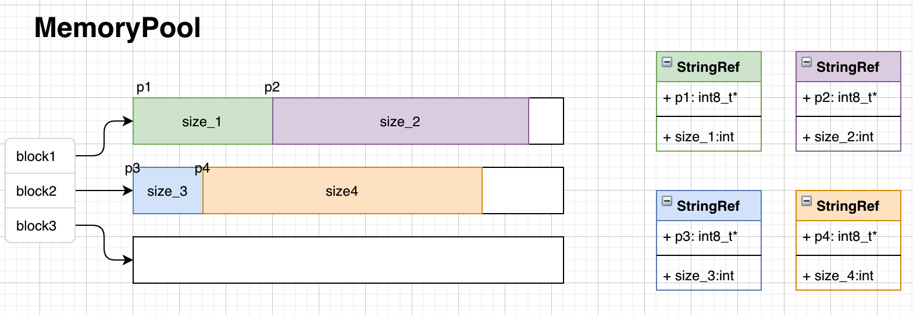

# Memory Pools

## 内存池设计

内存管理器：负责FeSQL引擎执行过程中的内存分配以及释放。内存管理器维护一批内存块。系统通过内存管理器申请一片分配内存区域（memory chuck)。当内存块用光时，内存管理器再扩展内存（从堆上申请新内存块）。内存管理器析构后，自动释放所有内存块。

[内存分配示意图]



```C++
class MemoryChuck {
 public:
    MemoryChuck(MemoryChuck* next, size_t request_size)
        : next_(next),
          chuck_size_(request_size > DEFAULT_CHUCK_SIZE ? request_size
                                                        : DEFAULT_CHUCK_SIZE),
          allocated_size_(0),
          mem_(new char[chuck_size_]) {}
    ~MemoryChuck() { delete[] mem_; }
    char* Alloc(size_t request_size) {
        if (request_size > available_size()) {
            return nullptr;
        }
        char* addr = mem_ + allocated_size_;
        allocated_size_ += request_size;
        return addr;
    }  
    enum { DEFAULT_CHUCK_SIZE = 4096 };

 private:
    MemoryChuck* next_;
    size_t chuck_size_;
    size_t allocated_size_;
    char* mem_;
};

class ByteMemoryPool {
 public:
    ByteMemoryPool(size_t init_size = MemoryChuck::DEFAULT_CHUCK_SIZE)
        : chucks_(nullptr) {
        ExpandStorage(init_size);
    }
    ~ByteMemoryPool() {
       // free each chuck
    }
    char* Alloc(size_t request_size) {
        if (chucks_->available_size() < request_size) {
            ExpandStorage(request_size);
        }
        return chucks_->Alloc(request_size);
    }

    void ExpandStorage(size_t request_size) {
        chucks_ = new MemoryChuck(chucks_, request_size);
    }

 private:
    MemoryChuck* chucks_;
};
```


## 内存池使用

```C++
{
ByteMemoryPool mem_pool;
uint32_t ret = udf(row_ptrs, window_ptr, row_sizes, &mem_pool, &out_buf); // udf中将使用mem_pool申请临时内存
}

udf(...) {
  // ...
  mem_pool->Alloc(request_size1);
  mem_pool->Alloc(request_size2);
  mem_pool->Alloc(request_size3);
  // ...
}
```


## 字节内存池的性能分析

```
------------------------------------------------------------------------
Benchmark                              Time             CPU   Iterations
------------------------------------------------------------------------
BM_ByteMemPoolAlloc1000/10          1796 ns         1795 ns       395950
BM_ByteMemPoolAlloc1000/100         5628 ns         5627 ns       125199
BM_ByteMemPoolAlloc1000/1000       46552 ns        46512 ns        15700
BM_ByteMemPoolAlloc1000/10000     316475 ns       316394 ns         2318
BM_NewFree1000/10                 105742 ns       105706 ns         6414
BM_NewFree1000/100                110547 ns       110499 ns         6363
BM_NewFree1000/1000               113103 ns       113072 ns         5698
BM_NewFree1000/10000              542945 ns       542409 ns         1355

```

我们对比了ByteMemPool和NewFree的内存分配以及回收性能。

BM_ByteMemPoolAlloc1000/X: ByteMemPool Alloc 1000块长度为X的区域。

BM_NewFree1000/X: New 1000块长度为X的空间，并最后释放这1000块内存空间

## 参考文献：

http://cplusplus.wikidot.com/cn:memory-management