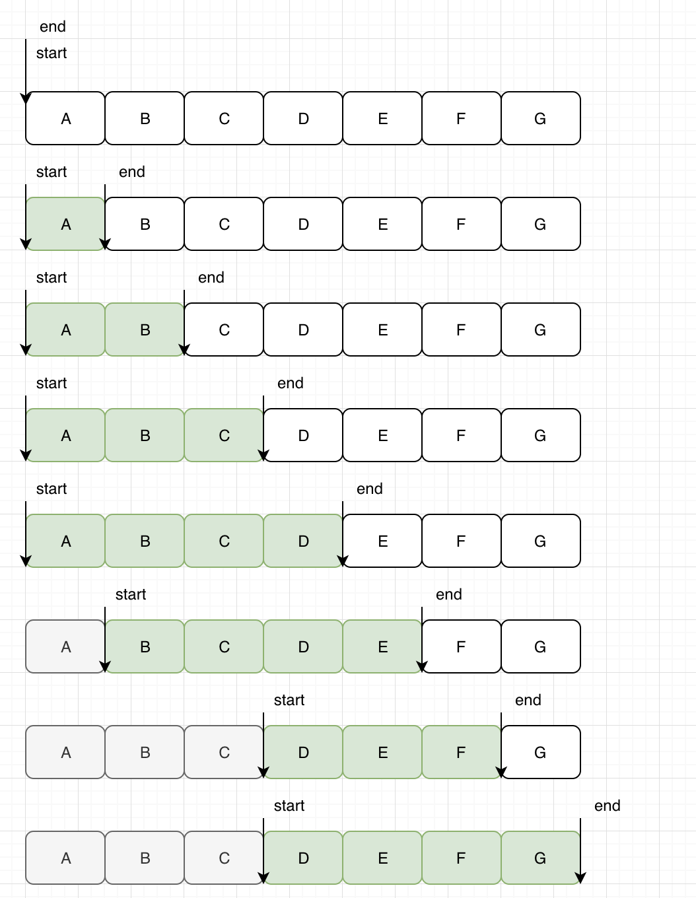

# 窗口

这篇文章讨论多种窗口构造策略，他们各有优势，需要结合数据存储等条件选择最优的窗口构造策略

## 基于BufferData的窗口构造
1. 初始化时，window中数据为空
2. buffer data后，向window中推入一条记录，同时检查窗口边界条件，依据边界滑动窗口的上边界

## 基于滑动的窗口构造

1. 初始化时，window中已经有了全量分片数据
2. slide data时，向后移动（slide）一条数据，同时检查窗口边界条件，依据边界滑动窗口上边界

