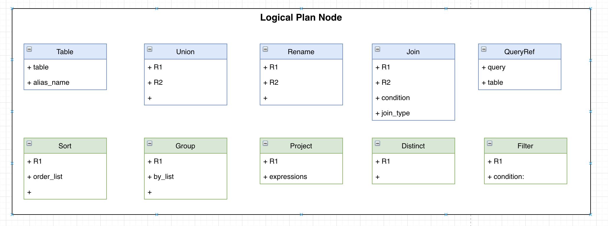

# FESQL 逻辑计划

### 逻辑节点设计



### 生成计划树示例

#### 1. 简单Select示例：

```SQL
SELECT t1.COL1 c1 FROM t1 limit 10;
```

```SQL
+-[kQueryPlan]
 	+-[kLimitPlan]
 	 	+-limit_cnt: 10
 	+-[kProjectPlan]
 		+-table: t1
 		+-project_list_vec[list]: 
 		 	+-[kProjectList]
 		 	 	+-projects on table [list]: 
 		 	 	|	+-[kProjectNode]
 		 	 	|	 	+-c1: t1.COL1
 	+-[kTablePlan]
 		+-table: t1
```

#### 2. 过滤和分组后排序聚合计算示例

```SQL
SELECT sum(COL1) as col1sum, * FROM t1 where col2 > 10 group by COL1, COL2 having col1sum > 0 order by COL1 limit 10;
```

```SQL

+-[kQueryPlan]
 	+-[kLimitPlan]
 	 	+-limit_cnt: 10
 	+-[kSortPlan]
 	 	+-order_by: (COL1) ASC
 	+-[kFilterPlan]
 	 	+-condition: col1sum > 0
 	+-[kProjectPlan]
 		+-table: t1
 		+-project_list_vec[list]: 
 		 	+-[kProjectList]
 		 	 	+-projects on table [list]: 
 		 	 	|	+-[kProjectNode]
 		 	 	|	 	+-col1sum: sum(COL1)
 		 	 	|	+-[kProjectNode]
 		 	 	|	 	+-*: *
 	+-[kGroupPlan]
 	 	+-group_by: (COL1,COL2)
 	+-[kFilterPlan]
 	 	+-condition: col2 > 10
 	+-[kTablePlan]
 		+-table: t1

```

#### 3. 窗口聚合计算示例

```SQL
SELECT sum(col1) OVER w1 as w1_col1_sum, sum(col1) OVER w2 as w2_col1_sum FROM t1 WINDOW w1 AS (PARTITION BY col2 ORDER BY `TS` RANGE BETWEEN 1d PRECEDING AND 1s PRECEDING), w2 AS (PARTITION BY col3 ORDER BY `TS` RANGE BETWEEN 2d PRECEDING AND 1s PRECEDING) limit 10;

```

```SQL
+-[kQueryPlan]
 	+-[kLimitPlan]
 	 	+-limit_cnt: 10
 	+-[kProjectPlan]
 		+-table: t1
 		+-project_list_vec[list]: 
 		 	+-[kProjectList]
 		 	 	+-[kWindow]
 		 	 	+-window_name: w1
 		 	 	+-projects on window [list]: 
 		 	 	|	+-[kProjectNode]
 		 	 	|	 	+-w1_col1_sum: sum(col1)over w1
 		 	+-[kProjectList]
 		 	 	+-[kWindow]
 		 	 	+-window_name: w2
 		 	 	+-projects on window [list]: 
 		 	 	|	+-[kProjectNode]
 		 	 	|	 	+-w2_col1_sum: sum(col1)over w2
 	+-[kTablePlan]
 		+-table: t1
```

#### 4. Join表计算示例

```SQL
SELECT * FROM t1 left join t2 on t1.col1 = t2.col2;
```

```SQL

+-[kQueryPlan]
 	+-[kProjectPlan]
 		+-table: join_table_16807
 		+-project_list_vec[list]: 
 		 	+-[kProjectList]
 		 	 	+-projects on table [list]: 
 		 	 	|	+-[kProjectNode]
 		 	 	|	 	+-*: *
 	+-[kJoinPlan]
 	 	+-type: LeftJoin
 	 	+-condition: t1.col1 = t2.col2
 	 	+-[kTablePlan]
 	 		+-table: t1
 	 	+-[kTablePlan]
 	 		+-table: t2

```


#### 5. UNION计算示例

```SQL
SELECT * FROM t1 UNION ALL SELECT * FROM t2;
```

```SQL

+-[kUnionPlan]
 	+-union_type: ALL
 	+-[kQueryPlan]
 	 	+-[kProjectPlan]
 	 		+-table: t1
 	 		+-project_list_vec[list]: 
 	 		 	+-[kProjectList]
 	 		 	 	+-projects on table [list]: 
 	 		 	 	|	+-[kProjectNode]
 	 		 	 	|	 	+-*: *
 	 	+-[kTablePlan]
 	 		+-table: t1
 	+-[kQueryPlan]
 	 	+-[kProjectPlan]
 	 		+-table: t2
 	 		+-project_list_vec[list]: 
 	 		 	+-[kProjectList]
 	 		 	 	+-projects on table [list]: 
 	 		 	 	|	+-[kProjectNode]
 	 		 	 	|	 	+-*: *
 	 	+-[kTablePlan]
 	 		+-table: t2

```

#### 6. 复杂自查询示例：

```SQL
select * from 
    (select * from stu where grade = 7) s
left join 
    (select * from sco where subject = "math") t
on s.id = t.stu_id
union
select * from 
    (select * from stu where grade = 7) s
right join 
    (select * from sco where subject = "math") t
on s.id = t.stu_id;
```

```SQL
+-[kUnionPlan]
 	+-union_type: DISTINCT
 	+-[kQueryPlan]
 	 	+-[kProjectPlan]
 	 		+-table: join_table_16807
 	 		+-project_list_vec[list]: 
 	 		 	+-[kProjectList]
 	 		 	 	+-projects on table [list]: 
 	 		 	 	|	+-[kProjectNode]
 	 		 	 	|	 	+-*: *
 	 	+-[kJoinPlan]
 	 	 	+-type: LeftJoin
 	 	 	+-condition: s.id = t.stu_id
 	 	 	+-[kPlanTypeRename]
 	 	 		+-table: s
 	 	 	+-[kQueryPlan]
 	 	 	 	+-[kProjectPlan]
 	 	 	 		+-table: stu
 	 	 	 		+-project_list_vec[list]: 
 	 	 	 		 	+-[kProjectList]
 	 	 	 		 	 	+-projects on table [list]: 
 	 	 	 		 	 	|	+-[kProjectNode]
 	 	 	 		 	 	|	 	+-*: *
 	 	 	 	+-[kFilterPlan]
 	 	 	 	 	+-condition: grade = 7
 	 	 	 	+-[kTablePlan]
 	 	 	 		+-table: stu
 	 	 	+-[kPlanTypeRename]
 	 	 		+-table: t
 	 	 	+-[kQueryPlan]
 	 	 	 	+-[kProjectPlan]
 	 	 	 		+-table: sco
 	 	 	 		+-project_list_vec[list]: 
 	 	 	 		 	+-[kProjectList]
 	 	 	 		 	 	+-projects on table [list]: 
 	 	 	 		 	 	|	+-[kProjectNode]
 	 	 	 		 	 	|	 	+-*: *
 	 	 	 	+-[kFilterPlan]
 	 	 	 	 	+-condition: subject = math
 	 	 	 	+-[kTablePlan]
 	 	 	 		+-table: sco
 	+-[kQueryPlan]
 	 	+-[kProjectPlan]
 	 		+-table: join_table_16807
 	 		+-project_list_vec[list]: 
 	 		 	+-[kProjectList]
 	 		 	 	+-projects on table [list]: 
 	 		 	 	|	+-[kProjectNode]
 	 		 	 	|	 	+-*: *
 	 	+-[kJoinPlan]
 	 	 	+-type: RightJoin
 	 	 	+-condition: s.id = t.stu_id
 	 	 	+-[kPlanTypeRename]
 	 	 		+-table: s
 	 	 	+-[kQueryPlan]
 	 	 	 	+-[kProjectPlan]
 	 	 	 		+-table: stu
 	 	 	 		+-project_list_vec[list]: 
 	 	 	 		 	+-[kProjectList]
 	 	 	 		 	 	+-projects on table [list]: 
 	 	 	 		 	 	|	+-[kProjectNode]
 	 	 	 		 	 	|	 	+-*: *
 	 	 	 	+-[kFilterPlan]
 	 	 	 	 	+-condition: grade = 7
 	 	 	 	+-[kTablePlan]
 	 	 	 		+-table: stu
 	 	 	+-[kPlanTypeRename]
 	 	 		+-table: t
 	 	 	+-[kQueryPlan]
 	 	 	 	+-[kProjectPlan]
 	 	 	 		+-table: sco
 	 	 	 		+-project_list_vec[list]: 
 	 	 	 		 	+-[kProjectList]
 	 	 	 		 	 	+-projects on table [list]: 
 	 	 	 		 	 	|	+-[kProjectNode]
 	 	 	 		 	 	|	 	+-*: *
 	 	 	 	+-[kFilterPlan]
 	 	 	 	 	+-condition: subject = math
 	 	 	 	+-[kTablePlan]
 	 	 	 		+-table: sco

```

