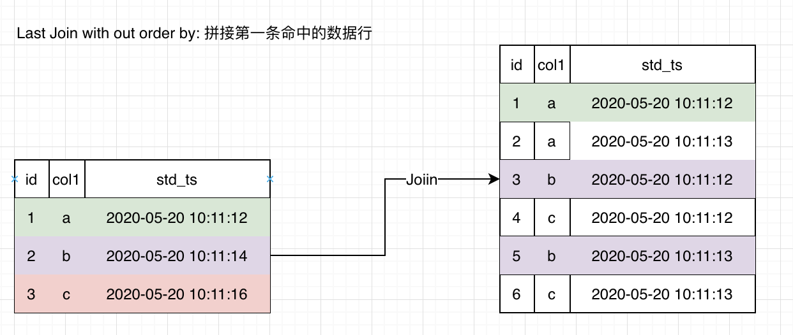
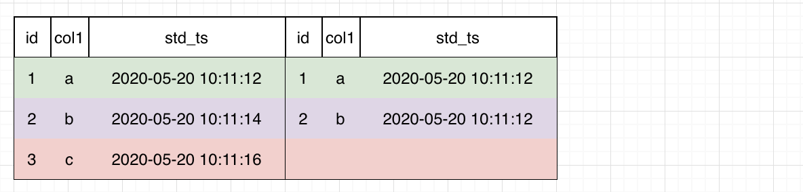
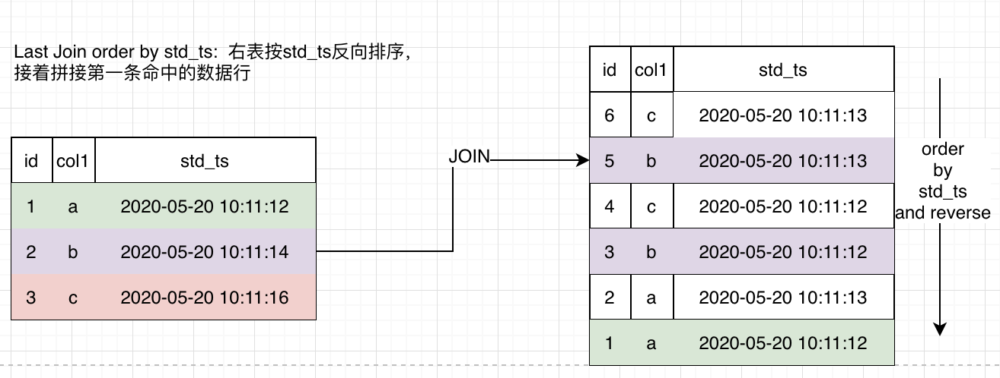
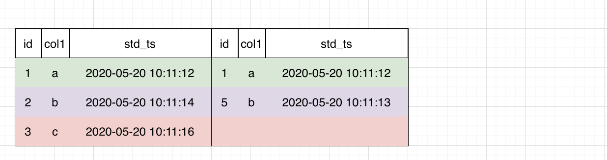

# Join 语法

## Last Join

LastJoin可以看作一种特殊的LeftJoin。在满足Join条件的前提下，左表的每一行拼取一条符合条件的最后一行。

**LAST JOIN 的语法描述**

```SQL
last_join_clause:
    table_ref last_join_item [ last_join_item ...]

last_join_item:
    LAST JOIN table_ref [ORDER BY order_col] ON expr
  
table_ref:
    {table_name | sub_query}
```

### LastJoin without Order By

LastJoin不需要对右表进行排序，仅仅将匹配到的第一行数据拼接到左表。

```SQL
SELECT t1.col1 as t1_col1, t2.col1 as t2_col2 from t1 LAST JOIN t2 ON t1.col1 = t2.col1 and t2.std_ts >= t1.std_ts - 30d and  ts.std_ts <= t1.std_ts - 1d
```



以左表第二行为例，符合条件的右表有2条，选择第一个匹配的拼接到左表。拼表结果如下：



### Last Join with Order By

Last Join with Order By 需要对右表进行反向排序，并且将匹配到的最后第一行拼接到右表。

```SQL
SELECT t1.col1 as t1_col1, t2.col1 as t2_col2 from t1 LAST JOIN t2 ORDER BY ts.std_ts ON t1.col1 = t2.col1 and t2.std_ts >= t1.std_ts - 30d and  ts.std_ts <= t1.std_ts - 1d
```

以左表第二行为例，符合条件的右表有2条，按`std_ts`排序后，选择最后一条`2020-05-20 10:11:13`

最后的拼表结果如下：



### 关于LAST JOIN的边界的说明

last join有两种用法:

- Last Join with ORDER BY
  - 在性能敏感模式下（如在RTDIB存储环境下）要求JOIN条件和ORDER BY列都能命中索引
- Last Join without ORDER BY 在性能敏感模式下：
  - 如果是行拼接（右边部分是一个Row)，则没有边界限制
  - 如果是表拼接（右边部分是Table), 要求JOIN条件命中右表索引。