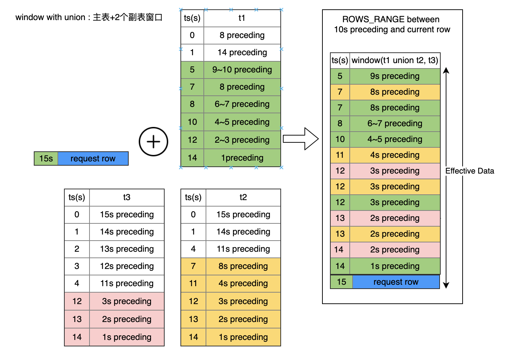
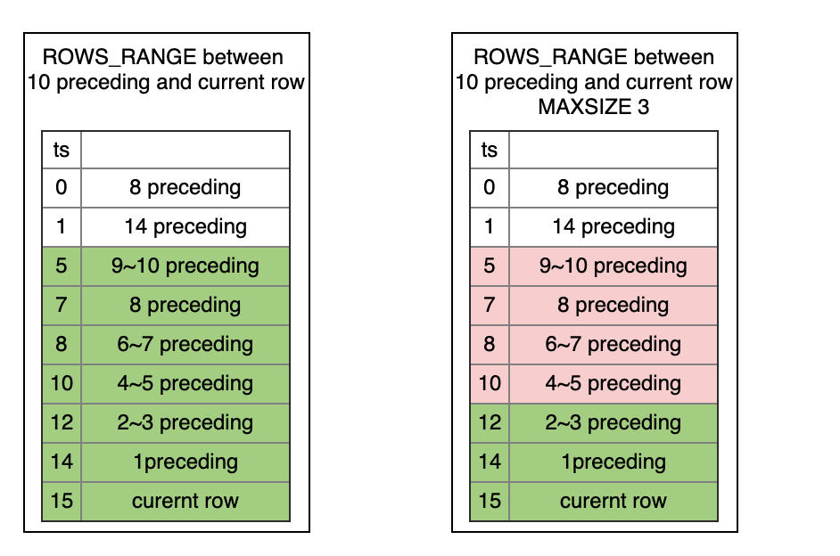

# SQL 查询语句

#### Syntax

```sql
query_statement:
    query_expr

query_expr:
    SELECT [DISTINCT] [projection, ...] FROM table_reference [, table_reference ...]
			 [where clause] [group clause] [having clause] [order clause] [window clause] [limit clause]

/* SQL Table Reference syntax */
table_reference： 
	{table_factor | join clause | last join clause | union clause | }

table_factor: 
	{ table_name | table_name AS table_name }
```

#### 边界说明

| 语句类型     | 状态                                                         |
| :----------- | :----------------------------------------------------------- |
| SIMPLE QUERY | 已支持大部分的简单查询语句                                   |
| GROUP        | 请求模式不支持，仅支持【**列】**作为Group By的表达式         |
| WHERE        | 批式处理支持，请求模式不支持                                 |
| LIMIT        | 批式处理支持，请求模式不支持                                 |
| WINDOW       | 已支持。Window语法设计基本遵循SQL标准规范，同时针对OLDA场景引入了一些新窗口语法特性 |
| LAST JOIN    | LAST JOIN语法是SQL标准LEFT JOIN的变种，是针对OLDA场景引入的新语法特性 |
| JOIN         | 计划中                                                       |

### 1. 简单的查询语句

简单的Select语义指对**单张关系表**作表达式计算，不包含复杂的表关系计算。所谓复杂的表关系运算包含，过滤、分组、JOIN、Window、Union等。

#### Syntax

```SQL
simple_select:
	SELECT [DISTINCT] [projection, ...] FROM table_name 

/*SQL expression projection syntax*/
projection: { sql_expr [AS SQL_IDENTIFIER] | * }

```

#### Examples

```sql

-- desc: SELECT 表达式重命名
  SELECT COL1 as c1 FROM t1;
 
-- desc: SELECT 表达式重命名2
  SELECT COL1 c1 FROM t1;

-- desc: SELECT所有列
  SELECT * FROM t1;
 
-- desc: SELECT 常量表达式
	SELECT 1, 2.0, 'Hello' from t1;
	
-- desc: SELECT 列表达式
  SELECT COL1 FROM t1;
  SELECT t1.COL1 FROM t1;
 
-- desc: SELECT 一元表达式
  SELECT -COL2 as COL2_NEG FROM t1;
  
-- desc: SELECT 二元表达式
  SELECT COL1 + COL2 as COL12_ADD FROM t1;
 
 -- desc: SELECT 类型强转 
  SELECT CAST(COL1 as INT) as COL_INT FROM t1;
  
-- desc: SELECT 函数表达式
  SELECT substr(col1, 3, 6);
```


### 2. WINDOW 语句

#### Window Type

SQL引擎支持两类窗口：ROWS 和 ROWS_RANGE。SQL标准的RANGE类窗口FESQL系统目前暂不支持。他们直接的对比差异如下图所示


#### Frame Bound Type

| 语法                          | 描述                                                         |
| :---------------------------- | :----------------------------------------------------------- |
| CURRENT ROW                   | For `ROWS`, the bound is the current row.For `ROWS_RANGE`, the bound is the current row. For `RANGE`, the bound is the peers of the current row.Peers of the current row： 表示当前行order值相同的行 |
| UNBOUNDED PRECEDING           | The bound is the first partition row.                        |
| `UNBOUNDED FOLLOWING`         | The bound is the last partition row.                         |
| *`expr`* PRECEDING闭区间      | For `ROWS`, the bound is *`expr`* rows before the current row.For `ROWS_RANGE`, the bound is the rows with values **equal** to the current row value minus *`expr.`*if the current row value is `NULL`, the bound is the current row.For `RANGE`, the bound is the rows with values **equal** to the current row value minus *`expr.`*if the current row value is `NULL`, the bound is the peers of the current row. |
| *`expr`* FOLLOWING闭区间      | For `ROWS`, the bound is *`expr`* rows before the current row.For `ROWS_RANGE`, the bound is the rows with values **equal** to the current row value plus *`expr.`*if the current row value is `NULL`, the bound is the current row.For `RANGE`, the bound is the rows with values **equal** to the current row value plus *`expr.`*if the current row value is `NULL`, the bound is the peers of the current row. |
| *`expr`* OPEN PRECEDING开区间 | For `ROWS`, the bound is *`expr-1`* rows before the current row.For `ROWS_RANGE`, the bound is the rows with values **less than** to the current row value minus *`expr.`*if the current row value is `NULL`, the bound is the current row.For `RANGE`, the bound is the rows with values **less than** to the current row value minus *`expr.`*if the current row value is `NULL`, the bound is the peers of the current row. |
| *`expr`* OPEN FOLLOWING开区间 | For `ROWS`, the bound is *`expr`* rows before the current row.For `ROWS_RANGE`, the bound is the rows with values **less than** to the current row value plus *`expr.`*if the current row value is `NULL`, the bound is the current row.For `RANGE`, the bound is the rows with values **less than** the current row value plus *`expr.`*if the current row value is `NULL`, the bound is the peers |

#### Syntax

```SQL
window_clause: 
	WINDOW window_definition [, window_definition ...]
	
window_definition:
    WINDOW window_name AS window_specification
    
window_specification: 
	[window_union_clause] PARTITION BY column_ref [,column_ref ...] ORDER BY column_ref frame_clause [EXCLUDE CURRENT_TIME] [INSTANCE_NOT_IN_WINDOW]
 
frame_clause:
    frame_units frame_extend [opt_frame_size]
 
frame_units:
    {ROWS|ROWS_RANGE}
 
opt_frame_size:
    MAXSIZE const_expr
 
frame_extent:
    frame_between|frame_start

frame_between:
    BETWEEN frame_start AND frame_end
 
frame_start, frame_end: {
    CURRENT ROW
  | UNBOUNDED PRECEDING
  | UNBOUNDED FOLLOWING
  | expr PRECEDING
  | expr FOLLOWING
  | expr OPEN PRECEDING
  | expr OPEN FOLLOWING
 
window_union_clause:
    UNION table_ref [, table_ref ...]
 
table_ref:
    {table_name | sub_query }

}
```

#### Examples

**有名窗口（Named Window）**

```SQL
-- 
SELECT sum(col2) OVER w1 as w1_col2_sum FROM t1
WINDOW w1 AS (PARTITION BY col1 ORDER BY col5 ROWS BETWEEN 3 PRECEDING AND CURRENT ROW)
```

**匿名窗口**

```SQL
SELECT id, pk1, col1, std_ts,
sum(col1) OVER (PARTITION BY pk1 ORDER BY std_ts ROWS BETWEEN 1 PRECEDING AND CURRENT ROW) as w1_col1_sum
from t1;
```

**ROWS窗口**

```SQL
-- ROWS example
-- desc: window ROWS, 前1000条到当前条
SELECT sum(col2) OVER w1 as w1_col2_sum FROM t1
WINDOW w1 AS (PARTITION BY col1 ORDER BY col5 ROWS BETWEEN 1000 PRECEDING AND CURRENT ROW);
```

**ROWS_RANGE窗口**

```SQL
-- ROWS example
-- desc: window ROWS, 前1000条到当前条
SELECT sum(col2) OVER w1 as w1_col2_sum FROM t1
WINDOW w1 AS (PARTITION BY col1 ORDER BY col5 ROWS_RANGE BETWEEN 1000s PRECEDING AND CURRENT ROW);
```


####  新SQL语法特性：WINDOW UNION

**window with union 一张副表**

```SQL
SELECT col1, col5, sum(col2) OVER w1 as w1_col2_sum FROM t1
WINDOW w1 AS (UNION t2 PARTITION BY col1 ORDER BY col5 ROWS_RANGE BETWEEN 10s PRECEDING AND CURRENT ROW) limit 10;
```


**window with union 多张副表**

```SQL
SELECT col1, col5, sum(col2) OVER w1 as w1_col2_sum FROM t1
WINDOW w1 AS (UNION t2, t3 PARTITION BY col1 ORDER BY col5 ROWS BETWEEN 3 PRECEDING AND CURRENT ROW) limit 10;
```



**window with union 样本表不进入窗口**

```SQL
SELECT col1, col5, sum(col2) OVER w1 as w1_col2_sum FROM t1
WINDOW w1 AS (UNION t2 PARTITION BY col1 ORDER BY col5 ROWS BETWEEN 3 PRECEDING AND CURRENT ROW INSTANCE_NOT_IN_WINDOW) limit 10;
```


**window with union subquery**

```SQL
SELECT col1, col5, sum(col2) OVER w1 as w1_col2_sum FROM t1
WINDOW w1 AS
(UNION (select c1 as col1, c2 as col2, 0.0 as col3, 0.0 as col4, c5 as col5, "NA" as col6 from t2),
(select c1 as col1, c2 as col2, 0.0 as col3, 0.0 as col4, c5 as col5, "NA" as col6 from t3)
PARTITION BY col1 ORDER BY col5 ROWS BETWEEN 3 PRECEDING AND CURRENT ROW) limit 10;
```


#### 新SQL语法特性：Exclude CURRENT_TIME

**ROWS窗口EXCLUDE CURRENT_TIME**

```SQL
-- ROWS example
-- desc: window ROWS, 前1000条到当前条, 除了current row以外窗口内不包含当前时刻的其他数据
SELECT sum(col2) OVER w1 as w1_col2_sum FROM t1
WINDOW w1 AS (PARTITION BY col1 ORDER BY col5 ROWS BETWEEN 1000 PRECEDING AND CURRENT ROW EXCLUDE CURRENT_TIME);
```

**ROWS_RANGE窗口EXCLUDE CURRENT_TIME**

```SQL
-- ROWS example
-- desc: window ROWS, 前1000s到当前条，除了current row以外窗口内不包含当前时刻的其他数据
SELECT sum(col2) OVER w1 as w1_col2_sum FROM t1
WINDOW w1 AS (PARTITION BY col1 ORDER BY col5 ROWS_RANGE BETWEEN 1000s PRECEDING AND CURRENT ROW EXCLUDE CURRENT_TIME);
```


#### 新SQL语法特性： MAXSIZE

window frame定义了窗口的范围，FESQL引入MAXSIZE，来限制window内允许的有效窗口内最大数据条数



**普通的ROWS_RANGE窗口的聚合操作**

```
SELECT``count``(col2) OVER w1 ``as` `w1_col2_cnt,``FROM` `t1``WINDOW w1 ``AS` `(PARTITION ``BY` `col1 ``ORDER` `BY` `col5 ROWS_RANGE ``BETWEEN` `10 PRECEDING ``AND` `CURRENT` `ROW) limit 10;
```

**普通的ROWS_RANGE窗口的聚合操作**

```
SELECT``count``(col2) OVER w2 ``as` `w1_col2_cnt,``FROM` `t1``WINDOW w2 ``AS` `(PARTITION ``BY` `col1 ``ORDER` `BY` `col5 ROWS_RANGE ``BETWEEN` `10 PRECEDING ``AND` `CURRENT` `ROW MAXSIZE 5) limit 10;
```


### 3. LAST JOIN 语句
LastJoin可以看作一种特殊的LeftJoin。在满足Join条件的前提下，左表的每一行拼取一条符合条件的最后一行。

#### Syntax

```SQL
last_join_clause:
    table_ref last_join_item [ last_join_item ...]
  
  
last_join_item:
    LAST JOIN table_ref [ORDER BY order_col] ON expr
   
table_ref:
    {table_name | sub_query}
```

**LAST JOIN without ORDER BY**

```sql
-- desc: 简单拼表查询 without ORDER BY

SELECT t1.col1 as t1_col1, t2.col1 as t2_col2 from t1 LAST JOIN t2 ON t1.col1 = t2.col1
```


以左表第二行为例，符合条件的右表有2条，选择第一个匹配的拼接到左表。拼表结果如下：


**LAST JOIN with ORDER BY**

```SQL
-- desc: 简单拼表查询 with ORDER BY
SELECT t1.col1 as t1_col1, t2.col1 as t2_col2 from t1 LAST JOIN t2 ORDER BY ts.std_ts ON t1.col1 = t2.col1
```


以左表第二行为例，符合条件的右表有2条，按`std_ts`排序后，选择最后一条`2020-05-20 10:11:13`

最后的拼表结果如下：


**LAST JOIN后作window查询**

```SQL
SELECT t1.col1 as id, t1.col2 as t1_col2, t1.col5 as t1_col5, t2.col5 as t2_col5, str1, sum(t1.col1) OVER w1 as w1_col1_sum
FROM t1 last join t2 order by t2.col5 on t1.col1=t2.col1 and t1.col5 >= t2.col5
WINDOW w1 AS (PARTITION BY t1.col2 ORDER BY t1.col5 ROWS_RANGE BETWEEN 3 PRECEDING AND CURRENT ROW) limit 10;

```

#### 边界说明

last join有两种用法:

1. Last Join with ORDER BY
   1. 在性能敏感模式下（在RTDIB环境下）要求JOIN条件和ORDER BY列都能命中索引
2. Last Join without ORDER BY 在性能敏感模式下（如RTIDB环境下）：
   1. 如果是行拼接（右边部分是一个Row)，则没有边界限制
   2. 如果是表拼接（右边部分是Table), 要求JOIN条件命中右表索引。

### 4. Group 语句

所有的group by目前仅仅批模式支持（也就是控制台的调试SQL支持，离线模式还是开发中）

#### Syntax

```SQL
SELECT [projection, ...] FROM table_name GROUP BY sql_expr, [sql_expr ...]
```

#### 边界说明：

| 语句类型         | 状态                   |
| :--------------- | :--------------------- |
| 按列分组         | 已支持，请求模式不支持 |
| 按复杂表达式分组 | 尚未支持               |
|                  |                        |

#### Examples

```SQL
-- desc: 简单SELECT分组KEY
  SELECT COL1 FROM t1 group by COL1;
-- desc: SELECT多KEY的分组
  SELECT COL1, COL2 FROM t1 group by COL1, COL2;
-- desc: 简单SELECT分组聚合
  SELECT COL1, SUM(COL2) FROM t1 group by COL1;
-- desc: SELECT多KEY的分组聚合
  SELECT COL1, COL2, SUM(COL3) FROM t1 group by COL1, COL2;
```

### 5 . Where 语句

#### Syntax

```SQL
SELECT [projection, ...] FROM table_name WHERE sql_expr
```

#### 边界说明

| 语句类型  | 状态                         |
| :-------- | :--------------------------- |
| Where语句 | 批处理已支持，请求模式不支持 |

#### Examples

```SQL
-- desc: SELECT简单过滤
  sql: SELECT COL1 FROM t1 where COL1 > 10;
-- desc: SELECT过滤条件是复杂逻辑关系表达式
  sql: SELECT COL1 FROM t1 where COL1 > 10 and COL2 = 20 or COL1 =0;
```

### 6. Limit 语句

#### Syntax

```SQL
SELECT ... LIMIT INT_NUM
```

#### 边界说明：

| 语句类型 | 状态                                  |
| :------- | :------------------------------------ |
| LIMIT    | 已支持，请求模式下，LIMIT没有实际意义 |

#### Examples

```SQL
-- desc: SELECT Limit
  SELECT t1.COL1 c1 FROM t1 limit 10;
```

